# Capstone Project: Create a Customer Segmentation Report for Arvato Financial Services

In this project, you will analyze demographics data for customers of a mail-order sales company in Germany, comparing it against demographics information for the general population. You'll use unsupervised learning techniques to perform customer segmentation, identifying the parts of the population that best describe the core customer base of the company. Then, you'll apply what you've learned on a third dataset with demographics information for targets of a marketing campaign for the company, and use a model to predict which individuals are most likely to convert into becoming customers for the company. The data that you will use has been provided by our partners at Bertelsmann Arvato Analytics, and represents a real-life data science task.

If you completed the first term of this program, you will be familiar with the first part of this project, from the unsupervised learning project. The versions of those two datasets used in this project will include many more features and has not been pre-cleaned. You are also free to choose whatever approach you'd like to analyzing the data rather than follow pre-determined steps. In your work on this project, make sure that you carefully document your steps and decisions, since your main deliverable for this project will be a blog post reporting your findings.


## Introduction

This post discuss in detail the project "Create a Customer Segmentation Report for Arvato Financial Services", which is one of the Data Scientist's nanodegree capstone options. It is in fact a continuation of a previous project whose solution was posted [here](https://github.com/bvcmartins/dsndProject3). I chose it because of its broad scope which involves a reasonably complex data cleaning procedure, unsupervised learning, analysis of imbalanced data, and prediction using supervised learning tools. In the following I will discuss my solution for it.

## The dataset

Arvato kindly provided us the following four datasets:

1. Azdias: general elements of the german population (891221 entries, 366 features)
2. Customers: same features but containing only customers (191652 entries, 369 features)
3. Mailout_train: training set containing potential customers chosen to receive mail ads. It also contains information if the ad was responded 
4. Mailout_test: testing set for the supervised learning model

On top of that two other files were provided:
1. DIAS Attributes - Values 2017: information about code levels of each attribute
2. DIAS Information Levels - Attributes 2017: high-level information about each attribuet

### Inspecting Azdias 


```python
azdias.head()
```


<div>
<style scoped>
    .dataframe tbody tr th:only-of-type {
        vertical-align: middle;
    }

    .dataframe tbody tr th {
        vertical-align: top;
    }

    .dataframe thead th {
        text-align: right;
    }
</style>
<table border="1" class="dataframe">
  <thead>
    <tr style="text-align: right;">
      <th></th>
      <th>LNR</th>
      <th>AGER_TYP</th>
      <th>AKT_DAT_KL</th>
      <th>ALTER_HH</th>
      <th>ALTER_KIND1</th>
      <th>ALTER_KIND2</th>
      <th>ALTER_KIND3</th>
      <th>ALTER_KIND4</th>
      <th>ALTERSKATEGORIE_FEIN</th>
      <th>ANZ_HAUSHALTE_AKTIV</th>
      <th>ANZ_HH_TITEL</th>
      <th>ANZ_KINDER</th>
      <th>ANZ_PERSONEN</th>
      <th>ANZ_STATISTISCHE_HAUSHALTE</th>
      <th>ANZ_TITEL</th>
      <th>ARBEIT</th>
      <th>BALLRAUM</th>
      <th>CAMEO_DEU_2015</th>
      <th>CAMEO_DEUG_2015</th>
      <th>CAMEO_INTL_2015</th>
      <th>CJT_GESAMTTYP</th>
      <th>CJT_KATALOGNUTZER</th>
      <th>CJT_TYP_1</th>
      <th>CJT_TYP_2</th>
      <th>CJT_TYP_3</th>
      <th>CJT_TYP_4</th>
      <th>CJT_TYP_5</th>
      <th>CJT_TYP_6</th>
      <th>D19_BANKEN_ANZ_12</th>
      <th>D19_BANKEN_ANZ_24</th>
      <th>D19_BANKEN_DATUM</th>
      <th>D19_BANKEN_DIREKT</th>
      <th>D19_BANKEN_GROSS</th>
      <th>D19_BANKEN_LOKAL</th>
      <th>D19_BANKEN_OFFLINE_DATUM</th>
      <th>D19_BANKEN_ONLINE_DATUM</th>
      <th>D19_BANKEN_ONLINE_QUOTE_12</th>
      <th>D19_BANKEN_REST</th>
      <th>D19_BEKLEIDUNG_GEH</th>
      <th>D19_BEKLEIDUNG_REST</th>
      <th>D19_BILDUNG</th>
      <th>D19_BIO_OEKO</th>
      <th>D19_BUCH_CD</th>
      <th>D19_DIGIT_SERV</th>
      <th>D19_DROGERIEARTIKEL</th>
      <th>D19_ENERGIE</th>
      <th>D19_FREIZEIT</th>
      <th>D19_GARTEN</th>
      <th>D19_GESAMT_ANZ_12</th>
      <th>D19_GESAMT_ANZ_24</th>
      <th>D19_GESAMT_DATUM</th>
      <th>D19_GESAMT_OFFLINE_DATUM</th>
      <th>D19_GESAMT_ONLINE_DATUM</th>
      <th>D19_GESAMT_ONLINE_QUOTE_12</th>
      <th>D19_HANDWERK</th>
      <th>D19_HAUS_DEKO</th>
      <th>D19_KINDERARTIKEL</th>
      <th>D19_KONSUMTYP</th>
      <th>D19_KONSUMTYP_MAX</th>
      <th>D19_KOSMETIK</th>
      <th>D19_LEBENSMITTEL</th>
      <th>D19_LETZTER_KAUF_BRANCHE</th>
      <th>D19_LOTTO</th>
      <th>D19_NAHRUNGSERGAENZUNG</th>
      <th>D19_RATGEBER</th>
      <th>D19_REISEN</th>
      <th>D19_SAMMELARTIKEL</th>
      <th>D19_SCHUHE</th>
      <th>D19_SONSTIGE</th>
      <th>D19_SOZIALES</th>
      <th>D19_TECHNIK</th>
      <th>D19_TELKO_ANZ_12</th>
      <th>D19_TELKO_ANZ_24</th>
      <th>D19_TELKO_DATUM</th>
      <th>D19_TELKO_MOBILE</th>
      <th>D19_TELKO_OFFLINE_DATUM</th>
      <th>D19_TELKO_ONLINE_DATUM</th>
      <th>D19_TELKO_ONLINE_QUOTE_12</th>
      <th>D19_TELKO_REST</th>
      <th>D19_TIERARTIKEL</th>
      <th>D19_VERSAND_ANZ_12</th>
      <th>D19_VERSAND_ANZ_24</th>
      <th>D19_VERSAND_DATUM</th>
      <th>D19_VERSAND_OFFLINE_DATUM</th>
      <th>D19_VERSAND_ONLINE_DATUM</th>
      <th>D19_VERSAND_ONLINE_QUOTE_12</th>
      <th>D19_VERSAND_REST</th>
      <th>D19_VERSI_ANZ_12</th>
      <th>D19_VERSI_ANZ_24</th>
      <th>D19_VERSI_DATUM</th>
      <th>D19_VERSI_OFFLINE_DATUM</th>
      <th>D19_VERSI_ONLINE_DATUM</th>
      <th>D19_VERSI_ONLINE_QUOTE_12</th>
      <th>D19_VERSICHERUNGEN</th>
      <th>D19_VOLLSORTIMENT</th>
      <th>D19_WEIN_FEINKOST</th>
      <th>DSL_FLAG</th>
      <th>EINGEFUEGT_AM</th>
      <th>EINGEZOGENAM_HH_JAHR</th>
      <th>EWDICHTE</th>
      <th>EXTSEL992</th>
      <th>FINANZ_ANLEGER</th>
      <th>FINANZ_HAUSBAUER</th>
      <th>FINANZ_MINIMALIST</th>
      <th>FINANZ_SPARER</th>
      <th>FINANZ_UNAUFFAELLIGER</th>
      <th>FINANZ_VORSORGER</th>
      <th>FINANZTYP</th>
      <th>FIRMENDICHTE</th>
      <th>GEBAEUDETYP</th>
      <th>GEBAEUDETYP_RASTER</th>
      <th>GEBURTSJAHR</th>
      <th>GEMEINDETYP</th>
      <th>GFK_URLAUBERTYP</th>
      <th>GREEN_AVANTGARDE</th>
      <th>HEALTH_TYP</th>
      <th>HH_DELTA_FLAG</th>
      <th>HH_EINKOMMEN_SCORE</th>
      <th>INNENSTADT</th>
      <th>KBA05_ALTER1</th>
      <th>KBA05_ALTER2</th>
      <th>KBA05_ALTER3</th>
      <th>KBA05_ALTER4</th>
      <th>KBA05_ANHANG</th>
      <th>KBA05_ANTG1</th>
      <th>KBA05_ANTG2</th>
      <th>KBA05_ANTG3</th>
      <th>KBA05_ANTG4</th>
      <th>KBA05_AUTOQUOT</th>
      <th>KBA05_BAUMAX</th>
      <th>KBA05_CCM1</th>
      <th>KBA05_CCM2</th>
      <th>KBA05_CCM3</th>
      <th>KBA05_CCM4</th>
      <th>KBA05_DIESEL</th>
      <th>KBA05_FRAU</th>
      <th>KBA05_GBZ</th>
      <th>KBA05_HERST1</th>
      <th>KBA05_HERST2</th>
      <th>KBA05_HERST3</th>
      <th>KBA05_HERST4</th>
      <th>KBA05_HERST5</th>
      <th>KBA05_HERSTTEMP</th>
      <th>KBA05_KRSAQUOT</th>
      <th>KBA05_KRSHERST1</th>
      <th>KBA05_KRSHERST2</th>
      <th>KBA05_KRSHERST3</th>
      <th>KBA05_KRSKLEIN</th>
      <th>KBA05_KRSOBER</th>
      <th>KBA05_KRSVAN</th>
      <th>KBA05_KRSZUL</th>
      <th>KBA05_KW1</th>
      <th>KBA05_KW2</th>
      <th>KBA05_KW3</th>
      <th>KBA05_MAXAH</th>
      <th>KBA05_MAXBJ</th>
      <th>KBA05_MAXHERST</th>
      <th>KBA05_MAXSEG</th>
      <th>KBA05_MAXVORB</th>
      <th>KBA05_MOD1</th>
      <th>KBA05_MOD2</th>
      <th>KBA05_MOD3</th>
      <th>KBA05_MOD4</th>
      <th>KBA05_MOD8</th>
      <th>KBA05_MODTEMP</th>
      <th>KBA05_MOTOR</th>
      <th>KBA05_MOTRAD</th>
      <th>KBA05_SEG1</th>
      <th>KBA05_SEG10</th>
      <th>KBA05_SEG2</th>
      <th>KBA05_SEG3</th>
      <th>KBA05_SEG4</th>
      <th>KBA05_SEG5</th>
      <th>KBA05_SEG6</th>
      <th>KBA05_SEG7</th>
      <th>KBA05_SEG8</th>
      <th>KBA05_SEG9</th>
      <th>KBA05_VORB0</th>
      <th>KBA05_VORB1</th>
      <th>KBA05_VORB2</th>
      <th>KBA05_ZUL1</th>
      <th>KBA05_ZUL2</th>
      <th>KBA05_ZUL3</th>
      <th>KBA05_ZUL4</th>
      <th>KBA13_ALTERHALTER_30</th>
      <th>KBA13_ALTERHALTER_45</th>
      <th>KBA13_ALTERHALTER_60</th>
      <th>KBA13_ALTERHALTER_61</th>
      <th>KBA13_ANTG1</th>
      <th>KBA13_ANTG2</th>
      <th>KBA13_ANTG3</th>
      <th>KBA13_ANTG4</th>
      <th>KBA13_ANZAHL_PKW</th>
      <th>KBA13_AUDI</th>
      <th>KBA13_AUTOQUOTE</th>
      <th>KBA13_BAUMAX</th>
      <th>KBA13_BJ_1999</th>
      <th>KBA13_BJ_2000</th>
      <th>KBA13_BJ_2004</th>
      <th>KBA13_BJ_2006</th>
      <th>KBA13_BJ_2008</th>
      <th>KBA13_BJ_2009</th>
      <th>KBA13_BMW</th>
      <th>KBA13_CCM_0_1400</th>
      <th>KBA13_CCM_1000</th>
      <th>KBA13_CCM_1200</th>
      <th>KBA13_CCM_1400</th>
      <th>KBA13_CCM_1401_2500</th>
      <th>KBA13_CCM_1500</th>
      <th>KBA13_CCM_1600</th>
      <th>KBA13_CCM_1800</th>
      <th>KBA13_CCM_2000</th>
      <th>KBA13_CCM_2500</th>
      <th>KBA13_CCM_2501</th>
      <th>KBA13_CCM_3000</th>
      <th>KBA13_CCM_3001</th>
      <th>KBA13_FAB_ASIEN</th>
      <th>KBA13_FAB_SONSTIGE</th>
      <th>KBA13_FIAT</th>
      <th>KBA13_FORD</th>
      <th>KBA13_GBZ</th>
      <th>KBA13_HALTER_20</th>
      <th>KBA13_HALTER_25</th>
      <th>KBA13_HALTER_30</th>
      <th>KBA13_HALTER_35</th>
      <th>KBA13_HALTER_40</th>
      <th>KBA13_HALTER_45</th>
      <th>KBA13_HALTER_50</th>
      <th>KBA13_HALTER_55</th>
      <th>KBA13_HALTER_60</th>
      <th>KBA13_HALTER_65</th>
      <th>KBA13_HALTER_66</th>
      <th>KBA13_HERST_ASIEN</th>
      <th>KBA13_HERST_AUDI_VW</th>
      <th>KBA13_HERST_BMW_BENZ</th>
      <th>KBA13_HERST_EUROPA</th>
      <th>KBA13_HERST_FORD_OPEL</th>
      <th>KBA13_HERST_SONST</th>
      <th>KBA13_HHZ</th>
      <th>KBA13_KMH_0_140</th>
      <th>KBA13_KMH_110</th>
      <th>KBA13_KMH_140</th>
      <th>KBA13_KMH_140_210</th>
      <th>KBA13_KMH_180</th>
      <th>KBA13_KMH_210</th>
      <th>KBA13_KMH_211</th>
      <th>KBA13_KMH_250</th>
      <th>KBA13_KMH_251</th>
      <th>KBA13_KRSAQUOT</th>
      <th>KBA13_KRSHERST_AUDI_VW</th>
      <th>KBA13_KRSHERST_BMW_BENZ</th>
      <th>KBA13_KRSHERST_FORD_OPEL</th>
      <th>KBA13_KRSSEG_KLEIN</th>
      <th>KBA13_KRSSEG_OBER</th>
      <th>KBA13_KRSSEG_VAN</th>
      <th>KBA13_KRSZUL_NEU</th>
      <th>KBA13_KW_0_60</th>
      <th>KBA13_KW_110</th>
      <th>KBA13_KW_120</th>
      <th>KBA13_KW_121</th>
      <th>KBA13_KW_30</th>
      <th>KBA13_KW_40</th>
      <th>KBA13_KW_50</th>
      <th>KBA13_KW_60</th>
      <th>KBA13_KW_61_120</th>
      <th>KBA13_KW_70</th>
      <th>KBA13_KW_80</th>
      <th>KBA13_KW_90</th>
      <th>KBA13_MAZDA</th>
      <th>KBA13_MERCEDES</th>
      <th>KBA13_MOTOR</th>
      <th>KBA13_NISSAN</th>
      <th>KBA13_OPEL</th>
      <th>KBA13_PEUGEOT</th>
      <th>KBA13_RENAULT</th>
      <th>KBA13_SEG_GELAENDEWAGEN</th>
      <th>KBA13_SEG_GROSSRAUMVANS</th>
      <th>KBA13_SEG_KLEINST</th>
      <th>KBA13_SEG_KLEINWAGEN</th>
      <th>KBA13_SEG_KOMPAKTKLASSE</th>
      <th>KBA13_SEG_MINIVANS</th>
      <th>KBA13_SEG_MINIWAGEN</th>
      <th>KBA13_SEG_MITTELKLASSE</th>
      <th>KBA13_SEG_OBEREMITTELKLASSE</th>
      <th>KBA13_SEG_OBERKLASSE</th>
      <th>KBA13_SEG_SONSTIGE</th>
      <th>KBA13_SEG_SPORTWAGEN</th>
      <th>KBA13_SEG_UTILITIES</th>
      <th>KBA13_SEG_VAN</th>
      <th>KBA13_SEG_WOHNMOBILE</th>
      <th>KBA13_SITZE_4</th>
      <th>KBA13_SITZE_5</th>
      <th>KBA13_SITZE_6</th>
      <th>KBA13_TOYOTA</th>
      <th>KBA13_VORB_0</th>
      <th>KBA13_VORB_1</th>
      <th>KBA13_VORB_1_2</th>
      <th>KBA13_VORB_2</th>
      <th>KBA13_VORB_3</th>
      <th>KBA13_VW</th>
      <th>KK_KUNDENTYP</th>
      <th>KKK</th>
      <th>KOMBIALTER</th>
      <th>KONSUMNAEHE</th>
      <th>KONSUMZELLE</th>
      <th>LP_FAMILIE_FEIN</th>
      <th>LP_FAMILIE_GROB</th>
      <th>LP_LEBENSPHASE_FEIN</th>
      <th>LP_LEBENSPHASE_GROB</th>
      <th>LP_STATUS_FEIN</th>
      <th>LP_STATUS_GROB</th>
      <th>MIN_GEBAEUDEJAHR</th>
      <th>MOBI_RASTER</th>
      <th>MOBI_REGIO</th>
      <th>NATIONALITAET_KZ</th>
      <th>ONLINE_AFFINITAET</th>
      <th>ORTSGR_KLS9</th>
      <th>OST_WEST_KZ</th>
      <th>PLZ8_ANTG1</th>
      <th>PLZ8_ANTG2</th>
      <th>PLZ8_ANTG3</th>
      <th>PLZ8_ANTG4</th>
      <th>PLZ8_BAUMAX</th>
      <th>PLZ8_GBZ</th>
      <th>PLZ8_HHZ</th>
      <th>PRAEGENDE_JUGENDJAHRE</th>
      <th>REGIOTYP</th>
      <th>RELAT_AB</th>
      <th>RETOURTYP_BK_S</th>
      <th>RT_KEIN_ANREIZ</th>
      <th>RT_SCHNAEPPCHEN</th>
      <th>RT_UEBERGROESSE</th>
      <th>SEMIO_DOM</th>
      <th>SEMIO_ERL</th>
      <th>SEMIO_FAM</th>
      <th>SEMIO_KAEM</th>
      <th>SEMIO_KRIT</th>
      <th>SEMIO_KULT</th>
      <th>SEMIO_LUST</th>
      <th>SEMIO_MAT</th>
      <th>SEMIO_PFLICHT</th>
      <th>SEMIO_RAT</th>
      <th>SEMIO_REL</th>
      <th>SEMIO_SOZ</th>
      <th>SEMIO_TRADV</th>
      <th>SEMIO_VERT</th>
      <th>SHOPPER_TYP</th>
      <th>SOHO_KZ</th>
      <th>STRUKTURTYP</th>
      <th>TITEL_KZ</th>
      <th>UMFELD_ALT</th>
      <th>UMFELD_JUNG</th>
      <th>UNGLEICHENN_FLAG</th>
      <th>VERDICHTUNGSRAUM</th>
      <th>VERS_TYP</th>
      <th>VHA</th>
      <th>VHN</th>
      <th>VK_DHT4A</th>
      <th>VK_DISTANZ</th>
      <th>VK_ZG11</th>
      <th>W_KEIT_KIND_HH</th>
      <th>WOHNDAUER_2008</th>
      <th>WOHNLAGE</th>
      <th>ZABEOTYP</th>
      <th>ANREDE_KZ</th>
      <th>ALTERSKATEGORIE_GROB</th>
    </tr>
  </thead>
  <tbody>
    <tr>
      <th>0</th>
      <td>910215</td>
      <td>-1</td>
      <td>NaN</td>
      <td>NaN</td>
      <td>NaN</td>
      <td>NaN</td>
      <td>NaN</td>
      <td>NaN</td>
      <td>NaN</td>
      <td>NaN</td>
      <td>NaN</td>
      <td>NaN</td>
      <td>NaN</td>
      <td>NaN</td>
      <td>NaN</td>
      <td>NaN</td>
      <td>NaN</td>
      <td>NaN</td>
      <td>NaN</td>
      <td>NaN</td>
      <td>2.0</td>
      <td>5.0</td>
      <td>1.0</td>
      <td>1.0</td>
      <td>5.0</td>
      <td>5.0</td>
      <td>5.0</td>
      <td>5.0</td>
      <td>0</td>
      <td>0</td>
      <td>10</td>
      <td>0</td>
      <td>0</td>
      <td>0</td>
      <td>10</td>
      <td>10</td>
      <td>NaN</td>
      <td>0</td>
      <td>0</td>
      <td>0</td>
      <td>0</td>
      <td>0</td>
      <td>0</td>
      <td>0</td>
      <td>0</td>
      <td>0</td>
      <td>0</td>
      <td>0</td>
      <td>0</td>
      <td>0</td>
      <td>10</td>
      <td>10</td>
      <td>10</td>
      <td>NaN</td>
      <td>0</td>
      <td>0</td>
      <td>0</td>
      <td>NaN</td>
      <td>9</td>
      <td>0</td>
      <td>0</td>
      <td>NaN</td>
      <td>NaN</td>
      <td>0</td>
      <td>0</td>
      <td>0</td>
      <td>0</td>
      <td>0</td>
      <td>0</td>
      <td>NaN</td>
      <td>0</td>
      <td>0</td>
      <td>0</td>
      <td>10</td>
      <td>0</td>
      <td>10</td>
      <td>10</td>
      <td>NaN</td>
      <td>0</td>
      <td>0</td>
      <td>0</td>
      <td>0</td>
      <td>10</td>
      <td>10</td>
      <td>10</td>
      <td>NaN</td>
      <td>0</td>
      <td>0</td>
      <td>0</td>
      <td>10</td>
      <td>10</td>
      <td>10</td>
      <td>NaN</td>
      <td>0</td>
      <td>0</td>
      <td>0</td>
      <td>NaN</td>
      <td>NaN</td>
      <td>NaN</td>
      <td>NaN</td>
      <td>NaN</td>
      <td>5</td>
      <td>3</td>
      <td>3</td>
      <td>4</td>
      <td>5</td>
      <td>3</td>
      <td>4</td>
      <td>NaN</td>
      <td>NaN</td>
      <td>NaN</td>
      <td>0</td>
      <td>NaN</td>
      <td>10.0</td>
      <td>0</td>
      <td>-1</td>
      <td>NaN</td>
      <td>2.0</td>
      <td>NaN</td>
      <td>NaN</td>
      <td>NaN</td>
      <td>NaN</td>
      <td>NaN</td>
      <td>NaN</td>
      <td>NaN</td>
      <td>NaN</td>
      <td>NaN</td>
      <td>NaN</td>
      <td>NaN</td>
      <td>NaN</td>
      <td>NaN</td>
      <td>NaN</td>
      <td>NaN</td>
      <td>NaN</td>
      <td>NaN</td>
      <td>NaN</td>
      <td>NaN</td>
      <td>NaN</td>
      <td>NaN</td>
      <td>NaN</td>
      <td>NaN</td>
      <td>NaN</td>
      <td>NaN</td>
      <td>NaN</td>
      <td>NaN</td>
      <td>NaN</td>
      <td>NaN</td>
      <td>NaN</td>
      <td>NaN</td>
      <td>NaN</td>
      <td>NaN</td>
      <td>NaN</td>
      <td>NaN</td>
      <td>NaN</td>
      <td>NaN</td>
      <td>NaN</td>
      <td>NaN</td>
      <td>NaN</td>
      <td>NaN</td>
      <td>NaN</td>
      <td>NaN</td>
      <td>NaN</td>
      <td>NaN</td>
      <td>NaN</td>
      <td>NaN</td>
      <td>NaN</td>
      <td>NaN</td>
      <td>NaN</td>
      <td>NaN</td>
      <td>NaN</td>
      <td>NaN</td>
      <td>NaN</td>
      <td>NaN</td>
      <td>NaN</td>
      <td>NaN</td>
      <td>NaN</td>
      <td>NaN</td>
      <td>NaN</td>
      <td>NaN</td>
      <td>NaN</td>
      <td>NaN</td>
      <td>NaN</td>
      <td>NaN</td>
      <td>NaN</td>
      <td>NaN</td>
      <td>NaN</td>
      <td>NaN</td>
      <td>NaN</td>
      <td>NaN</td>
      <td>NaN</td>
      <td>NaN</td>
      <td>NaN</td>
      <td>NaN</td>
      <td>NaN</td>
      <td>NaN</td>
      <td>NaN</td>
      <td>NaN</td>
      <td>NaN</td>
      <td>NaN</td>
      <td>NaN</td>
      <td>NaN</td>
      <td>NaN</td>
      <td>NaN</td>
      <td>NaN</td>
      <td>NaN</td>
      <td>NaN</td>
      <td>NaN</td>
      <td>NaN</td>
      <td>NaN</td>
      <td>NaN</td>
      <td>NaN</td>
      <td>NaN</td>
      <td>NaN</td>
      <td>NaN</td>
      <td>NaN</td>
      <td>NaN</td>
      <td>NaN</td>
      <td>NaN</td>
      <td>NaN</td>
      <td>NaN</td>
      <td>NaN</td>
      <td>NaN</td>
      <td>NaN</td>
      <td>NaN</td>
      <td>NaN</td>
      <td>NaN</td>
      <td>NaN</td>
      <td>NaN</td>
      <td>NaN</td>
      <td>NaN</td>
      <td>NaN</td>
      <td>NaN</td>
      <td>NaN</td>
      <td>NaN</td>
      <td>NaN</td>
      <td>NaN</td>
      <td>NaN</td>
      <td>NaN</td>
      <td>NaN</td>
      <td>NaN</td>
      <td>NaN</td>
      <td>NaN</td>
      <td>NaN</td>
      <td>NaN</td>
      <td>NaN</td>
      <td>NaN</td>
      <td>NaN</td>
      <td>NaN</td>
      <td>NaN</td>
      <td>NaN</td>
      <td>NaN</td>
      <td>NaN</td>
      <td>NaN</td>
      <td>NaN</td>
      <td>NaN</td>
      <td>NaN</td>
      <td>NaN</td>
      <td>NaN</td>
      <td>NaN</td>
      <td>NaN</td>
      <td>NaN</td>
      <td>NaN</td>
      <td>NaN</td>
      <td>NaN</td>
      <td>NaN</td>
      <td>NaN</td>
      <td>NaN</td>
      <td>NaN</td>
      <td>NaN</td>
      <td>NaN</td>
      <td>NaN</td>
      <td>NaN</td>
      <td>NaN</td>
      <td>NaN</td>
      <td>NaN</td>
      <td>NaN</td>
      <td>NaN</td>
      <td>NaN</td>
      <td>NaN</td>
      <td>NaN</td>
      <td>NaN</td>
      <td>NaN</td>
      <td>NaN</td>
      <td>NaN</td>
      <td>NaN</td>
      <td>NaN</td>
      <td>NaN</td>
      <td>NaN</td>
      <td>NaN</td>
      <td>NaN</td>
      <td>NaN</td>
      <td>NaN</td>
      <td>NaN</td>
      <td>NaN</td>
      <td>NaN</td>
      <td>NaN</td>
      <td>NaN</td>
      <td>NaN</td>
      <td>NaN</td>
      <td>NaN</td>
      <td>NaN</td>
      <td>NaN</td>
      <td>9</td>
      <td>NaN</td>
      <td>NaN</td>
      <td>2.0</td>
      <td>2.0</td>
      <td>15.0</td>
      <td>4.0</td>
      <td>1.0</td>
      <td>1.0</td>
      <td>NaN</td>
      <td>NaN</td>
      <td>NaN</td>
      <td>0</td>
      <td>1.0</td>
      <td>NaN</td>
      <td>NaN</td>
      <td>NaN</td>
      <td>NaN</td>
      <td>NaN</td>
      <td>NaN</td>
      <td>NaN</td>
      <td>NaN</td>
      <td>NaN</td>
      <td>0</td>
      <td>NaN</td>
      <td>NaN</td>
      <td>5.0</td>
      <td>1.0</td>
      <td>4.0</td>
      <td>1.0</td>
      <td>6</td>
      <td>3</td>
      <td>6</td>
      <td>6</td>
      <td>7</td>
      <td>3</td>
      <td>5</td>
      <td>5</td>
      <td>5</td>
      <td>4</td>
      <td>7</td>
      <td>2</td>
      <td>3</td>
      <td>1</td>
      <td>-1</td>
      <td>NaN</td>
      <td>NaN</td>
      <td>NaN</td>
      <td>NaN</td>
      <td>NaN</td>
      <td>NaN</td>
      <td>NaN</td>
      <td>-1</td>
      <td>NaN</td>
      <td>NaN</td>
      <td>NaN</td>
      <td>NaN</td>
      <td>NaN</td>
      <td>NaN</td>
      <td>NaN</td>
      <td>NaN</td>
      <td>3</td>
      <td>1</td>
      <td>2</td>
    </tr>
    <tr>
      <th>1</th>
      <td>910220</td>
      <td>-1</td>
      <td>9.0</td>
      <td>0.0</td>
      <td>NaN</td>
      <td>NaN</td>
      <td>NaN</td>
      <td>NaN</td>
      <td>21.0</td>
      <td>11.0</td>
      <td>0.0</td>
      <td>0.0</td>
      <td>2.0</td>
      <td>12.0</td>
      <td>0.0</td>
      <td>3.0</td>
      <td>6.0</td>
      <td>8A</td>
      <td>8</td>
      <td>51</td>
      <td>5.0</td>
      <td>1.0</td>
      <td>5.0</td>
      <td>5.0</td>
      <td>2.0</td>
      <td>3.0</td>
      <td>1.0</td>
      <td>1.0</td>
      <td>0</td>
      <td>0</td>
      <td>10</td>
      <td>0</td>
      <td>0</td>
      <td>0</td>
      <td>10</td>
      <td>10</td>
      <td>NaN</td>
      <td>0</td>
      <td>0</td>
      <td>0</td>
      <td>0</td>
      <td>0</td>
      <td>0</td>
      <td>0</td>
      <td>0</td>
      <td>0</td>
      <td>0</td>
      <td>0</td>
      <td>0</td>
      <td>0</td>
      <td>10</td>
      <td>10</td>
      <td>10</td>
      <td>NaN</td>
      <td>0</td>
      <td>0</td>
      <td>0</td>
      <td>NaN</td>
      <td>9</td>
      <td>0</td>
      <td>0</td>
      <td>NaN</td>
      <td>NaN</td>
      <td>0</td>
      <td>0</td>
      <td>0</td>
      <td>0</td>
      <td>0</td>
      <td>0</td>
      <td>NaN</td>
      <td>0</td>
      <td>0</td>
      <td>0</td>
      <td>10</td>
      <td>0</td>
      <td>10</td>
      <td>10</td>
      <td>NaN</td>
      <td>0</td>
      <td>0</td>
      <td>0</td>
      <td>0</td>
      <td>10</td>
      <td>10</td>
      <td>10</td>
      <td>NaN</td>
      <td>0</td>
      <td>0</td>
      <td>0</td>
      <td>10</td>
      <td>10</td>
      <td>10</td>
      <td>NaN</td>
      <td>0</td>
      <td>0</td>
      <td>0</td>
      <td>1.0</td>
      <td>1992-02-10 00:00:00</td>
      <td>2004.0</td>
      <td>3.0</td>
      <td>NaN</td>
      <td>5</td>
      <td>5</td>
      <td>1</td>
      <td>5</td>
      <td>4</td>
      <td>2</td>
      <td>1</td>
      <td>2.0</td>
      <td>8.0</td>
      <td>3.0</td>
      <td>1996</td>
      <td>22.0</td>
      <td>10.0</td>
      <td>0</td>
      <td>3</td>
      <td>0.0</td>
      <td>6.0</td>
      <td>8.0</td>
      <td>3.0</td>
      <td>4.0</td>
      <td>1.0</td>
      <td>4.0</td>
      <td>0.0</td>
      <td>0.0</td>
      <td>0.0</td>
      <td>0.0</td>
      <td>2.0</td>
      <td>1.0</td>
      <td>5.0</td>
      <td>1.0</td>
      <td>5.0</td>
      <td>1.0</td>
      <td>4.0</td>
      <td>2.0</td>
      <td>4.0</td>
      <td>1.0</td>
      <td>5.0</td>
      <td>5.0</td>
      <td>2.0</td>
      <td>2.0</td>
      <td>0.0</td>
      <td>4.0</td>
      <td>1.0</td>
      <td>5.0</td>
      <td>4.0</td>
      <td>2.0</td>
      <td>1.0</td>
      <td>2.0</td>
      <td>1.0</td>
      <td>2.0</td>
      <td>1.0</td>
      <td>3.0</td>
      <td>4.0</td>
      <td>2.0</td>
      <td>1.0</td>
      <td>2.0</td>
      <td>4.0</td>
      <td>3.0</td>
      <td>3.0</td>
      <td>2.0</td>
      <td>2.0</td>
      <td>0.0</td>
      <td>0.0</td>
      <td>1.0</td>
      <td>3.0</td>
      <td>0.0</td>
      <td>0.0</td>
      <td>4.0</td>
      <td>1.0</td>
      <td>2.0</td>
      <td>2.0</td>
      <td>2.0</td>
      <td>1.0</td>
      <td>3.0</td>
      <td>3.0</td>
      <td>0.0</td>
      <td>1.0</td>
      <td>1.0</td>
      <td>5.0</td>
      <td>5.0</td>
      <td>1.0</td>
      <td>0.0</td>
      <td>2.0</td>
      <td>3.0</td>
      <td>2.0</td>
      <td>3.0</td>
      <td>4.0</td>
      <td>2.0</td>
      <td>4.0</td>
      <td>2.0</td>
      <td>1.0</td>
      <td>963.0</td>
      <td>4.0</td>
      <td>2.0</td>
      <td>2.0</td>
      <td>3.0</td>
      <td>3.0</td>
      <td>3.0</td>
      <td>3.0</td>
      <td>3.0</td>
      <td>2.0</td>
      <td>3.0</td>
      <td>2.0</td>
      <td>0.0</td>
      <td>0.0</td>
      <td>4.0</td>
      <td>3.0</td>
      <td>1.0</td>
      <td>2.0</td>
      <td>2.0</td>
      <td>5.0</td>
      <td>3.0</td>
      <td>3.0</td>
      <td>0.0</td>
      <td>5.0</td>
      <td>2.0</td>
      <td>3.0</td>
      <td>4.0</td>
      <td>2.0</td>
      <td>4.0</td>
      <td>3.0</td>
      <td>3.0</td>
      <td>3.0</td>
      <td>3.0</td>
      <td>3.0</td>
      <td>2.0</td>
      <td>2.0</td>
      <td>3.0</td>
      <td>3.0</td>
      <td>3.0</td>
      <td>4.0</td>
      <td>1.0</td>
      <td>4.0</td>
      <td>4.0</td>
      <td>4.0</td>
      <td>2.0</td>
      <td>3.0</td>
      <td>5.0</td>
      <td>3.0</td>
      <td>1.0</td>
      <td>3.0</td>
      <td>3.0</td>
      <td>2.0</td>
      <td>4.0</td>
      <td>3.0</td>
      <td>3.0</td>
      <td>1.0</td>
      <td>2.0</td>
      <td>4.0</td>
      <td>3.0</td>
      <td>3.0</td>
      <td>2.0</td>
      <td>2.0</td>
      <td>2.0</td>
      <td>1.0</td>
      <td>3.0</td>
      <td>4.0</td>
      <td>4.0</td>
      <td>3.0</td>
      <td>1.0</td>
      <td>2.0</td>
      <td>4.0</td>
      <td>0.0</td>
      <td>3.0</td>
      <td>1.0</td>
      <td>2.0</td>
      <td>3.0</td>
      <td>2.0</td>
      <td>4.0</td>
      <td>3.0</td>
      <td>2.0</td>
      <td>3.0</td>
      <td>4.0</td>
      <td>3.0</td>
      <td>2.0</td>
      <td>3.0</td>
      <td>2.0</td>
      <td>2.0</td>
      <td>5.0</td>
      <td>4.0</td>
      <td>2.0</td>
      <td>3.0</td>
      <td>3.0</td>
      <td>3.0</td>
      <td>2.0</td>
      <td>3.0</td>
      <td>3.0</td>
      <td>4.0</td>
      <td>2.0</td>
      <td>3.0</td>
      <td>3.0</td>
      <td>4.0</td>
      <td>2.0</td>
      <td>3.0</td>
      <td>3.0</td>
      <td>3.0</td>
      <td>3.0</td>
      <td>3.0</td>
      <td>4.0</td>
      <td>NaN</td>
      <td>2.0</td>
      <td>1</td>
      <td>1.0</td>
      <td>1.0</td>
      <td>5.0</td>
      <td>3.0</td>
      <td>21.0</td>
      <td>6.0</td>
      <td>2.0</td>
      <td>1.0</td>
      <td>1992.0</td>
      <td>1.0</td>
      <td>1.0</td>
      <td>1</td>
      <td>3.0</td>
      <td>5.0</td>
      <td>W</td>
      <td>2.0</td>
      <td>3.0</td>
      <td>2.0</td>
      <td>1.0</td>
      <td>1.0</td>
      <td>4.0</td>
      <td>5.0</td>
      <td>14</td>
      <td>3.0</td>
      <td>4.0</td>
      <td>1.0</td>
      <td>5.0</td>
      <td>3.0</td>
      <td>5.0</td>
      <td>7</td>
      <td>2</td>
      <td>4</td>
      <td>4</td>
      <td>4</td>
      <td>3</td>
      <td>2</td>
      <td>3</td>
      <td>7</td>
      <td>6</td>
      <td>4</td>
      <td>5</td>
      <td>6</td>
      <td>1</td>
      <td>3</td>
      <td>1.0</td>
      <td>2.0</td>
      <td>0.0</td>
      <td>3.0</td>
      <td>3.0</td>
      <td>1.0</td>
      <td>0.0</td>
      <td>2</td>
      <td>0.0</td>
      <td>4.0</td>
      <td>8.0</td>
      <td>11.0</td>
      <td>10.0</td>
      <td>3.0</td>
      <td>9.0</td>
      <td>4.0</td>
      <td>5</td>
      <td>2</td>
      <td>1</td>
    </tr>
    <tr>
      <th>2</th>
      <td>910225</td>
      <td>-1</td>
      <td>9.0</td>
      <td>17.0</td>
      <td>NaN</td>
      <td>NaN</td>
      <td>NaN</td>
      <td>NaN</td>
      <td>17.0</td>
      <td>10.0</td>
      <td>0.0</td>
      <td>0.0</td>
      <td>1.0</td>
      <td>7.0</td>
      <td>0.0</td>
      <td>3.0</td>
      <td>2.0</td>
      <td>4C</td>
      <td>4</td>
      <td>24</td>
      <td>3.0</td>
      <td>2.0</td>
      <td>4.0</td>
      <td>4.0</td>
      <td>1.0</td>
      <td>3.0</td>
      <td>2.0</td>
      <td>2.0</td>
      <td>0</td>
      <td>0</td>
      <td>10</td>
      <td>0</td>
      <td>0</td>
      <td>0</td>
      <td>10</td>
      <td>10</td>
      <td>0.0</td>
      <td>0</td>
      <td>0</td>
      <td>0</td>
      <td>6</td>
      <td>0</td>
      <td>0</td>
      <td>0</td>
      <td>0</td>
      <td>0</td>
      <td>0</td>
      <td>0</td>
      <td>0</td>
      <td>0</td>
      <td>10</td>
      <td>10</td>
      <td>10</td>
      <td>0.0</td>
      <td>0</td>
      <td>0</td>
      <td>0</td>
      <td>9.0</td>
      <td>8</td>
      <td>6</td>
      <td>0</td>
      <td>D19_UNBEKANNT</td>
      <td>0.0</td>
      <td>0</td>
      <td>0</td>
      <td>0</td>
      <td>0</td>
      <td>0</td>
      <td>6</td>
      <td>0.0</td>
      <td>6</td>
      <td>0</td>
      <td>0</td>
      <td>10</td>
      <td>0</td>
      <td>10</td>
      <td>10</td>
      <td>0.0</td>
      <td>0</td>
      <td>0</td>
      <td>0</td>
      <td>0</td>
      <td>10</td>
      <td>10</td>
      <td>10</td>
      <td>0.0</td>
      <td>0</td>
      <td>0</td>
      <td>0</td>
      <td>10</td>
      <td>10</td>
      <td>10</td>
      <td>0.0</td>
      <td>0</td>
      <td>7</td>
      <td>0</td>
      <td>1.0</td>
      <td>1992-02-12 00:00:00</td>
      <td>2000.0</td>
      <td>4.0</td>
      <td>14.0</td>
      <td>2</td>
      <td>5</td>
      <td>1</td>
      <td>4</td>
      <td>3</td>
      <td>1</td>
      <td>1</td>
      <td>4.0</td>
      <td>1.0</td>
      <td>4.0</td>
      <td>1979</td>
      <td>22.0</td>
      <td>10.0</td>
      <td>1</td>
      <td>3</td>
      <td>0.0</td>
      <td>4.0</td>
      <td>4.0</td>
      <td>2.0</td>
      <td>3.0</td>
      <td>3.0</td>
      <td>3.0</td>
      <td>0.0</td>
      <td>1.0</td>
      <td>3.0</td>
      <td>1.0</td>
      <td>0.0</td>
      <td>3.0</td>
      <td>0.0</td>
      <td>5.0</td>
      <td>2.0</td>
      <td>3.0</td>
      <td>0.0</td>
      <td>0.0</td>
      <td>3.0</td>
      <td>3.0</td>
      <td>2.0</td>
      <td>2.0</td>
      <td>3.0</td>
      <td>2.0</td>
      <td>5.0</td>
      <td>4.0</td>
      <td>3.0</td>
      <td>3.0</td>
      <td>2.0</td>
      <td>3.0</td>
      <td>3.0</td>
      <td>2.0</td>
      <td>2.0</td>
      <td>3.0</td>
      <td>3.0</td>
      <td>2.0</td>
      <td>2.0</td>
      <td>3.0</td>
      <td>4.0</td>
      <td>5.0</td>
      <td>1.0</td>
      <td>1.0</td>
      <td>0.0</td>
      <td>2.0</td>
      <td>5.0</td>
      <td>1.0</td>
      <td>1.0</td>
      <td>4.0</td>
      <td>1.0</td>
      <td>1.0</td>
      <td>2.0</td>
      <td>1.0</td>
      <td>5.0</td>
      <td>3.0</td>
      <td>3.0</td>
      <td>1.0</td>
      <td>0.0</td>
      <td>0.0</td>
      <td>0.0</td>
      <td>1.0</td>
      <td>4.0</td>
      <td>2.0</td>
      <td>3.0</td>
      <td>2.0</td>
      <td>3.0</td>
      <td>4.0</td>
      <td>4.0</td>
      <td>3.0</td>
      <td>2.0</td>
      <td>3.0</td>
      <td>3.0</td>
      <td>2.0</td>
      <td>3.0</td>
      <td>1.0</td>
      <td>0.0</td>
      <td>712.0</td>
      <td>3.0</td>
      <td>3.0</td>
      <td>1.0</td>
      <td>2.0</td>
      <td>2.0</td>
      <td>4.0</td>
      <td>5.0</td>
      <td>3.0</td>
      <td>1.0</td>
      <td>4.0</td>
      <td>1.0</td>
      <td>1.0</td>
      <td>2.0</td>
      <td>2.0</td>
      <td>3.0</td>
      <td>4.0</td>
      <td>3.0</td>
      <td>4.0</td>
      <td>3.0</td>
      <td>3.0</td>
      <td>4.0</td>
      <td>3.0</td>
      <td>5.0</td>
      <td>4.0</td>
      <td>3.0</td>
      <td>3.0</td>
      <td>4.0</td>
      <td>4.0</td>
      <td>3.0</td>
      <td>3.0</td>
      <td>2.0</td>
      <td>2.0</td>
      <td>2.0</td>
      <td>3.0</td>
      <td>3.0</td>
      <td>3.0</td>
      <td>3.0</td>
      <td>4.0</td>
      <td>3.0</td>
      <td>3.0</td>
      <td>2.0</td>
      <td>4.0</td>
      <td>3.0</td>
      <td>3.0</td>
      <td>3.0</td>
      <td>4.0</td>
      <td>1.0</td>
      <td>1.0</td>
      <td>1.0</td>
      <td>2.0</td>
      <td>2.0</td>
      <td>4.0</td>
      <td>4.0</td>
      <td>4.0</td>
      <td>1.0</td>
      <td>3.0</td>
      <td>3.0</td>
      <td>3.0</td>
      <td>2.0</td>
      <td>2.0</td>
      <td>3.0</td>
      <td>2.0</td>
      <td>1.0</td>
      <td>1.0</td>
      <td>3.0</td>
      <td>4.0</td>
      <td>4.0</td>
      <td>1.0</td>
      <td>1.0</td>
      <td>2.0</td>
      <td>1.0</td>
      <td>5.0</td>
      <td>4.0</td>
      <td>4.0</td>
      <td>2.0</td>
      <td>3.0</td>
      <td>4.0</td>
      <td>3.0</td>
      <td>3.0</td>
      <td>2.0</td>
      <td>3.0</td>
      <td>3.0</td>
      <td>5.0</td>
      <td>3.0</td>
      <td>3.0</td>
      <td>3.0</td>
      <td>1.0</td>
      <td>3.0</td>
      <td>3.0</td>
      <td>2.0</td>
      <td>4.0</td>
      <td>3.0</td>
      <td>2.0</td>
      <td>4.0</td>
      <td>5.0</td>
      <td>3.0</td>
      <td>2.0</td>
      <td>4.0</td>
      <td>2.0</td>
      <td>3.0</td>
      <td>3.0</td>
      <td>3.0</td>
      <td>4.0</td>
      <td>4.0</td>
      <td>2.0</td>
      <td>2.0</td>
      <td>2.0</td>
      <td>NaN</td>
      <td>2.0</td>
      <td>2</td>
      <td>5.0</td>
      <td>0.0</td>
      <td>1.0</td>
      <td>1.0</td>
      <td>3.0</td>
      <td>1.0</td>
      <td>3.0</td>
      <td>2.0</td>
      <td>1992.0</td>
      <td>2.0</td>
      <td>3.0</td>
      <td>1</td>
      <td>2.0</td>
      <td>5.0</td>
      <td>W</td>
      <td>3.0</td>
      <td>3.0</td>
      <td>1.0</td>
      <td>0.0</td>
      <td>1.0</td>
      <td>4.0</td>
      <td>4.0</td>
      <td>15</td>
      <td>2.0</td>
      <td>2.0</td>
      <td>3.0</td>
      <td>5.0</td>
      <td>4.0</td>
      <td>5.0</td>
      <td>7</td>
      <td>6</td>
      <td>1</td>
      <td>7</td>
      <td>7</td>
      <td>3</td>
      <td>4</td>
      <td>3</td>
      <td>3</td>
      <td>4</td>
      <td>3</td>
      <td>4</td>
      <td>3</td>
      <td>4</td>
      <td>2</td>
      <td>0.0</td>
      <td>3.0</td>
      <td>0.0</td>
      <td>2.0</td>
      <td>5.0</td>
      <td>0.0</td>
      <td>1.0</td>
      <td>1</td>
      <td>0.0</td>
      <td>2.0</td>
      <td>9.0</td>
      <td>9.0</td>
      <td>6.0</td>
      <td>3.0</td>
      <td>9.0</td>
      <td>2.0</td>
      <td>5</td>
      <td>2</td>
      <td>3</td>
    </tr>
    <tr>
      <th>3</th>
      <td>910226</td>
      <td>2</td>
      <td>1.0</td>
      <td>13.0</td>
      <td>NaN</td>
      <td>NaN</td>
      <td>NaN</td>
      <td>NaN</td>
      <td>13.0</td>
      <td>1.0</td>
      <td>0.0</td>
      <td>0.0</td>
      <td>0.0</td>
      <td>2.0</td>
      <td>0.0</td>
      <td>2.0</td>
      <td>4.0</td>
      <td>2A</td>
      <td>2</td>
      <td>12</td>
      <td>2.0</td>
      <td>3.0</td>
      <td>2.0</td>
      <td>2.0</td>
      <td>4.0</td>
      <td>4.0</td>
      <td>5.0</td>
      <td>3.0</td>
      <td>0</td>
      <td>0</td>
      <td>10</td>
      <td>0</td>
      <td>0</td>
      <td>0</td>
      <td>10</td>
      <td>10</td>
      <td>0.0</td>
      <td>0</td>
      <td>0</td>
      <td>0</td>
      <td>0</td>
      <td>0</td>
      <td>6</td>
      <td>0</td>
      <td>0</td>
      <td>0</td>
      <td>0</td>
      <td>0</td>
      <td>0</td>
      <td>0</td>
      <td>10</td>
      <td>10</td>
      <td>10</td>
      <td>0.0</td>
      <td>0</td>
      <td>0</td>
      <td>0</td>
      <td>9.0</td>
      <td>8</td>
      <td>0</td>
      <td>0</td>
      <td>D19_UNBEKANNT</td>
      <td>0.0</td>
      <td>0</td>
      <td>0</td>
      <td>6</td>
      <td>6</td>
      <td>0</td>
      <td>6</td>
      <td>0.0</td>
      <td>6</td>
      <td>0</td>
      <td>0</td>
      <td>10</td>
      <td>0</td>
      <td>10</td>
      <td>10</td>
      <td>0.0</td>
      <td>0</td>
      <td>0</td>
      <td>0</td>
      <td>0</td>
      <td>10</td>
      <td>10</td>
      <td>10</td>
      <td>0.0</td>
      <td>0</td>
      <td>0</td>
      <td>0</td>
      <td>10</td>
      <td>10</td>
      <td>10</td>
      <td>0.0</td>
      <td>0</td>
      <td>0</td>
      <td>0</td>
      <td>1.0</td>
      <td>1997-04-21 00:00:00</td>
      <td>1998.0</td>
      <td>2.0</td>
      <td>31.0</td>
      <td>2</td>
      <td>2</td>
      <td>4</td>
      <td>2</td>
      <td>1</td>
      <td>5</td>
      <td>6</td>
      <td>4.0</td>
      <td>1.0</td>
      <td>4.0</td>
      <td>1957</td>
      <td>40.0</td>
      <td>1.0</td>
      <td>0</td>
      <td>2</td>
      <td>NaN</td>
      <td>1.0</td>
      <td>6.0</td>
      <td>2.0</td>
      <td>5.0</td>
      <td>3.0</td>
      <td>0.0</td>
      <td>1.0</td>
      <td>4.0</td>
      <td>1.0</td>
      <td>0.0</td>
      <td>0.0</td>
      <td>4.0</td>
      <td>1.0</td>
      <td>2.0</td>
      <td>3.0</td>
      <td>5.0</td>
      <td>1.0</td>
      <td>3.0</td>
      <td>4.0</td>
      <td>4.0</td>
      <td>4.0</td>
      <td>3.0</td>
      <td>3.0</td>
      <td>2.0</td>
      <td>3.0</td>
      <td>3.0</td>
      <td>4.0</td>
      <td>4.0</td>
      <td>2.0</td>
      <td>3.0</td>
      <td>1.0</td>
      <td>2.0</td>
      <td>2.0</td>
      <td>3.0</td>
      <td>3.0</td>
      <td>4.0</td>
      <td>1.0</td>
      <td>3.0</td>
      <td>4.0</td>
      <td>3.0</td>
      <td>2.0</td>
      <td>2.0</td>
      <td>2.0</td>
      <td>4.0</td>
      <td>4.0</td>
      <td>2.0</td>
      <td>1.0</td>
      <td>3.0</td>
      <td>3.0</td>
      <td>3.0</td>
      <td>1.0</td>
      <td>1.0</td>
      <td>2.0</td>
      <td>5.0</td>
      <td>3.0</td>
      <td>2.0</td>
      <td>0.0</td>
      <td>0.0</td>
      <td>0.0</td>
      <td>1.0</td>
      <td>2.0</td>
      <td>5.0</td>
      <td>1.0</td>
      <td>3.0</td>
      <td>3.0</td>
      <td>3.0</td>
      <td>3.0</td>
      <td>2.0</td>
      <td>3.0</td>
      <td>5.0</td>
      <td>2.0</td>
      <td>2.0</td>
      <td>3.0</td>
      <td>1.0</td>
      <td>0.0</td>
      <td>596.0</td>
      <td>5.0</td>
      <td>3.0</td>
      <td>1.0</td>
      <td>2.0</td>
      <td>2.0</td>
      <td>3.0</td>
      <td>3.0</td>
      <td>4.0</td>
      <td>3.0</td>
      <td>4.0</td>
      <td>3.0</td>
      <td>4.0</td>
      <td>2.0</td>
      <td>3.0</td>
      <td>2.0</td>
      <td>3.0</td>
      <td>3.0</td>
      <td>2.0</td>
      <td>3.0</td>
      <td>4.0</td>
      <td>4.0</td>
      <td>3.0</td>
      <td>5.0</td>
      <td>3.0</td>
      <td>2.0</td>
      <td>3.0</td>
      <td>3.0</td>
      <td>4.0</td>
      <td>2.0</td>
      <td>2.0</td>
      <td>2.0</td>
      <td>3.0</td>
      <td>3.0</td>
      <td>3.0</td>
      <td>5.0</td>
      <td>5.0</td>
      <td>4.0</td>
      <td>3.0</td>
      <td>2.0</td>
      <td>3.0</td>
      <td>4.0</td>
      <td>3.0</td>
      <td>2.0</td>
      <td>2.0</td>
      <td>2.0</td>
      <td>3.0</td>
      <td>5.0</td>
      <td>1.0</td>
      <td>5.0</td>
      <td>1.0</td>
      <td>2.0</td>
      <td>2.0</td>
      <td>5.0</td>
      <td>5.0</td>
      <td>1.0</td>
      <td>3.0</td>
      <td>4.0</td>
      <td>4.0</td>
      <td>2.0</td>
      <td>2.0</td>
      <td>2.0</td>
      <td>2.0</td>
      <td>2.0</td>
      <td>3.0</td>
      <td>1.0</td>
      <td>3.0</td>
      <td>5.0</td>
      <td>1.0</td>
      <td>4.0</td>
      <td>3.0</td>
      <td>2.0</td>
      <td>2.0</td>
      <td>3.0</td>
      <td>2.0</td>
      <td>3.0</td>
      <td>2.0</td>
      <td>3.0</td>
      <td>3.0</td>
      <td>5.0</td>
      <td>2.0</td>
      <td>3.0</td>
      <td>2.0</td>
      <td>3.0</td>
      <td>4.0</td>
      <td>3.0</td>
      <td>3.0</td>
      <td>4.0</td>
      <td>4.0</td>
      <td>3.0</td>
      <td>4.0</td>
      <td>3.0</td>
      <td>1.0</td>
      <td>2.0</td>
      <td>3.0</td>
      <td>2.0</td>
      <td>4.0</td>
      <td>2.0</td>
      <td>3.0</td>
      <td>3.0</td>
      <td>3.0</td>
      <td>3.0</td>
      <td>4.0</td>
      <td>3.0</td>
      <td>2.0</td>
      <td>3.0</td>
      <td>2.0</td>
      <td>4.0</td>
      <td>NaN</td>
      <td>0.0</td>
      <td>4</td>
      <td>4.0</td>
      <td>0.0</td>
      <td>0.0</td>
      <td>0.0</td>
      <td>0.0</td>
      <td>0.0</td>
      <td>9.0</td>
      <td>4.0</td>
      <td>1997.0</td>
      <td>4.0</td>
      <td>4.0</td>
      <td>1</td>
      <td>1.0</td>
      <td>3.0</td>
      <td>W</td>
      <td>2.0</td>
      <td>2.0</td>
      <td>2.0</td>
      <td>0.0</td>
      <td>1.0</td>
      <td>4.0</td>
      <td>3.0</td>
      <td>8</td>
      <td>0.0</td>
      <td>3.0</td>
      <td>2.0</td>
      <td>3.0</td>
      <td>2.0</td>
      <td>3.0</td>
      <td>4</td>
      <td>7</td>
      <td>1</td>
      <td>5</td>
      <td>4</td>
      <td>4</td>
      <td>4</td>
      <td>1</td>
      <td>4</td>
      <td>3</td>
      <td>2</td>
      <td>5</td>
      <td>4</td>
      <td>4</td>
      <td>1</td>
      <td>0.0</td>
      <td>1.0</td>
      <td>0.0</td>
      <td>4.0</td>
      <td>5.0</td>
      <td>0.0</td>
      <td>0.0</td>
      <td>1</td>
      <td>1.0</td>
      <td>0.0</td>
      <td>7.0</td>
      <td>10.0</td>
      <td>11.0</td>
      <td>NaN</td>
      <td>9.0</td>
      <td>7.0</td>
      <td>3</td>
      <td>2</td>
      <td>4</td>
    </tr>
    <tr>
      <th>4</th>
      <td>910241</td>
      <td>-1</td>
      <td>1.0</td>
      <td>20.0</td>
      <td>NaN</td>
      <td>NaN</td>
      <td>NaN</td>
      <td>NaN</td>
      <td>14.0</td>
      <td>3.0</td>
      <td>0.0</td>
      <td>0.0</td>
      <td>4.0</td>
      <td>3.0</td>
      <td>0.0</td>
      <td>4.0</td>
      <td>2.0</td>
      <td>6B</td>
      <td>6</td>
      <td>43</td>
      <td>5.0</td>
      <td>3.0</td>
      <td>3.0</td>
      <td>3.0</td>
      <td>3.0</td>
      <td>4.0</td>
      <td>3.0</td>
      <td>3.0</td>
      <td>3</td>
      <td>5</td>
      <td>5</td>
      <td>1</td>
      <td>2</td>
      <td>0</td>
      <td>10</td>
      <td>5</td>
      <td>10.0</td>
      <td>6</td>
      <td>6</td>
      <td>1</td>
      <td>6</td>
      <td>0</td>
      <td>6</td>
      <td>0</td>
      <td>1</td>
      <td>5</td>
      <td>0</td>
      <td>0</td>
      <td>6</td>
      <td>6</td>
      <td>1</td>
      <td>6</td>
      <td>1</td>
      <td>10.0</td>
      <td>0</td>
      <td>5</td>
      <td>0</td>
      <td>1.0</td>
      <td>1</td>
      <td>0</td>
      <td>0</td>
      <td>D19_SCHUHE</td>
      <td>0.0</td>
      <td>0</td>
      <td>0</td>
      <td>0</td>
      <td>0</td>
      <td>1</td>
      <td>4</td>
      <td>0.0</td>
      <td>5</td>
      <td>0</td>
      <td>1</td>
      <td>6</td>
      <td>6</td>
      <td>8</td>
      <td>10</td>
      <td>0.0</td>
      <td>5</td>
      <td>0</td>
      <td>6</td>
      <td>6</td>
      <td>1</td>
      <td>9</td>
      <td>1</td>
      <td>10.0</td>
      <td>2</td>
      <td>1</td>
      <td>3</td>
      <td>2</td>
      <td>7</td>
      <td>10</td>
      <td>0.0</td>
      <td>3</td>
      <td>0</td>
      <td>0</td>
      <td>1.0</td>
      <td>1992-02-12 00:00:00</td>
      <td>2004.0</td>
      <td>5.0</td>
      <td>NaN</td>
      <td>1</td>
      <td>2</td>
      <td>4</td>
      <td>3</td>
      <td>3</td>
      <td>4</td>
      <td>5</td>
      <td>5.0</td>
      <td>1.0</td>
      <td>5.0</td>
      <td>1963</td>
      <td>21.0</td>
      <td>5.0</td>
      <td>0</td>
      <td>3</td>
      <td>0.0</td>
      <td>5.0</td>
      <td>1.0</td>
      <td>0.0</td>
      <td>4.0</td>
      <td>4.0</td>
      <td>3.0</td>
      <td>0.0</td>
      <td>1.0</td>
      <td>4.0</td>
      <td>1.0</td>
      <td>0.0</td>
      <td>3.0</td>
      <td>0.0</td>
      <td>4.0</td>
      <td>1.0</td>
      <td>4.0</td>
      <td>2.0</td>
      <td>1.0</td>
      <td>5.0</td>
      <td>3.0</td>
      <td>2.0</td>
      <td>2.0</td>
      <td>4.0</td>
      <td>1.0</td>
      <td>4.0</td>
      <td>3.0</td>
      <td>3.0</td>
      <td>3.0</td>
      <td>3.0</td>
      <td>3.0</td>
      <td>2.0</td>
      <td>2.0</td>
      <td>3.0</td>
      <td>2.0</td>
      <td>3.0</td>
      <td>2.0</td>
      <td>3.0</td>
      <td>2.0</td>
      <td>2.0</td>
      <td>3.0</td>
      <td>1.0</td>
      <td>1.0</td>
      <td>3.0</td>
      <td>1.0</td>
      <td>1.0</td>
      <td>4.0</td>
      <td>2.0</td>
      <td>3.0</td>
      <td>4.0</td>
      <td>1.0</td>
      <td>3.0</td>
      <td>3.0</td>
      <td>4.0</td>
      <td>1.0</td>
      <td>3.0</td>
      <td>2.0</td>
      <td>0.0</td>
      <td>1.0</td>
      <td>0.0</td>
      <td>2.0</td>
      <td>5.0</td>
      <td>1.0</td>
      <td>5.0</td>
      <td>3.0</td>
      <td>4.0</td>
      <td>2.0</td>
      <td>2.0</td>
      <td>3.0</td>
      <td>3.0</td>
      <td>3.0</td>
      <td>3.0</td>
      <td>1.0</td>
      <td>4.0</td>
      <td>2.0</td>
      <td>1.0</td>
      <td>435.0</td>
      <td>4.0</td>
      <td>3.0</td>
      <td>2.0</td>
      <td>3.0</td>
      <td>3.0</td>
      <td>3.0</td>
      <td>2.0</td>
      <td>0.0</td>
      <td>5.0</td>
      <td>2.0</td>
      <td>3.0</td>
      <td>5.0</td>
      <td>1.0</td>
      <td>2.0</td>
      <td>1.0</td>
      <td>4.0</td>
      <td>1.0</td>
      <td>3.0</td>
      <td>3.0</td>
      <td>3.0</td>
      <td>5.0</td>
      <td>5.0</td>
      <td>5.0</td>
      <td>3.0</td>
      <td>2.0</td>
      <td>3.0</td>
      <td>4.0</td>
      <td>3.0</td>
      <td>3.0</td>
      <td>3.0</td>
      <td>3.0</td>
      <td>3.0</td>
      <td>3.0</td>
      <td>3.0</td>
      <td>4.0</td>
      <td>4.0</td>
      <td>2.0</td>
      <td>3.0</td>
      <td>3.0</td>
      <td>3.0</td>
      <td>4.0</td>
      <td>3.0</td>
      <td>4.0</td>
      <td>3.0</td>
      <td>2.0</td>
      <td>3.0</td>
      <td>5.0</td>
      <td>1.0</td>
      <td>5.0</td>
      <td>1.0</td>
      <td>1.0</td>
      <td>3.0</td>
      <td>5.0</td>
      <td>5.0</td>
      <td>1.0</td>
      <td>3.0</td>
      <td>4.0</td>
      <td>3.0</td>
      <td>2.0</td>
      <td>2.0</td>
      <td>2.0</td>
      <td>1.0</td>
      <td>3.0</td>
      <td>3.0</td>
      <td>3.0</td>
      <td>1.0</td>
      <td>5.0</td>
      <td>1.0</td>
      <td>5.0</td>
      <td>3.0</td>
      <td>0.0</td>
      <td>2.0</td>
      <td>2.0</td>
      <td>1.0</td>
      <td>3.0</td>
      <td>3.0</td>
      <td>3.0</td>
      <td>4.0</td>
      <td>4.0</td>
      <td>3.0</td>
      <td>3.0</td>
      <td>4.0</td>
      <td>3.0</td>
      <td>3.0</td>
      <td>3.0</td>
      <td>3.0</td>
      <td>3.0</td>
      <td>2.0</td>
      <td>3.0</td>
      <td>2.0</td>
      <td>4.0</td>
      <td>4.0</td>
      <td>5.0</td>
      <td>4.0</td>
      <td>2.0</td>
      <td>2.0</td>
      <td>5.0</td>
      <td>3.0</td>
      <td>3.0</td>
      <td>3.0</td>
      <td>3.0</td>
      <td>4.0</td>
      <td>2.0</td>
      <td>2.0</td>
      <td>3.0</td>
      <td>4.0</td>
      <td>3.0</td>
      <td>1.0</td>
      <td>3.0</td>
      <td>3</td>
      <td>4.0</td>
      <td>0.0</td>
      <td>10.0</td>
      <td>5.0</td>
      <td>32.0</td>
      <td>10.0</td>
      <td>3.0</td>
      <td>2.0</td>
      <td>1992.0</td>
      <td>1.0</td>
      <td>3.0</td>
      <td>1</td>
      <td>5.0</td>
      <td>6.0</td>
      <td>W</td>
      <td>2.0</td>
      <td>4.0</td>
      <td>2.0</td>
      <td>1.0</td>
      <td>2.0</td>
      <td>3.0</td>
      <td>3.0</td>
      <td>8</td>
      <td>5.0</td>
      <td>5.0</td>
      <td>5.0</td>
      <td>3.0</td>
      <td>5.0</td>
      <td>5.0</td>
      <td>2</td>
      <td>4</td>
      <td>4</td>
      <td>2</td>
      <td>3</td>
      <td>6</td>
      <td>4</td>
      <td>2</td>
      <td>4</td>
      <td>2</td>
      <td>4</td>
      <td>6</td>
      <td>2</td>
      <td>7</td>
      <td>2</td>
      <td>0.0</td>
      <td>3.0</td>
      <td>0.0</td>
      <td>4.0</td>
      <td>3.0</td>
      <td>0.0</td>
      <td>1.0</td>
      <td>2</td>
      <td>0.0</td>
      <td>2.0</td>
      <td>3.0</td>
      <td>5.0</td>
      <td>4.0</td>
      <td>2.0</td>
      <td>9.0</td>
      <td>3.0</td>
      <td>4</td>
      <td>1</td>
      <td>3</td>
    </tr>
  </tbody>
</table>
</div>


The dataset has almost 900k entries and 366 features. 


```python
azdias.shape
```


    (891221, 366)


Most of them are numerical and ordinal. The integer numbers only represent a label for hierachical categories. Columns marked as float are actually comprised by ints but were marked that way only because they contain NaN, which is itself a float. The latest pandas version allows us to use the type Int64 which supports a integer NaN.


```python
azdias.dtypes
```


    LNR                              int64
    AGER_TYP                         int64
    AKT_DAT_KL                     float64
    ALTER_HH                       float64
    ALTER_KIND1                    float64
    ALTER_KIND2                    float64
    ALTER_KIND3                    float64
    ALTER_KIND4                    float64
    ALTERSKATEGORIE_FEIN           float64
    ANZ_HAUSHALTE_AKTIV            float64
    ANZ_HH_TITEL                   float64
    ANZ_KINDER                     float64
    ANZ_PERSONEN                   float64
    ANZ_STATISTISCHE_HAUSHALTE     float64
    ANZ_TITEL                      float64
    ARBEIT                         float64
    BALLRAUM                       float64
    CAMEO_DEU_2015                  object
    CAMEO_DEUG_2015                 object
    CAMEO_INTL_2015                 object
    CJT_GESAMTTYP                  float64
    CJT_KATALOGNUTZER              float64
    CJT_TYP_1                      float64
    CJT_TYP_2                      float64
    CJT_TYP_3                      float64
    CJT_TYP_4                      float64
    CJT_TYP_5                      float64
    CJT_TYP_6                      float64
    D19_BANKEN_ANZ_12                int64
    D19_BANKEN_ANZ_24                int64
    D19_BANKEN_DATUM                 int64
    D19_BANKEN_DIREKT                int64
    D19_BANKEN_GROSS                 int64
    D19_BANKEN_LOKAL                 int64
    D19_BANKEN_OFFLINE_DATUM         int64
    D19_BANKEN_ONLINE_DATUM          int64
    D19_BANKEN_ONLINE_QUOTE_12     float64
    D19_BANKEN_REST                  int64
    D19_BEKLEIDUNG_GEH               int64
    D19_BEKLEIDUNG_REST              int64
    D19_BILDUNG                      int64
    D19_BIO_OEKO                     int64
    D19_BUCH_CD                      int64
    D19_DIGIT_SERV                   int64
    D19_DROGERIEARTIKEL              int64
    D19_ENERGIE                      int64
    D19_FREIZEIT                     int64
    D19_GARTEN                       int64
    D19_GESAMT_ANZ_12                int64
    D19_GESAMT_ANZ_24                int64
    D19_GESAMT_DATUM                 int64
    D19_GESAMT_OFFLINE_DATUM         int64
    D19_GESAMT_ONLINE_DATUM          int64
    D19_GESAMT_ONLINE_QUOTE_12     float64
    D19_HANDWERK                     int64
    D19_HAUS_DEKO                    int64
    D19_KINDERARTIKEL                int64
    D19_KONSUMTYP                  float64
    D19_KONSUMTYP_MAX                int64
    D19_KOSMETIK                     int64
    D19_LEBENSMITTEL                 int64
    D19_LETZTER_KAUF_BRANCHE        object
    D19_LOTTO                      float64
    D19_NAHRUNGSERGAENZUNG           int64
    D19_RATGEBER                     int64
    D19_REISEN                       int64
    D19_SAMMELARTIKEL                int64
    D19_SCHUHE                       int64
    D19_SONSTIGE                     int64
    D19_SOZIALES                   float64
    D19_TECHNIK                      int64
    D19_TELKO_ANZ_12                 int64
    D19_TELKO_ANZ_24                 int64
    D19_TELKO_DATUM                  int64
    D19_TELKO_MOBILE                 int64
    D19_TELKO_OFFLINE_DATUM          int64
    D19_TELKO_ONLINE_DATUM           int64
    D19_TELKO_ONLINE_QUOTE_12      float64
    D19_TELKO_REST                   int64
    D19_TIERARTIKEL                  int64
    D19_VERSAND_ANZ_12               int64
    D19_VERSAND_ANZ_24               int64
    D19_VERSAND_DATUM                int64
    D19_VERSAND_OFFLINE_DATUM        int64
    D19_VERSAND_ONLINE_DATUM         int64
    D19_VERSAND_ONLINE_QUOTE_12    float64
    D19_VERSAND_REST                 int64
    D19_VERSI_ANZ_12                 int64
    D19_VERSI_ANZ_24                 int64
    D19_VERSI_DATUM                  int64
    D19_VERSI_OFFLINE_DATUM          int64
    D19_VERSI_ONLINE_DATUM           int64
    D19_VERSI_ONLINE_QUOTE_12      float64
    D19_VERSICHERUNGEN               int64
    D19_VOLLSORTIMENT                int64
    D19_WEIN_FEINKOST                int64
    DSL_FLAG                       float64
    EINGEFUEGT_AM                   object
    EINGEZOGENAM_HH_JAHR           float64
    EWDICHTE                       float64
    EXTSEL992                      float64
    FINANZ_ANLEGER                   int64
    FINANZ_HAUSBAUER                 int64
    FINANZ_MINIMALIST                int64
    FINANZ_SPARER                    int64
    FINANZ_UNAUFFAELLIGER            int64
    FINANZ_VORSORGER                 int64
    FINANZTYP                        int64
    FIRMENDICHTE                   float64
    GEBAEUDETYP                    float64
    GEBAEUDETYP_RASTER             float64
    GEBURTSJAHR                      int64
    GEMEINDETYP                    float64
    GFK_URLAUBERTYP                float64
    GREEN_AVANTGARDE                 int64
    HEALTH_TYP                       int64
    HH_DELTA_FLAG                  float64
    HH_EINKOMMEN_SCORE             float64
    INNENSTADT                     float64
    KBA05_ALTER1                   float64
    KBA05_ALTER2                   float64
    KBA05_ALTER3                   float64
    KBA05_ALTER4                   float64
    KBA05_ANHANG                   float64
    KBA05_ANTG1                    float64
    KBA05_ANTG2                    float64
    KBA05_ANTG3                    float64
    KBA05_ANTG4                    float64
    KBA05_AUTOQUOT                 float64
    KBA05_BAUMAX                   float64
    KBA05_CCM1                     float64
    KBA05_CCM2                     float64
    KBA05_CCM3                     float64
    KBA05_CCM4                     float64
    KBA05_DIESEL                   float64
    KBA05_FRAU                     float64
    KBA05_GBZ                      float64
    KBA05_HERST1                   float64
    KBA05_HERST2                   float64
    KBA05_HERST3                   float64
    KBA05_HERST4                   float64
    KBA05_HERST5                   float64
    KBA05_HERSTTEMP                float64
    KBA05_KRSAQUOT                 float64
    KBA05_KRSHERST1                float64
    KBA05_KRSHERST2                float64
    KBA05_KRSHERST3                float64
    KBA05_KRSKLEIN                 float64
    KBA05_KRSOBER                  float64
    KBA05_KRSVAN                   float64
    KBA05_KRSZUL                   float64
    KBA05_KW1                      float64
    KBA05_KW2                      float64
    KBA05_KW3                      float64
    KBA05_MAXAH                    float64
    KBA05_MAXBJ                    float64
    KBA05_MAXHERST                 float64
    KBA05_MAXSEG                   float64
    KBA05_MAXVORB                  float64
    KBA05_MOD1                     float64
    KBA05_MOD2                     float64
    KBA05_MOD3                     float64
    KBA05_MOD4                     float64
    KBA05_MOD8                     float64
    KBA05_MODTEMP                  float64
    KBA05_MOTOR                    float64
    KBA05_MOTRAD                   float64
    KBA05_SEG1                     float64
    KBA05_SEG10                    float64
    KBA05_SEG2                     float64
    KBA05_SEG3                     float64
    KBA05_SEG4                     float64
    KBA05_SEG5                     float64
    KBA05_SEG6                     float64
    KBA05_SEG7                     float64
    KBA05_SEG8                     float64
    KBA05_SEG9                     float64
    KBA05_VORB0                    float64
    KBA05_VORB1                    float64
    KBA05_VORB2                    float64
    KBA05_ZUL1                     float64
    KBA05_ZUL2                     float64
    KBA05_ZUL3                     float64
    KBA05_ZUL4                     float64
    KBA13_ALTERHALTER_30           float64
    KBA13_ALTERHALTER_45           float64
    KBA13_ALTERHALTER_60           float64
    KBA13_ALTERHALTER_61           float64
    KBA13_ANTG1                    float64
    KBA13_ANTG2                    float64
    KBA13_ANTG3                    float64
    KBA13_ANTG4                    float64
    KBA13_ANZAHL_PKW               float64
    KBA13_AUDI                     float64
    KBA13_AUTOQUOTE                float64
    KBA13_BAUMAX                   float64
    KBA13_BJ_1999                  float64
    KBA13_BJ_2000                  float64
    KBA13_BJ_2004                  float64
    KBA13_BJ_2006                  float64
    KBA13_BJ_2008                  float64
    KBA13_BJ_2009                  float64
    KBA13_BMW                      float64
    KBA13_CCM_0_1400               float64
    KBA13_CCM_1000                 float64
    KBA13_CCM_1200                 float64
    KBA13_CCM_1400                 float64
    KBA13_CCM_1401_2500            float64
    KBA13_CCM_1500                 float64
    KBA13_CCM_1600                 float64
    KBA13_CCM_1800                 float64
    KBA13_CCM_2000                 float64
    KBA13_CCM_2500                 float64
    KBA13_CCM_2501                 float64
    KBA13_CCM_3000                 float64
    KBA13_CCM_3001                 float64
    KBA13_FAB_ASIEN                float64
    KBA13_FAB_SONSTIGE             float64
    KBA13_FIAT                     float64
    KBA13_FORD                     float64
    KBA13_GBZ                      float64
    KBA13_HALTER_20                float64
    KBA13_HALTER_25                float64
    KBA13_HALTER_30                float64
    KBA13_HALTER_35                float64
    KBA13_HALTER_40                float64
    KBA13_HALTER_45                float64
    KBA13_HALTER_50                float64
    KBA13_HALTER_55                float64
    KBA13_HALTER_60                float64
    KBA13_HALTER_65                float64
    KBA13_HALTER_66                float64
    KBA13_HERST_ASIEN              float64
    KBA13_HERST_AUDI_VW            float64
    KBA13_HERST_BMW_BENZ           float64
    KBA13_HERST_EUROPA             float64
    KBA13_HERST_FORD_OPEL          float64
    KBA13_HERST_SONST              float64
    KBA13_HHZ                      float64
    KBA13_KMH_0_140                float64
    KBA13_KMH_110                  float64
    KBA13_KMH_140                  float64
    KBA13_KMH_140_210              float64
    KBA13_KMH_180                  float64
    KBA13_KMH_210                  float64
    KBA13_KMH_211                  float64
    KBA13_KMH_250                  float64
    KBA13_KMH_251                  float64
    KBA13_KRSAQUOT                 float64
    KBA13_KRSHERST_AUDI_VW         float64
    KBA13_KRSHERST_BMW_BENZ        float64
    KBA13_KRSHERST_FORD_OPEL       float64
    KBA13_KRSSEG_KLEIN             float64
    KBA13_KRSSEG_OBER              float64
    KBA13_KRSSEG_VAN               float64
    KBA13_KRSZUL_NEU               float64
    KBA13_KW_0_60                  float64
    KBA13_KW_110                   float64
    KBA13_KW_120                   float64
    KBA13_KW_121                   float64
    KBA13_KW_30                    float64
    KBA13_KW_40                    float64
    KBA13_KW_50                    float64
    KBA13_KW_60                    float64
    KBA13_KW_61_120                float64
    KBA13_KW_70                    float64
    KBA13_KW_80                    float64
    KBA13_KW_90                    float64
    KBA13_MAZDA                    float64
    KBA13_MERCEDES                 float64
    KBA13_MOTOR                    float64
    KBA13_NISSAN                   float64
    KBA13_OPEL                     float64
    KBA13_PEUGEOT                  float64
    KBA13_RENAULT                  float64
    KBA13_SEG_GELAENDEWAGEN        float64
    KBA13_SEG_GROSSRAUMVANS        float64
    KBA13_SEG_KLEINST              float64
    KBA13_SEG_KLEINWAGEN           float64
    KBA13_SEG_KOMPAKTKLASSE        float64
    KBA13_SEG_MINIVANS             float64
    KBA13_SEG_MINIWAGEN            float64
    KBA13_SEG_MITTELKLASSE         float64
    KBA13_SEG_OBEREMITTELKLASSE    float64
    KBA13_SEG_OBERKLASSE           float64
    KBA13_SEG_SONSTIGE             float64
    KBA13_SEG_SPORTWAGEN           float64
    KBA13_SEG_UTILITIES            float64
    KBA13_SEG_VAN                  float64
    KBA13_SEG_WOHNMOBILE           float64
    KBA13_SITZE_4                  float64
    KBA13_SITZE_5                  float64
    KBA13_SITZE_6                  float64
    KBA13_TOYOTA                   float64
    KBA13_VORB_0                   float64
    KBA13_VORB_1                   float64
    KBA13_VORB_1_2                 float64
    KBA13_VORB_2                   float64
    KBA13_VORB_3                   float64
    KBA13_VW                       float64
    KK_KUNDENTYP                   float64
    KKK                            float64
    KOMBIALTER                       int64
    KONSUMNAEHE                    float64
    KONSUMZELLE                    float64
    LP_FAMILIE_FEIN                float64
    LP_FAMILIE_GROB                float64
    LP_LEBENSPHASE_FEIN            float64
    LP_LEBENSPHASE_GROB            float64
    LP_STATUS_FEIN                 float64
    LP_STATUS_GROB                 float64
    MIN_GEBAEUDEJAHR               float64
    MOBI_RASTER                    float64
    MOBI_REGIO                     float64
    NATIONALITAET_KZ                 int64
    ONLINE_AFFINITAET              float64
    ORTSGR_KLS9                    float64
    OST_WEST_KZ                     object
    PLZ8_ANTG1                     float64
    PLZ8_ANTG2                     float64
    PLZ8_ANTG3                     float64
    PLZ8_ANTG4                     float64
    PLZ8_BAUMAX                    float64
    PLZ8_GBZ                       float64
    PLZ8_HHZ                       float64
    PRAEGENDE_JUGENDJAHRE            int64
    REGIOTYP                       float64
    RELAT_AB                       float64
    RETOURTYP_BK_S                 float64
    RT_KEIN_ANREIZ                 float64
    RT_SCHNAEPPCHEN                float64
    RT_UEBERGROESSE                float64
    SEMIO_DOM                        int64
    SEMIO_ERL                        int64
    SEMIO_FAM                        int64
    SEMIO_KAEM                       int64
    SEMIO_KRIT                       int64
    SEMIO_KULT                       int64
    SEMIO_LUST                       int64
    SEMIO_MAT                        int64
    SEMIO_PFLICHT                    int64
    SEMIO_RAT                        int64
    SEMIO_REL                        int64
    SEMIO_SOZ                        int64
    SEMIO_TRADV                      int64
    SEMIO_VERT                       int64
    SHOPPER_TYP                      int64
    SOHO_KZ                        float64
    STRUKTURTYP                    float64
    TITEL_KZ                       float64
    UMFELD_ALT                     float64
    UMFELD_JUNG                    float64
    UNGLEICHENN_FLAG               float64
    VERDICHTUNGSRAUM               float64
    VERS_TYP                         int64
    VHA                            float64
    VHN                            float64
    VK_DHT4A                       float64
    VK_DISTANZ                     float64
    VK_ZG11                        float64
    W_KEIT_KIND_HH                 float64
    WOHNDAUER_2008                 float64
    WOHNLAGE                       float64
    ZABEOTYP                         int64
    ANREDE_KZ                        int64
    ALTERSKATEGORIE_GROB             int64
    dtype: object


There are also 6 features of type object. These are categorical variables, except for EINGEFUEGT_AM, which is datetime.


```python
azdias.dtypes[azdias.dtypes=='object']
```


    CAMEO_DEU_2015              object
    CAMEO_DEUG_2015             object
    CAMEO_INTL_2015             object
    D19_LETZTER_KAUF_BRANCHE    object
    EINGEFUEGT_AM               object
    OST_WEST_KZ                 object
    dtype: object


```python
azdias.info()
```

    <class 'pandas.core.frame.DataFrame'>
    RangeIndex: 891221 entries, 0 to 891220
    Columns: 366 entries, LNR to ALTERSKATEGORIE_GROB
    dtypes: float64(267), int64(93), object(6)
    memory usage: 2.4+ GB


Many features contain NaNs which appear in blocks following the clustered structured of the features. 


```python
azdias.isnull().sum().values
```


    array([     0,      0,  73499,  73499, 810163, 861722, 885051, 890016,
           262947,  93148,  97008,  73499,  73499,  93148,  73499,  97216,
            93740,  98979,  98979,  98979,   4854,   4854,   4854,   4854,
             4854,   4854,   4854,   4854,      0,      0,      0,      0,
                0,      0,      0,      0, 257113,      0,      0,      0,
                0,      0,      0,      0,      0,      0,      0,      0,
                0,      0,      0,      0,      0, 257113,      0,      0,
                0, 257113,      0,      0,      0, 257113, 257113,      0,
                0,      0,      0,      0,      0, 257113,      0,      0,
                0,      0,      0,      0,      0, 257113,      0,      0,
                0,      0,      0,      0,      0, 257113,      0,      0,
                0,      0,      0,      0, 257113,      0,      0,      0,
            93148,  93148,  73499,  93740, 654153,      0,      0,      0,
                0,      0,      0,      0,  93155,  93148,  93155,      0,
            97274,   4854,      0,      0, 107602,  18348,  93740, 133324,
           133324, 133324, 133324, 133324, 133324, 133324, 133324, 133324,
           133324, 133324, 133324, 133324, 133324, 133324, 133324, 133324,
           133324, 133324, 133324, 133324, 133324, 133324,  93148, 133324,
           133324, 133324, 133324, 133324, 133324, 133324, 133324, 133324,
           133324, 133324, 133324, 133324, 133324, 133324, 133324, 133324,
           133324, 133324, 133324, 133324,  93148, 133324, 133324, 133324,
           133324, 133324, 133324, 133324, 133324, 133324, 133324, 133324,
           133324, 133324, 133324, 133324, 133324, 133324, 133324, 133324,
           105800, 105800, 105800, 105800, 105800, 105800, 105800, 105800,
           105800, 105800, 105800, 105800, 105800, 105800, 105800, 105800,
           105800, 105800, 105800, 105800, 105800, 105800, 105800, 105800,
           105800, 105800, 105800, 105800, 105800, 105800, 105800, 105800,
           105800, 105800, 105800, 105800, 105800, 105800, 105800, 105800,
           105800, 105800, 105800, 105800, 105800, 105800, 105800, 105800,
           105800, 105800, 105800, 105800, 105800, 105800, 105800, 105800,
           105800, 105800, 105800, 105800, 105800, 105800, 105800, 105800,
           105800, 105800, 105800, 105800, 105800, 105800, 105800, 105800,
           105800, 105800, 105800, 105800, 105800, 105800, 105800, 105800,
           105800, 105800, 105800, 105800, 105800, 105800, 105800, 105800,
           105800, 105800, 105800, 105800, 105800, 105800, 105800, 105800,
           105800, 105800, 105800, 105800, 105800, 105800, 105800, 105800,
           105800, 105800, 105800, 105800, 105800, 105800, 105800, 105800,
           105800, 105800, 105800, 105800, 584612, 121196,      0,  73969,
            93155,   4854,   4854,   4854,   4854,   4854,   4854,  93148,
            93148, 133324,      0,   4854,  97216,  93148, 116515, 116515,
           116515, 116515, 116515, 116515, 116515,      0, 121196,  97216,
             4854,   4854,   4854,  51226,      0,      0,      0,      0,
                0,      0,      0,      0,      0,      0,      0,      0,
                0,      0,      0,  73499,  97274,  73499,  97786,  97786,
            73499,  97274,      0,  73499, 121196,  75917,  75917,  75917,
           107602,  73499,  93148,      0,      0,      0])


### Inspecting Customers


```python
customers.head()
```


<div>
<style scoped>
    .dataframe tbody tr th:only-of-type {
        vertical-align: middle;
    }

    .dataframe tbody tr th {
        vertical-align: top;
    }

    .dataframe thead th {
        text-align: right;
    }
</style>
<table border="1" class="dataframe">
  <thead>
    <tr style="text-align: right;">
      <th></th>
      <th>LNR</th>
      <th>AGER_TYP</th>
      <th>AKT_DAT_KL</th>
      <th>ALTER_HH</th>
      <th>ALTER_KIND1</th>
      <th>ALTER_KIND2</th>
      <th>ALTER_KIND3</th>
      <th>ALTER_KIND4</th>
      <th>ALTERSKATEGORIE_FEIN</th>
      <th>ANZ_HAUSHALTE_AKTIV</th>
      <th>ANZ_HH_TITEL</th>
      <th>ANZ_KINDER</th>
      <th>ANZ_PERSONEN</th>
      <th>ANZ_STATISTISCHE_HAUSHALTE</th>
      <th>ANZ_TITEL</th>
      <th>ARBEIT</th>
      <th>BALLRAUM</th>
      <th>CAMEO_DEU_2015</th>
      <th>CAMEO_DEUG_2015</th>
      <th>CAMEO_INTL_2015</th>
      <th>CJT_GESAMTTYP</th>
      <th>CJT_KATALOGNUTZER</th>
      <th>CJT_TYP_1</th>
      <th>CJT_TYP_2</th>
      <th>CJT_TYP_3</th>
      <th>CJT_TYP_4</th>
      <th>CJT_TYP_5</th>
      <th>CJT_TYP_6</th>
      <th>D19_BANKEN_ANZ_12</th>
      <th>D19_BANKEN_ANZ_24</th>
      <th>D19_BANKEN_DATUM</th>
      <th>D19_BANKEN_DIREKT</th>
      <th>D19_BANKEN_GROSS</th>
      <th>D19_BANKEN_LOKAL</th>
      <th>D19_BANKEN_OFFLINE_DATUM</th>
      <th>D19_BANKEN_ONLINE_DATUM</th>
      <th>D19_BANKEN_ONLINE_QUOTE_12</th>
      <th>D19_BANKEN_REST</th>
      <th>D19_BEKLEIDUNG_GEH</th>
      <th>D19_BEKLEIDUNG_REST</th>
      <th>D19_BILDUNG</th>
      <th>D19_BIO_OEKO</th>
      <th>D19_BUCH_CD</th>
      <th>D19_DIGIT_SERV</th>
      <th>D19_DROGERIEARTIKEL</th>
      <th>D19_ENERGIE</th>
      <th>D19_FREIZEIT</th>
      <th>D19_GARTEN</th>
      <th>D19_GESAMT_ANZ_12</th>
      <th>D19_GESAMT_ANZ_24</th>
      <th>D19_GESAMT_DATUM</th>
      <th>D19_GESAMT_OFFLINE_DATUM</th>
      <th>D19_GESAMT_ONLINE_DATUM</th>
      <th>D19_GESAMT_ONLINE_QUOTE_12</th>
      <th>D19_HANDWERK</th>
      <th>D19_HAUS_DEKO</th>
      <th>D19_KINDERARTIKEL</th>
      <th>D19_KONSUMTYP</th>
      <th>D19_KONSUMTYP_MAX</th>
      <th>D19_KOSMETIK</th>
      <th>D19_LEBENSMITTEL</th>
      <th>D19_LETZTER_KAUF_BRANCHE</th>
      <th>D19_LOTTO</th>
      <th>D19_NAHRUNGSERGAENZUNG</th>
      <th>D19_RATGEBER</th>
      <th>D19_REISEN</th>
      <th>D19_SAMMELARTIKEL</th>
      <th>D19_SCHUHE</th>
      <th>D19_SONSTIGE</th>
      <th>D19_SOZIALES</th>
      <th>D19_TECHNIK</th>
      <th>D19_TELKO_ANZ_12</th>
      <th>D19_TELKO_ANZ_24</th>
      <th>D19_TELKO_DATUM</th>
      <th>D19_TELKO_MOBILE</th>
      <th>D19_TELKO_OFFLINE_DATUM</th>
      <th>D19_TELKO_ONLINE_DATUM</th>
      <th>D19_TELKO_ONLINE_QUOTE_12</th>
      <th>D19_TELKO_REST</th>
      <th>D19_TIERARTIKEL</th>
      <th>D19_VERSAND_ANZ_12</th>
      <th>D19_VERSAND_ANZ_24</th>
      <th>D19_VERSAND_DATUM</th>
      <th>D19_VERSAND_OFFLINE_DATUM</th>
      <th>D19_VERSAND_ONLINE_DATUM</th>
      <th>D19_VERSAND_ONLINE_QUOTE_12</th>
      <th>D19_VERSAND_REST</th>
      <th>D19_VERSI_ANZ_12</th>
      <th>D19_VERSI_ANZ_24</th>
      <th>D19_VERSI_DATUM</th>
      <th>D19_VERSI_OFFLINE_DATUM</th>
      <th>D19_VERSI_ONLINE_DATUM</th>
      <th>D19_VERSI_ONLINE_QUOTE_12</th>
      <th>D19_VERSICHERUNGEN</th>
      <th>D19_VOLLSORTIMENT</th>
      <th>D19_WEIN_FEINKOST</th>
      <th>DSL_FLAG</th>
      <th>EINGEFUEGT_AM</th>
      <th>EINGEZOGENAM_HH_JAHR</th>
      <th>EWDICHTE</th>
      <th>EXTSEL992</th>
      <th>FINANZ_ANLEGER</th>
      <th>FINANZ_HAUSBAUER</th>
      <th>FINANZ_MINIMALIST</th>
      <th>FINANZ_SPARER</th>
      <th>FINANZ_UNAUFFAELLIGER</th>
      <th>FINANZ_VORSORGER</th>
      <th>FINANZTYP</th>
      <th>FIRMENDICHTE</th>
      <th>GEBAEUDETYP</th>
      <th>GEBAEUDETYP_RASTER</th>
      <th>GEBURTSJAHR</th>
      <th>GEMEINDETYP</th>
      <th>GFK_URLAUBERTYP</th>
      <th>GREEN_AVANTGARDE</th>
      <th>HEALTH_TYP</th>
      <th>HH_DELTA_FLAG</th>
      <th>HH_EINKOMMEN_SCORE</th>
      <th>INNENSTADT</th>
      <th>KBA05_ALTER1</th>
      <th>KBA05_ALTER2</th>
      <th>KBA05_ALTER3</th>
      <th>KBA05_ALTER4</th>
      <th>KBA05_ANHANG</th>
      <th>KBA05_ANTG1</th>
      <th>KBA05_ANTG2</th>
      <th>KBA05_ANTG3</th>
      <th>KBA05_ANTG4</th>
      <th>KBA05_AUTOQUOT</th>
      <th>KBA05_BAUMAX</th>
      <th>KBA05_CCM1</th>
      <th>KBA05_CCM2</th>
      <th>KBA05_CCM3</th>
      <th>KBA05_CCM4</th>
      <th>KBA05_DIESEL</th>
      <th>KBA05_FRAU</th>
      <th>KBA05_GBZ</th>
      <th>KBA05_HERST1</th>
      <th>KBA05_HERST2</th>
      <th>KBA05_HERST3</th>
      <th>KBA05_HERST4</th>
      <th>KBA05_HERST5</th>
      <th>KBA05_HERSTTEMP</th>
      <th>KBA05_KRSAQUOT</th>
      <th>KBA05_KRSHERST1</th>
      <th>KBA05_KRSHERST2</th>
      <th>KBA05_KRSHERST3</th>
      <th>KBA05_KRSKLEIN</th>
      <th>KBA05_KRSOBER</th>
      <th>KBA05_KRSVAN</th>
      <th>KBA05_KRSZUL</th>
      <th>KBA05_KW1</th>
      <th>KBA05_KW2</th>
      <th>KBA05_KW3</th>
      <th>KBA05_MAXAH</th>
      <th>KBA05_MAXBJ</th>
      <th>KBA05_MAXHERST</th>
      <th>KBA05_MAXSEG</th>
      <th>KBA05_MAXVORB</th>
      <th>KBA05_MOD1</th>
      <th>KBA05_MOD2</th>
      <th>KBA05_MOD3</th>
      <th>KBA05_MOD4</th>
      <th>KBA05_MOD8</th>
      <th>KBA05_MODTEMP</th>
      <th>KBA05_MOTOR</th>
      <th>KBA05_MOTRAD</th>
      <th>KBA05_SEG1</th>
      <th>KBA05_SEG10</th>
      <th>KBA05_SEG2</th>
      <th>KBA05_SEG3</th>
      <th>KBA05_SEG4</th>
      <th>KBA05_SEG5</th>
      <th>KBA05_SEG6</th>
      <th>KBA05_SEG7</th>
      <th>KBA05_SEG8</th>
      <th>KBA05_SEG9</th>
      <th>KBA05_VORB0</th>
      <th>KBA05_VORB1</th>
      <th>KBA05_VORB2</th>
      <th>KBA05_ZUL1</th>
      <th>KBA05_ZUL2</th>
      <th>KBA05_ZUL3</th>
      <th>KBA05_ZUL4</th>
      <th>KBA13_ALTERHALTER_30</th>
      <th>KBA13_ALTERHALTER_45</th>
      <th>KBA13_ALTERHALTER_60</th>
      <th>KBA13_ALTERHALTER_61</th>
      <th>KBA13_ANTG1</th>
      <th>KBA13_ANTG2</th>
      <th>KBA13_ANTG3</th>
      <th>KBA13_ANTG4</th>
      <th>KBA13_ANZAHL_PKW</th>
      <th>KBA13_AUDI</th>
      <th>KBA13_AUTOQUOTE</th>
      <th>KBA13_BAUMAX</th>
      <th>KBA13_BJ_1999</th>
      <th>KBA13_BJ_2000</th>
      <th>KBA13_BJ_2004</th>
      <th>KBA13_BJ_2006</th>
      <th>KBA13_BJ_2008</th>
      <th>KBA13_BJ_2009</th>
      <th>KBA13_BMW</th>
      <th>KBA13_CCM_0_1400</th>
      <th>KBA13_CCM_1000</th>
      <th>KBA13_CCM_1200</th>
      <th>KBA13_CCM_1400</th>
      <th>KBA13_CCM_1401_2500</th>
      <th>KBA13_CCM_1500</th>
      <th>KBA13_CCM_1600</th>
      <th>KBA13_CCM_1800</th>
      <th>KBA13_CCM_2000</th>
      <th>KBA13_CCM_2500</th>
      <th>KBA13_CCM_2501</th>
      <th>KBA13_CCM_3000</th>
      <th>KBA13_CCM_3001</th>
      <th>KBA13_FAB_ASIEN</th>
      <th>KBA13_FAB_SONSTIGE</th>
      <th>KBA13_FIAT</th>
      <th>KBA13_FORD</th>
      <th>KBA13_GBZ</th>
      <th>KBA13_HALTER_20</th>
      <th>KBA13_HALTER_25</th>
      <th>KBA13_HALTER_30</th>
      <th>KBA13_HALTER_35</th>
      <th>KBA13_HALTER_40</th>
      <th>KBA13_HALTER_45</th>
      <th>KBA13_HALTER_50</th>
      <th>KBA13_HALTER_55</th>
      <th>KBA13_HALTER_60</th>
      <th>KBA13_HALTER_65</th>
      <th>KBA13_HALTER_66</th>
      <th>KBA13_HERST_ASIEN</th>
      <th>KBA13_HERST_AUDI_VW</th>
      <th>KBA13_HERST_BMW_BENZ</th>
      <th>KBA13_HERST_EUROPA</th>
      <th>KBA13_HERST_FORD_OPEL</th>
      <th>KBA13_HERST_SONST</th>
      <th>KBA13_HHZ</th>
      <th>KBA13_KMH_0_140</th>
      <th>KBA13_KMH_110</th>
      <th>KBA13_KMH_140</th>
      <th>KBA13_KMH_140_210</th>
      <th>KBA13_KMH_180</th>
      <th>KBA13_KMH_210</th>
      <th>KBA13_KMH_211</th>
      <th>KBA13_KMH_250</th>
      <th>KBA13_KMH_251</th>
      <th>KBA13_KRSAQUOT</th>
      <th>KBA13_KRSHERST_AUDI_VW</th>
      <th>KBA13_KRSHERST_BMW_BENZ</th>
      <th>KBA13_KRSHERST_FORD_OPEL</th>
      <th>KBA13_KRSSEG_KLEIN</th>
      <th>KBA13_KRSSEG_OBER</th>
      <th>KBA13_KRSSEG_VAN</th>
      <th>KBA13_KRSZUL_NEU</th>
      <th>KBA13_KW_0_60</th>
      <th>KBA13_KW_110</th>
      <th>KBA13_KW_120</th>
      <th>KBA13_KW_121</th>
      <th>KBA13_KW_30</th>
      <th>KBA13_KW_40</th>
      <th>KBA13_KW_50</th>
      <th>KBA13_KW_60</th>
      <th>KBA13_KW_61_120</th>
      <th>KBA13_KW_70</th>
      <th>KBA13_KW_80</th>
      <th>KBA13_KW_90</th>
      <th>KBA13_MAZDA</th>
      <th>KBA13_MERCEDES</th>
      <th>KBA13_MOTOR</th>
      <th>KBA13_NISSAN</th>
      <th>KBA13_OPEL</th>
      <th>KBA13_PEUGEOT</th>
      <th>KBA13_RENAULT</th>
      <th>KBA13_SEG_GELAENDEWAGEN</th>
      <th>KBA13_SEG_GROSSRAUMVANS</th>
      <th>KBA13_SEG_KLEINST</th>
      <th>KBA13_SEG_KLEINWAGEN</th>
      <th>KBA13_SEG_KOMPAKTKLASSE</th>
      <th>KBA13_SEG_MINIVANS</th>
      <th>KBA13_SEG_MINIWAGEN</th>
      <th>KBA13_SEG_MITTELKLASSE</th>
      <th>KBA13_SEG_OBEREMITTELKLASSE</th>
      <th>KBA13_SEG_OBERKLASSE</th>
      <th>KBA13_SEG_SONSTIGE</th>
      <th>KBA13_SEG_SPORTWAGEN</th>
      <th>KBA13_SEG_UTILITIES</th>
      <th>KBA13_SEG_VAN</th>
      <th>KBA13_SEG_WOHNMOBILE</th>
      <th>KBA13_SITZE_4</th>
      <th>KBA13_SITZE_5</th>
      <th>KBA13_SITZE_6</th>
      <th>KBA13_TOYOTA</th>
      <th>KBA13_VORB_0</th>
      <th>KBA13_VORB_1</th>
      <th>KBA13_VORB_1_2</th>
      <th>KBA13_VORB_2</th>
      <th>KBA13_VORB_3</th>
      <th>KBA13_VW</th>
      <th>KK_KUNDENTYP</th>
      <th>KKK</th>
      <th>KOMBIALTER</th>
      <th>KONSUMNAEHE</th>
      <th>KONSUMZELLE</th>
      <th>LP_FAMILIE_FEIN</th>
      <th>LP_FAMILIE_GROB</th>
      <th>LP_LEBENSPHASE_FEIN</th>
      <th>LP_LEBENSPHASE_GROB</th>
      <th>LP_STATUS_FEIN</th>
      <th>LP_STATUS_GROB</th>
      <th>MIN_GEBAEUDEJAHR</th>
      <th>MOBI_RASTER</th>
      <th>MOBI_REGIO</th>
      <th>NATIONALITAET_KZ</th>
      <th>ONLINE_AFFINITAET</th>
      <th>ORTSGR_KLS9</th>
      <th>OST_WEST_KZ</th>
      <th>PLZ8_ANTG1</th>
      <th>PLZ8_ANTG2</th>
      <th>PLZ8_ANTG3</th>
      <th>PLZ8_ANTG4</th>
      <th>PLZ8_BAUMAX</th>
      <th>PLZ8_GBZ</th>
      <th>PLZ8_HHZ</th>
      <th>PRAEGENDE_JUGENDJAHRE</th>
      <th>REGIOTYP</th>
      <th>RELAT_AB</th>
      <th>RETOURTYP_BK_S</th>
      <th>RT_KEIN_ANREIZ</th>
      <th>RT_SCHNAEPPCHEN</th>
      <th>RT_UEBERGROESSE</th>
      <th>SEMIO_DOM</th>
      <th>SEMIO_ERL</th>
      <th>SEMIO_FAM</th>
      <th>SEMIO_KAEM</th>
      <th>SEMIO_KRIT</th>
      <th>SEMIO_KULT</th>
      <th>SEMIO_LUST</th>
      <th>SEMIO_MAT</th>
      <th>SEMIO_PFLICHT</th>
      <th>SEMIO_RAT</th>
      <th>SEMIO_REL</th>
      <th>SEMIO_SOZ</th>
      <th>SEMIO_TRADV</th>
      <th>SEMIO_VERT</th>
      <th>SHOPPER_TYP</th>
      <th>SOHO_KZ</th>
      <th>STRUKTURTYP</th>
      <th>TITEL_KZ</th>
      <th>UMFELD_ALT</th>
      <th>UMFELD_JUNG</th>
      <th>UNGLEICHENN_FLAG</th>
      <th>VERDICHTUNGSRAUM</th>
      <th>VERS_TYP</th>
      <th>VHA</th>
      <th>VHN</th>
      <th>VK_DHT4A</th>
      <th>VK_DISTANZ</th>
      <th>VK_ZG11</th>
      <th>W_KEIT_KIND_HH</th>
      <th>WOHNDAUER_2008</th>
      <th>WOHNLAGE</th>
      <th>ZABEOTYP</th>
      <th>PRODUCT_GROUP</th>
      <th>CUSTOMER_GROUP</th>
      <th>ONLINE_PURCHASE</th>
      <th>ANREDE_KZ</th>
      <th>ALTERSKATEGORIE_GROB</th>
    </tr>
  </thead>
  <tbody>
    <tr>
      <th>0</th>
      <td>9626</td>
      <td>2</td>
      <td>1.0</td>
      <td>10.0</td>
      <td>NaN</td>
      <td>NaN</td>
      <td>NaN</td>
      <td>NaN</td>
      <td>10.0</td>
      <td>1.0</td>
      <td>0.0</td>
      <td>0.0</td>
      <td>2.0</td>
      <td>1.0</td>
      <td>0.0</td>
      <td>1.0</td>
      <td>3.0</td>
      <td>1A</td>
      <td>1</td>
      <td>13</td>
      <td>5.0</td>
      <td>4.0</td>
      <td>1.0</td>
      <td>1.0</td>
      <td>5.0</td>
      <td>5.0</td>
      <td>5.0</td>
      <td>5.0</td>
      <td>0</td>
      <td>0</td>
      <td>10</td>
      <td>0</td>
      <td>0</td>
      <td>0</td>
      <td>10</td>
      <td>10</td>
      <td>0.0</td>
      <td>0</td>
      <td>0</td>
      <td>0</td>
      <td>0</td>
      <td>0</td>
      <td>6</td>
      <td>0</td>
      <td>0</td>
      <td>0</td>
      <td>0</td>
      <td>0</td>
      <td>0</td>
      <td>0</td>
      <td>9</td>
      <td>9</td>
      <td>10</td>
      <td>0.0</td>
      <td>0</td>
      <td>6</td>
      <td>0</td>
      <td>3.0</td>
      <td>2</td>
      <td>0</td>
      <td>6</td>
      <td>D19_UNBEKANNT</td>
      <td>0.0</td>
      <td>0</td>
      <td>0</td>
      <td>0</td>
      <td>6</td>
      <td>0</td>
      <td>6</td>
      <td>1.0</td>
      <td>6</td>
      <td>0</td>
      <td>0</td>
      <td>10</td>
      <td>0</td>
      <td>10</td>
      <td>10</td>
      <td>0.0</td>
      <td>0</td>
      <td>0</td>
      <td>0</td>
      <td>0</td>
      <td>9</td>
      <td>9</td>
      <td>10</td>
      <td>0.0</td>
      <td>0</td>
      <td>0</td>
      <td>0</td>
      <td>10</td>
      <td>10</td>
      <td>10</td>
      <td>0.0</td>
      <td>0</td>
      <td>0</td>
      <td>0</td>
      <td>1.0</td>
      <td>1992-02-12 00:00:00</td>
      <td>1994.0</td>
      <td>2.0</td>
      <td>40.0</td>
      <td>1</td>
      <td>2</td>
      <td>5</td>
      <td>1</td>
      <td>2</td>
      <td>5</td>
      <td>2</td>
      <td>4.0</td>
      <td>1.0</td>
      <td>4.0</td>
      <td>0</td>
      <td>50.0</td>
      <td>4.0</td>
      <td>1</td>
      <td>1</td>
      <td>0.0</td>
      <td>1.0</td>
      <td>4.0</td>
      <td>2.0</td>
      <td>2.0</td>
      <td>4.0</td>
      <td>4.0</td>
      <td>1.0</td>
      <td>2.0</td>
      <td>2.0</td>
      <td>0.0</td>
      <td>0.0</td>
      <td>5.0</td>
      <td>0.0</td>
      <td>3.0</td>
      <td>3.0</td>
      <td>3.0</td>
      <td>1.0</td>
      <td>1.0</td>
      <td>4.0</td>
      <td>4.0</td>
      <td>4.0</td>
      <td>3.0</td>
      <td>3.0</td>
      <td>2.0</td>
      <td>2.0</td>
      <td>2.0</td>
      <td>4.0</td>
      <td>4.0</td>
      <td>3.0</td>
      <td>3.0</td>
      <td>2.0</td>
      <td>3.0</td>
      <td>3.0</td>
      <td>2.0</td>
      <td>3.0</td>
      <td>3.0</td>
      <td>3.0</td>
      <td>5.0</td>
      <td>2.0</td>
      <td>2.0</td>
      <td>3.0</td>
      <td>2.0</td>
      <td>2.0</td>
      <td>4.0</td>
      <td>3.0</td>
      <td>4.0</td>
      <td>2.0</td>
      <td>2.0</td>
      <td>4.0</td>
      <td>1.0</td>
      <td>1.0</td>
      <td>2.0</td>
      <td>3.0</td>
      <td>2.0</td>
      <td>3.0</td>
      <td>3.0</td>
      <td>1.0</td>
      <td>0.0</td>
      <td>1.0</td>
      <td>2.0</td>
      <td>4.0</td>
      <td>3.0</td>
      <td>2.0</td>
      <td>3.0</td>
      <td>4.0</td>
      <td>2.0</td>
      <td>3.0</td>
      <td>1.0</td>
      <td>2.0</td>
      <td>5.0</td>
      <td>3.0</td>
      <td>3.0</td>
      <td>3.0</td>
      <td>1.0</td>
      <td>0.0</td>
      <td>1201.0</td>
      <td>4.0</td>
      <td>4.0</td>
      <td>1.0</td>
      <td>3.0</td>
      <td>2.0</td>
      <td>3.0</td>
      <td>3.0</td>
      <td>4.0</td>
      <td>3.0</td>
      <td>5.0</td>
      <td>2.0</td>
      <td>3.0</td>
      <td>2.0</td>
      <td>3.0</td>
      <td>4.0</td>
      <td>4.0</td>
      <td>2.0</td>
      <td>3.0</td>
      <td>4.0</td>
      <td>4.0</td>
      <td>0.0</td>
      <td>3.0</td>
      <td>3.0</td>
      <td>2.0</td>
      <td>3.0</td>
      <td>3.0</td>
      <td>3.0</td>
      <td>5.0</td>
      <td>1.0</td>
      <td>1.0</td>
      <td>1.0</td>
      <td>3.0</td>
      <td>3.0</td>
      <td>2.0</td>
      <td>4.0</td>
      <td>5.0</td>
      <td>5.0</td>
      <td>4.0</td>
      <td>3.0</td>
      <td>2.0</td>
      <td>4.0</td>
      <td>4.0</td>
      <td>2.0</td>
      <td>3.0</td>
      <td>3.0</td>
      <td>5.0</td>
      <td>3.0</td>
      <td>2.0</td>
      <td>4.0</td>
      <td>3.0</td>
      <td>2.0</td>
      <td>4.0</td>
      <td>3.0</td>
      <td>3.0</td>
      <td>1.0</td>
      <td>3.0</td>
      <td>4.0</td>
      <td>3.0</td>
      <td>3.0</td>
      <td>2.0</td>
      <td>2.0</td>
      <td>2.0</td>
      <td>3.0</td>
      <td>3.0</td>
      <td>4.0</td>
      <td>3.0</td>
      <td>3.0</td>
      <td>2.0</td>
      <td>3.0</td>
      <td>2.0</td>
      <td>3.0</td>
      <td>3.0</td>
      <td>3.0</td>
      <td>2.0</td>
      <td>3.0</td>
      <td>3.0</td>
      <td>3.0</td>
      <td>4.0</td>
      <td>3.0</td>
      <td>3.0</td>
      <td>2.0</td>
      <td>2.0</td>
      <td>3.0</td>
      <td>5.0</td>
      <td>2.0</td>
      <td>2.0</td>
      <td>3.0</td>
      <td>3.0</td>
      <td>1.0</td>
      <td>3.0</td>
      <td>4.0</td>
      <td>3.0</td>
      <td>4.0</td>
      <td>4.0</td>
      <td>4.0</td>
      <td>4.0</td>
      <td>4.0</td>
      <td>3.0</td>
      <td>1.0</td>
      <td>5.0</td>
      <td>2.0</td>
      <td>4.0</td>
      <td>3.0</td>
      <td>3.0</td>
      <td>3.0</td>
      <td>1.0</td>
      <td>4.0</td>
      <td>NaN</td>
      <td>1.0</td>
      <td>4</td>
      <td>5.0</td>
      <td>0.0</td>
      <td>2.0</td>
      <td>2.0</td>
      <td>20.0</td>
      <td>5.0</td>
      <td>10.0</td>
      <td>5.0</td>
      <td>1992.0</td>
      <td>3.0</td>
      <td>4.0</td>
      <td>1</td>
      <td>3.0</td>
      <td>2.0</td>
      <td>W</td>
      <td>3.0</td>
      <td>3.0</td>
      <td>1.0</td>
      <td>0.0</td>
      <td>1.0</td>
      <td>5.0</td>
      <td>5.0</td>
      <td>4</td>
      <td>1.0</td>
      <td>1.0</td>
      <td>5.0</td>
      <td>1.0</td>
      <td>5.0</td>
      <td>3.0</td>
      <td>1</td>
      <td>3</td>
      <td>5</td>
      <td>1</td>
      <td>3</td>
      <td>4</td>
      <td>7</td>
      <td>6</td>
      <td>2</td>
      <td>1</td>
      <td>2</td>
      <td>6</td>
      <td>1</td>
      <td>6</td>
      <td>3</td>
      <td>0.0</td>
      <td>3.0</td>
      <td>0.0</td>
      <td>4.0</td>
      <td>4.0</td>
      <td>0.0</td>
      <td>8.0</td>
      <td>1</td>
      <td>0.0</td>
      <td>3.0</td>
      <td>5.0</td>
      <td>3.0</td>
      <td>2.0</td>
      <td>6.0</td>
      <td>9.0</td>
      <td>7.0</td>
      <td>3</td>
      <td>COSMETIC_AND_FOOD</td>
      <td>MULTI_BUYER</td>
      <td>0</td>
      <td>1</td>
      <td>4</td>
    </tr>
    <tr>
      <th>1</th>
      <td>9628</td>
      <td>-1</td>
      <td>9.0</td>
      <td>11.0</td>
      <td>NaN</td>
      <td>NaN</td>
      <td>NaN</td>
      <td>NaN</td>
      <td>NaN</td>
      <td>NaN</td>
      <td>NaN</td>
      <td>0.0</td>
      <td>3.0</td>
      <td>NaN</td>
      <td>0.0</td>
      <td>NaN</td>
      <td>NaN</td>
      <td>NaN</td>
      <td>NaN</td>
      <td>NaN</td>
      <td>NaN</td>
      <td>NaN</td>
      <td>NaN</td>
      <td>NaN</td>
      <td>NaN</td>
      <td>NaN</td>
      <td>NaN</td>
      <td>NaN</td>
      <td>0</td>
      <td>1</td>
      <td>6</td>
      <td>0</td>
      <td>5</td>
      <td>0</td>
      <td>10</td>
      <td>10</td>
      <td>0.0</td>
      <td>6</td>
      <td>0</td>
      <td>0</td>
      <td>0</td>
      <td>0</td>
      <td>0</td>
      <td>0</td>
      <td>6</td>
      <td>0</td>
      <td>0</td>
      <td>0</td>
      <td>0</td>
      <td>1</td>
      <td>6</td>
      <td>10</td>
      <td>9</td>
      <td>0.0</td>
      <td>0</td>
      <td>0</td>
      <td>0</td>
      <td>5.0</td>
      <td>3</td>
      <td>0</td>
      <td>0</td>
      <td>D19_BANKEN_GROSS</td>
      <td>0.0</td>
      <td>0</td>
      <td>0</td>
      <td>0</td>
      <td>0</td>
      <td>0</td>
      <td>0</td>
      <td>0.0</td>
      <td>0</td>
      <td>0</td>
      <td>0</td>
      <td>10</td>
      <td>0</td>
      <td>10</td>
      <td>10</td>
      <td>0.0</td>
      <td>0</td>
      <td>0</td>
      <td>0</td>
      <td>0</td>
      <td>9</td>
      <td>10</td>
      <td>9</td>
      <td>0.0</td>
      <td>0</td>
      <td>0</td>
      <td>0</td>
      <td>10</td>
      <td>10</td>
      <td>10</td>
      <td>0.0</td>
      <td>0</td>
      <td>6</td>
      <td>0</td>
      <td>NaN</td>
      <td>NaN</td>
      <td>2007.0</td>
      <td>NaN</td>
      <td>29.0</td>
      <td>1</td>
      <td>2</td>
      <td>5</td>
      <td>1</td>
      <td>3</td>
      <td>5</td>
      <td>2</td>
      <td>NaN</td>
      <td>NaN</td>
      <td>NaN</td>
      <td>0</td>
      <td>NaN</td>
      <td>NaN</td>
      <td>0</td>
      <td>1</td>
      <td>1.0</td>
      <td>NaN</td>
      <td>NaN</td>
      <td>NaN</td>
      <td>NaN</td>
      <td>NaN</td>
      <td>NaN</td>
      <td>NaN</td>
      <td>NaN</td>
      <td>NaN</td>
      <td>NaN</td>
      <td>NaN</td>
      <td>NaN</td>
      <td>NaN</td>
      <td>NaN</td>
      <td>NaN</td>
      <td>NaN</td>
      <td>NaN</td>
      <td>NaN</td>
      <td>NaN</td>
      <td>NaN</td>
      <td>NaN</td>
      <td>NaN</td>
      <td>NaN</td>
      <td>NaN</td>
      <td>NaN</td>
      <td>NaN</td>
      <td>NaN</td>
      <td>NaN</td>
      <td>NaN</td>
      <td>NaN</td>
      <td>NaN</td>
      <td>NaN</td>
      <td>NaN</td>
      <td>NaN</td>
      <td>NaN</td>
      <td>NaN</td>
      <td>NaN</td>
      <td>NaN</td>
      <td>NaN</td>
      <td>NaN</td>
      <td>NaN</td>
      <td>NaN</td>
      <td>NaN</td>
      <td>NaN</td>
      <td>NaN</td>
      <td>NaN</td>
      <td>NaN</td>
      <td>NaN</td>
      <td>NaN</td>
      <td>NaN</td>
      <td>NaN</td>
      <td>NaN</td>
      <td>NaN</td>
      <td>NaN</td>
      <td>NaN</td>
      <td>NaN</td>
      <td>NaN</td>
      <td>NaN</td>
      <td>NaN</td>
      <td>NaN</td>
      <td>NaN</td>
      <td>NaN</td>
      <td>NaN</td>
      <td>NaN</td>
      <td>NaN</td>
      <td>NaN</td>
      <td>NaN</td>
      <td>NaN</td>
      <td>NaN</td>
      <td>NaN</td>
      <td>NaN</td>
      <td>NaN</td>
      <td>NaN</td>
      <td>NaN</td>
      <td>NaN</td>
      <td>NaN</td>
      <td>NaN</td>
      <td>NaN</td>
      <td>NaN</td>
      <td>NaN</td>
      <td>NaN</td>
      <td>NaN</td>
      <td>NaN</td>
      <td>NaN</td>
      <td>NaN</td>
      <td>NaN</td>
      <td>NaN</td>
      <td>NaN</td>
      <td>NaN</td>
      <td>NaN</td>
      <td>NaN</td>
      <td>NaN</td>
      <td>NaN</td>
      <td>NaN</td>
      <td>NaN</td>
      <td>NaN</td>
      <td>NaN</td>
      <td>NaN</td>
      <td>NaN</td>
      <td>NaN</td>
      <td>NaN</td>
      <td>NaN</td>
      <td>NaN</td>
      <td>NaN</td>
      <td>NaN</td>
      <td>NaN</td>
      <td>NaN</td>
      <td>NaN</td>
      <td>NaN</td>
      <td>NaN</td>
      <td>NaN</td>
      <td>NaN</td>
      <td>NaN</td>
      <td>NaN</td>
      <td>NaN</td>
      <td>NaN</td>
      <td>NaN</td>
      <td>NaN</td>
      <td>NaN</td>
      <td>NaN</td>
      <td>NaN</td>
      <td>NaN</td>
      <td>NaN</td>
      <td>NaN</td>
      <td>NaN</td>
      <td>NaN</td>
      <td>NaN</td>
      <td>NaN</td>
      <td>NaN</td>
      <td>NaN</td>
      <td>NaN</td>
      <td>NaN</td>
      <td>NaN</td>
      <td>NaN</td>
      <td>NaN</td>
      <td>NaN</td>
      <td>NaN</td>
      <td>NaN</td>
      <td>NaN</td>
      <td>NaN</td>
      <td>NaN</td>
      <td>NaN</td>
      <td>NaN</td>
      <td>NaN</td>
      <td>NaN</td>
      <td>NaN</td>
      <td>NaN</td>
      <td>NaN</td>
      <td>NaN</td>
      <td>NaN</td>
      <td>NaN</td>
      <td>NaN</td>
      <td>NaN</td>
      <td>NaN</td>
      <td>NaN</td>
      <td>NaN</td>
      <td>NaN</td>
      <td>NaN</td>
      <td>NaN</td>
      <td>NaN</td>
      <td>NaN</td>
      <td>NaN</td>
      <td>NaN</td>
      <td>NaN</td>
      <td>NaN</td>
      <td>NaN</td>
      <td>NaN</td>
      <td>NaN</td>
      <td>NaN</td>
      <td>NaN</td>
      <td>NaN</td>
      <td>NaN</td>
      <td>NaN</td>
      <td>NaN</td>
      <td>NaN</td>
      <td>NaN</td>
      <td>NaN</td>
      <td>NaN</td>
      <td>NaN</td>
      <td>NaN</td>
      <td>NaN</td>
      <td>NaN</td>
      <td>NaN</td>
      <td>NaN</td>
      <td>NaN</td>
      <td>4</td>
      <td>5.0</td>
      <td>NaN</td>
      <td>NaN</td>
      <td>NaN</td>
      <td>NaN</td>
      <td>NaN</td>
      <td>NaN</td>
      <td>NaN</td>
      <td>NaN</td>
      <td>NaN</td>
      <td>NaN</td>
      <td>1</td>
      <td>NaN</td>
      <td>NaN</td>
      <td>NaN</td>
      <td>NaN</td>
      <td>NaN</td>
      <td>NaN</td>
      <td>NaN</td>
      <td>NaN</td>
      <td>NaN</td>
      <td>NaN</td>
      <td>0</td>
      <td>NaN</td>
      <td>NaN</td>
      <td>NaN</td>
      <td>NaN</td>
      <td>NaN</td>
      <td>NaN</td>
      <td>3</td>
      <td>3</td>
      <td>6</td>
      <td>2</td>
      <td>3</td>
      <td>4</td>
      <td>5</td>
      <td>6</td>
      <td>4</td>
      <td>1</td>
      <td>2</td>
      <td>3</td>
      <td>1</td>
      <td>7</td>
      <td>3</td>
      <td>0.0</td>
      <td>NaN</td>
      <td>0.0</td>
      <td>NaN</td>
      <td>NaN</td>
      <td>0.0</td>
      <td>NaN</td>
      <td>1</td>
      <td>0.0</td>
      <td>NaN</td>
      <td>6.0</td>
      <td>6.0</td>
      <td>3.0</td>
      <td>0.0</td>
      <td>9.0</td>
      <td>NaN</td>
      <td>3</td>
      <td>FOOD</td>
      <td>SINGLE_BUYER</td>
      <td>0</td>
      <td>1</td>
      <td>4</td>
    </tr>
    <tr>
      <th>2</th>
      <td>143872</td>
      <td>-1</td>
      <td>1.0</td>
      <td>6.0</td>
      <td>NaN</td>
      <td>NaN</td>
      <td>NaN</td>
      <td>NaN</td>
      <td>0.0</td>
      <td>1.0</td>
      <td>0.0</td>
      <td>0.0</td>
      <td>1.0</td>
      <td>1.0</td>
      <td>0.0</td>
      <td>3.0</td>
      <td>7.0</td>
      <td>5D</td>
      <td>5</td>
      <td>34</td>
      <td>2.0</td>
      <td>5.0</td>
      <td>2.0</td>
      <td>2.0</td>
      <td>5.0</td>
      <td>5.0</td>
      <td>5.0</td>
      <td>5.0</td>
      <td>0</td>
      <td>0</td>
      <td>10</td>
      <td>0</td>
      <td>0</td>
      <td>0</td>
      <td>10</td>
      <td>10</td>
      <td>0.0</td>
      <td>0</td>
      <td>0</td>
      <td>0</td>
      <td>6</td>
      <td>0</td>
      <td>0</td>
      <td>0</td>
      <td>0</td>
      <td>0</td>
      <td>0</td>
      <td>0</td>
      <td>0</td>
      <td>0</td>
      <td>10</td>
      <td>10</td>
      <td>10</td>
      <td>0.0</td>
      <td>0</td>
      <td>0</td>
      <td>0</td>
      <td>3.0</td>
      <td>2</td>
      <td>0</td>
      <td>0</td>
      <td>D19_UNBEKANNT</td>
      <td>7.0</td>
      <td>0</td>
      <td>0</td>
      <td>6</td>
      <td>6</td>
      <td>0</td>
      <td>6</td>
      <td>1.0</td>
      <td>0</td>
      <td>0</td>
      <td>0</td>
      <td>10</td>
      <td>0</td>
      <td>10</td>
      <td>10</td>
      <td>0.0</td>
      <td>0</td>
      <td>0</td>
      <td>0</td>
      <td>0</td>
      <td>10</td>
      <td>10</td>
      <td>10</td>
      <td>0.0</td>
      <td>0</td>
      <td>0</td>
      <td>0</td>
      <td>10</td>
      <td>10</td>
      <td>10</td>
      <td>0.0</td>
      <td>0</td>
      <td>0</td>
      <td>0</td>
      <td>1.0</td>
      <td>1992-02-10 00:00:00</td>
      <td>1996.0</td>
      <td>4.0</td>
      <td>26.0</td>
      <td>1</td>
      <td>4</td>
      <td>5</td>
      <td>1</td>
      <td>4</td>
      <td>5</td>
      <td>2</td>
      <td>2.0</td>
      <td>8.0</td>
      <td>3.0</td>
      <td>0</td>
      <td>22.0</td>
      <td>3.0</td>
      <td>1</td>
      <td>2</td>
      <td>0.0</td>
      <td>1.0</td>
      <td>1.0</td>
      <td>2.0</td>
      <td>4.0</td>
      <td>2.0</td>
      <td>3.0</td>
      <td>3.0</td>
      <td>2.0</td>
      <td>2.0</td>
      <td>0.0</td>
      <td>0.0</td>
      <td>4.0</td>
      <td>0.0</td>
      <td>2.0</td>
      <td>2.0</td>
      <td>5.0</td>
      <td>2.0</td>
      <td>4.0</td>
      <td>4.0</td>
      <td>3.0</td>
      <td>4.0</td>
      <td>4.0</td>
      <td>1.0</td>
      <td>2.0</td>
      <td>3.0</td>
      <td>2.0</td>
      <td>4.0</td>
      <td>4.0</td>
      <td>4.0</td>
      <td>2.0</td>
      <td>2.0</td>
      <td>2.0</td>
      <td>2.0</td>
      <td>2.0</td>
      <td>3.0</td>
      <td>3.0</td>
      <td>3.0</td>
      <td>3.0</td>
      <td>2.0</td>
      <td>2.0</td>
      <td>2.0</td>
      <td>1.0</td>
      <td>2.0</td>
      <td>3.0</td>
      <td>4.0</td>
      <td>3.0</td>
      <td>1.0</td>
      <td>3.0</td>
      <td>4.0</td>
      <td>1.0</td>
      <td>1.0</td>
      <td>4.0</td>
      <td>2.0</td>
      <td>4.0</td>
      <td>3.0</td>
      <td>1.0</td>
      <td>0.0</td>
      <td>3.0</td>
      <td>2.0</td>
      <td>1.0</td>
      <td>4.0</td>
      <td>3.0</td>
      <td>2.0</td>
      <td>2.0</td>
      <td>4.0</td>
      <td>3.0</td>
      <td>2.0</td>
      <td>3.0</td>
      <td>3.0</td>
      <td>2.0</td>
      <td>4.0</td>
      <td>1.0</td>
      <td>4.0</td>
      <td>3.0</td>
      <td>1.0</td>
      <td>433.0</td>
      <td>4.0</td>
      <td>2.0</td>
      <td>3.0</td>
      <td>4.0</td>
      <td>3.0</td>
      <td>1.0</td>
      <td>2.0</td>
      <td>0.0</td>
      <td>5.0</td>
      <td>4.0</td>
      <td>4.0</td>
      <td>5.0</td>
      <td>3.0</td>
      <td>4.0</td>
      <td>1.0</td>
      <td>1.0</td>
      <td>2.0</td>
      <td>2.0</td>
      <td>3.0</td>
      <td>2.0</td>
      <td>4.0</td>
      <td>5.0</td>
      <td>3.0</td>
      <td>3.0</td>
      <td>3.0</td>
      <td>3.0</td>
      <td>3.0</td>
      <td>2.0</td>
      <td>3.0</td>
      <td>3.0</td>
      <td>4.0</td>
      <td>4.0</td>
      <td>2.0</td>
      <td>2.0</td>
      <td>2.0</td>
      <td>3.0</td>
      <td>3.0</td>
      <td>3.0</td>
      <td>4.0</td>
      <td>3.0</td>
      <td>3.0</td>
      <td>3.0</td>
      <td>4.0</td>
      <td>2.0</td>
      <td>3.0</td>
      <td>3.0</td>
      <td>4.0</td>
      <td>1.0</td>
      <td>5.0</td>
      <td>2.0</td>
      <td>3.0</td>
      <td>2.0</td>
      <td>3.0</td>
      <td>3.0</td>
      <td>1.0</td>
      <td>3.0</td>
      <td>4.0</td>
      <td>3.0</td>
      <td>1.0</td>
      <td>2.0</td>
      <td>1.0</td>
      <td>1.0</td>
      <td>3.0</td>
      <td>4.0</td>
      <td>2.0</td>
      <td>3.0</td>
      <td>3.0</td>
      <td>3.0</td>
      <td>3.0</td>
      <td>4.0</td>
      <td>4.0</td>
      <td>1.0</td>
      <td>2.0</td>
      <td>1.0</td>
      <td>0.0</td>
      <td>3.0</td>
      <td>3.0</td>
      <td>3.0</td>
      <td>3.0</td>
      <td>1.0</td>
      <td>5.0</td>
      <td>3.0</td>
      <td>4.0</td>
      <td>3.0</td>
      <td>4.0</td>
      <td>3.0</td>
      <td>3.0</td>
      <td>2.0</td>
      <td>5.0</td>
      <td>2.0</td>
      <td>2.0</td>
      <td>1.0</td>
      <td>5.0</td>
      <td>3.0</td>
      <td>3.0</td>
      <td>3.0</td>
      <td>5.0</td>
      <td>3.0</td>
      <td>3.0</td>
      <td>4.0</td>
      <td>3.0</td>
      <td>4.0</td>
      <td>2.0</td>
      <td>2.0</td>
      <td>3.0</td>
      <td>4.0</td>
      <td>3.0</td>
      <td>NaN</td>
      <td>3.0</td>
      <td>4</td>
      <td>1.0</td>
      <td>1.0</td>
      <td>1.0</td>
      <td>1.0</td>
      <td>13.0</td>
      <td>3.0</td>
      <td>10.0</td>
      <td>5.0</td>
      <td>1992.0</td>
      <td>1.0</td>
      <td>3.0</td>
      <td>1</td>
      <td>1.0</td>
      <td>5.0</td>
      <td>W</td>
      <td>2.0</td>
      <td>3.0</td>
      <td>3.0</td>
      <td>1.0</td>
      <td>3.0</td>
      <td>2.0</td>
      <td>3.0</td>
      <td>4</td>
      <td>7.0</td>
      <td>3.0</td>
      <td>5.0</td>
      <td>1.0</td>
      <td>5.0</td>
      <td>1.0</td>
      <td>5</td>
      <td>7</td>
      <td>2</td>
      <td>6</td>
      <td>7</td>
      <td>1</td>
      <td>7</td>
      <td>3</td>
      <td>4</td>
      <td>2</td>
      <td>1</td>
      <td>2</td>
      <td>1</td>
      <td>3</td>
      <td>1</td>
      <td>0.0</td>
      <td>3.0</td>
      <td>0.0</td>
      <td>1.0</td>
      <td>5.0</td>
      <td>0.0</td>
      <td>0.0</td>
      <td>2</td>
      <td>0.0</td>
      <td>4.0</td>
      <td>10.0</td>
      <td>13.0</td>
      <td>11.0</td>
      <td>6.0</td>
      <td>9.0</td>
      <td>2.0</td>
      <td>3</td>
      <td>COSMETIC_AND_FOOD</td>
      <td>MULTI_BUYER</td>
      <td>0</td>
      <td>2</td>
      <td>4</td>
    </tr>
    <tr>
      <th>3</th>
      <td>143873</td>
      <td>1</td>
      <td>1.0</td>
      <td>8.0</td>
      <td>NaN</td>
      <td>NaN</td>
      <td>NaN</td>
      <td>NaN</td>
      <td>8.0</td>
      <td>0.0</td>
      <td>NaN</td>
      <td>0.0</td>
      <td>0.0</td>
      <td>1.0</td>
      <td>0.0</td>
      <td>1.0</td>
      <td>7.0</td>
      <td>4C</td>
      <td>4</td>
      <td>24</td>
      <td>2.0</td>
      <td>5.0</td>
      <td>1.0</td>
      <td>1.0</td>
      <td>5.0</td>
      <td>5.0</td>
      <td>5.0</td>
      <td>5.0</td>
      <td>0</td>
      <td>0</td>
      <td>10</td>
      <td>0</td>
      <td>0</td>
      <td>0</td>
      <td>10</td>
      <td>10</td>
      <td>0.0</td>
      <td>0</td>
      <td>0</td>
      <td>0</td>
      <td>0</td>
      <td>0</td>
      <td>6</td>
      <td>0</td>
      <td>0</td>
      <td>0</td>
      <td>0</td>
      <td>0</td>
      <td>0</td>
      <td>1</td>
      <td>6</td>
      <td>6</td>
      <td>10</td>
      <td>0.0</td>
      <td>0</td>
      <td>0</td>
      <td>0</td>
      <td>3.0</td>
      <td>2</td>
      <td>0</td>
      <td>0</td>
      <td>D19_NAHRUNGSERGAENZUNG</td>
      <td>0.0</td>
      <td>5</td>
      <td>0</td>
      <td>0</td>
      <td>0</td>
      <td>0</td>
      <td>0</td>
      <td>1.0</td>
      <td>0</td>
      <td>0</td>
      <td>0</td>
      <td>10</td>
      <td>0</td>
      <td>10</td>
      <td>10</td>
      <td>0.0</td>
      <td>0</td>
      <td>0</td>
      <td>0</td>
      <td>1</td>
      <td>6</td>
      <td>6</td>
      <td>10</td>
      <td>0.0</td>
      <td>0</td>
      <td>0</td>
      <td>0</td>
      <td>9</td>
      <td>10</td>
      <td>10</td>
      <td>0.0</td>
      <td>6</td>
      <td>6</td>
      <td>0</td>
      <td>1.0</td>
      <td>1992-02-10 00:00:00</td>
      <td>1997.0</td>
      <td>1.0</td>
      <td>10.0</td>
      <td>2</td>
      <td>2</td>
      <td>5</td>
      <td>1</td>
      <td>1</td>
      <td>5</td>
      <td>6</td>
      <td>4.0</td>
      <td>2.0</td>
      <td>4.0</td>
      <td>0</td>
      <td>40.0</td>
      <td>10.0</td>
      <td>0</td>
      <td>2</td>
      <td>NaN</td>
      <td>4.0</td>
      <td>7.0</td>
      <td>2.0</td>
      <td>3.0</td>
      <td>3.0</td>
      <td>3.0</td>
      <td>3.0</td>
      <td>3.0</td>
      <td>0.0</td>
      <td>0.0</td>
      <td>0.0</td>
      <td>3.0</td>
      <td>1.0</td>
      <td>3.0</td>
      <td>4.0</td>
      <td>2.0</td>
      <td>0.0</td>
      <td>3.0</td>
      <td>2.0</td>
      <td>4.0</td>
      <td>3.0</td>
      <td>1.0</td>
      <td>3.0</td>
      <td>5.0</td>
      <td>3.0</td>
      <td>3.0</td>
      <td>3.0</td>
      <td>4.0</td>
      <td>2.0</td>
      <td>2.0</td>
      <td>2.0</td>
      <td>1.0</td>
      <td>2.0</td>
      <td>3.0</td>
      <td>3.0</td>
      <td>4.0</td>
      <td>0.0</td>
      <td>3.0</td>
      <td>4.0</td>
      <td>4.0</td>
      <td>1.0</td>
      <td>3.0</td>
      <td>0.0</td>
      <td>3.0</td>
      <td>5.0</td>
      <td>0.0</td>
      <td>1.0</td>
      <td>4.0</td>
      <td>2.0</td>
      <td>1.0</td>
      <td>3.0</td>
      <td>2.0</td>
      <td>4.0</td>
      <td>3.0</td>
      <td>4.0</td>
      <td>0.0</td>
      <td>0.0</td>
      <td>0.0</td>
      <td>2.0</td>
      <td>0.0</td>
      <td>3.0</td>
      <td>3.0</td>
      <td>2.0</td>
      <td>2.0</td>
      <td>3.0</td>
      <td>4.0</td>
      <td>4.0</td>
      <td>3.0</td>
      <td>4.0</td>
      <td>3.0</td>
      <td>2.0</td>
      <td>2.0</td>
      <td>2.0</td>
      <td>0.0</td>
      <td>0.0</td>
      <td>755.0</td>
      <td>2.0</td>
      <td>4.0</td>
      <td>1.0</td>
      <td>3.0</td>
      <td>2.0</td>
      <td>3.0</td>
      <td>4.0</td>
      <td>3.0</td>
      <td>2.0</td>
      <td>4.0</td>
      <td>2.0</td>
      <td>2.0</td>
      <td>0.0</td>
      <td>2.0</td>
      <td>4.0</td>
      <td>3.0</td>
      <td>4.0</td>
      <td>3.0</td>
      <td>4.0</td>
      <td>3.0</td>
      <td>3.0</td>
      <td>3.0</td>
      <td>3.0</td>
      <td>4.0</td>
      <td>3.0</td>
      <td>1.0</td>
      <td>3.0</td>
      <td>5.0</td>
      <td>4.0</td>
      <td>4.0</td>
      <td>3.0</td>
      <td>4.0</td>
      <td>4.0</td>
      <td>4.0</td>
      <td>4.0</td>
      <td>3.0</td>
      <td>3.0</td>
      <td>1.0</td>
      <td>2.0</td>
      <td>4.0</td>
      <td>1.0</td>
      <td>4.0</td>
      <td>5.0</td>
      <td>2.0</td>
      <td>3.0</td>
      <td>3.0</td>
      <td>3.0</td>
      <td>2.0</td>
      <td>3.0</td>
      <td>3.0</td>
      <td>3.0</td>
      <td>4.0</td>
      <td>3.0</td>
      <td>3.0</td>
      <td>1.0</td>
      <td>4.0</td>
      <td>3.0</td>
      <td>5.0</td>
      <td>1.0</td>
      <td>1.0</td>
      <td>3.0</td>
      <td>3.0</td>
      <td>1.0</td>
      <td>2.0</td>
      <td>3.0</td>
      <td>3.0</td>
      <td>3.0</td>
      <td>2.0</td>
      <td>2.0</td>
      <td>2.0</td>
      <td>2.0</td>
      <td>4.0</td>
      <td>2.0</td>
      <td>5.0</td>
      <td>2.0</td>
      <td>5.0</td>
      <td>4.0</td>
      <td>3.0</td>
      <td>2.0</td>
      <td>1.0</td>
      <td>5.0</td>
      <td>2.0</td>
      <td>5.0</td>
      <td>3.0</td>
      <td>1.0</td>
      <td>2.0</td>
      <td>3.0</td>
      <td>4.0</td>
      <td>2.0</td>
      <td>3.0</td>
      <td>2.0</td>
      <td>0.0</td>
      <td>4.0</td>
      <td>4.0</td>
      <td>3.0</td>
      <td>4.0</td>
      <td>2.0</td>
      <td>3.0</td>
      <td>3.0</td>
      <td>3.0</td>
      <td>5.0</td>
      <td>4.0</td>
      <td>3.0</td>
      <td>2.0</td>
      <td>2.0</td>
      <td>3.0</td>
      <td>1.0</td>
      <td>NaN</td>
      <td>3.0</td>
      <td>4</td>
      <td>2.0</td>
      <td>0.0</td>
      <td>0.0</td>
      <td>0.0</td>
      <td>0.0</td>
      <td>0.0</td>
      <td>9.0</td>
      <td>4.0</td>
      <td>1992.0</td>
      <td>3.0</td>
      <td>4.0</td>
      <td>1</td>
      <td>2.0</td>
      <td>3.0</td>
      <td>W</td>
      <td>3.0</td>
      <td>2.0</td>
      <td>1.0</td>
      <td>0.0</td>
      <td>1.0</td>
      <td>4.0</td>
      <td>3.0</td>
      <td>1</td>
      <td>6.0</td>
      <td>1.0</td>
      <td>3.0</td>
      <td>1.0</td>
      <td>5.0</td>
      <td>2.0</td>
      <td>3</td>
      <td>3</td>
      <td>5</td>
      <td>3</td>
      <td>3</td>
      <td>4</td>
      <td>5</td>
      <td>4</td>
      <td>3</td>
      <td>3</td>
      <td>3</td>
      <td>6</td>
      <td>4</td>
      <td>7</td>
      <td>0</td>
      <td>0.0</td>
      <td>1.0</td>
      <td>0.0</td>
      <td>3.0</td>
      <td>4.0</td>
      <td>0.0</td>
      <td>0.0</td>
      <td>1</td>
      <td>0.0</td>
      <td>2.0</td>
      <td>6.0</td>
      <td>4.0</td>
      <td>2.0</td>
      <td>NaN</td>
      <td>9.0</td>
      <td>7.0</td>
      <td>1</td>
      <td>COSMETIC</td>
      <td>MULTI_BUYER</td>
      <td>0</td>
      <td>1</td>
      <td>4</td>
    </tr>
    <tr>
      <th>4</th>
      <td>143874</td>
      <td>-1</td>
      <td>1.0</td>
      <td>20.0</td>
      <td>NaN</td>
      <td>NaN</td>
      <td>NaN</td>
      <td>NaN</td>
      <td>14.0</td>
      <td>7.0</td>
      <td>0.0</td>
      <td>0.0</td>
      <td>4.0</td>
      <td>7.0</td>
      <td>0.0</td>
      <td>3.0</td>
      <td>3.0</td>
      <td>7B</td>
      <td>7</td>
      <td>41</td>
      <td>6.0</td>
      <td>4.0</td>
      <td>3.0</td>
      <td>3.0</td>
      <td>3.0</td>
      <td>4.0</td>
      <td>3.0</td>
      <td>3.0</td>
      <td>1</td>
      <td>2</td>
      <td>3</td>
      <td>5</td>
      <td>0</td>
      <td>3</td>
      <td>10</td>
      <td>7</td>
      <td>0.0</td>
      <td>0</td>
      <td>0</td>
      <td>6</td>
      <td>0</td>
      <td>0</td>
      <td>2</td>
      <td>0</td>
      <td>4</td>
      <td>0</td>
      <td>6</td>
      <td>0</td>
      <td>3</td>
      <td>5</td>
      <td>1</td>
      <td>8</td>
      <td>1</td>
      <td>10.0</td>
      <td>0</td>
      <td>6</td>
      <td>0</td>
      <td>1.0</td>
      <td>4</td>
      <td>0</td>
      <td>5</td>
      <td>D19_SCHUHE</td>
      <td>0.0</td>
      <td>0</td>
      <td>6</td>
      <td>0</td>
      <td>6</td>
      <td>3</td>
      <td>6</td>
      <td>1.0</td>
      <td>6</td>
      <td>0</td>
      <td>1</td>
      <td>7</td>
      <td>5</td>
      <td>10</td>
      <td>9</td>
      <td>0.0</td>
      <td>6</td>
      <td>0</td>
      <td>3</td>
      <td>5</td>
      <td>1</td>
      <td>8</td>
      <td>1</td>
      <td>10.0</td>
      <td>3</td>
      <td>0</td>
      <td>0</td>
      <td>10</td>
      <td>10</td>
      <td>10</td>
      <td>0.0</td>
      <td>0</td>
      <td>0</td>
      <td>0</td>
      <td>1.0</td>
      <td>1992-02-12 00:00:00</td>
      <td>1997.0</td>
      <td>4.0</td>
      <td>NaN</td>
      <td>4</td>
      <td>2</td>
      <td>3</td>
      <td>1</td>
      <td>5</td>
      <td>4</td>
      <td>2</td>
      <td>2.0</td>
      <td>3.0</td>
      <td>3.0</td>
      <td>1960</td>
      <td>22.0</td>
      <td>2.0</td>
      <td>0</td>
      <td>3</td>
      <td>1.0</td>
      <td>6.0</td>
      <td>4.0</td>
      <td>2.0</td>
      <td>4.0</td>
      <td>4.0</td>
      <td>1.0</td>
      <td>0.0</td>
      <td>0.0</td>
      <td>3.0</td>
      <td>2.0</td>
      <td>0.0</td>
      <td>3.0</td>
      <td>0.0</td>
      <td>2.0</td>
      <td>5.0</td>
      <td>2.0</td>
      <td>0.0</td>
      <td>2.0</td>
      <td>3.0</td>
      <td>3.0</td>
      <td>1.0</td>
      <td>4.0</td>
      <td>3.0</td>
      <td>2.0</td>
      <td>3.0</td>
      <td>1.0</td>
      <td>2.0</td>
      <td>2.0</td>
      <td>4.0</td>
      <td>3.0</td>
      <td>1.0</td>
      <td>2.0</td>
      <td>1.0</td>
      <td>1.0</td>
      <td>3.0</td>
      <td>4.0</td>
      <td>0.0</td>
      <td>3.0</td>
      <td>1.0</td>
      <td>2.0</td>
      <td>2.0</td>
      <td>3.0</td>
      <td>1.0</td>
      <td>3.0</td>
      <td>3.0</td>
      <td>1.0</td>
      <td>1.0</td>
      <td>4.0</td>
      <td>2.0</td>
      <td>0.0</td>
      <td>0.0</td>
      <td>1.0</td>
      <td>2.0</td>
      <td>4.0</td>
      <td>3.0</td>
      <td>1.0</td>
      <td>0.0</td>
      <td>1.0</td>
      <td>0.0</td>
      <td>0.0</td>
      <td>2.0</td>
      <td>4.0</td>
      <td>3.0</td>
      <td>3.0</td>
      <td>3.0</td>
      <td>3.0</td>
      <td>1.0</td>
      <td>1.0</td>
      <td>3.0</td>
      <td>3.0</td>
      <td>4.0</td>
      <td>2.0</td>
      <td>4.0</td>
      <td>2.0</td>
      <td>1.0</td>
      <td>513.0</td>
      <td>2.0</td>
      <td>3.0</td>
      <td>2.0</td>
      <td>4.0</td>
      <td>3.0</td>
      <td>3.0</td>
      <td>3.0</td>
      <td>5.0</td>
      <td>1.0</td>
      <td>3.0</td>
      <td>3.0</td>
      <td>3.0</td>
      <td>3.0</td>
      <td>4.0</td>
      <td>2.0</td>
      <td>1.0</td>
      <td>3.0</td>
      <td>0.0</td>
      <td>2.0</td>
      <td>0.0</td>
      <td>3.0</td>
      <td>4.0</td>
      <td>1.0</td>
      <td>4.0</td>
      <td>3.0</td>
      <td>3.0</td>
      <td>4.0</td>
      <td>3.0</td>
      <td>2.0</td>
      <td>2.0</td>
      <td>1.0</td>
      <td>2.0</td>
      <td>2.0</td>
      <td>5.0</td>
      <td>4.0</td>
      <td>3.0</td>
      <td>3.0</td>
      <td>3.0</td>
      <td>4.0</td>
      <td>3.0</td>
      <td>2.0</td>
      <td>3.0</td>
      <td>4.0</td>
      <td>4.0</td>
      <td>3.0</td>
      <td>3.0</td>
      <td>3.0</td>
      <td>1.0</td>
      <td>4.0</td>
      <td>3.0</td>
      <td>4.0</td>
      <td>2.0</td>
      <td>3.0</td>
      <td>3.0</td>
      <td>1.0</td>
      <td>3.0</td>
      <td>3.0</td>
      <td>2.0</td>
      <td>3.0</td>
      <td>2.0</td>
      <td>2.0</td>
      <td>2.0</td>
      <td>2.0</td>
      <td>4.0</td>
      <td>2.0</td>
      <td>1.0</td>
      <td>3.0</td>
      <td>1.0</td>
      <td>3.0</td>
      <td>4.0</td>
      <td>4.0</td>
      <td>1.0</td>
      <td>3.0</td>
      <td>0.0</td>
      <td>3.0</td>
      <td>2.0</td>
      <td>3.0</td>
      <td>4.0</td>
      <td>4.0</td>
      <td>4.0</td>
      <td>3.0</td>
      <td>4.0</td>
      <td>3.0</td>
      <td>4.0</td>
      <td>4.0</td>
      <td>5.0</td>
      <td>3.0</td>
      <td>4.0</td>
      <td>3.0</td>
      <td>2.0</td>
      <td>3.0</td>
      <td>1.0</td>
      <td>3.0</td>
      <td>3.0</td>
      <td>3.0</td>
      <td>4.0</td>
      <td>3.0</td>
      <td>4.0</td>
      <td>2.0</td>
      <td>3.0</td>
      <td>3.0</td>
      <td>3.0</td>
      <td>3.0</td>
      <td>3.0</td>
      <td>3.0</td>
      <td>0.0</td>
      <td>2.0</td>
      <td>2.0</td>
      <td>4.0</td>
      <td>3</td>
      <td>1.0</td>
      <td>1.0</td>
      <td>10.0</td>
      <td>5.0</td>
      <td>31.0</td>
      <td>10.0</td>
      <td>1.0</td>
      <td>1.0</td>
      <td>1992.0</td>
      <td>1.0</td>
      <td>3.0</td>
      <td>1</td>
      <td>5.0</td>
      <td>5.0</td>
      <td>W</td>
      <td>2.0</td>
      <td>4.0</td>
      <td>2.0</td>
      <td>1.0</td>
      <td>2.0</td>
      <td>3.0</td>
      <td>3.0</td>
      <td>8</td>
      <td>7.0</td>
      <td>1.0</td>
      <td>5.0</td>
      <td>4.0</td>
      <td>3.0</td>
      <td>5.0</td>
      <td>5</td>
      <td>4</td>
      <td>5</td>
      <td>2</td>
      <td>3</td>
      <td>5</td>
      <td>6</td>
      <td>6</td>
      <td>5</td>
      <td>5</td>
      <td>4</td>
      <td>4</td>
      <td>4</td>
      <td>5</td>
      <td>1</td>
      <td>0.0</td>
      <td>3.0</td>
      <td>0.0</td>
      <td>2.0</td>
      <td>4.0</td>
      <td>0.0</td>
      <td>1.0</td>
      <td>2</td>
      <td>0.0</td>
      <td>4.0</td>
      <td>3.0</td>
      <td>5.0</td>
      <td>4.0</td>
      <td>2.0</td>
      <td>9.0</td>
      <td>3.0</td>
      <td>1</td>
      <td>FOOD</td>
      <td>MULTI_BUYER</td>
      <td>0</td>
      <td>1</td>
      <td>3</td>
    </tr>
  </tbody>
</table>
</div>


Customers data has three extra columns.


```python
customers.shape
```


    (191652, 369)


These are CUSTOMER_GROUP, ONLINE_PURCHASE, PRODUCT_GROUP


```python
extra_cols = list(set(customers.columns.values).difference(set(azdias.columns.values)))
extra_cols
```


    ['CUSTOMER_GROUP', 'ONLINE_PURCHASE', 'PRODUCT_GROUP']


Two of them are objects and the other is of type int.


```python
customers.dtypes[extra_cols]
```


    CUSTOMER_GROUP     object
    ONLINE_PURCHASE     int64
    PRODUCT_GROUP      object
    dtype: object


The customers dataframe is also full of NaNs.


```python
customers.isnull().sum().values
```


    array([     0,      0,  46596,  46596, 179886, 186552, 190377, 191416,
            51842,  49927,  52110,  46596,  46596,  49927,  46596,  50476,
            49959,  50428,  50428,  50428,   3213,   3213,   3213,   3213,
             3213,   3213,   3213,   3213,      0,      0,      0,      0,
                0,      0,      0,      0,  47697,      0,      0,      0,
                0,      0,      0,      0,      0,      0,      0,      0,
                0,      0,      0,      0,      0,  47697,      0,      0,
                0,  47697,      0,      0,      0,  47697,  47697,      0,
                0,      0,      0,      0,      0,  47697,      0,      0,
                0,      0,      0,      0,      0,  47697,      0,      0,
                0,      0,      0,      0,      0,  47697,      0,      0,
                0,      0,      0,      0,  47697,      0,      0,      0,
            49927,  49927,  46596,  49959,  85283,      0,      0,      0,
                0,      0,      0,      0,  49927,  49927,  49927,      0,
            50476,   3213,      0,      0,  53742,   2968,  49959,  55980,
            55980,  55980,  55980,  55980,  55980,  55980,  55980,  55980,
            55980,  55980,  55980,  55980,  55980,  55980,  55980,  55980,
            55980,  55980,  55980,  55980,  55980,  55980,  49927,  55980,
            55980,  55980,  55980,  55980,  55980,  55980,  55980,  55980,
            55980,  55980,  55980,  55980,  55980,  55980,  55980,  55980,
            55980,  55980,  55980,  55980,  49927,  55980,  55980,  55980,
            55980,  55980,  55980,  55980,  55980,  55980,  55980,  55980,
            55980,  55980,  55980,  55980,  55980,  55980,  55980,  55980,
            51281,  51281,  51281,  51281,  51281,  51281,  51281,  51281,
            51281,  51281,  51281,  51281,  51281,  51281,  51281,  51281,
            51281,  51281,  51281,  51281,  51281,  51281,  51281,  51281,
            51281,  51281,  51281,  51281,  51281,  51281,  51281,  51281,
            51281,  51281,  51281,  51281,  51281,  51281,  51281,  51281,
            51281,  51281,  51281,  51281,  51281,  51281,  51281,  51281,
            51281,  51281,  51281,  51281,  51281,  51281,  51281,  51281,
            51281,  51281,  51281,  51281,  51281,  51281,  51281,  51281,
            51281,  51281,  51281,  51281,  51281,  51281,  51281,  51281,
            51281,  51281,  51281,  51281,  51281,  51281,  51281,  51281,
            51281,  51281,  51281,  51281,  51281,  51281,  51281,  51281,
            51281,  51281,  51281,  51281,  51281,  51281,  51281,  51281,
            51281,  51281,  51281,  51281,  51281,  51281,  51281,  51281,
            51281,  51281,  51281,  51281,  51281,  51281,  51281,  51281,
            51281,  51281,  51281,  51281, 111937,  54260,      0,  46651,
            49927,   3213,   3213,   3213,   3213,   3213,   3213,  49927,
            49927,  55980,      0,   3213,  50476,  49927,  52764,  52764,
            52764,  52764,  52764,  52764,  52764,      0,  54260,  50476,
             3213,   3213,   3213,  44192,      0,      0,      0,      0,
                0,      0,      0,      0,      0,      0,      0,      0,
                0,      0,      0,  46596,  50476,  46596,  50448,  50448,
            46596,  50476,      0,  46596,  54260,  47871,  47871,  47871,
            53742,  46596,  49927,      0,      0,      0,      0,      0,
                0])


File DIAS Attributes - Values 2017 contains a description of the encoding for most of the features. For most of them attributes [-1,0] indicate missing or unknown features. These codes were substituted by NaN.


```python
dias_attr = pd.read_excel('data/DIAS Attributes - Values 2017.xlsx', skiprows=[0])
dias_attr.drop('Unnamed: 0', axis=1, inplace=True)
dias_attr
```


<div>
<style scoped>
    .dataframe tbody tr th:only-of-type {
        vertical-align: middle;
    }

    .dataframe tbody tr th {
        vertical-align: top;
    }

    .dataframe thead th {
        text-align: right;
    }
</style>
<table border="1" class="dataframe">
  <thead>
    <tr style="text-align: right;">
      <th></th>
      <th>Attribute</th>
      <th>Description</th>
      <th>Value</th>
      <th>Meaning</th>
    </tr>
  </thead>
  <tbody>
    <tr>
      <th>0</th>
      <td>AGER_TYP</td>
      <td>best-ager typology</td>
      <td>-1</td>
      <td>unknown</td>
    </tr>
    <tr>
      <th>1</th>
      <td>NaN</td>
      <td>NaN</td>
      <td>0</td>
      <td>no classification possible</td>
    </tr>
    <tr>
      <th>2</th>
      <td>NaN</td>
      <td>NaN</td>
      <td>1</td>
      <td>passive elderly</td>
    </tr>
    <tr>
      <th>3</th>
      <td>NaN</td>
      <td>NaN</td>
      <td>2</td>
      <td>cultural elderly</td>
    </tr>
    <tr>
      <th>4</th>
      <td>NaN</td>
      <td>NaN</td>
      <td>3</td>
      <td>experience-driven elderly</td>
    </tr>
    <tr>
      <th>5</th>
      <td>ALTERSKATEGORIE_GROB</td>
      <td>age classification through prename analysis</td>
      <td>-1, 0</td>
      <td>unknown</td>
    </tr>
    <tr>
      <th>6</th>
      <td>NaN</td>
      <td>NaN</td>
      <td>1</td>
      <td>&lt; 30 years</td>
    </tr>
    <tr>
      <th>7</th>
      <td>NaN</td>
      <td>NaN</td>
      <td>2</td>
      <td>30 - 45 years</td>
    </tr>
    <tr>
      <th>8</th>
      <td>NaN</td>
      <td>NaN</td>
      <td>3</td>
      <td>46 - 60 years</td>
    </tr>
    <tr>
      <th>9</th>
      <td>NaN</td>
      <td>NaN</td>
      <td>4</td>
      <td>&gt; 60 years</td>
    </tr>
    <tr>
      <th>10</th>
      <td>NaN</td>
      <td>NaN</td>
      <td>9</td>
      <td>uniformly distributed</td>
    </tr>
    <tr>
      <th>11</th>
      <td>ALTER_HH</td>
      <td>main age within the household</td>
      <td>0</td>
      <td>unknown / no main age detectable</td>
    </tr>
    <tr>
      <th>12</th>
      <td>NaN</td>
      <td>NaN</td>
      <td>1</td>
      <td>01.01.1895 bis 31.12.1899</td>
    </tr>
    <tr>
      <th>13</th>
      <td>NaN</td>
      <td>NaN</td>
      <td>2</td>
      <td>01.01.1900 bis 31.12.1904</td>
    </tr>
    <tr>
      <th>14</th>
      <td>NaN</td>
      <td>NaN</td>
      <td>3</td>
      <td>01.01.1905 bis 31.12.1909</td>
    </tr>
    <tr>
      <th>15</th>
      <td>NaN</td>
      <td>NaN</td>
      <td>4</td>
      <td>01.01.1910 bis 31.12.1914</td>
    </tr>
    <tr>
      <th>16</th>
      <td>NaN</td>
      <td>NaN</td>
      <td>5</td>
      <td>01.01.1915 bis 31.12.1919</td>
    </tr>
    <tr>
      <th>17</th>
      <td>NaN</td>
      <td>NaN</td>
      <td>6</td>
      <td>01.01.1920 bis 31.12.1924</td>
    </tr>
    <tr>
      <th>18</th>
      <td>NaN</td>
      <td>NaN</td>
      <td>7</td>
      <td>01.01.1925 bis 31.12.1929</td>
    </tr>
    <tr>
      <th>19</th>
      <td>NaN</td>
      <td>NaN</td>
      <td>8</td>
      <td>01.01.1930 bis 31.12.1934</td>
    </tr>
    <tr>
      <th>20</th>
      <td>NaN</td>
      <td>NaN</td>
      <td>9</td>
      <td>01.01.1935 bis 31.12.1939</td>
    </tr>
    <tr>
      <th>21</th>
      <td>NaN</td>
      <td>NaN</td>
      <td>10</td>
      <td>01.01.1940 bis 31.12.1944</td>
    </tr>
    <tr>
      <th>22</th>
      <td>NaN</td>
      <td>NaN</td>
      <td>11</td>
      <td>01.01.1945 bis 31.12.1949</td>
    </tr>
    <tr>
      <th>23</th>
      <td>NaN</td>
      <td>NaN</td>
      <td>12</td>
      <td>01.01.1950 bis 31.12.1954</td>
    </tr>
    <tr>
      <th>24</th>
      <td>NaN</td>
      <td>NaN</td>
      <td>13</td>
      <td>01.01.1955 bis 31.12.1959</td>
    </tr>
    <tr>
      <th>25</th>
      <td>NaN</td>
      <td>NaN</td>
      <td>14</td>
      <td>01.01.1960 bis 31.12.1964</td>
    </tr>
    <tr>
      <th>26</th>
      <td>NaN</td>
      <td>NaN</td>
      <td>15</td>
      <td>01.01.1965 bis 31.12.1969</td>
    </tr>
    <tr>
      <th>27</th>
      <td>NaN</td>
      <td>NaN</td>
      <td>16</td>
      <td>01.01.1970 bis 31.12.1974</td>
    </tr>
    <tr>
      <th>28</th>
      <td>NaN</td>
      <td>NaN</td>
      <td>17</td>
      <td>01.01.1975 bis 31.12.1979</td>
    </tr>
    <tr>
      <th>29</th>
      <td>NaN</td>
      <td>NaN</td>
      <td>18</td>
      <td>01.01.1980 bis 31.12.1984</td>
    </tr>
    <tr>
      <th>30</th>
      <td>NaN</td>
      <td>NaN</td>
      <td>19</td>
      <td>01.01.1985 bis 31.12.1989</td>
    </tr>
    <tr>
      <th>31</th>
      <td>NaN</td>
      <td>NaN</td>
      <td>20</td>
      <td>01.01.1990 bis 31.12.1994</td>
    </tr>
    <tr>
      <th>32</th>
      <td>NaN</td>
      <td>NaN</td>
      <td>21</td>
      <td>01.01.1995 bis 31.12.1999</td>
    </tr>
    <tr>
      <th>33</th>
      <td>ANREDE_KZ</td>
      <td>gender</td>
      <td>-1, 0</td>
      <td>unknown</td>
    </tr>
    <tr>
      <th>34</th>
      <td>NaN</td>
      <td>NaN</td>
      <td>1</td>
      <td>male</td>
    </tr>
    <tr>
      <th>35</th>
      <td>NaN</td>
      <td>NaN</td>
      <td>2</td>
      <td>female</td>
    </tr>
    <tr>
      <th>36</th>
      <td>ANZ_HAUSHALTE_AKTIV</td>
      <td>number of households in the building</td>
      <td>…</td>
      <td>numeric value (typically coded from 1-10)</td>
    </tr>
    <tr>
      <th>37</th>
      <td>ANZ_HH_TITEL</td>
      <td>number of academic title holder in building</td>
      <td>…</td>
      <td>numeric value (typically coded from 1-10)</td>
    </tr>
    <tr>
      <th>38</th>
      <td>ANZ_PERSONEN</td>
      <td>number of adult persons in the household</td>
      <td>…</td>
      <td>numeric value (typically coded from 1-3)</td>
    </tr>
    <tr>
      <th>39</th>
      <td>ANZ_TITEL</td>
      <td>number of professional title holder in household</td>
      <td>…</td>
      <td>numeric value (typically coded from 1-10)</td>
    </tr>
    <tr>
      <th>40</th>
      <td>BALLRAUM</td>
      <td>distance to next urban centre</td>
      <td>-1</td>
      <td>unknown</td>
    </tr>
    <tr>
      <th>41</th>
      <td>NaN</td>
      <td>NaN</td>
      <td>1</td>
      <td>till 10 km</td>
    </tr>
    <tr>
      <th>42</th>
      <td>NaN</td>
      <td>NaN</td>
      <td>2</td>
      <td>10 - 20 km</td>
    </tr>
    <tr>
      <th>43</th>
      <td>NaN</td>
      <td>NaN</td>
      <td>3</td>
      <td>20 - 30 km</td>
    </tr>
    <tr>
      <th>44</th>
      <td>NaN</td>
      <td>NaN</td>
      <td>4</td>
      <td>30 - 40 km</td>
    </tr>
    <tr>
      <th>45</th>
      <td>NaN</td>
      <td>NaN</td>
      <td>5</td>
      <td>40 - 50 km</td>
    </tr>
    <tr>
      <th>46</th>
      <td>NaN</td>
      <td>NaN</td>
      <td>6</td>
      <td>50-100 km</td>
    </tr>
    <tr>
      <th>47</th>
      <td>NaN</td>
      <td>NaN</td>
      <td>7</td>
      <td>more than 100 km</td>
    </tr>
    <tr>
      <th>48</th>
      <td>BIP_FLAG</td>
      <td>business-flag indicating companies in the buil...</td>
      <td>-1</td>
      <td>unknown</td>
    </tr>
    <tr>
      <th>49</th>
      <td>NaN</td>
      <td>NaN</td>
      <td>0</td>
      <td>no company in the building</td>
    </tr>
    <tr>
      <th>50</th>
      <td>NaN</td>
      <td>NaN</td>
      <td>1</td>
      <td>company in the building</td>
    </tr>
    <tr>
      <th>51</th>
      <td>CAMEO_DEUG_2015</td>
      <td>CAMEO classification 2015 - Uppergroup</td>
      <td>-1</td>
      <td>unknown</td>
    </tr>
    <tr>
      <th>52</th>
      <td>NaN</td>
      <td>NaN</td>
      <td>1</td>
      <td>upper class</td>
    </tr>
    <tr>
      <th>53</th>
      <td>NaN</td>
      <td>NaN</td>
      <td>2</td>
      <td>upper middleclass</td>
    </tr>
    <tr>
      <th>54</th>
      <td>NaN</td>
      <td>NaN</td>
      <td>3</td>
      <td>established middleclasse</td>
    </tr>
    <tr>
      <th>55</th>
      <td>NaN</td>
      <td>NaN</td>
      <td>4</td>
      <td>consumption-oriented middleclass</td>
    </tr>
    <tr>
      <th>56</th>
      <td>NaN</td>
      <td>NaN</td>
      <td>5</td>
      <td>active middleclass</td>
    </tr>
    <tr>
      <th>57</th>
      <td>NaN</td>
      <td>NaN</td>
      <td>6</td>
      <td>low-consumption middleclass</td>
    </tr>
    <tr>
      <th>58</th>
      <td>NaN</td>
      <td>NaN</td>
      <td>7</td>
      <td>lower middleclass</td>
    </tr>
    <tr>
      <th>59</th>
      <td>NaN</td>
      <td>NaN</td>
      <td>8</td>
      <td>working class</td>
    </tr>
    <tr>
      <th>60</th>
      <td>NaN</td>
      <td>NaN</td>
      <td>9</td>
      <td>urban working class</td>
    </tr>
    <tr>
      <th>61</th>
      <td>CAMEO_DEU_2015</td>
      <td>CAMEO classification 2015 - detailled classifi...</td>
      <td>1A</td>
      <td>Work-Life-Balance</td>
    </tr>
    <tr>
      <th>62</th>
      <td>NaN</td>
      <td>NaN</td>
      <td>1B</td>
      <td>Wealthy Best Ager</td>
    </tr>
    <tr>
      <th>63</th>
      <td>NaN</td>
      <td>NaN</td>
      <td>1C</td>
      <td>Successful Songwriter</td>
    </tr>
    <tr>
      <th>64</th>
      <td>NaN</td>
      <td>NaN</td>
      <td>1D</td>
      <td>Old Nobility</td>
    </tr>
    <tr>
      <th>65</th>
      <td>NaN</td>
      <td>NaN</td>
      <td>1E</td>
      <td>City Nobility</td>
    </tr>
    <tr>
      <th>66</th>
      <td>NaN</td>
      <td>NaN</td>
      <td>2A</td>
      <td>Cottage Chic</td>
    </tr>
    <tr>
      <th>67</th>
      <td>NaN</td>
      <td>NaN</td>
      <td>2B</td>
      <td>Noble Jogger</td>
    </tr>
    <tr>
      <th>68</th>
      <td>NaN</td>
      <td>NaN</td>
      <td>2C</td>
      <td>Established gourmet</td>
    </tr>
    <tr>
      <th>69</th>
      <td>NaN</td>
      <td>NaN</td>
      <td>2D</td>
      <td>Fine Management</td>
    </tr>
    <tr>
      <th>70</th>
      <td>NaN</td>
      <td>NaN</td>
      <td>3A</td>
      <td>Career &amp; Family</td>
    </tr>
    <tr>
      <th>71</th>
      <td>NaN</td>
      <td>NaN</td>
      <td>3B</td>
      <td>Powershopping Families</td>
    </tr>
    <tr>
      <th>72</th>
      <td>NaN</td>
      <td>NaN</td>
      <td>3C</td>
      <td>Rural Neighborhood</td>
    </tr>
    <tr>
      <th>73</th>
      <td>NaN</td>
      <td>NaN</td>
      <td>3D</td>
      <td>Secure Retirement</td>
    </tr>
    <tr>
      <th>74</th>
      <td>NaN</td>
      <td>NaN</td>
      <td>4A</td>
      <td>Family Starter</td>
    </tr>
    <tr>
      <th>75</th>
      <td>NaN</td>
      <td>NaN</td>
      <td>4B</td>
      <td>Family Life</td>
    </tr>
    <tr>
      <th>76</th>
      <td>NaN</td>
      <td>NaN</td>
      <td>4C</td>
      <td>String Trimmer</td>
    </tr>
    <tr>
      <th>77</th>
      <td>NaN</td>
      <td>NaN</td>
      <td>4D</td>
      <td>Empty Nest</td>
    </tr>
    <tr>
      <th>78</th>
      <td>NaN</td>
      <td>NaN</td>
      <td>4E</td>
      <td>Golden Ager</td>
    </tr>
    <tr>
      <th>79</th>
      <td>NaN</td>
      <td>NaN</td>
      <td>5A</td>
      <td>Younger Employees</td>
    </tr>
    <tr>
      <th>80</th>
      <td>NaN</td>
      <td>NaN</td>
      <td>5B</td>
      <td>Suddenly Family</td>
    </tr>
    <tr>
      <th>81</th>
      <td>NaN</td>
      <td>NaN</td>
      <td>5C</td>
      <td>Family First</td>
    </tr>
    <tr>
      <th>82</th>
      <td>NaN</td>
      <td>NaN</td>
      <td>5D</td>
      <td>Stock Market Junkies</td>
    </tr>
    <tr>
      <th>83</th>
      <td>NaN</td>
      <td>NaN</td>
      <td>5E</td>
      <td>Coffee Rider</td>
    </tr>
    <tr>
      <th>84</th>
      <td>NaN</td>
      <td>NaN</td>
      <td>5F</td>
      <td>Active Retirement</td>
    </tr>
    <tr>
      <th>85</th>
      <td>NaN</td>
      <td>NaN</td>
      <td>6A</td>
      <td>Jobstarter</td>
    </tr>
    <tr>
      <th>86</th>
      <td>NaN</td>
      <td>NaN</td>
      <td>6B</td>
      <td>Petty Bourgeois</td>
    </tr>
    <tr>
      <th>87</th>
      <td>NaN</td>
      <td>NaN</td>
      <td>6C</td>
      <td>Long-established</td>
    </tr>
    <tr>
      <th>88</th>
      <td>NaN</td>
      <td>NaN</td>
      <td>6D</td>
      <td>Sportgardener</td>
    </tr>
    <tr>
      <th>89</th>
      <td>NaN</td>
      <td>NaN</td>
      <td>6E</td>
      <td>Urban Parents</td>
    </tr>
    <tr>
      <th>90</th>
      <td>NaN</td>
      <td>NaN</td>
      <td>6F</td>
      <td>Frugal Aging</td>
    </tr>
    <tr>
      <th>91</th>
      <td>NaN</td>
      <td>NaN</td>
      <td>7A</td>
      <td>Journeymen</td>
    </tr>
    <tr>
      <th>92</th>
      <td>NaN</td>
      <td>NaN</td>
      <td>7B</td>
      <td>Mantaplatte</td>
    </tr>
    <tr>
      <th>93</th>
      <td>NaN</td>
      <td>NaN</td>
      <td>7C</td>
      <td>Factory Worker</td>
    </tr>
    <tr>
      <th>94</th>
      <td>NaN</td>
      <td>NaN</td>
      <td>7D</td>
      <td>Rear Window</td>
    </tr>
    <tr>
      <th>95</th>
      <td>NaN</td>
      <td>NaN</td>
      <td>7E</td>
      <td>Interested Retirees</td>
    </tr>
    <tr>
      <th>96</th>
      <td>NaN</td>
      <td>NaN</td>
      <td>8A</td>
      <td>Multi-culteral</td>
    </tr>
    <tr>
      <th>97</th>
      <td>NaN</td>
      <td>NaN</td>
      <td>8B</td>
      <td>Young &amp; Mobile</td>
    </tr>
    <tr>
      <th>98</th>
      <td>NaN</td>
      <td>NaN</td>
      <td>8C</td>
      <td>Prefab</td>
    </tr>
    <tr>
      <th>99</th>
      <td>NaN</td>
      <td>NaN</td>
      <td>8D</td>
      <td>Town Seniors</td>
    </tr>
    <tr>
      <th>100</th>
      <td>NaN</td>
      <td>NaN</td>
      <td>9A</td>
      <td>First Shared Apartment</td>
    </tr>
    <tr>
      <th>101</th>
      <td>NaN</td>
      <td>NaN</td>
      <td>9B</td>
      <td>Temporary Workers</td>
    </tr>
    <tr>
      <th>102</th>
      <td>NaN</td>
      <td>NaN</td>
      <td>9C</td>
      <td>Afternoon Talk Show</td>
    </tr>
    <tr>
      <th>103</th>
      <td>NaN</td>
      <td>NaN</td>
      <td>9D</td>
      <td>Mini-Jobber</td>
    </tr>
    <tr>
      <th>104</th>
      <td>NaN</td>
      <td>NaN</td>
      <td>9E</td>
      <td>Socking Away</td>
    </tr>
    <tr>
      <th>105</th>
      <td>CAMEO_DEUINTL_2015</td>
      <td>CAMEO classification 2015 - international typo...</td>
      <td>-1</td>
      <td>unknown</td>
    </tr>
    <tr>
      <th>106</th>
      <td>NaN</td>
      <td>(each German CAMEO code belongs to one interna...</td>
      <td>11</td>
      <td>Wealthy Households-Pre-Family Couples &amp; Singles</td>
    </tr>
    <tr>
      <th>107</th>
      <td>NaN</td>
      <td>NaN</td>
      <td>12</td>
      <td>Wealthy Households-Young Couples With Children</td>
    </tr>
    <tr>
      <th>108</th>
      <td>NaN</td>
      <td>NaN</td>
      <td>13</td>
      <td>Wealthy Households-Families With School Age Ch...</td>
    </tr>
    <tr>
      <th>109</th>
      <td>NaN</td>
      <td>NaN</td>
      <td>14</td>
      <td>Wealthy Households-Older Families &amp;  Mature Co...</td>
    </tr>
    <tr>
      <th>110</th>
      <td>NaN</td>
      <td>NaN</td>
      <td>15</td>
      <td>Wealthy Households-Elders In Retirement</td>
    </tr>
    <tr>
      <th>111</th>
      <td>NaN</td>
      <td>NaN</td>
      <td>21</td>
      <td>Prosperous Households-Pre-Family Couples &amp; Sin...</td>
    </tr>
    <tr>
      <th>112</th>
      <td>NaN</td>
      <td>NaN</td>
      <td>22</td>
      <td>Prosperous Households-Young Couples With Children</td>
    </tr>
    <tr>
      <th>113</th>
      <td>NaN</td>
      <td>NaN</td>
      <td>23</td>
      <td>Prosperous Households-Families With School Age...</td>
    </tr>
    <tr>
      <th>114</th>
      <td>NaN</td>
      <td>NaN</td>
      <td>24</td>
      <td>Prosperous Households-Older Families &amp; Mature ...</td>
    </tr>
    <tr>
      <th>115</th>
      <td>NaN</td>
      <td>NaN</td>
      <td>25</td>
      <td>Prosperous Households-Elders In Retirement</td>
    </tr>
    <tr>
      <th>116</th>
      <td>NaN</td>
      <td>NaN</td>
      <td>31</td>
      <td>Comfortable Households-Pre-Family Couples &amp; Si...</td>
    </tr>
    <tr>
      <th>117</th>
      <td>NaN</td>
      <td>NaN</td>
      <td>32</td>
      <td>Comfortable Households-Young Couples With Chil...</td>
    </tr>
    <tr>
      <th>118</th>
      <td>NaN</td>
      <td>NaN</td>
      <td>33</td>
      <td>Comfortable Households-Families With School Ag...</td>
    </tr>
    <tr>
      <th>119</th>
      <td>NaN</td>
      <td>NaN</td>
      <td>34</td>
      <td>Comfortable Households-Older Families &amp; Mature...</td>
    </tr>
    <tr>
      <th>120</th>
      <td>NaN</td>
      <td>NaN</td>
      <td>35</td>
      <td>Comfortable Households-Elders In Retirement</td>
    </tr>
    <tr>
      <th>121</th>
      <td>NaN</td>
      <td>NaN</td>
      <td>41</td>
      <td>Less Affluent Households-Pre-Family Couples &amp; ...</td>
    </tr>
    <tr>
      <th>122</th>
      <td>NaN</td>
      <td>NaN</td>
      <td>42</td>
      <td>Less Affluent Households-Young Couples With Ch...</td>
    </tr>
    <tr>
      <th>123</th>
      <td>NaN</td>
      <td>NaN</td>
      <td>43</td>
      <td>Less Affluent Households-Families With School ...</td>
    </tr>
    <tr>
      <th>124</th>
      <td>NaN</td>
      <td>NaN</td>
      <td>44</td>
      <td>Less Affluent Households-Older Families &amp; Matu...</td>
    </tr>
    <tr>
      <th>125</th>
      <td>NaN</td>
      <td>NaN</td>
      <td>45</td>
      <td>Less Affluent Households-Elders In Retirement</td>
    </tr>
    <tr>
      <th>126</th>
      <td>NaN</td>
      <td>NaN</td>
      <td>51</td>
      <td>Poorer Households-Pre-Family Couples &amp; Singles</td>
    </tr>
    <tr>
      <th>127</th>
      <td>NaN</td>
      <td>NaN</td>
      <td>52</td>
      <td>Poorer Households-Young Couples With Children</td>
    </tr>
    <tr>
      <th>128</th>
      <td>NaN</td>
      <td>NaN</td>
      <td>53</td>
      <td>Poorer Households-Families With School Age Chi...</td>
    </tr>
    <tr>
      <th>129</th>
      <td>NaN</td>
      <td>NaN</td>
      <td>54</td>
      <td>Poorer Households-Older Families &amp; Mature Couples</td>
    </tr>
    <tr>
      <th>130</th>
      <td>NaN</td>
      <td>NaN</td>
      <td>55</td>
      <td>Poorer Households-Elders In Retirement</td>
    </tr>
    <tr>
      <th>131</th>
      <td>CJT_GESAMTTYP</td>
      <td>customer journey typology</td>
      <td>0</td>
      <td>unknown</td>
    </tr>
    <tr>
      <th>132</th>
      <td>NaN</td>
      <td>NaN</td>
      <td>1</td>
      <td>Advertising- and Consumptionminimalist</td>
    </tr>
    <tr>
      <th>133</th>
      <td>NaN</td>
      <td>NaN</td>
      <td>2</td>
      <td>Advertising- and Consumptiontraditionalist</td>
    </tr>
    <tr>
      <th>134</th>
      <td>NaN</td>
      <td>NaN</td>
      <td>3</td>
      <td>advertisinginterested Store-shopper</td>
    </tr>
    <tr>
      <th>135</th>
      <td>NaN</td>
      <td>NaN</td>
      <td>4</td>
      <td>advertisinginterested Online-shopper</td>
    </tr>
    <tr>
      <th>136</th>
      <td>NaN</td>
      <td>NaN</td>
      <td>5</td>
      <td>Advertising- and Cross-Channel-Enthusiast</td>
    </tr>
    <tr>
      <th>137</th>
      <td>NaN</td>
      <td>NaN</td>
      <td>6</td>
      <td>Advertising-Enthusiast with restricted Cross-C...</td>
    </tr>
    <tr>
      <th>138</th>
      <td>D19_BANKEN_ANZ_12</td>
      <td>transaction activity BANKS in the last 12 months</td>
      <td>0</td>
      <td>no transactions known</td>
    </tr>
    <tr>
      <th>139</th>
      <td>NaN</td>
      <td>NaN</td>
      <td>1</td>
      <td>very low activity</td>
    </tr>
    <tr>
      <th>140</th>
      <td>NaN</td>
      <td>NaN</td>
      <td>2</td>
      <td>low activity</td>
    </tr>
    <tr>
      <th>141</th>
      <td>NaN</td>
      <td>NaN</td>
      <td>3</td>
      <td>slightly increased activity</td>
    </tr>
    <tr>
      <th>142</th>
      <td>NaN</td>
      <td>NaN</td>
      <td>4</td>
      <td>increased activity</td>
    </tr>
    <tr>
      <th>143</th>
      <td>NaN</td>
      <td>NaN</td>
      <td>5</td>
      <td>high activity</td>
    </tr>
    <tr>
      <th>144</th>
      <td>NaN</td>
      <td>NaN</td>
      <td>6</td>
      <td>very high activity</td>
    </tr>
    <tr>
      <th>145</th>
      <td>D19_BANKEN_ANZ_24</td>
      <td>transaction activity BANKS in the last 24 months</td>
      <td>0</td>
      <td>no transactions known</td>
    </tr>
    <tr>
      <th>146</th>
      <td>NaN</td>
      <td>NaN</td>
      <td>1</td>
      <td>very low activity</td>
    </tr>
    <tr>
      <th>147</th>
      <td>NaN</td>
      <td>NaN</td>
      <td>2</td>
      <td>low activity</td>
    </tr>
    <tr>
      <th>148</th>
      <td>NaN</td>
      <td>NaN</td>
      <td>3</td>
      <td>slightly increased activity</td>
    </tr>
    <tr>
      <th>149</th>
      <td>NaN</td>
      <td>NaN</td>
      <td>4</td>
      <td>increased activity</td>
    </tr>
    <tr>
      <th>150</th>
      <td>NaN</td>
      <td>NaN</td>
      <td>5</td>
      <td>high activity</td>
    </tr>
    <tr>
      <th>151</th>
      <td>NaN</td>
      <td>NaN</td>
      <td>6</td>
      <td>very high activity</td>
    </tr>
    <tr>
      <th>152</th>
      <td>D19_BANKEN_DATUM</td>
      <td>actuality of the last transaction for the segm...</td>
      <td>1</td>
      <td>highest activity within the last 12 months</td>
    </tr>
    <tr>
      <th>153</th>
      <td>NaN</td>
      <td>NaN</td>
      <td>2</td>
      <td>very high activity within the last 12 months</td>
    </tr>
    <tr>
      <th>154</th>
      <td>NaN</td>
      <td>NaN</td>
      <td>3</td>
      <td>high activity within the last 12 months</td>
    </tr>
    <tr>
      <th>155</th>
      <td>NaN</td>
      <td>NaN</td>
      <td>4</td>
      <td>increased activity within the last 12 months</td>
    </tr>
    <tr>
      <th>156</th>
      <td>NaN</td>
      <td>NaN</td>
      <td>5</td>
      <td>slightly increased activity within the last 12...</td>
    </tr>
    <tr>
      <th>157</th>
      <td>NaN</td>
      <td>NaN</td>
      <td>6</td>
      <td>activity elder than 1 year</td>
    </tr>
    <tr>
      <th>158</th>
      <td>NaN</td>
      <td>NaN</td>
      <td>7</td>
      <td>activity elder than 1,5 years</td>
    </tr>
    <tr>
      <th>159</th>
      <td>NaN</td>
      <td>NaN</td>
      <td>8</td>
      <td>activity elder than 2 years</td>
    </tr>
    <tr>
      <th>160</th>
      <td>NaN</td>
      <td>NaN</td>
      <td>9</td>
      <td>activity elder than 3 years</td>
    </tr>
    <tr>
      <th>161</th>
      <td>NaN</td>
      <td>NaN</td>
      <td>10</td>
      <td>no transactions known</td>
    </tr>
    <tr>
      <th>162</th>
      <td>D19_BANKEN_DIREKT_RZ</td>
      <td>transactional activity based on the product gr...</td>
      <td>0</td>
      <td>no transaction known</td>
    </tr>
    <tr>
      <th>163</th>
      <td>NaN</td>
      <td>- on grid level -</td>
      <td>1</td>
      <td>Multibuyer 0-12 months</td>
    </tr>
    <tr>
      <th>164</th>
      <td>NaN</td>
      <td>NaN</td>
      <td>2</td>
      <td>Doublebuyer 0-12 months</td>
    </tr>
    <tr>
      <th>165</th>
      <td>NaN</td>
      <td>NaN</td>
      <td>3</td>
      <td>Singlebuyer 0-12 months</td>
    </tr>
    <tr>
      <th>166</th>
      <td>NaN</td>
      <td>NaN</td>
      <td>4</td>
      <td>Multi-/Doublebuyer 13-24 months</td>
    </tr>
    <tr>
      <th>167</th>
      <td>NaN</td>
      <td>NaN</td>
      <td>5</td>
      <td>Singlebuyer 13-24 months</td>
    </tr>
    <tr>
      <th>168</th>
      <td>NaN</td>
      <td>NaN</td>
      <td>6</td>
      <td>Buyer &gt; 24 months</td>
    </tr>
    <tr>
      <th>169</th>
      <td>NaN</td>
      <td>NaN</td>
      <td>7</td>
      <td>Prospects &gt; 24 months</td>
    </tr>
    <tr>
      <th>170</th>
      <td>D19_BANKEN_GROSS_RZ</td>
      <td>transactional activity based on the product gr...</td>
      <td>0</td>
      <td>no transaction known</td>
    </tr>
    <tr>
      <th>171</th>
      <td>NaN</td>
      <td>- on grid level -</td>
      <td>1</td>
      <td>Multibuyer 0-12 months</td>
    </tr>
    <tr>
      <th>172</th>
      <td>NaN</td>
      <td>NaN</td>
      <td>2</td>
      <td>Doublebuyer 0-12 months</td>
    </tr>
    <tr>
      <th>173</th>
      <td>NaN</td>
      <td>NaN</td>
      <td>3</td>
      <td>Singlebuyer 0-12 months</td>
    </tr>
    <tr>
      <th>174</th>
      <td>NaN</td>
      <td>NaN</td>
      <td>4</td>
      <td>Multi-/Doublebuyer 13-24 months</td>
    </tr>
    <tr>
      <th>175</th>
      <td>NaN</td>
      <td>NaN</td>
      <td>5</td>
      <td>Singlebuyer 13-24 months</td>
    </tr>
    <tr>
      <th>176</th>
      <td>NaN</td>
      <td>NaN</td>
      <td>6</td>
      <td>Buyer &gt; 24 months</td>
    </tr>
    <tr>
      <th>177</th>
      <td>NaN</td>
      <td>NaN</td>
      <td>7</td>
      <td>Prospects &gt; 24 months</td>
    </tr>
    <tr>
      <th>178</th>
      <td>D19_BANKEN_LOKAL_RZ</td>
      <td>transactional activity based on the product gr...</td>
      <td>0</td>
      <td>no transaction known</td>
    </tr>
    <tr>
      <th>179</th>
      <td>NaN</td>
      <td>- on grid level -</td>
      <td>1</td>
      <td>Multibuyer 0-12 months</td>
    </tr>
    <tr>
      <th>180</th>
      <td>NaN</td>
      <td>NaN</td>
      <td>2</td>
      <td>Doublebuyer 0-12 months</td>
    </tr>
    <tr>
      <th>181</th>
      <td>NaN</td>
      <td>NaN</td>
      <td>3</td>
      <td>Singlebuyer 0-12 months</td>
    </tr>
    <tr>
      <th>182</th>
      <td>NaN</td>
      <td>NaN</td>
      <td>4</td>
      <td>Multi-/Doublebuyer 13-24 months</td>
    </tr>
    <tr>
      <th>183</th>
      <td>NaN</td>
      <td>NaN</td>
      <td>5</td>
      <td>Singlebuyer 13-24 months</td>
    </tr>
    <tr>
      <th>184</th>
      <td>NaN</td>
      <td>NaN</td>
      <td>6</td>
      <td>Buyer &gt; 24 months</td>
    </tr>
    <tr>
      <th>185</th>
      <td>NaN</td>
      <td>NaN</td>
      <td>7</td>
      <td>Prospects &gt; 24 months</td>
    </tr>
    <tr>
      <th>186</th>
      <td>D19_BANKEN_OFFLINE_DATUM</td>
      <td>actuality of the last transaction for the segm...</td>
      <td>1</td>
      <td>highest activity within the last 12 months</td>
    </tr>
    <tr>
      <th>187</th>
      <td>NaN</td>
      <td>NaN</td>
      <td>2</td>
      <td>very high activity within the last 12 months</td>
    </tr>
    <tr>
      <th>188</th>
      <td>NaN</td>
      <td>NaN</td>
      <td>3</td>
      <td>high activity within the last 12 months</td>
    </tr>
    <tr>
      <th>189</th>
      <td>NaN</td>
      <td>NaN</td>
      <td>4</td>
      <td>increased activity within the last 12 months</td>
    </tr>
    <tr>
      <th>190</th>
      <td>NaN</td>
      <td>NaN</td>
      <td>5</td>
      <td>slightly increased activity within the last 12...</td>
    </tr>
    <tr>
      <th>191</th>
      <td>NaN</td>
      <td>NaN</td>
      <td>6</td>
      <td>activity elder than 12 months</td>
    </tr>
    <tr>
      <th>192</th>
      <td>NaN</td>
      <td>NaN</td>
      <td>7</td>
      <td>activity elder than 18 months</td>
    </tr>
    <tr>
      <th>193</th>
      <td>NaN</td>
      <td>NaN</td>
      <td>8</td>
      <td>activity elder than 24 months</td>
    </tr>
    <tr>
      <th>194</th>
      <td>NaN</td>
      <td>NaN</td>
      <td>9</td>
      <td>activity elder than 36 months</td>
    </tr>
    <tr>
      <th>195</th>
      <td>NaN</td>
      <td>NaN</td>
      <td>10</td>
      <td>no transactions known</td>
    </tr>
    <tr>
      <th>196</th>
      <td>D19_BANKEN_ONLINE_DATUM</td>
      <td>actuality of the last transaction for the segm...</td>
      <td>1</td>
      <td>highest activity within the last 12 months</td>
    </tr>
    <tr>
      <th>197</th>
      <td>NaN</td>
      <td>NaN</td>
      <td>2</td>
      <td>very high activity within the last 12 months</td>
    </tr>
    <tr>
      <th>198</th>
      <td>NaN</td>
      <td>NaN</td>
      <td>3</td>
      <td>high activity within the last 12 months</td>
    </tr>
    <tr>
      <th>199</th>
      <td>NaN</td>
      <td>NaN</td>
      <td>4</td>
      <td>increased activity within the last 12 months</td>
    </tr>
    <tr>
      <th>200</th>
      <td>NaN</td>
      <td>NaN</td>
      <td>5</td>
      <td>slightly increased activity within the last 12...</td>
    </tr>
    <tr>
      <th>201</th>
      <td>NaN</td>
      <td>NaN</td>
      <td>6</td>
      <td>activity elder than 12 months</td>
    </tr>
    <tr>
      <th>202</th>
      <td>NaN</td>
      <td>NaN</td>
      <td>7</td>
      <td>activity elder than 18 months</td>
    </tr>
    <tr>
      <th>203</th>
      <td>NaN</td>
      <td>NaN</td>
      <td>8</td>
      <td>activity elder than 24 months</td>
    </tr>
    <tr>
      <th>204</th>
      <td>NaN</td>
      <td>NaN</td>
      <td>9</td>
      <td>activity elder than 36 months</td>
    </tr>
    <tr>
      <th>205</th>
      <td>NaN</td>
      <td>NaN</td>
      <td>10</td>
      <td>no transactions known</td>
    </tr>
    <tr>
      <th>206</th>
      <td>D19_BANKEN_ONLINE_QUOTE_12</td>
      <td>amount of online transactions within all trans...</td>
      <td>0</td>
      <td>no Online-transactions within the last 12 months</td>
    </tr>
    <tr>
      <th>207</th>
      <td>NaN</td>
      <td>NaN</td>
      <td>1</td>
      <td>10% Online-transactions within the last 12 months</td>
    </tr>
    <tr>
      <th>208</th>
      <td>NaN</td>
      <td>NaN</td>
      <td>2</td>
      <td>20% Online-transactions within the last 12 months</td>
    </tr>
    <tr>
      <th>209</th>
      <td>NaN</td>
      <td>NaN</td>
      <td>3</td>
      <td>30% Online-transactions within the last 12 months</td>
    </tr>
    <tr>
      <th>210</th>
      <td>NaN</td>
      <td>NaN</td>
      <td>4</td>
      <td>40% Online-transactions within the last 12 months</td>
    </tr>
    <tr>
      <th>211</th>
      <td>NaN</td>
      <td>NaN</td>
      <td>5</td>
      <td>50% Online-transactions within the last 12 months</td>
    </tr>
    <tr>
      <th>212</th>
      <td>NaN</td>
      <td>NaN</td>
      <td>6</td>
      <td>60% Online-transactions within the last 12 months</td>
    </tr>
    <tr>
      <th>213</th>
      <td>NaN</td>
      <td>NaN</td>
      <td>7</td>
      <td>70% Online-transactions within the last 12 months</td>
    </tr>
    <tr>
      <th>214</th>
      <td>NaN</td>
      <td>NaN</td>
      <td>8</td>
      <td>80% Online-transactions within the last 12 months</td>
    </tr>
    <tr>
      <th>215</th>
      <td>NaN</td>
      <td>NaN</td>
      <td>9</td>
      <td>90% Online-transactions within the last 12 months</td>
    </tr>
    <tr>
      <th>216</th>
      <td>NaN</td>
      <td>NaN</td>
      <td>10</td>
      <td>100% Online-transactions within the last 12 mo...</td>
    </tr>
    <tr>
      <th>217</th>
      <td>D19_BANKEN_REST_RZ</td>
      <td>transactional activity based on the product gr...</td>
      <td>0</td>
      <td>no transaction known</td>
    </tr>
    <tr>
      <th>218</th>
      <td>NaN</td>
      <td>- on grid level -</td>
      <td>1</td>
      <td>Multibuyer 0-12 months</td>
    </tr>
    <tr>
      <th>219</th>
      <td>NaN</td>
      <td>NaN</td>
      <td>2</td>
      <td>Doublebuyer 0-12 months</td>
    </tr>
    <tr>
      <th>220</th>
      <td>NaN</td>
      <td>NaN</td>
      <td>3</td>
      <td>Singlebuyer 0-12 months</td>
    </tr>
    <tr>
      <th>221</th>
      <td>NaN</td>
      <td>NaN</td>
      <td>4</td>
      <td>Multi-/Doublebuyer 13-24 months</td>
    </tr>
    <tr>
      <th>222</th>
      <td>NaN</td>
      <td>NaN</td>
      <td>5</td>
      <td>Singlebuyer 13-24 months</td>
    </tr>
    <tr>
      <th>223</th>
      <td>NaN</td>
      <td>NaN</td>
      <td>6</td>
      <td>Buyer &gt; 24 months</td>
    </tr>
    <tr>
      <th>224</th>
      <td>NaN</td>
      <td>NaN</td>
      <td>7</td>
      <td>Prospects &gt; 24 months</td>
    </tr>
    <tr>
      <th>225</th>
      <td>D19_BEKLEIDUNG_GEH_RZ</td>
      <td>transactional activity based on the product gr...</td>
      <td>0</td>
      <td>no transaction known</td>
    </tr>
    <tr>
      <th>226</th>
      <td>NaN</td>
      <td>- on grid level -</td>
      <td>1</td>
      <td>Multibuyer 0-12 months</td>
    </tr>
    <tr>
      <th>227</th>
      <td>NaN</td>
      <td>NaN</td>
      <td>2</td>
      <td>Doublebuyer 0-12 months</td>
    </tr>
    <tr>
      <th>228</th>
      <td>NaN</td>
      <td>NaN</td>
      <td>3</td>
      <td>Singlebuyer 0-12 months</td>
    </tr>
    <tr>
      <th>229</th>
      <td>NaN</td>
      <td>NaN</td>
      <td>4</td>
      <td>Multi-/Doublebuyer 13-24 months</td>
    </tr>
    <tr>
      <th>230</th>
      <td>NaN</td>
      <td>NaN</td>
      <td>5</td>
      <td>Singlebuyer 13-24 months</td>
    </tr>
    <tr>
      <th>231</th>
      <td>NaN</td>
      <td>NaN</td>
      <td>6</td>
      <td>Buyer &gt; 24 months</td>
    </tr>
    <tr>
      <th>232</th>
      <td>NaN</td>
      <td>NaN</td>
      <td>7</td>
      <td>Prospects &gt; 24 months</td>
    </tr>
    <tr>
      <th>233</th>
      <td>D19_BEKLEIDUNG_REST_RZ</td>
      <td>transactional activity based on the product gr...</td>
      <td>0</td>
      <td>no transaction known</td>
    </tr>
    <tr>
      <th>234</th>
      <td>NaN</td>
      <td>- on grid level -</td>
      <td>1</td>
      <td>Multibuyer 0-12 months</td>
    </tr>
    <tr>
      <th>235</th>
      <td>NaN</td>
      <td>NaN</td>
      <td>2</td>
      <td>Doublebuyer 0-12 months</td>
    </tr>
    <tr>
      <th>236</th>
      <td>NaN</td>
      <td>NaN</td>
      <td>3</td>
      <td>Singlebuyer 0-12 months</td>
    </tr>
    <tr>
      <th>237</th>
      <td>NaN</td>
      <td>NaN</td>
      <td>4</td>
      <td>Multi-/Doublebuyer 13-24 months</td>
    </tr>
    <tr>
      <th>238</th>
      <td>NaN</td>
      <td>NaN</td>
      <td>5</td>
      <td>Singlebuyer 13-24 months</td>
    </tr>
    <tr>
      <th>239</th>
      <td>NaN</td>
      <td>NaN</td>
      <td>6</td>
      <td>Buyer &gt; 24 months</td>
    </tr>
    <tr>
      <th>240</th>
      <td>NaN</td>
      <td>NaN</td>
      <td>7</td>
      <td>Prospects &gt; 24 months</td>
    </tr>
    <tr>
      <th>241</th>
      <td>D19_BILDUNG_RZ</td>
      <td>transactional activity based on the product gr...</td>
      <td>0</td>
      <td>no transaction known</td>
    </tr>
    <tr>
      <th>242</th>
      <td>NaN</td>
      <td>- on grid level -</td>
      <td>1</td>
      <td>Multibuyer 0-12 months</td>
    </tr>
    <tr>
      <th>243</th>
      <td>NaN</td>
      <td>NaN</td>
      <td>2</td>
      <td>Doublebuyer 0-12 months</td>
    </tr>
    <tr>
      <th>244</th>
      <td>NaN</td>
      <td>NaN</td>
      <td>3</td>
      <td>Singlebuyer 0-12 months</td>
    </tr>
    <tr>
      <th>245</th>
      <td>NaN</td>
      <td>NaN</td>
      <td>4</td>
      <td>Multi-/Doublebuyer 13-24 months</td>
    </tr>
    <tr>
      <th>246</th>
      <td>NaN</td>
      <td>NaN</td>
      <td>5</td>
      <td>Singlebuyer 13-24 months</td>
    </tr>
    <tr>
      <th>247</th>
      <td>NaN</td>
      <td>NaN</td>
      <td>6</td>
      <td>Buyer &gt; 24 months</td>
    </tr>
    <tr>
      <th>248</th>
      <td>NaN</td>
      <td>NaN</td>
      <td>7</td>
      <td>Prospects &gt; 24 months</td>
    </tr>
    <tr>
      <th>249</th>
      <td>D19_BIO_OEKO_RZ</td>
      <td>transactional activity based on the product gr...</td>
      <td>0</td>
      <td>no transaction known</td>
    </tr>
    <tr>
      <th>250</th>
      <td>NaN</td>
      <td>- on grid level -</td>
      <td>1</td>
      <td>Multibuyer 0-12 months</td>
    </tr>
    <tr>
      <th>251</th>
      <td>NaN</td>
      <td>NaN</td>
      <td>2</td>
      <td>Doublebuyer 0-12 months</td>
    </tr>
    <tr>
      <th>252</th>
      <td>NaN</td>
      <td>NaN</td>
      <td>3</td>
      <td>Singlebuyer 0-12 months</td>
    </tr>
    <tr>
      <th>253</th>
      <td>NaN</td>
      <td>NaN</td>
      <td>4</td>
      <td>Multi-/Doublebuyer 13-24 months</td>
    </tr>
    <tr>
      <th>254</th>
      <td>NaN</td>
      <td>NaN</td>
      <td>5</td>
      <td>Singlebuyer 13-24 months</td>
    </tr>
    <tr>
      <th>255</th>
      <td>NaN</td>
      <td>NaN</td>
      <td>6</td>
      <td>Buyer &gt; 24 months</td>
    </tr>
    <tr>
      <th>256</th>
      <td>NaN</td>
      <td>NaN</td>
      <td>7</td>
      <td>Prospects &gt; 24 months</td>
    </tr>
    <tr>
      <th>257</th>
      <td>D19_BUCH_RZ</td>
      <td>transactional activity based on the product gr...</td>
      <td>0</td>
      <td>no transaction known</td>
    </tr>
    <tr>
      <th>258</th>
      <td>NaN</td>
      <td>- on grid level -</td>
      <td>1</td>
      <td>Multibuyer 0-12 months</td>
    </tr>
    <tr>
      <th>259</th>
      <td>NaN</td>
      <td>NaN</td>
      <td>2</td>
      <td>Doublebuyer 0-12 months</td>
    </tr>
    <tr>
      <th>260</th>
      <td>NaN</td>
      <td>NaN</td>
      <td>3</td>
      <td>Singlebuyer 0-12 months</td>
    </tr>
    <tr>
      <th>261</th>
      <td>NaN</td>
      <td>NaN</td>
      <td>4</td>
      <td>Multi-/Doublebuyer 13-24 months</td>
    </tr>
    <tr>
      <th>262</th>
      <td>NaN</td>
      <td>NaN</td>
      <td>5</td>
      <td>Singlebuyer 13-24 months</td>
    </tr>
    <tr>
      <th>263</th>
      <td>NaN</td>
      <td>NaN</td>
      <td>6</td>
      <td>Buyer &gt; 24 months</td>
    </tr>
    <tr>
      <th>264</th>
      <td>NaN</td>
      <td>NaN</td>
      <td>7</td>
      <td>Prospects &gt; 24 months</td>
    </tr>
    <tr>
      <th>265</th>
      <td>D19_DIGIT_SERV_RZ</td>
      <td>transactional activity based on the product gr...</td>
      <td>0</td>
      <td>no transaction known</td>
    </tr>
    <tr>
      <th>266</th>
      <td>NaN</td>
      <td>- on grid level -</td>
      <td>1</td>
      <td>Multibuyer 0-12 months</td>
    </tr>
    <tr>
      <th>267</th>
      <td>NaN</td>
      <td>NaN</td>
      <td>2</td>
      <td>Doublebuyer 0-12 months</td>
    </tr>
    <tr>
      <th>268</th>
      <td>NaN</td>
      <td>NaN</td>
      <td>3</td>
      <td>Singlebuyer 0-12 months</td>
    </tr>
    <tr>
      <th>269</th>
      <td>NaN</td>
      <td>NaN</td>
      <td>4</td>
      <td>Multi-/Doublebuyer 13-24 months</td>
    </tr>
    <tr>
      <th>270</th>
      <td>NaN</td>
      <td>NaN</td>
      <td>5</td>
      <td>Singlebuyer 13-24 months</td>
    </tr>
    <tr>
      <th>271</th>
      <td>NaN</td>
      <td>NaN</td>
      <td>6</td>
      <td>Buyer &gt; 24 months</td>
    </tr>
    <tr>
      <th>272</th>
      <td>NaN</td>
      <td>NaN</td>
      <td>7</td>
      <td>Prospects &gt; 24 months</td>
    </tr>
    <tr>
      <th>273</th>
      <td>D19_DROGERIEARTIKEL_RZ</td>
      <td>transactional activity based on the product gr...</td>
      <td>0</td>
      <td>no transaction known</td>
    </tr>
    <tr>
      <th>274</th>
      <td>NaN</td>
      <td>- on grid level -</td>
      <td>1</td>
      <td>Multibuyer 0-12 months</td>
    </tr>
    <tr>
      <th>275</th>
      <td>NaN</td>
      <td>NaN</td>
      <td>2</td>
      <td>Doublebuyer 0-12 months</td>
    </tr>
    <tr>
      <th>276</th>
      <td>NaN</td>
      <td>NaN</td>
      <td>3</td>
      <td>Singlebuyer 0-12 months</td>
    </tr>
    <tr>
      <th>277</th>
      <td>NaN</td>
      <td>NaN</td>
      <td>4</td>
      <td>Multi-/Doublebuyer 13-24 months</td>
    </tr>
    <tr>
      <th>278</th>
      <td>NaN</td>
      <td>NaN</td>
      <td>5</td>
      <td>Singlebuyer 13-24 months</td>
    </tr>
    <tr>
      <th>279</th>
      <td>NaN</td>
      <td>NaN</td>
      <td>6</td>
      <td>Buyer &gt; 24 months</td>
    </tr>
    <tr>
      <th>280</th>
      <td>NaN</td>
      <td>NaN</td>
      <td>7</td>
      <td>Prospects &gt; 24 months</td>
    </tr>
    <tr>
      <th>281</th>
      <td>D19_ENERGIE_RZ</td>
      <td>transactional activity based on the product gr...</td>
      <td>0</td>
      <td>no transaction known</td>
    </tr>
    <tr>
      <th>282</th>
      <td>NaN</td>
      <td>- on grid level -</td>
      <td>1</td>
      <td>Multibuyer 0-12 months</td>
    </tr>
    <tr>
      <th>283</th>
      <td>NaN</td>
      <td>NaN</td>
      <td>2</td>
      <td>Doublebuyer 0-12 months</td>
    </tr>
    <tr>
      <th>284</th>
      <td>NaN</td>
      <td>NaN</td>
      <td>3</td>
      <td>Singlebuyer 0-12 months</td>
    </tr>
    <tr>
      <th>285</th>
      <td>NaN</td>
      <td>NaN</td>
      <td>4</td>
      <td>Multi-/Doublebuyer 13-24 months</td>
    </tr>
    <tr>
      <th>286</th>
      <td>NaN</td>
      <td>NaN</td>
      <td>5</td>
      <td>Singlebuyer 13-24 months</td>
    </tr>
    <tr>
      <th>287</th>
      <td>NaN</td>
      <td>NaN</td>
      <td>6</td>
      <td>Buyer &gt; 24 months</td>
    </tr>
    <tr>
      <th>288</th>
      <td>NaN</td>
      <td>NaN</td>
      <td>7</td>
      <td>Prospects &gt; 24 months</td>
    </tr>
    <tr>
      <th>289</th>
      <td>D19_FREIZEIT_RZ</td>
      <td>transactional activity based on the product gr...</td>
      <td>0</td>
      <td>no transaction known</td>
    </tr>
    <tr>
      <th>290</th>
      <td>NaN</td>
      <td>- on grid level -</td>
      <td>1</td>
      <td>Multibuyer 0-12 months</td>
    </tr>
    <tr>
      <th>291</th>
      <td>NaN</td>
      <td>NaN</td>
      <td>2</td>
      <td>Doublebuyer 0-12 months</td>
    </tr>
    <tr>
      <th>292</th>
      <td>NaN</td>
      <td>NaN</td>
      <td>3</td>
      <td>Singlebuyer 0-12 months</td>
    </tr>
    <tr>
      <th>293</th>
      <td>NaN</td>
      <td>NaN</td>
      <td>4</td>
      <td>Multi-/Doublebuyer 13-24 months</td>
    </tr>
    <tr>
      <th>294</th>
      <td>NaN</td>
      <td>NaN</td>
      <td>5</td>
      <td>Singlebuyer 13-24 months</td>
    </tr>
    <tr>
      <th>295</th>
      <td>NaN</td>
      <td>NaN</td>
      <td>6</td>
      <td>Buyer &gt; 24 months</td>
    </tr>
    <tr>
      <th>296</th>
      <td>NaN</td>
      <td>NaN</td>
      <td>7</td>
      <td>Prospects &gt; 24 months</td>
    </tr>
    <tr>
      <th>297</th>
      <td>D19_GARTEN_RZ</td>
      <td>transactional activity based on the product gr...</td>
      <td>0</td>
      <td>no transaction known</td>
    </tr>
    <tr>
      <th>298</th>
      <td>NaN</td>
      <td>- on grid level -</td>
      <td>1</td>
      <td>Multibuyer 0-12 months</td>
    </tr>
    <tr>
      <th>299</th>
      <td>NaN</td>
      <td>NaN</td>
      <td>2</td>
      <td>Doublebuyer 0-12 months</td>
    </tr>
    <tr>
      <th>300</th>
      <td>NaN</td>
      <td>NaN</td>
      <td>3</td>
      <td>Singlebuyer 0-12 months</td>
    </tr>
    <tr>
      <th>301</th>
      <td>NaN</td>
      <td>NaN</td>
      <td>4</td>
      <td>Multi-/Doublebuyer 13-24 months</td>
    </tr>
    <tr>
      <th>302</th>
      <td>NaN</td>
      <td>NaN</td>
      <td>5</td>
      <td>Singlebuyer 13-24 months</td>
    </tr>
    <tr>
      <th>303</th>
      <td>NaN</td>
      <td>NaN</td>
      <td>6</td>
      <td>Buyer &gt; 24 months</td>
    </tr>
    <tr>
      <th>304</th>
      <td>NaN</td>
      <td>NaN</td>
      <td>7</td>
      <td>Prospects &gt; 24 months</td>
    </tr>
    <tr>
      <th>305</th>
      <td>D19_GESAMT_ANZ_12</td>
      <td>transaction activity TOTAL POOL in the last 12...</td>
      <td>0</td>
      <td>no transactions known</td>
    </tr>
    <tr>
      <th>306</th>
      <td>NaN</td>
      <td>NaN</td>
      <td>1</td>
      <td>very low activity</td>
    </tr>
    <tr>
      <th>307</th>
      <td>NaN</td>
      <td>NaN</td>
      <td>2</td>
      <td>low activity</td>
    </tr>
    <tr>
      <th>308</th>
      <td>NaN</td>
      <td>NaN</td>
      <td>3</td>
      <td>slightly increased activity</td>
    </tr>
    <tr>
      <th>309</th>
      <td>NaN</td>
      <td>NaN</td>
      <td>4</td>
      <td>increased activity</td>
    </tr>
    <tr>
      <th>310</th>
      <td>NaN</td>
      <td>NaN</td>
      <td>5</td>
      <td>high activity</td>
    </tr>
    <tr>
      <th>311</th>
      <td>NaN</td>
      <td>NaN</td>
      <td>6</td>
      <td>very high activity</td>
    </tr>
    <tr>
      <th>312</th>
      <td>D19_GESAMT_ANZ_24</td>
      <td>transaction activity TOTAL POOL in the last 24...</td>
      <td>0</td>
      <td>no transactions known</td>
    </tr>
    <tr>
      <th>313</th>
      <td>NaN</td>
      <td>NaN</td>
      <td>1</td>
      <td>very low activity</td>
    </tr>
    <tr>
      <th>314</th>
      <td>NaN</td>
      <td>NaN</td>
      <td>2</td>
      <td>low activity</td>
    </tr>
    <tr>
      <th>315</th>
      <td>NaN</td>
      <td>NaN</td>
      <td>3</td>
      <td>slightly increased activity</td>
    </tr>
    <tr>
      <th>316</th>
      <td>NaN</td>
      <td>NaN</td>
      <td>4</td>
      <td>increased activity</td>
    </tr>
    <tr>
      <th>317</th>
      <td>NaN</td>
      <td>NaN</td>
      <td>5</td>
      <td>high activity</td>
    </tr>
    <tr>
      <th>318</th>
      <td>NaN</td>
      <td>NaN</td>
      <td>6</td>
      <td>very high activity</td>
    </tr>
    <tr>
      <th>319</th>
      <td>D19_GESAMT_DATUM</td>
      <td>actuality of the last transaction with the com...</td>
      <td>1</td>
      <td>highest activity within the last 12 months</td>
    </tr>
    <tr>
      <th>320</th>
      <td>NaN</td>
      <td>NaN</td>
      <td>2</td>
      <td>very high activity within the last 12 months</td>
    </tr>
    <tr>
      <th>321</th>
      <td>NaN</td>
      <td>NaN</td>
      <td>3</td>
      <td>high activity within the last 12 months</td>
    </tr>
    <tr>
      <th>322</th>
      <td>NaN</td>
      <td>NaN</td>
      <td>4</td>
      <td>increased activity within the last 12 months</td>
    </tr>
    <tr>
      <th>323</th>
      <td>NaN</td>
      <td>NaN</td>
      <td>5</td>
      <td>slightly increased activity within the last 12...</td>
    </tr>
    <tr>
      <th>324</th>
      <td>NaN</td>
      <td>NaN</td>
      <td>6</td>
      <td>activity elder than 1 year</td>
    </tr>
    <tr>
      <th>325</th>
      <td>NaN</td>
      <td>NaN</td>
      <td>7</td>
      <td>activity elder than 1,5 years</td>
    </tr>
    <tr>
      <th>326</th>
      <td>NaN</td>
      <td>NaN</td>
      <td>8</td>
      <td>activity elder than 2 years</td>
    </tr>
    <tr>
      <th>327</th>
      <td>NaN</td>
      <td>NaN</td>
      <td>9</td>
      <td>activity elder than 3 years</td>
    </tr>
    <tr>
      <th>328</th>
      <td>NaN</td>
      <td>NaN</td>
      <td>10</td>
      <td>no transactions known</td>
    </tr>
    <tr>
      <th>329</th>
      <td>D19_GESAMT_OFFLINE_DATUM</td>
      <td>actuality of the last transaction with the com...</td>
      <td>1</td>
      <td>highest activity within the last 12 months</td>
    </tr>
    <tr>
      <th>330</th>
      <td>NaN</td>
      <td>NaN</td>
      <td>2</td>
      <td>very high activity within the last 12 months</td>
    </tr>
    <tr>
      <th>331</th>
      <td>NaN</td>
      <td>NaN</td>
      <td>3</td>
      <td>high activity within the last 12 months</td>
    </tr>
    <tr>
      <th>332</th>
      <td>NaN</td>
      <td>NaN</td>
      <td>4</td>
      <td>increased activity within the last 12 months</td>
    </tr>
    <tr>
      <th>333</th>
      <td>NaN</td>
      <td>NaN</td>
      <td>5</td>
      <td>slightly increased activity within the last 12...</td>
    </tr>
    <tr>
      <th>334</th>
      <td>NaN</td>
      <td>NaN</td>
      <td>6</td>
      <td>activity elder than 1 year</td>
    </tr>
    <tr>
      <th>335</th>
      <td>NaN</td>
      <td>NaN</td>
      <td>7</td>
      <td>activity elder than 1,5 years</td>
    </tr>
    <tr>
      <th>336</th>
      <td>NaN</td>
      <td>NaN</td>
      <td>8</td>
      <td>activity elder than 2 years</td>
    </tr>
    <tr>
      <th>337</th>
      <td>NaN</td>
      <td>NaN</td>
      <td>9</td>
      <td>activity elder than 3 years</td>
    </tr>
    <tr>
      <th>338</th>
      <td>NaN</td>
      <td>NaN</td>
      <td>10</td>
      <td>no transactions known</td>
    </tr>
    <tr>
      <th>339</th>
      <td>D19_GESAMT_ONLINE_DATUM</td>
      <td>actuality of the last transaction with the com...</td>
      <td>1</td>
      <td>highest activity within the last 12 months</td>
    </tr>
    <tr>
      <th>340</th>
      <td>NaN</td>
      <td>NaN</td>
      <td>2</td>
      <td>very high activity within the last 12 months</td>
    </tr>
    <tr>
      <th>341</th>
      <td>NaN</td>
      <td>NaN</td>
      <td>3</td>
      <td>high activity within the last 12 months</td>
    </tr>
    <tr>
      <th>342</th>
      <td>NaN</td>
      <td>NaN</td>
      <td>4</td>
      <td>increased activity within the last 12 months</td>
    </tr>
    <tr>
      <th>343</th>
      <td>NaN</td>
      <td>NaN</td>
      <td>5</td>
      <td>slightly increased activity within the last 12...</td>
    </tr>
    <tr>
      <th>344</th>
      <td>NaN</td>
      <td>NaN</td>
      <td>6</td>
      <td>activity elder than 1 year</td>
    </tr>
    <tr>
      <th>345</th>
      <td>NaN</td>
      <td>NaN</td>
      <td>7</td>
      <td>activity elder than 1,5 years</td>
    </tr>
    <tr>
      <th>346</th>
      <td>NaN</td>
      <td>NaN</td>
      <td>8</td>
      <td>activity elder than 2 years</td>
    </tr>
    <tr>
      <th>347</th>
      <td>NaN</td>
      <td>NaN</td>
      <td>9</td>
      <td>activity elder than 3 years</td>
    </tr>
    <tr>
      <th>348</th>
      <td>NaN</td>
      <td>NaN</td>
      <td>10</td>
      <td>no transactions known</td>
    </tr>
    <tr>
      <th>349</th>
      <td>D19_GESAMT_ONLINE_QUOTE_12</td>
      <td>amount of online transactions within all trans...</td>
      <td>0</td>
      <td>no Online-transactions within the last 12 months</td>
    </tr>
    <tr>
      <th>350</th>
      <td>NaN</td>
      <td>NaN</td>
      <td>1</td>
      <td>10% Online-transactions within the last 12 months</td>
    </tr>
    <tr>
      <th>351</th>
      <td>NaN</td>
      <td>NaN</td>
      <td>2</td>
      <td>20% Online-transactions within the last 12 months</td>
    </tr>
    <tr>
      <th>352</th>
      <td>NaN</td>
      <td>NaN</td>
      <td>3</td>
      <td>30% Online-transactions within the last 12 months</td>
    </tr>
    <tr>
      <th>353</th>
      <td>NaN</td>
      <td>NaN</td>
      <td>4</td>
      <td>40% Online-transactions within the last 12 months</td>
    </tr>
    <tr>
      <th>354</th>
      <td>NaN</td>
      <td>NaN</td>
      <td>5</td>
      <td>50% Online-transactions within the last 12 months</td>
    </tr>
    <tr>
      <th>355</th>
      <td>NaN</td>
      <td>NaN</td>
      <td>6</td>
      <td>60% Online-transactions within the last 12 months</td>
    </tr>
    <tr>
      <th>356</th>
      <td>NaN</td>
      <td>NaN</td>
      <td>7</td>
      <td>70% Online-transactions within the last 12 months</td>
    </tr>
    <tr>
      <th>357</th>
      <td>NaN</td>
      <td>NaN</td>
      <td>8</td>
      <td>80% Online-transactions within the last 12 months</td>
    </tr>
    <tr>
      <th>358</th>
      <td>NaN</td>
      <td>NaN</td>
      <td>9</td>
      <td>90% Online-transactions within the last 12 months</td>
    </tr>
    <tr>
      <th>359</th>
      <td>NaN</td>
      <td>NaN</td>
      <td>10</td>
      <td>100% Online-transactions within the last 12 mo...</td>
    </tr>
    <tr>
      <th>360</th>
      <td>D19_HANDWERK_RZ</td>
      <td>transactional activity based on the product gr...</td>
      <td>0</td>
      <td>no transaction known</td>
    </tr>
    <tr>
      <th>361</th>
      <td>NaN</td>
      <td>- on grid level -</td>
      <td>1</td>
      <td>Multibuyer 0-12 months</td>
    </tr>
    <tr>
      <th>362</th>
      <td>NaN</td>
      <td>NaN</td>
      <td>2</td>
      <td>Doublebuyer 0-12 months</td>
    </tr>
    <tr>
      <th>363</th>
      <td>NaN</td>
      <td>NaN</td>
      <td>3</td>
      <td>Singlebuyer 0-12 months</td>
    </tr>
    <tr>
      <th>364</th>
      <td>NaN</td>
      <td>NaN</td>
      <td>4</td>
      <td>Multi-/Doublebuyer 13-24 months</td>
    </tr>
    <tr>
      <th>365</th>
      <td>NaN</td>
      <td>NaN</td>
      <td>5</td>
      <td>Singlebuyer 13-24 months</td>
    </tr>
    <tr>
      <th>366</th>
      <td>NaN</td>
      <td>NaN</td>
      <td>6</td>
      <td>Buyer &gt; 24 months</td>
    </tr>
    <tr>
      <th>367</th>
      <td>NaN</td>
      <td>NaN</td>
      <td>7</td>
      <td>Prospects &gt; 24 months</td>
    </tr>
    <tr>
      <th>368</th>
      <td>D19_HAUS_DEKO_RZ</td>
      <td>transactional activity based on the product gr...</td>
      <td>0</td>
      <td>no transaction known</td>
    </tr>
    <tr>
      <th>369</th>
      <td>NaN</td>
      <td>- on grid level -</td>
      <td>1</td>
      <td>Multibuyer 0-12 months</td>
    </tr>
    <tr>
      <th>370</th>
      <td>NaN</td>
      <td>NaN</td>
      <td>2</td>
      <td>Doublebuyer 0-12 months</td>
    </tr>
    <tr>
      <th>371</th>
      <td>NaN</td>
      <td>NaN</td>
      <td>3</td>
      <td>Singlebuyer 0-12 months</td>
    </tr>
    <tr>
      <th>372</th>
      <td>NaN</td>
      <td>NaN</td>
      <td>4</td>
      <td>Multi-/Doublebuyer 13-24 months</td>
    </tr>
    <tr>
      <th>373</th>
      <td>NaN</td>
      <td>NaN</td>
      <td>5</td>
      <td>Singlebuyer 13-24 months</td>
    </tr>
    <tr>
      <th>374</th>
      <td>NaN</td>
      <td>NaN</td>
      <td>6</td>
      <td>Buyer &gt; 24 months</td>
    </tr>
    <tr>
      <th>375</th>
      <td>NaN</td>
      <td>NaN</td>
      <td>7</td>
      <td>Prospects &gt; 24 months</td>
    </tr>
    <tr>
      <th>376</th>
      <td>D19_KINDERARTIKEL_RZ</td>
      <td>transactional activity based on the product gr...</td>
      <td>0</td>
      <td>no transaction known</td>
    </tr>
    <tr>
      <th>377</th>
      <td>NaN</td>
      <td>- on grid level -</td>
      <td>1</td>
      <td>Multibuyer 0-12 months</td>
    </tr>
    <tr>
      <th>378</th>
      <td>NaN</td>
      <td>NaN</td>
      <td>2</td>
      <td>Doublebuyer 0-12 months</td>
    </tr>
    <tr>
      <th>379</th>
      <td>NaN</td>
      <td>NaN</td>
      <td>3</td>
      <td>Singlebuyer 0-12 months</td>
    </tr>
    <tr>
      <th>380</th>
      <td>NaN</td>
      <td>NaN</td>
      <td>4</td>
      <td>Multi-/Doublebuyer 13-24 months</td>
    </tr>
    <tr>
      <th>381</th>
      <td>NaN</td>
      <td>NaN</td>
      <td>5</td>
      <td>Singlebuyer 13-24 months</td>
    </tr>
    <tr>
      <th>382</th>
      <td>NaN</td>
      <td>NaN</td>
      <td>6</td>
      <td>Buyer &gt; 24 months</td>
    </tr>
    <tr>
      <th>383</th>
      <td>NaN</td>
      <td>NaN</td>
      <td>7</td>
      <td>Prospects &gt; 24 months</td>
    </tr>
    <tr>
      <th>384</th>
      <td>D19_KONSUMTYP</td>
      <td>consumption type</td>
      <td>1</td>
      <td>Universal</td>
    </tr>
    <tr>
      <th>385</th>
      <td>NaN</td>
      <td>NaN</td>
      <td>2</td>
      <td>Versatile</td>
    </tr>
    <tr>
      <th>386</th>
      <td>NaN</td>
      <td>NaN</td>
      <td>3</td>
      <td>Gourmet</td>
    </tr>
    <tr>
      <th>387</th>
      <td>NaN</td>
      <td>NaN</td>
      <td>4</td>
      <td>Family</td>
    </tr>
    <tr>
      <th>388</th>
      <td>NaN</td>
      <td>NaN</td>
      <td>5</td>
      <td>Informed</td>
    </tr>
    <tr>
      <th>389</th>
      <td>NaN</td>
      <td>NaN</td>
      <td>6</td>
      <td>Modern</td>
    </tr>
    <tr>
      <th>390</th>
      <td>NaN</td>
      <td>NaN</td>
      <td>9</td>
      <td>Inactive</td>
    </tr>
    <tr>
      <th>391</th>
      <td>D19_KK_KUNDENTYP</td>
      <td>consumption movement in the last 12 months</td>
      <td>-1</td>
      <td>unknown</td>
    </tr>
    <tr>
      <th>392</th>
      <td>NaN</td>
      <td>NaN</td>
      <td>1</td>
      <td>regular customer</td>
    </tr>
    <tr>
      <th>393</th>
      <td>NaN</td>
      <td>NaN</td>
      <td>2</td>
      <td>active customer</td>
    </tr>
    <tr>
      <th>394</th>
      <td>NaN</td>
      <td>NaN</td>
      <td>3</td>
      <td>new costumer</td>
    </tr>
    <tr>
      <th>395</th>
      <td>NaN</td>
      <td>NaN</td>
      <td>4</td>
      <td>stray customer</td>
    </tr>
    <tr>
      <th>396</th>
      <td>NaN</td>
      <td>NaN</td>
      <td>5</td>
      <td>inactive customer</td>
    </tr>
    <tr>
      <th>397</th>
      <td>NaN</td>
      <td>NaN</td>
      <td>6</td>
      <td>passive customer</td>
    </tr>
    <tr>
      <th>398</th>
      <td>D19_KOSMETIK_RZ</td>
      <td>transactional activity based on the product gr...</td>
      <td>0</td>
      <td>no transaction known</td>
    </tr>
    <tr>
      <th>399</th>
      <td>NaN</td>
      <td>- on grid level -</td>
      <td>1</td>
      <td>Multibuyer 0-12 months</td>
    </tr>
    <tr>
      <th>400</th>
      <td>NaN</td>
      <td>NaN</td>
      <td>2</td>
      <td>Doublebuyer 0-12 months</td>
    </tr>
    <tr>
      <th>401</th>
      <td>NaN</td>
      <td>NaN</td>
      <td>3</td>
      <td>Singlebuyer 0-12 months</td>
    </tr>
    <tr>
      <th>402</th>
      <td>NaN</td>
      <td>NaN</td>
      <td>4</td>
      <td>Multi-/Doublebuyer 13-24 months</td>
    </tr>
    <tr>
      <th>403</th>
      <td>NaN</td>
      <td>NaN</td>
      <td>5</td>
      <td>Singlebuyer 13-24 months</td>
    </tr>
    <tr>
      <th>404</th>
      <td>NaN</td>
      <td>NaN</td>
      <td>6</td>
      <td>Buyer &gt; 24 months</td>
    </tr>
    <tr>
      <th>405</th>
      <td>NaN</td>
      <td>NaN</td>
      <td>7</td>
      <td>Prospects &gt; 24 months</td>
    </tr>
    <tr>
      <th>406</th>
      <td>D19_LEBENSMITTEL_RZ</td>
      <td>transactional activity based on the product gr...</td>
      <td>0</td>
      <td>no transaction known</td>
    </tr>
    <tr>
      <th>407</th>
      <td>NaN</td>
      <td>- on grid level -</td>
      <td>1</td>
      <td>Multibuyer 0-12 months</td>
    </tr>
    <tr>
      <th>408</th>
      <td>NaN</td>
      <td>NaN</td>
      <td>2</td>
      <td>Doublebuyer 0-12 months</td>
    </tr>
    <tr>
      <th>409</th>
      <td>NaN</td>
      <td>NaN</td>
      <td>3</td>
      <td>Singlebuyer 0-12 months</td>
    </tr>
    <tr>
      <th>410</th>
      <td>NaN</td>
      <td>NaN</td>
      <td>4</td>
      <td>Multi-/Doublebuyer 13-24 months</td>
    </tr>
    <tr>
      <th>411</th>
      <td>NaN</td>
      <td>NaN</td>
      <td>5</td>
      <td>Singlebuyer 13-24 months</td>
    </tr>
    <tr>
      <th>412</th>
      <td>NaN</td>
      <td>NaN</td>
      <td>6</td>
      <td>Buyer &gt; 24 months</td>
    </tr>
    <tr>
      <th>413</th>
      <td>NaN</td>
      <td>NaN</td>
      <td>7</td>
      <td>Prospects &gt; 24 months</td>
    </tr>
    <tr>
      <th>414</th>
      <td>D19_LOTTO_RZ</td>
      <td>transactional activity based on the product gr...</td>
      <td>0</td>
      <td>no transaction known</td>
    </tr>
    <tr>
      <th>415</th>
      <td>NaN</td>
      <td>- on grid level -</td>
      <td>1</td>
      <td>Multibuyer 0-12 months</td>
    </tr>
    <tr>
      <th>416</th>
      <td>NaN</td>
      <td>NaN</td>
      <td>2</td>
      <td>Doublebuyer 0-12 months</td>
    </tr>
    <tr>
      <th>417</th>
      <td>NaN</td>
      <td>NaN</td>
      <td>3</td>
      <td>Singlebuyer 0-12 months</td>
    </tr>
    <tr>
      <th>418</th>
      <td>NaN</td>
      <td>NaN</td>
      <td>4</td>
      <td>Multi-/Doublebuyer 13-24 months</td>
    </tr>
    <tr>
      <th>419</th>
      <td>NaN</td>
      <td>NaN</td>
      <td>5</td>
      <td>Singlebuyer 13-24 months</td>
    </tr>
    <tr>
      <th>420</th>
      <td>NaN</td>
      <td>NaN</td>
      <td>6</td>
      <td>Buyer &gt; 24 months</td>
    </tr>
    <tr>
      <th>421</th>
      <td>NaN</td>
      <td>NaN</td>
      <td>7</td>
      <td>Prospects &gt; 24 months</td>
    </tr>
    <tr>
      <th>422</th>
      <td>D19_NAHRUNGSERGAENZUNG_RZ</td>
      <td>transactional activity based on the product gr...</td>
      <td>0</td>
      <td>no transaction known</td>
    </tr>
    <tr>
      <th>423</th>
      <td>NaN</td>
      <td>- on grid level -</td>
      <td>1</td>
      <td>Multibuyer 0-12 months</td>
    </tr>
    <tr>
      <th>424</th>
      <td>NaN</td>
      <td>NaN</td>
      <td>2</td>
      <td>Doublebuyer 0-12 months</td>
    </tr>
    <tr>
      <th>425</th>
      <td>NaN</td>
      <td>NaN</td>
      <td>3</td>
      <td>Singlebuyer 0-12 months</td>
    </tr>
    <tr>
      <th>426</th>
      <td>NaN</td>
      <td>NaN</td>
      <td>4</td>
      <td>Multi-/Doublebuyer 13-24 months</td>
    </tr>
    <tr>
      <th>427</th>
      <td>NaN</td>
      <td>NaN</td>
      <td>5</td>
      <td>Singlebuyer 13-24 months</td>
    </tr>
    <tr>
      <th>428</th>
      <td>NaN</td>
      <td>NaN</td>
      <td>6</td>
      <td>Buyer &gt; 24 months</td>
    </tr>
    <tr>
      <th>429</th>
      <td>NaN</td>
      <td>NaN</td>
      <td>7</td>
      <td>Prospects &gt; 24 months</td>
    </tr>
    <tr>
      <th>430</th>
      <td>D19_RATGEBER_RZ</td>
      <td>transactional activity based on the product gr...</td>
      <td>0</td>
      <td>no transaction known</td>
    </tr>
    <tr>
      <th>431</th>
      <td>NaN</td>
      <td>- on grid level -</td>
      <td>1</td>
      <td>Multibuyer 0-12 months</td>
    </tr>
    <tr>
      <th>432</th>
      <td>NaN</td>
      <td>NaN</td>
      <td>2</td>
      <td>Doublebuyer 0-12 months</td>
    </tr>
    <tr>
      <th>433</th>
      <td>NaN</td>
      <td>NaN</td>
      <td>3</td>
      <td>Singlebuyer 0-12 months</td>
    </tr>
    <tr>
      <th>434</th>
      <td>NaN</td>
      <td>NaN</td>
      <td>4</td>
      <td>Multi-/Doublebuyer 13-24 months</td>
    </tr>
    <tr>
      <th>435</th>
      <td>NaN</td>
      <td>NaN</td>
      <td>5</td>
      <td>Singlebuyer 13-24 months</td>
    </tr>
    <tr>
      <th>436</th>
      <td>NaN</td>
      <td>NaN</td>
      <td>6</td>
      <td>Buyer &gt; 24 months</td>
    </tr>
    <tr>
      <th>437</th>
      <td>NaN</td>
      <td>NaN</td>
      <td>7</td>
      <td>Prospects &gt; 24 months</td>
    </tr>
    <tr>
      <th>438</th>
      <td>D19_REISEN_RZ</td>
      <td>transactional activity based on the product gr...</td>
      <td>0</td>
      <td>no transaction known</td>
    </tr>
    <tr>
      <th>439</th>
      <td>NaN</td>
      <td>- on grid level -</td>
      <td>1</td>
      <td>Multibuyer 0-12 months</td>
    </tr>
    <tr>
      <th>440</th>
      <td>NaN</td>
      <td>NaN</td>
      <td>2</td>
      <td>Doublebuyer 0-12 months</td>
    </tr>
    <tr>
      <th>441</th>
      <td>NaN</td>
      <td>NaN</td>
      <td>3</td>
      <td>Singlebuyer 0-12 months</td>
    </tr>
    <tr>
      <th>442</th>
      <td>NaN</td>
      <td>NaN</td>
      <td>4</td>
      <td>Multi-/Doublebuyer 13-24 months</td>
    </tr>
    <tr>
      <th>443</th>
      <td>NaN</td>
      <td>NaN</td>
      <td>5</td>
      <td>Singlebuyer 13-24 months</td>
    </tr>
    <tr>
      <th>444</th>
      <td>NaN</td>
      <td>NaN</td>
      <td>6</td>
      <td>Buyer &gt; 24 months</td>
    </tr>
    <tr>
      <th>445</th>
      <td>NaN</td>
      <td>NaN</td>
      <td>7</td>
      <td>Prospects &gt; 24 months</td>
    </tr>
    <tr>
      <th>446</th>
      <td>D19_SAMMELARTIKEL_RZ</td>
      <td>transactional activity based on the product gr...</td>
      <td>0</td>
      <td>no transaction known</td>
    </tr>
    <tr>
      <th>447</th>
      <td>NaN</td>
      <td>- on grid level -</td>
      <td>1</td>
      <td>Multibuyer 0-12 months</td>
    </tr>
    <tr>
      <th>448</th>
      <td>NaN</td>
      <td>NaN</td>
      <td>2</td>
      <td>Doublebuyer 0-12 months</td>
    </tr>
    <tr>
      <th>449</th>
      <td>NaN</td>
      <td>NaN</td>
      <td>3</td>
      <td>Singlebuyer 0-12 months</td>
    </tr>
    <tr>
      <th>450</th>
      <td>NaN</td>
      <td>NaN</td>
      <td>4</td>
      <td>Multi-/Doublebuyer 13-24 months</td>
    </tr>
    <tr>
      <th>451</th>
      <td>NaN</td>
      <td>NaN</td>
      <td>5</td>
      <td>Singlebuyer 13-24 months</td>
    </tr>
    <tr>
      <th>452</th>
      <td>NaN</td>
      <td>NaN</td>
      <td>6</td>
      <td>Buyer &gt; 24 months</td>
    </tr>
    <tr>
      <th>453</th>
      <td>NaN</td>
      <td>NaN</td>
      <td>7</td>
      <td>Prospects &gt; 24 months</td>
    </tr>
    <tr>
      <th>454</th>
      <td>D19_SCHUHE_RZ</td>
      <td>transactional activity based on the product gr...</td>
      <td>0</td>
      <td>no transaction known</td>
    </tr>
    <tr>
      <th>455</th>
      <td>NaN</td>
      <td>- on grid level -</td>
      <td>1</td>
      <td>Multibuyer 0-12 months</td>
    </tr>
    <tr>
      <th>456</th>
      <td>NaN</td>
      <td>NaN</td>
      <td>2</td>
      <td>Doublebuyer 0-12 months</td>
    </tr>
    <tr>
      <th>457</th>
      <td>NaN</td>
      <td>NaN</td>
      <td>3</td>
      <td>Singlebuyer 0-12 months</td>
    </tr>
    <tr>
      <th>458</th>
      <td>NaN</td>
      <td>NaN</td>
      <td>4</td>
      <td>Multi-/Doublebuyer 13-24 months</td>
    </tr>
    <tr>
      <th>459</th>
      <td>NaN</td>
      <td>NaN</td>
      <td>5</td>
      <td>Singlebuyer 13-24 months</td>
    </tr>
    <tr>
      <th>460</th>
      <td>NaN</td>
      <td>NaN</td>
      <td>6</td>
      <td>Buyer &gt; 24 months</td>
    </tr>
    <tr>
      <th>461</th>
      <td>NaN</td>
      <td>NaN</td>
      <td>7</td>
      <td>Prospects &gt; 24 months</td>
    </tr>
    <tr>
      <th>462</th>
      <td>D19_SONSTIGE_RZ</td>
      <td>transactional activity based on the product gr...</td>
      <td>0</td>
      <td>no transaction known</td>
    </tr>
    <tr>
      <th>463</th>
      <td>NaN</td>
      <td>- on grid level -</td>
      <td>1</td>
      <td>Multibuyer 0-12 months</td>
    </tr>
    <tr>
      <th>464</th>
      <td>NaN</td>
      <td>NaN</td>
      <td>2</td>
      <td>Doublebuyer 0-12 months</td>
    </tr>
    <tr>
      <th>465</th>
      <td>NaN</td>
      <td>NaN</td>
      <td>3</td>
      <td>Singlebuyer 0-12 months</td>
    </tr>
    <tr>
      <th>466</th>
      <td>NaN</td>
      <td>NaN</td>
      <td>4</td>
      <td>Multi-/Doublebuyer 13-24 months</td>
    </tr>
    <tr>
      <th>467</th>
      <td>NaN</td>
      <td>NaN</td>
      <td>5</td>
      <td>Singlebuyer 13-24 months</td>
    </tr>
    <tr>
      <th>468</th>
      <td>NaN</td>
      <td>NaN</td>
      <td>6</td>
      <td>Buyer &gt; 24 months</td>
    </tr>
    <tr>
      <th>469</th>
      <td>NaN</td>
      <td>NaN</td>
      <td>7</td>
      <td>Prospects &gt; 24 months</td>
    </tr>
    <tr>
      <th>470</th>
      <td>D19_TECHNIK_RZ</td>
      <td>transactional activity based on the product gr...</td>
      <td>0</td>
      <td>no transaction known</td>
    </tr>
    <tr>
      <th>471</th>
      <td>NaN</td>
      <td>- on grid level -</td>
      <td>1</td>
      <td>Multibuyer 0-12 months</td>
    </tr>
    <tr>
      <th>472</th>
      <td>NaN</td>
      <td>NaN</td>
      <td>2</td>
      <td>Doublebuyer 0-12 months</td>
    </tr>
    <tr>
      <th>473</th>
      <td>NaN</td>
      <td>NaN</td>
      <td>3</td>
      <td>Singlebuyer 0-12 months</td>
    </tr>
    <tr>
      <th>474</th>
      <td>NaN</td>
      <td>NaN</td>
      <td>4</td>
      <td>Multi-/Doublebuyer 13-24 months</td>
    </tr>
    <tr>
      <th>475</th>
      <td>NaN</td>
      <td>NaN</td>
      <td>5</td>
      <td>Singlebuyer 13-24 months</td>
    </tr>
    <tr>
      <th>476</th>
      <td>NaN</td>
      <td>NaN</td>
      <td>6</td>
      <td>Buyer &gt; 24 months</td>
    </tr>
    <tr>
      <th>477</th>
      <td>NaN</td>
      <td>NaN</td>
      <td>7</td>
      <td>Prospects &gt; 24 months</td>
    </tr>
    <tr>
      <th>478</th>
      <td>D19_TELKO_ANZ_12</td>
      <td>transaction activity TELCO in the last 12 months</td>
      <td>0</td>
      <td>no transactions known</td>
    </tr>
    <tr>
      <th>479</th>
      <td>NaN</td>
      <td>NaN</td>
      <td>1</td>
      <td>very low activity</td>
    </tr>
    <tr>
      <th>480</th>
      <td>NaN</td>
      <td>NaN</td>
      <td>2</td>
      <td>low activity</td>
    </tr>
    <tr>
      <th>481</th>
      <td>NaN</td>
      <td>NaN</td>
      <td>3</td>
      <td>slightly increased activity</td>
    </tr>
    <tr>
      <th>482</th>
      <td>NaN</td>
      <td>NaN</td>
      <td>4</td>
      <td>increased activity</td>
    </tr>
    <tr>
      <th>483</th>
      <td>NaN</td>
      <td>NaN</td>
      <td>5</td>
      <td>high activity</td>
    </tr>
    <tr>
      <th>484</th>
      <td>NaN</td>
      <td>NaN</td>
      <td>6</td>
      <td>very high activity</td>
    </tr>
    <tr>
      <th>485</th>
      <td>D19_TELKO_ANZ_24</td>
      <td>transaction activity TELCO in the last 24 months</td>
      <td>0</td>
      <td>no transactions known</td>
    </tr>
    <tr>
      <th>486</th>
      <td>NaN</td>
      <td>NaN</td>
      <td>1</td>
      <td>very low activity</td>
    </tr>
    <tr>
      <th>487</th>
      <td>NaN</td>
      <td>NaN</td>
      <td>2</td>
      <td>low activity</td>
    </tr>
    <tr>
      <th>488</th>
      <td>NaN</td>
      <td>NaN</td>
      <td>3</td>
      <td>slightly increased activity</td>
    </tr>
    <tr>
      <th>489</th>
      <td>NaN</td>
      <td>NaN</td>
      <td>4</td>
      <td>increased activity</td>
    </tr>
    <tr>
      <th>490</th>
      <td>NaN</td>
      <td>NaN</td>
      <td>5</td>
      <td>high activity</td>
    </tr>
    <tr>
      <th>491</th>
      <td>NaN</td>
      <td>NaN</td>
      <td>6</td>
      <td>very high activity</td>
    </tr>
    <tr>
      <th>492</th>
      <td>D19_TELKO_DATUM</td>
      <td>actuality of the last transaction for the segm...</td>
      <td>1</td>
      <td>highest activity within the last 12 months</td>
    </tr>
    <tr>
      <th>493</th>
      <td>NaN</td>
      <td>NaN</td>
      <td>2</td>
      <td>very high activity within the last 12 months</td>
    </tr>
    <tr>
      <th>494</th>
      <td>NaN</td>
      <td>NaN</td>
      <td>3</td>
      <td>high activity within the last 12 months</td>
    </tr>
    <tr>
      <th>495</th>
      <td>NaN</td>
      <td>NaN</td>
      <td>4</td>
      <td>increased activity within the last 12 months</td>
    </tr>
    <tr>
      <th>496</th>
      <td>NaN</td>
      <td>NaN</td>
      <td>5</td>
      <td>slightly increased activity within the last 12...</td>
    </tr>
    <tr>
      <th>497</th>
      <td>NaN</td>
      <td>NaN</td>
      <td>6</td>
      <td>activity elder than 1 year</td>
    </tr>
    <tr>
      <th>498</th>
      <td>NaN</td>
      <td>NaN</td>
      <td>7</td>
      <td>activity elder than 1,5 years</td>
    </tr>
    <tr>
      <th>499</th>
      <td>NaN</td>
      <td>NaN</td>
      <td>8</td>
      <td>activity elder than 2 years</td>
    </tr>
    <tr>
      <th>...</th>
      <td>...</td>
      <td>...</td>
      <td>...</td>
      <td>...</td>
    </tr>
    <tr>
      <th>1758</th>
      <td>NaN</td>
      <td>NaN</td>
      <td>3</td>
      <td>average</td>
    </tr>
    <tr>
      <th>1759</th>
      <td>NaN</td>
      <td>NaN</td>
      <td>4</td>
      <td>high</td>
    </tr>
    <tr>
      <th>1760</th>
      <td>NaN</td>
      <td>NaN</td>
      <td>5</td>
      <td>very high</td>
    </tr>
    <tr>
      <th>1761</th>
      <td>KBA13_SEG_OBEREMITTELKLASSE</td>
      <td>share of upper middle class cars and upper cla...</td>
      <td>-1</td>
      <td>unknown</td>
    </tr>
    <tr>
      <th>1762</th>
      <td>NaN</td>
      <td>NaN</td>
      <td>0</td>
      <td>none</td>
    </tr>
    <tr>
      <th>1763</th>
      <td>NaN</td>
      <td>NaN</td>
      <td>1</td>
      <td>very low</td>
    </tr>
    <tr>
      <th>1764</th>
      <td>NaN</td>
      <td>NaN</td>
      <td>2</td>
      <td>low</td>
    </tr>
    <tr>
      <th>1765</th>
      <td>NaN</td>
      <td>NaN</td>
      <td>3</td>
      <td>average</td>
    </tr>
    <tr>
      <th>1766</th>
      <td>NaN</td>
      <td>NaN</td>
      <td>4</td>
      <td>high</td>
    </tr>
    <tr>
      <th>1767</th>
      <td>NaN</td>
      <td>NaN</td>
      <td>5</td>
      <td>very high</td>
    </tr>
    <tr>
      <th>1768</th>
      <td>KBA13_SEG_OBERKLASSE</td>
      <td>share of upper class cars (BMW 7er etc.) in th...</td>
      <td>-1</td>
      <td>unknown</td>
    </tr>
    <tr>
      <th>1769</th>
      <td>NaN</td>
      <td>NaN</td>
      <td>0</td>
      <td>none</td>
    </tr>
    <tr>
      <th>1770</th>
      <td>NaN</td>
      <td>NaN</td>
      <td>1</td>
      <td>very low</td>
    </tr>
    <tr>
      <th>1771</th>
      <td>NaN</td>
      <td>NaN</td>
      <td>2</td>
      <td>low</td>
    </tr>
    <tr>
      <th>1772</th>
      <td>NaN</td>
      <td>NaN</td>
      <td>3</td>
      <td>average</td>
    </tr>
    <tr>
      <th>1773</th>
      <td>NaN</td>
      <td>NaN</td>
      <td>4</td>
      <td>high</td>
    </tr>
    <tr>
      <th>1774</th>
      <td>NaN</td>
      <td>NaN</td>
      <td>5</td>
      <td>very high</td>
    </tr>
    <tr>
      <th>1775</th>
      <td>KBA13_SEG_SONSTIGE</td>
      <td>share of other cars within the PLZ8</td>
      <td>-1</td>
      <td>unknown</td>
    </tr>
    <tr>
      <th>1776</th>
      <td>NaN</td>
      <td>NaN</td>
      <td>0</td>
      <td>none</td>
    </tr>
    <tr>
      <th>1777</th>
      <td>NaN</td>
      <td>NaN</td>
      <td>1</td>
      <td>very low</td>
    </tr>
    <tr>
      <th>1778</th>
      <td>NaN</td>
      <td>NaN</td>
      <td>2</td>
      <td>low</td>
    </tr>
    <tr>
      <th>1779</th>
      <td>NaN</td>
      <td>NaN</td>
      <td>3</td>
      <td>average</td>
    </tr>
    <tr>
      <th>1780</th>
      <td>NaN</td>
      <td>NaN</td>
      <td>4</td>
      <td>high</td>
    </tr>
    <tr>
      <th>1781</th>
      <td>NaN</td>
      <td>NaN</td>
      <td>5</td>
      <td>very high</td>
    </tr>
    <tr>
      <th>1782</th>
      <td>KBA13_SEG_SPORTWAGEN</td>
      <td>share of sportscars within the PLZ8</td>
      <td>-1</td>
      <td>unknown</td>
    </tr>
    <tr>
      <th>1783</th>
      <td>NaN</td>
      <td>NaN</td>
      <td>0</td>
      <td>none</td>
    </tr>
    <tr>
      <th>1784</th>
      <td>NaN</td>
      <td>NaN</td>
      <td>1</td>
      <td>very low</td>
    </tr>
    <tr>
      <th>1785</th>
      <td>NaN</td>
      <td>NaN</td>
      <td>2</td>
      <td>low</td>
    </tr>
    <tr>
      <th>1786</th>
      <td>NaN</td>
      <td>NaN</td>
      <td>3</td>
      <td>average</td>
    </tr>
    <tr>
      <th>1787</th>
      <td>NaN</td>
      <td>NaN</td>
      <td>4</td>
      <td>high</td>
    </tr>
    <tr>
      <th>1788</th>
      <td>NaN</td>
      <td>NaN</td>
      <td>5</td>
      <td>very high</td>
    </tr>
    <tr>
      <th>1789</th>
      <td>KBA13_SEG_UTILITIES</td>
      <td>share of MUVs/SUVs within the PLZ8</td>
      <td>-1</td>
      <td>unknown</td>
    </tr>
    <tr>
      <th>1790</th>
      <td>NaN</td>
      <td>NaN</td>
      <td>0</td>
      <td>none</td>
    </tr>
    <tr>
      <th>1791</th>
      <td>NaN</td>
      <td>NaN</td>
      <td>1</td>
      <td>very low</td>
    </tr>
    <tr>
      <th>1792</th>
      <td>NaN</td>
      <td>NaN</td>
      <td>2</td>
      <td>low</td>
    </tr>
    <tr>
      <th>1793</th>
      <td>NaN</td>
      <td>NaN</td>
      <td>3</td>
      <td>average</td>
    </tr>
    <tr>
      <th>1794</th>
      <td>NaN</td>
      <td>NaN</td>
      <td>4</td>
      <td>high</td>
    </tr>
    <tr>
      <th>1795</th>
      <td>NaN</td>
      <td>NaN</td>
      <td>5</td>
      <td>very high</td>
    </tr>
    <tr>
      <th>1796</th>
      <td>KBA13_SEG_VAN</td>
      <td>share of vans within the PLZ8</td>
      <td>-1</td>
      <td>unknown</td>
    </tr>
    <tr>
      <th>1797</th>
      <td>NaN</td>
      <td>NaN</td>
      <td>0</td>
      <td>none</td>
    </tr>
    <tr>
      <th>1798</th>
      <td>NaN</td>
      <td>NaN</td>
      <td>1</td>
      <td>very low</td>
    </tr>
    <tr>
      <th>1799</th>
      <td>NaN</td>
      <td>NaN</td>
      <td>2</td>
      <td>low</td>
    </tr>
    <tr>
      <th>1800</th>
      <td>NaN</td>
      <td>NaN</td>
      <td>3</td>
      <td>average</td>
    </tr>
    <tr>
      <th>1801</th>
      <td>NaN</td>
      <td>NaN</td>
      <td>4</td>
      <td>high</td>
    </tr>
    <tr>
      <th>1802</th>
      <td>NaN</td>
      <td>NaN</td>
      <td>5</td>
      <td>very high</td>
    </tr>
    <tr>
      <th>1803</th>
      <td>KBA13_SEG_WOHNMOBILE</td>
      <td>share of roadmobiles within the PLZ8</td>
      <td>-1</td>
      <td>unknown</td>
    </tr>
    <tr>
      <th>1804</th>
      <td>NaN</td>
      <td>NaN</td>
      <td>0</td>
      <td>none</td>
    </tr>
    <tr>
      <th>1805</th>
      <td>NaN</td>
      <td>NaN</td>
      <td>1</td>
      <td>very low</td>
    </tr>
    <tr>
      <th>1806</th>
      <td>NaN</td>
      <td>NaN</td>
      <td>2</td>
      <td>low</td>
    </tr>
    <tr>
      <th>1807</th>
      <td>NaN</td>
      <td>NaN</td>
      <td>3</td>
      <td>average</td>
    </tr>
    <tr>
      <th>1808</th>
      <td>NaN</td>
      <td>NaN</td>
      <td>4</td>
      <td>high</td>
    </tr>
    <tr>
      <th>1809</th>
      <td>NaN</td>
      <td>NaN</td>
      <td>5</td>
      <td>very high</td>
    </tr>
    <tr>
      <th>1810</th>
      <td>KBA13_SITZE_4</td>
      <td>number of cars with less than 5 seats in the PLZ8</td>
      <td>-1</td>
      <td>unknown</td>
    </tr>
    <tr>
      <th>1811</th>
      <td>NaN</td>
      <td>NaN</td>
      <td>0</td>
      <td>none</td>
    </tr>
    <tr>
      <th>1812</th>
      <td>NaN</td>
      <td>NaN</td>
      <td>1</td>
      <td>very low</td>
    </tr>
    <tr>
      <th>1813</th>
      <td>NaN</td>
      <td>NaN</td>
      <td>2</td>
      <td>low</td>
    </tr>
    <tr>
      <th>1814</th>
      <td>NaN</td>
      <td>NaN</td>
      <td>3</td>
      <td>average</td>
    </tr>
    <tr>
      <th>1815</th>
      <td>NaN</td>
      <td>NaN</td>
      <td>4</td>
      <td>high</td>
    </tr>
    <tr>
      <th>1816</th>
      <td>NaN</td>
      <td>NaN</td>
      <td>5</td>
      <td>very high</td>
    </tr>
    <tr>
      <th>1817</th>
      <td>KBA13_SITZE_5</td>
      <td>number of cars with 5 seats in the PLZ8</td>
      <td>-1</td>
      <td>unknown</td>
    </tr>
    <tr>
      <th>1818</th>
      <td>NaN</td>
      <td>NaN</td>
      <td>0</td>
      <td>none</td>
    </tr>
    <tr>
      <th>1819</th>
      <td>NaN</td>
      <td>NaN</td>
      <td>1</td>
      <td>very low</td>
    </tr>
    <tr>
      <th>1820</th>
      <td>NaN</td>
      <td>NaN</td>
      <td>2</td>
      <td>low</td>
    </tr>
    <tr>
      <th>1821</th>
      <td>NaN</td>
      <td>NaN</td>
      <td>3</td>
      <td>average</td>
    </tr>
    <tr>
      <th>1822</th>
      <td>NaN</td>
      <td>NaN</td>
      <td>4</td>
      <td>high</td>
    </tr>
    <tr>
      <th>1823</th>
      <td>NaN</td>
      <td>NaN</td>
      <td>5</td>
      <td>very high</td>
    </tr>
    <tr>
      <th>1824</th>
      <td>KBA13_SITZE_6</td>
      <td>number of cars with more than 5 seats in the PLZ8</td>
      <td>-1</td>
      <td>unknown</td>
    </tr>
    <tr>
      <th>1825</th>
      <td>NaN</td>
      <td>NaN</td>
      <td>0</td>
      <td>none</td>
    </tr>
    <tr>
      <th>1826</th>
      <td>NaN</td>
      <td>NaN</td>
      <td>1</td>
      <td>very low</td>
    </tr>
    <tr>
      <th>1827</th>
      <td>NaN</td>
      <td>NaN</td>
      <td>2</td>
      <td>low</td>
    </tr>
    <tr>
      <th>1828</th>
      <td>NaN</td>
      <td>NaN</td>
      <td>3</td>
      <td>average</td>
    </tr>
    <tr>
      <th>1829</th>
      <td>NaN</td>
      <td>NaN</td>
      <td>4</td>
      <td>high</td>
    </tr>
    <tr>
      <th>1830</th>
      <td>NaN</td>
      <td>NaN</td>
      <td>5</td>
      <td>very high</td>
    </tr>
    <tr>
      <th>1831</th>
      <td>KBA13_TOYOTA</td>
      <td>share of TOYOTA within the PLZ8</td>
      <td>-1</td>
      <td>unknown</td>
    </tr>
    <tr>
      <th>1832</th>
      <td>NaN</td>
      <td>NaN</td>
      <td>0</td>
      <td>none</td>
    </tr>
    <tr>
      <th>1833</th>
      <td>NaN</td>
      <td>NaN</td>
      <td>1</td>
      <td>very low</td>
    </tr>
    <tr>
      <th>1834</th>
      <td>NaN</td>
      <td>NaN</td>
      <td>2</td>
      <td>low</td>
    </tr>
    <tr>
      <th>1835</th>
      <td>NaN</td>
      <td>NaN</td>
      <td>3</td>
      <td>average</td>
    </tr>
    <tr>
      <th>1836</th>
      <td>NaN</td>
      <td>NaN</td>
      <td>4</td>
      <td>high</td>
    </tr>
    <tr>
      <th>1837</th>
      <td>NaN</td>
      <td>NaN</td>
      <td>5</td>
      <td>very high</td>
    </tr>
    <tr>
      <th>1838</th>
      <td>KBA13_VORB_0</td>
      <td>share of cars with no preowner - PLZ8</td>
      <td>-1</td>
      <td>unknown</td>
    </tr>
    <tr>
      <th>1839</th>
      <td>NaN</td>
      <td>NaN</td>
      <td>0</td>
      <td>none</td>
    </tr>
    <tr>
      <th>1840</th>
      <td>NaN</td>
      <td>NaN</td>
      <td>1</td>
      <td>very low</td>
    </tr>
    <tr>
      <th>1841</th>
      <td>NaN</td>
      <td>NaN</td>
      <td>2</td>
      <td>low</td>
    </tr>
    <tr>
      <th>1842</th>
      <td>NaN</td>
      <td>NaN</td>
      <td>3</td>
      <td>average</td>
    </tr>
    <tr>
      <th>1843</th>
      <td>NaN</td>
      <td>NaN</td>
      <td>4</td>
      <td>high</td>
    </tr>
    <tr>
      <th>1844</th>
      <td>NaN</td>
      <td>NaN</td>
      <td>5</td>
      <td>very high</td>
    </tr>
    <tr>
      <th>1845</th>
      <td>KBA13_VORB_1</td>
      <td>share of cars with 1 preowner - PLZ8</td>
      <td>-1</td>
      <td>unknown</td>
    </tr>
    <tr>
      <th>1846</th>
      <td>NaN</td>
      <td>NaN</td>
      <td>0</td>
      <td>none</td>
    </tr>
    <tr>
      <th>1847</th>
      <td>NaN</td>
      <td>NaN</td>
      <td>1</td>
      <td>very low</td>
    </tr>
    <tr>
      <th>1848</th>
      <td>NaN</td>
      <td>NaN</td>
      <td>2</td>
      <td>low</td>
    </tr>
    <tr>
      <th>1849</th>
      <td>NaN</td>
      <td>NaN</td>
      <td>3</td>
      <td>average</td>
    </tr>
    <tr>
      <th>1850</th>
      <td>NaN</td>
      <td>NaN</td>
      <td>4</td>
      <td>high</td>
    </tr>
    <tr>
      <th>1851</th>
      <td>NaN</td>
      <td>NaN</td>
      <td>5</td>
      <td>very high</td>
    </tr>
    <tr>
      <th>1852</th>
      <td>KBA13_VORB_1_2</td>
      <td>share of cars with 1 or 2 preowner - PLZ8</td>
      <td>-1</td>
      <td>unknown</td>
    </tr>
    <tr>
      <th>1853</th>
      <td>NaN</td>
      <td>NaN</td>
      <td>0</td>
      <td>none</td>
    </tr>
    <tr>
      <th>1854</th>
      <td>NaN</td>
      <td>NaN</td>
      <td>1</td>
      <td>very low</td>
    </tr>
    <tr>
      <th>1855</th>
      <td>NaN</td>
      <td>NaN</td>
      <td>2</td>
      <td>low</td>
    </tr>
    <tr>
      <th>1856</th>
      <td>NaN</td>
      <td>NaN</td>
      <td>3</td>
      <td>average</td>
    </tr>
    <tr>
      <th>1857</th>
      <td>NaN</td>
      <td>NaN</td>
      <td>4</td>
      <td>high</td>
    </tr>
    <tr>
      <th>1858</th>
      <td>NaN</td>
      <td>NaN</td>
      <td>5</td>
      <td>very high</td>
    </tr>
    <tr>
      <th>1859</th>
      <td>KBA13_VORB_2</td>
      <td>share of cars with 2 preowner - PLZ8</td>
      <td>-1</td>
      <td>unknown</td>
    </tr>
    <tr>
      <th>1860</th>
      <td>NaN</td>
      <td>NaN</td>
      <td>0</td>
      <td>none</td>
    </tr>
    <tr>
      <th>1861</th>
      <td>NaN</td>
      <td>NaN</td>
      <td>1</td>
      <td>very low</td>
    </tr>
    <tr>
      <th>1862</th>
      <td>NaN</td>
      <td>NaN</td>
      <td>2</td>
      <td>low</td>
    </tr>
    <tr>
      <th>1863</th>
      <td>NaN</td>
      <td>NaN</td>
      <td>3</td>
      <td>average</td>
    </tr>
    <tr>
      <th>1864</th>
      <td>NaN</td>
      <td>NaN</td>
      <td>4</td>
      <td>high</td>
    </tr>
    <tr>
      <th>1865</th>
      <td>NaN</td>
      <td>NaN</td>
      <td>5</td>
      <td>very high</td>
    </tr>
    <tr>
      <th>1866</th>
      <td>KBA13_VORB_3</td>
      <td>share of cars with 3 or more preowner - PLZ8</td>
      <td>-1</td>
      <td>unknown</td>
    </tr>
    <tr>
      <th>1867</th>
      <td>NaN</td>
      <td>NaN</td>
      <td>0</td>
      <td>none</td>
    </tr>
    <tr>
      <th>1868</th>
      <td>NaN</td>
      <td>NaN</td>
      <td>1</td>
      <td>very low</td>
    </tr>
    <tr>
      <th>1869</th>
      <td>NaN</td>
      <td>NaN</td>
      <td>2</td>
      <td>low</td>
    </tr>
    <tr>
      <th>1870</th>
      <td>NaN</td>
      <td>NaN</td>
      <td>3</td>
      <td>average</td>
    </tr>
    <tr>
      <th>1871</th>
      <td>NaN</td>
      <td>NaN</td>
      <td>4</td>
      <td>high</td>
    </tr>
    <tr>
      <th>1872</th>
      <td>NaN</td>
      <td>NaN</td>
      <td>5</td>
      <td>very high</td>
    </tr>
    <tr>
      <th>1873</th>
      <td>KBA13_VW</td>
      <td>share of VOLKSWAGEN within the PLZ8</td>
      <td>-1</td>
      <td>unknown</td>
    </tr>
    <tr>
      <th>1874</th>
      <td>NaN</td>
      <td>NaN</td>
      <td>0</td>
      <td>none</td>
    </tr>
    <tr>
      <th>1875</th>
      <td>NaN</td>
      <td>NaN</td>
      <td>1</td>
      <td>very low</td>
    </tr>
    <tr>
      <th>1876</th>
      <td>NaN</td>
      <td>NaN</td>
      <td>2</td>
      <td>low</td>
    </tr>
    <tr>
      <th>1877</th>
      <td>NaN</td>
      <td>NaN</td>
      <td>3</td>
      <td>average</td>
    </tr>
    <tr>
      <th>1878</th>
      <td>NaN</td>
      <td>NaN</td>
      <td>4</td>
      <td>high</td>
    </tr>
    <tr>
      <th>1879</th>
      <td>NaN</td>
      <td>NaN</td>
      <td>5</td>
      <td>very high</td>
    </tr>
    <tr>
      <th>1880</th>
      <td>KKK</td>
      <td>purchasing power</td>
      <td>-1, 0</td>
      <td>unknown</td>
    </tr>
    <tr>
      <th>1881</th>
      <td>NaN</td>
      <td>NaN</td>
      <td>1</td>
      <td>very high</td>
    </tr>
    <tr>
      <th>1882</th>
      <td>NaN</td>
      <td>NaN</td>
      <td>2</td>
      <td>high</td>
    </tr>
    <tr>
      <th>1883</th>
      <td>NaN</td>
      <td>NaN</td>
      <td>3</td>
      <td>average</td>
    </tr>
    <tr>
      <th>1884</th>
      <td>NaN</td>
      <td>NaN</td>
      <td>4</td>
      <td>low</td>
    </tr>
    <tr>
      <th>1885</th>
      <td>KONSUMNAEHE</td>
      <td>distance from a building to PoS (Point of Sale)</td>
      <td>1</td>
      <td>building is located in a 125 x 125m-grid cell ...</td>
    </tr>
    <tr>
      <th>1886</th>
      <td>NaN</td>
      <td>NaN</td>
      <td>2</td>
      <td>building is located in a 250 x 250m-grid cell,...</td>
    </tr>
    <tr>
      <th>1887</th>
      <td>NaN</td>
      <td>NaN</td>
      <td>3</td>
      <td>building is located in a 500 x 500m-grid cell,...</td>
    </tr>
    <tr>
      <th>1888</th>
      <td>NaN</td>
      <td>NaN</td>
      <td>4</td>
      <td>building is located in a 1 x 1km-grid cell, wh...</td>
    </tr>
    <tr>
      <th>1889</th>
      <td>NaN</td>
      <td>NaN</td>
      <td>5</td>
      <td>building is located in a 2 x 2km-grid cell, wh...</td>
    </tr>
    <tr>
      <th>1890</th>
      <td>NaN</td>
      <td>NaN</td>
      <td>6</td>
      <td>building is located in a 10 x 10km-grid cell, ...</td>
    </tr>
    <tr>
      <th>1891</th>
      <td>NaN</td>
      <td>NaN</td>
      <td>7</td>
      <td>building is not located in a 10 x 10km-range t...</td>
    </tr>
    <tr>
      <th>1892</th>
      <td>LP_FAMILIE_FEIN</td>
      <td>familytyp fine</td>
      <td>1</td>
      <td>single</td>
    </tr>
    <tr>
      <th>1893</th>
      <td>NaN</td>
      <td>NaN</td>
      <td>2</td>
      <td>couple</td>
    </tr>
    <tr>
      <th>1894</th>
      <td>NaN</td>
      <td>NaN</td>
      <td>3</td>
      <td>young single parent</td>
    </tr>
    <tr>
      <th>1895</th>
      <td>NaN</td>
      <td>NaN</td>
      <td>4</td>
      <td>single parent with teenager</td>
    </tr>
    <tr>
      <th>1896</th>
      <td>NaN</td>
      <td>NaN</td>
      <td>5</td>
      <td>single parent with child of full age</td>
    </tr>
    <tr>
      <th>1897</th>
      <td>NaN</td>
      <td>NaN</td>
      <td>6</td>
      <td>young family</td>
    </tr>
    <tr>
      <th>1898</th>
      <td>NaN</td>
      <td>NaN</td>
      <td>7</td>
      <td>family with teenager</td>
    </tr>
    <tr>
      <th>1899</th>
      <td>NaN</td>
      <td>NaN</td>
      <td>8</td>
      <td>family with child of full age</td>
    </tr>
    <tr>
      <th>1900</th>
      <td>NaN</td>
      <td>NaN</td>
      <td>9</td>
      <td>shared flat</td>
    </tr>
    <tr>
      <th>1901</th>
      <td>NaN</td>
      <td>NaN</td>
      <td>10</td>
      <td>two-generational household</td>
    </tr>
    <tr>
      <th>1902</th>
      <td>NaN</td>
      <td>NaN</td>
      <td>11</td>
      <td>multi-generational household</td>
    </tr>
    <tr>
      <th>1903</th>
      <td>LP_FAMILIE_GROB</td>
      <td>familytyp rough</td>
      <td>1</td>
      <td>single</td>
    </tr>
    <tr>
      <th>1904</th>
      <td>NaN</td>
      <td>NaN</td>
      <td>2</td>
      <td>couple</td>
    </tr>
    <tr>
      <th>1905</th>
      <td>NaN</td>
      <td>NaN</td>
      <td>3</td>
      <td>single parent</td>
    </tr>
    <tr>
      <th>1906</th>
      <td>NaN</td>
      <td>NaN</td>
      <td>4</td>
      <td>NaN</td>
    </tr>
    <tr>
      <th>1907</th>
      <td>NaN</td>
      <td>NaN</td>
      <td>5</td>
      <td>NaN</td>
    </tr>
    <tr>
      <th>1908</th>
      <td>NaN</td>
      <td>NaN</td>
      <td>6</td>
      <td>family</td>
    </tr>
    <tr>
      <th>1909</th>
      <td>NaN</td>
      <td>NaN</td>
      <td>7</td>
      <td>NaN</td>
    </tr>
    <tr>
      <th>1910</th>
      <td>NaN</td>
      <td>NaN</td>
      <td>8</td>
      <td>NaN</td>
    </tr>
    <tr>
      <th>1911</th>
      <td>NaN</td>
      <td>NaN</td>
      <td>9</td>
      <td>multiperson household</td>
    </tr>
    <tr>
      <th>1912</th>
      <td>NaN</td>
      <td>NaN</td>
      <td>10</td>
      <td>NaN</td>
    </tr>
    <tr>
      <th>1913</th>
      <td>NaN</td>
      <td>NaN</td>
      <td>11</td>
      <td>NaN</td>
    </tr>
    <tr>
      <th>1914</th>
      <td>LP_LEBENSPHASE_FEIN</td>
      <td>lifestage fine</td>
      <td>1</td>
      <td>single low-income earners of younger age</td>
    </tr>
    <tr>
      <th>1915</th>
      <td>NaN</td>
      <td>NaN</td>
      <td>2</td>
      <td>single low-income earners of middle age</td>
    </tr>
    <tr>
      <th>1916</th>
      <td>NaN</td>
      <td>NaN</td>
      <td>3</td>
      <td>single average earners of younger age</td>
    </tr>
    <tr>
      <th>1917</th>
      <td>NaN</td>
      <td>NaN</td>
      <td>4</td>
      <td>single average earners of middle age</td>
    </tr>
    <tr>
      <th>1918</th>
      <td>NaN</td>
      <td>NaN</td>
      <td>5</td>
      <td>single low-income earners of advanced age</td>
    </tr>
    <tr>
      <th>1919</th>
      <td>NaN</td>
      <td>NaN</td>
      <td>6</td>
      <td>single low-income earners at retirement age</td>
    </tr>
    <tr>
      <th>1920</th>
      <td>NaN</td>
      <td>NaN</td>
      <td>7</td>
      <td>single average earners of advanced age</td>
    </tr>
    <tr>
      <th>1921</th>
      <td>NaN</td>
      <td>NaN</td>
      <td>8</td>
      <td>single average earners at retirement age</td>
    </tr>
    <tr>
      <th>1922</th>
      <td>NaN</td>
      <td>NaN</td>
      <td>9</td>
      <td>single independant persons</td>
    </tr>
    <tr>
      <th>1923</th>
      <td>NaN</td>
      <td>NaN</td>
      <td>10</td>
      <td>wealthy single homeowners</td>
    </tr>
    <tr>
      <th>1924</th>
      <td>NaN</td>
      <td>NaN</td>
      <td>11</td>
      <td>single homeowners of advanced age</td>
    </tr>
    <tr>
      <th>1925</th>
      <td>NaN</td>
      <td>NaN</td>
      <td>12</td>
      <td>single homeowners at retirement age</td>
    </tr>
    <tr>
      <th>1926</th>
      <td>NaN</td>
      <td>NaN</td>
      <td>13</td>
      <td>single top earners of higher age</td>
    </tr>
    <tr>
      <th>1927</th>
      <td>NaN</td>
      <td>NaN</td>
      <td>14</td>
      <td>low-income- and average earner-couples of youn...</td>
    </tr>
    <tr>
      <th>1928</th>
      <td>NaN</td>
      <td>NaN</td>
      <td>15</td>
      <td>low-income earner-couples of higher age</td>
    </tr>
    <tr>
      <th>1929</th>
      <td>NaN</td>
      <td>NaN</td>
      <td>16</td>
      <td>average earner-couples of higher age</td>
    </tr>
    <tr>
      <th>1930</th>
      <td>NaN</td>
      <td>NaN</td>
      <td>17</td>
      <td>independant couples</td>
    </tr>
    <tr>
      <th>1931</th>
      <td>NaN</td>
      <td>NaN</td>
      <td>18</td>
      <td>wealthy homeowner-couples of younger age</td>
    </tr>
    <tr>
      <th>1932</th>
      <td>NaN</td>
      <td>NaN</td>
      <td>19</td>
      <td>homeowner-couples of higher age</td>
    </tr>
    <tr>
      <th>1933</th>
      <td>NaN</td>
      <td>NaN</td>
      <td>20</td>
      <td>top earner-couples of higher age</td>
    </tr>
    <tr>
      <th>1934</th>
      <td>NaN</td>
      <td>NaN</td>
      <td>21</td>
      <td>single parent low-income earners</td>
    </tr>
    <tr>
      <th>1935</th>
      <td>NaN</td>
      <td>NaN</td>
      <td>22</td>
      <td>single parent average earners</td>
    </tr>
    <tr>
      <th>1936</th>
      <td>NaN</td>
      <td>NaN</td>
      <td>23</td>
      <td>single parent high-income earners</td>
    </tr>
    <tr>
      <th>1937</th>
      <td>NaN</td>
      <td>NaN</td>
      <td>24</td>
      <td>low-income earner-families</td>
    </tr>
    <tr>
      <th>1938</th>
      <td>NaN</td>
      <td>NaN</td>
      <td>25</td>
      <td>average earner-families</td>
    </tr>
    <tr>
      <th>1939</th>
      <td>NaN</td>
      <td>NaN</td>
      <td>26</td>
      <td>independant families</td>
    </tr>
    <tr>
      <th>1940</th>
      <td>NaN</td>
      <td>NaN</td>
      <td>27</td>
      <td>homeowner-families</td>
    </tr>
    <tr>
      <th>1941</th>
      <td>NaN</td>
      <td>NaN</td>
      <td>28</td>
      <td>top earner-families</td>
    </tr>
    <tr>
      <th>1942</th>
      <td>NaN</td>
      <td>NaN</td>
      <td>29</td>
      <td>low-income earners of younger age from mulitpe...</td>
    </tr>
    <tr>
      <th>1943</th>
      <td>NaN</td>
      <td>NaN</td>
      <td>30</td>
      <td>average earners of younger age from mulitperso...</td>
    </tr>
    <tr>
      <th>1944</th>
      <td>NaN</td>
      <td>NaN</td>
      <td>31</td>
      <td>low-income earners of higher age from mulitper...</td>
    </tr>
    <tr>
      <th>1945</th>
      <td>NaN</td>
      <td>NaN</td>
      <td>32</td>
      <td>average earners of higher age from mulitperson...</td>
    </tr>
    <tr>
      <th>1946</th>
      <td>NaN</td>
      <td>NaN</td>
      <td>33</td>
      <td>independant persons of younger age from mulitp...</td>
    </tr>
    <tr>
      <th>1947</th>
      <td>NaN</td>
      <td>NaN</td>
      <td>34</td>
      <td>homeowners of younger age from mulitperson hou...</td>
    </tr>
    <tr>
      <th>1948</th>
      <td>NaN</td>
      <td>NaN</td>
      <td>35</td>
      <td>top earners of younger age from mulitperson ho...</td>
    </tr>
    <tr>
      <th>1949</th>
      <td>NaN</td>
      <td>NaN</td>
      <td>36</td>
      <td>independant persons of higher age from mulitpe...</td>
    </tr>
    <tr>
      <th>1950</th>
      <td>NaN</td>
      <td>NaN</td>
      <td>37</td>
      <td>homeowners of advanced age from mulitperson ho...</td>
    </tr>
    <tr>
      <th>1951</th>
      <td>NaN</td>
      <td>NaN</td>
      <td>38</td>
      <td>homeowners at retirement age from mulitperson ...</td>
    </tr>
    <tr>
      <th>1952</th>
      <td>NaN</td>
      <td>NaN</td>
      <td>39</td>
      <td>top earners of middle age from mulitperson hou...</td>
    </tr>
    <tr>
      <th>1953</th>
      <td>NaN</td>
      <td>NaN</td>
      <td>40</td>
      <td>top earners at retirement age from mulitperson...</td>
    </tr>
    <tr>
      <th>1954</th>
      <td>LP_LEBENSPHASE_GROB</td>
      <td>lifestage rough</td>
      <td>1</td>
      <td>single low-income- and average earners of youn...</td>
    </tr>
    <tr>
      <th>1955</th>
      <td>NaN</td>
      <td>NaN</td>
      <td>2</td>
      <td>single low-income- and average earners of high...</td>
    </tr>
    <tr>
      <th>1956</th>
      <td>NaN</td>
      <td>NaN</td>
      <td>3</td>
      <td>single high-income earners</td>
    </tr>
    <tr>
      <th>1957</th>
      <td>NaN</td>
      <td>NaN</td>
      <td>4</td>
      <td>single low-income- and average earner-couples</td>
    </tr>
    <tr>
      <th>1958</th>
      <td>NaN</td>
      <td>NaN</td>
      <td>5</td>
      <td>single high-income earner-couples</td>
    </tr>
    <tr>
      <th>1959</th>
      <td>NaN</td>
      <td>NaN</td>
      <td>6</td>
      <td>single parents</td>
    </tr>
    <tr>
      <th>1960</th>
      <td>NaN</td>
      <td>NaN</td>
      <td>7</td>
      <td>single low-income- and average earner-families</td>
    </tr>
    <tr>
      <th>1961</th>
      <td>NaN</td>
      <td>NaN</td>
      <td>8</td>
      <td>high-income earner-families</td>
    </tr>
    <tr>
      <th>1962</th>
      <td>NaN</td>
      <td>NaN</td>
      <td>9</td>
      <td>average earners of younger age from mulitperso...</td>
    </tr>
    <tr>
      <th>1963</th>
      <td>NaN</td>
      <td>NaN</td>
      <td>10</td>
      <td>low-income- and average earners of higher age ...</td>
    </tr>
    <tr>
      <th>1964</th>
      <td>NaN</td>
      <td>NaN</td>
      <td>11</td>
      <td>high-income earners of younger age from multip...</td>
    </tr>
    <tr>
      <th>1965</th>
      <td>NaN</td>
      <td>NaN</td>
      <td>12</td>
      <td>high-income earners of higher age from multipe...</td>
    </tr>
    <tr>
      <th>1966</th>
      <td>LP_STATUS_FEIN</td>
      <td>social status fine</td>
      <td>1</td>
      <td>typical low-income earners</td>
    </tr>
    <tr>
      <th>1967</th>
      <td>NaN</td>
      <td>NaN</td>
      <td>2</td>
      <td>orientationseeking low-income earners</td>
    </tr>
    <tr>
      <th>1968</th>
      <td>NaN</td>
      <td>NaN</td>
      <td>3</td>
      <td>aspiring low-income earners</td>
    </tr>
    <tr>
      <th>1969</th>
      <td>NaN</td>
      <td>NaN</td>
      <td>4</td>
      <td>villagers</td>
    </tr>
    <tr>
      <th>1970</th>
      <td>NaN</td>
      <td>NaN</td>
      <td>5</td>
      <td>minimalistic high-income earners</td>
    </tr>
    <tr>
      <th>1971</th>
      <td>NaN</td>
      <td>NaN</td>
      <td>6</td>
      <td>independant workers</td>
    </tr>
    <tr>
      <th>1972</th>
      <td>NaN</td>
      <td>NaN</td>
      <td>7</td>
      <td>title holder-households</td>
    </tr>
    <tr>
      <th>1973</th>
      <td>NaN</td>
      <td>NaN</td>
      <td>8</td>
      <td>new houseowners</td>
    </tr>
    <tr>
      <th>1974</th>
      <td>NaN</td>
      <td>NaN</td>
      <td>9</td>
      <td>houseowners</td>
    </tr>
    <tr>
      <th>1975</th>
      <td>NaN</td>
      <td>NaN</td>
      <td>10</td>
      <td>top earners</td>
    </tr>
    <tr>
      <th>1976</th>
      <td>LP_STATUS_GROB</td>
      <td>social status rough</td>
      <td>1</td>
      <td>low-income earners</td>
    </tr>
    <tr>
      <th>1977</th>
      <td>NaN</td>
      <td>NaN</td>
      <td>2</td>
      <td>NaN</td>
    </tr>
    <tr>
      <th>1978</th>
      <td>NaN</td>
      <td>NaN</td>
      <td>3</td>
      <td>average earners</td>
    </tr>
    <tr>
      <th>1979</th>
      <td>NaN</td>
      <td>NaN</td>
      <td>4</td>
      <td>NaN</td>
    </tr>
    <tr>
      <th>1980</th>
      <td>NaN</td>
      <td>NaN</td>
      <td>5</td>
      <td>NaN</td>
    </tr>
    <tr>
      <th>1981</th>
      <td>NaN</td>
      <td>NaN</td>
      <td>6</td>
      <td>independants</td>
    </tr>
    <tr>
      <th>1982</th>
      <td>NaN</td>
      <td>NaN</td>
      <td>7</td>
      <td>NaN</td>
    </tr>
    <tr>
      <th>1983</th>
      <td>NaN</td>
      <td>NaN</td>
      <td>8</td>
      <td>houseowners</td>
    </tr>
    <tr>
      <th>1984</th>
      <td>NaN</td>
      <td>NaN</td>
      <td>9</td>
      <td>NaN</td>
    </tr>
    <tr>
      <th>1985</th>
      <td>NaN</td>
      <td>NaN</td>
      <td>10</td>
      <td>top earners</td>
    </tr>
    <tr>
      <th>1986</th>
      <td>MIN_GEBAEUDEJAHR</td>
      <td>year the building was first mentioned in our d...</td>
      <td>…</td>
      <td>numeric value</td>
    </tr>
    <tr>
      <th>1987</th>
      <td>MOBI_REGIO</td>
      <td>moving patterns</td>
      <td>1</td>
      <td>very high mobility</td>
    </tr>
    <tr>
      <th>1988</th>
      <td>NaN</td>
      <td>NaN</td>
      <td>2</td>
      <td>high mobility</td>
    </tr>
    <tr>
      <th>1989</th>
      <td>NaN</td>
      <td>NaN</td>
      <td>3</td>
      <td>middle mobility</td>
    </tr>
    <tr>
      <th>1990</th>
      <td>NaN</td>
      <td>NaN</td>
      <td>4</td>
      <td>low mobility</td>
    </tr>
    <tr>
      <th>1991</th>
      <td>NaN</td>
      <td>NaN</td>
      <td>5</td>
      <td>very low mobility</td>
    </tr>
    <tr>
      <th>1992</th>
      <td>NaN</td>
      <td>NaN</td>
      <td>6</td>
      <td>none</td>
    </tr>
    <tr>
      <th>1993</th>
      <td>NATIONALITAET_KZ</td>
      <td>nationaltity (scored by prename analysis)</td>
      <td>-1, 0</td>
      <td>unknown</td>
    </tr>
    <tr>
      <th>1994</th>
      <td>NaN</td>
      <td>NaN</td>
      <td>1</td>
      <td>sounding german</td>
    </tr>
    <tr>
      <th>1995</th>
      <td>NaN</td>
      <td>NaN</td>
      <td>2</td>
      <td>sounding foreign</td>
    </tr>
    <tr>
      <th>1996</th>
      <td>NaN</td>
      <td>NaN</td>
      <td>3</td>
      <td>assimilated names</td>
    </tr>
    <tr>
      <th>1997</th>
      <td>ONLINE_AFFINITAET</td>
      <td>online affinity</td>
      <td>0</td>
      <td>none</td>
    </tr>
    <tr>
      <th>1998</th>
      <td>NaN</td>
      <td>NaN</td>
      <td>1</td>
      <td>low</td>
    </tr>
    <tr>
      <th>1999</th>
      <td>NaN</td>
      <td>NaN</td>
      <td>2</td>
      <td>middle</td>
    </tr>
    <tr>
      <th>2000</th>
      <td>NaN</td>
      <td>NaN</td>
      <td>3</td>
      <td>high</td>
    </tr>
    <tr>
      <th>2001</th>
      <td>NaN</td>
      <td>NaN</td>
      <td>4</td>
      <td>very high</td>
    </tr>
    <tr>
      <th>2002</th>
      <td>NaN</td>
      <td>NaN</td>
      <td>5</td>
      <td>highest</td>
    </tr>
    <tr>
      <th>2003</th>
      <td>ORTSGR_KLS9</td>
      <td>size of the community</td>
      <td>-1</td>
      <td>unknown</td>
    </tr>
    <tr>
      <th>2004</th>
      <td>NaN</td>
      <td>'- classified number of inhabitants</td>
      <td>1</td>
      <td>&lt;= 2.000 inhabitants</td>
    </tr>
    <tr>
      <th>2005</th>
      <td>NaN</td>
      <td>NaN</td>
      <td>2</td>
      <td>2.001 to 5.000 inhabitants</td>
    </tr>
    <tr>
      <th>2006</th>
      <td>NaN</td>
      <td>NaN</td>
      <td>3</td>
      <td>5.001 to 10.000 inhabitants</td>
    </tr>
    <tr>
      <th>2007</th>
      <td>NaN</td>
      <td>NaN</td>
      <td>4</td>
      <td>10.001 to 20.000 inhabitants</td>
    </tr>
    <tr>
      <th>2008</th>
      <td>NaN</td>
      <td>NaN</td>
      <td>5</td>
      <td>20.001 to 50.000 inhabitants</td>
    </tr>
    <tr>
      <th>2009</th>
      <td>NaN</td>
      <td>NaN</td>
      <td>6</td>
      <td>50.001 to 100.000 inhabitants</td>
    </tr>
    <tr>
      <th>2010</th>
      <td>NaN</td>
      <td>NaN</td>
      <td>7</td>
      <td>100.001 to 300.000 inhabitants</td>
    </tr>
    <tr>
      <th>2011</th>
      <td>NaN</td>
      <td>NaN</td>
      <td>8</td>
      <td>300.001 to 700.000 inhabitants</td>
    </tr>
    <tr>
      <th>2012</th>
      <td>NaN</td>
      <td>NaN</td>
      <td>9</td>
      <td>&gt; 700.000  inhabitants</td>
    </tr>
    <tr>
      <th>2013</th>
      <td>OST_WEST_KZ</td>
      <td>flag indicating the former GDR/FRG</td>
      <td>-1</td>
      <td>unknown</td>
    </tr>
    <tr>
      <th>2014</th>
      <td>NaN</td>
      <td>NaN</td>
      <td>O</td>
      <td>East (GDR)</td>
    </tr>
    <tr>
      <th>2015</th>
      <td>NaN</td>
      <td>NaN</td>
      <td>W</td>
      <td>West (FRG)</td>
    </tr>
    <tr>
      <th>2016</th>
      <td>PLZ8_ANTG1</td>
      <td>number of 1-2 family houses in the PLZ8</td>
      <td>-1</td>
      <td>unknown</td>
    </tr>
    <tr>
      <th>2017</th>
      <td>NaN</td>
      <td>NaN</td>
      <td>0</td>
      <td>none</td>
    </tr>
    <tr>
      <th>2018</th>
      <td>NaN</td>
      <td>NaN</td>
      <td>1</td>
      <td>low share</td>
    </tr>
    <tr>
      <th>2019</th>
      <td>NaN</td>
      <td>NaN</td>
      <td>2</td>
      <td>average share</td>
    </tr>
    <tr>
      <th>2020</th>
      <td>NaN</td>
      <td>NaN</td>
      <td>3</td>
      <td>high share</td>
    </tr>
    <tr>
      <th>2021</th>
      <td>NaN</td>
      <td>NaN</td>
      <td>4</td>
      <td>very high share</td>
    </tr>
    <tr>
      <th>2022</th>
      <td>PLZ8_ANTG2</td>
      <td>number of 3-5 family houses in the PLZ8</td>
      <td>-1</td>
      <td>unknown</td>
    </tr>
    <tr>
      <th>2023</th>
      <td>NaN</td>
      <td>NaN</td>
      <td>0</td>
      <td>none</td>
    </tr>
    <tr>
      <th>2024</th>
      <td>NaN</td>
      <td>NaN</td>
      <td>1</td>
      <td>low share</td>
    </tr>
    <tr>
      <th>2025</th>
      <td>NaN</td>
      <td>NaN</td>
      <td>2</td>
      <td>average share</td>
    </tr>
    <tr>
      <th>2026</th>
      <td>NaN</td>
      <td>NaN</td>
      <td>3</td>
      <td>high share</td>
    </tr>
    <tr>
      <th>2027</th>
      <td>NaN</td>
      <td>NaN</td>
      <td>4</td>
      <td>very high share</td>
    </tr>
    <tr>
      <th>2028</th>
      <td>PLZ8_ANTG3</td>
      <td>number of 6-10 family houses in the PLZ8</td>
      <td>-1</td>
      <td>unknown</td>
    </tr>
    <tr>
      <th>2029</th>
      <td>NaN</td>
      <td>NaN</td>
      <td>0</td>
      <td>none</td>
    </tr>
    <tr>
      <th>2030</th>
      <td>NaN</td>
      <td>NaN</td>
      <td>1</td>
      <td>low share</td>
    </tr>
    <tr>
      <th>2031</th>
      <td>NaN</td>
      <td>NaN</td>
      <td>2</td>
      <td>average share</td>
    </tr>
    <tr>
      <th>2032</th>
      <td>NaN</td>
      <td>NaN</td>
      <td>3</td>
      <td>high share</td>
    </tr>
    <tr>
      <th>2033</th>
      <td>PLZ8_ANTG4</td>
      <td>number of &gt;10 family houses in the PLZ8</td>
      <td>-1</td>
      <td>unknown</td>
    </tr>
    <tr>
      <th>2034</th>
      <td>NaN</td>
      <td>NaN</td>
      <td>0</td>
      <td>none</td>
    </tr>
    <tr>
      <th>2035</th>
      <td>NaN</td>
      <td>NaN</td>
      <td>1</td>
      <td>low share</td>
    </tr>
    <tr>
      <th>2036</th>
      <td>NaN</td>
      <td>NaN</td>
      <td>2</td>
      <td>high share</td>
    </tr>
    <tr>
      <th>2037</th>
      <td>PLZ8_BAUMAX</td>
      <td>most common building-type within the PLZ8</td>
      <td>1</td>
      <td>mainly 1-2 family homes</td>
    </tr>
    <tr>
      <th>2038</th>
      <td>NaN</td>
      <td>NaN</td>
      <td>2</td>
      <td>mainly 3-5 family homes</td>
    </tr>
    <tr>
      <th>2039</th>
      <td>NaN</td>
      <td>NaN</td>
      <td>3</td>
      <td>mainly 6-10 family homes</td>
    </tr>
    <tr>
      <th>2040</th>
      <td>NaN</td>
      <td>NaN</td>
      <td>4</td>
      <td>mainly &gt;10 family homes</td>
    </tr>
    <tr>
      <th>2041</th>
      <td>NaN</td>
      <td>NaN</td>
      <td>5</td>
      <td>mainly business building</td>
    </tr>
    <tr>
      <th>2042</th>
      <td>PLZ8_GBZ</td>
      <td>number of buildings within the PLZ8</td>
      <td>-1</td>
      <td>unknown</td>
    </tr>
    <tr>
      <th>2043</th>
      <td>NaN</td>
      <td>NaN</td>
      <td>1</td>
      <td>less than 60 buildings</td>
    </tr>
    <tr>
      <th>2044</th>
      <td>NaN</td>
      <td>NaN</td>
      <td>2</td>
      <td>60-129 buildings</td>
    </tr>
    <tr>
      <th>2045</th>
      <td>NaN</td>
      <td>NaN</td>
      <td>3</td>
      <td>130-299 buildings</td>
    </tr>
    <tr>
      <th>2046</th>
      <td>NaN</td>
      <td>NaN</td>
      <td>4</td>
      <td>300-449 buildings</td>
    </tr>
    <tr>
      <th>2047</th>
      <td>NaN</td>
      <td>NaN</td>
      <td>5</td>
      <td>more than 449 buildings</td>
    </tr>
    <tr>
      <th>2048</th>
      <td>PLZ8_HHZ</td>
      <td>number of households within the PLZ8</td>
      <td>-1</td>
      <td>unknown</td>
    </tr>
    <tr>
      <th>2049</th>
      <td>NaN</td>
      <td>NaN</td>
      <td>1</td>
      <td>less than 130 households</td>
    </tr>
    <tr>
      <th>2050</th>
      <td>NaN</td>
      <td>NaN</td>
      <td>2</td>
      <td>131-299 households</td>
    </tr>
    <tr>
      <th>2051</th>
      <td>NaN</td>
      <td>NaN</td>
      <td>3</td>
      <td>300-599 households</td>
    </tr>
    <tr>
      <th>2052</th>
      <td>NaN</td>
      <td>NaN</td>
      <td>4</td>
      <td>600-849 households</td>
    </tr>
    <tr>
      <th>2053</th>
      <td>NaN</td>
      <td>NaN</td>
      <td>5</td>
      <td>more than 849 households</td>
    </tr>
    <tr>
      <th>2054</th>
      <td>PRAEGENDE_JUGENDJAHRE</td>
      <td>dominating movement in the person's youth (ava...</td>
      <td>-1, 0</td>
      <td>unknown</td>
    </tr>
    <tr>
      <th>2055</th>
      <td>NaN</td>
      <td>NaN</td>
      <td>1</td>
      <td>40ies - war years (Mainstream, O+W)</td>
    </tr>
    <tr>
      <th>2056</th>
      <td>NaN</td>
      <td>NaN</td>
      <td>2</td>
      <td>40ies - reconstruction years (Avantgarde, O+W)</td>
    </tr>
    <tr>
      <th>2057</th>
      <td>NaN</td>
      <td>NaN</td>
      <td>3</td>
      <td>50ies - economic miracle (Mainstream, O+W)</td>
    </tr>
    <tr>
      <th>2058</th>
      <td>NaN</td>
      <td>NaN</td>
      <td>4</td>
      <td>50ies - milk bar / Individualisation (Avantgar...</td>
    </tr>
    <tr>
      <th>2059</th>
      <td>NaN</td>
      <td>NaN</td>
      <td>5</td>
      <td>60ies - economic miracle (Mainstream, O+W)</td>
    </tr>
    <tr>
      <th>2060</th>
      <td>NaN</td>
      <td>NaN</td>
      <td>6</td>
      <td>60ies - generation 68 / student protestors (Av...</td>
    </tr>
    <tr>
      <th>2061</th>
      <td>NaN</td>
      <td>NaN</td>
      <td>7</td>
      <td>60ies - opponents to the building of the Wall ...</td>
    </tr>
    <tr>
      <th>2062</th>
      <td>NaN</td>
      <td>NaN</td>
      <td>8</td>
      <td>70ies - family orientation (Mainstream, O+W)</td>
    </tr>
    <tr>
      <th>2063</th>
      <td>NaN</td>
      <td>NaN</td>
      <td>9</td>
      <td>70ies - peace movement (Avantgarde, O+W)</td>
    </tr>
    <tr>
      <th>2064</th>
      <td>NaN</td>
      <td>NaN</td>
      <td>10</td>
      <td>80ies - Generation Golf (Mainstream, W)</td>
    </tr>
    <tr>
      <th>2065</th>
      <td>NaN</td>
      <td>NaN</td>
      <td>11</td>
      <td>80ies - ecological awareness (Avantgarde, W)</td>
    </tr>
    <tr>
      <th>2066</th>
      <td>NaN</td>
      <td>NaN</td>
      <td>12</td>
      <td>80ies - FDJ / communist party youth organisati...</td>
    </tr>
    <tr>
      <th>2067</th>
      <td>NaN</td>
      <td>NaN</td>
      <td>13</td>
      <td>80ies - Swords into ploughshares (Avantgarde, O)</td>
    </tr>
    <tr>
      <th>2068</th>
      <td>NaN</td>
      <td>NaN</td>
      <td>14</td>
      <td>90ies - digital media kids (Mainstream, O+W)</td>
    </tr>
    <tr>
      <th>2069</th>
      <td>NaN</td>
      <td>NaN</td>
      <td>15</td>
      <td>90ies - ecological awareness (Avantgarde, O+W)</td>
    </tr>
    <tr>
      <th>2070</th>
      <td>REGIOTYP</td>
      <td>neighbourhood</td>
      <td>-1, 0</td>
      <td>unknown</td>
    </tr>
    <tr>
      <th>2071</th>
      <td>NaN</td>
      <td>NaN</td>
      <td>1</td>
      <td>upper class</td>
    </tr>
    <tr>
      <th>2072</th>
      <td>NaN</td>
      <td>NaN</td>
      <td>2</td>
      <td>conservatives</td>
    </tr>
    <tr>
      <th>2073</th>
      <td>NaN</td>
      <td>NaN</td>
      <td>3</td>
      <td>upper middle class</td>
    </tr>
    <tr>
      <th>2074</th>
      <td>NaN</td>
      <td>NaN</td>
      <td>4</td>
      <td>middle class</td>
    </tr>
    <tr>
      <th>2075</th>
      <td>NaN</td>
      <td>NaN</td>
      <td>5</td>
      <td>lower middle class</td>
    </tr>
    <tr>
      <th>2076</th>
      <td>NaN</td>
      <td>NaN</td>
      <td>6</td>
      <td>traditional workers</td>
    </tr>
    <tr>
      <th>2077</th>
      <td>NaN</td>
      <td>NaN</td>
      <td>7</td>
      <td>marginal groups</td>
    </tr>
    <tr>
      <th>2078</th>
      <td>RELAT_AB</td>
      <td>share of unemployed in relation to the county ...</td>
      <td>1</td>
      <td>very low</td>
    </tr>
    <tr>
      <th>2079</th>
      <td>NaN</td>
      <td>NaN</td>
      <td>2</td>
      <td>low</td>
    </tr>
    <tr>
      <th>2080</th>
      <td>NaN</td>
      <td>NaN</td>
      <td>3</td>
      <td>average</td>
    </tr>
    <tr>
      <th>2081</th>
      <td>NaN</td>
      <td>NaN</td>
      <td>4</td>
      <td>high</td>
    </tr>
    <tr>
      <th>2082</th>
      <td>NaN</td>
      <td>NaN</td>
      <td>5</td>
      <td>very high</td>
    </tr>
    <tr>
      <th>2083</th>
      <td>NaN</td>
      <td>NaN</td>
      <td>-1, 9</td>
      <td>unknown</td>
    </tr>
    <tr>
      <th>2084</th>
      <td>RETOURTYP_BK_S</td>
      <td>return type</td>
      <td>0</td>
      <td>unknown</td>
    </tr>
    <tr>
      <th>2085</th>
      <td>NaN</td>
      <td>NaN</td>
      <td>1</td>
      <td>influenceable Crazy-Shopper</td>
    </tr>
    <tr>
      <th>2086</th>
      <td>NaN</td>
      <td>NaN</td>
      <td>2</td>
      <td>demanding Heavy-Returner</td>
    </tr>
    <tr>
      <th>2087</th>
      <td>NaN</td>
      <td>NaN</td>
      <td>3</td>
      <td>incentive-receptive Normal-Returner</td>
    </tr>
    <tr>
      <th>2088</th>
      <td>NaN</td>
      <td>NaN</td>
      <td>4</td>
      <td>conservative Low-Returner</td>
    </tr>
    <tr>
      <th>2089</th>
      <td>NaN</td>
      <td>NaN</td>
      <td>5</td>
      <td>determined Minimal-Returner</td>
    </tr>
    <tr>
      <th>2090</th>
      <td>SEMIO_DOM</td>
      <td>affinity indicating in what way the person is ...</td>
      <td>-1, 9</td>
      <td>unknown</td>
    </tr>
    <tr>
      <th>2091</th>
      <td>NaN</td>
      <td>NaN</td>
      <td>1</td>
      <td>highest affinity</td>
    </tr>
    <tr>
      <th>2092</th>
      <td>NaN</td>
      <td>NaN</td>
      <td>2</td>
      <td>very high affinity</td>
    </tr>
    <tr>
      <th>2093</th>
      <td>NaN</td>
      <td>NaN</td>
      <td>3</td>
      <td>high affinity</td>
    </tr>
    <tr>
      <th>2094</th>
      <td>NaN</td>
      <td>NaN</td>
      <td>4</td>
      <td>average affinity</td>
    </tr>
    <tr>
      <th>2095</th>
      <td>NaN</td>
      <td>NaN</td>
      <td>5</td>
      <td>low affinity</td>
    </tr>
    <tr>
      <th>2096</th>
      <td>NaN</td>
      <td>NaN</td>
      <td>6</td>
      <td>very low affinity</td>
    </tr>
    <tr>
      <th>2097</th>
      <td>NaN</td>
      <td>NaN</td>
      <td>7</td>
      <td>lowest affinity</td>
    </tr>
    <tr>
      <th>2098</th>
      <td>SEMIO_ERL</td>
      <td>affinity indicating in what way the person is ...</td>
      <td>-1, 9</td>
      <td>unknown</td>
    </tr>
    <tr>
      <th>2099</th>
      <td>NaN</td>
      <td>NaN</td>
      <td>1</td>
      <td>highest affinity</td>
    </tr>
    <tr>
      <th>2100</th>
      <td>NaN</td>
      <td>NaN</td>
      <td>2</td>
      <td>very high affinity</td>
    </tr>
    <tr>
      <th>2101</th>
      <td>NaN</td>
      <td>NaN</td>
      <td>3</td>
      <td>high affinity</td>
    </tr>
    <tr>
      <th>2102</th>
      <td>NaN</td>
      <td>NaN</td>
      <td>4</td>
      <td>average affinity</td>
    </tr>
    <tr>
      <th>2103</th>
      <td>NaN</td>
      <td>NaN</td>
      <td>5</td>
      <td>low affinity</td>
    </tr>
    <tr>
      <th>2104</th>
      <td>NaN</td>
      <td>NaN</td>
      <td>6</td>
      <td>very low affinity</td>
    </tr>
    <tr>
      <th>2105</th>
      <td>NaN</td>
      <td>NaN</td>
      <td>7</td>
      <td>lowest affinity</td>
    </tr>
    <tr>
      <th>2106</th>
      <td>SEMIO_FAM</td>
      <td>affinity indicating in what way the person is ...</td>
      <td>-1, 9</td>
      <td>unknown</td>
    </tr>
    <tr>
      <th>2107</th>
      <td>NaN</td>
      <td>NaN</td>
      <td>1</td>
      <td>highest affinity</td>
    </tr>
    <tr>
      <th>2108</th>
      <td>NaN</td>
      <td>NaN</td>
      <td>2</td>
      <td>very high affinity</td>
    </tr>
    <tr>
      <th>2109</th>
      <td>NaN</td>
      <td>NaN</td>
      <td>3</td>
      <td>high affinity</td>
    </tr>
    <tr>
      <th>2110</th>
      <td>NaN</td>
      <td>NaN</td>
      <td>4</td>
      <td>average affinity</td>
    </tr>
    <tr>
      <th>2111</th>
      <td>NaN</td>
      <td>NaN</td>
      <td>5</td>
      <td>low affinity</td>
    </tr>
    <tr>
      <th>2112</th>
      <td>NaN</td>
      <td>NaN</td>
      <td>6</td>
      <td>very low affinity</td>
    </tr>
    <tr>
      <th>2113</th>
      <td>NaN</td>
      <td>NaN</td>
      <td>7</td>
      <td>lowest affinity</td>
    </tr>
    <tr>
      <th>2114</th>
      <td>SEMIO_KAEM</td>
      <td>affinity indicating in what way the person is ...</td>
      <td>-1, 9</td>
      <td>unknown</td>
    </tr>
    <tr>
      <th>2115</th>
      <td>NaN</td>
      <td>NaN</td>
      <td>1</td>
      <td>highest affinity</td>
    </tr>
    <tr>
      <th>2116</th>
      <td>NaN</td>
      <td>NaN</td>
      <td>2</td>
      <td>very high affinity</td>
    </tr>
    <tr>
      <th>2117</th>
      <td>NaN</td>
      <td>NaN</td>
      <td>3</td>
      <td>high affinity</td>
    </tr>
    <tr>
      <th>2118</th>
      <td>NaN</td>
      <td>NaN</td>
      <td>4</td>
      <td>average affinity</td>
    </tr>
    <tr>
      <th>2119</th>
      <td>NaN</td>
      <td>NaN</td>
      <td>5</td>
      <td>low affinity</td>
    </tr>
    <tr>
      <th>2120</th>
      <td>NaN</td>
      <td>NaN</td>
      <td>6</td>
      <td>very low affinity</td>
    </tr>
    <tr>
      <th>2121</th>
      <td>NaN</td>
      <td>NaN</td>
      <td>7</td>
      <td>lowest affinity</td>
    </tr>
    <tr>
      <th>2122</th>
      <td>SEMIO_KRIT</td>
      <td>affinity indicating in what way the person is ...</td>
      <td>-1, 9</td>
      <td>unknown</td>
    </tr>
    <tr>
      <th>2123</th>
      <td>NaN</td>
      <td>NaN</td>
      <td>1</td>
      <td>highest affinity</td>
    </tr>
    <tr>
      <th>2124</th>
      <td>NaN</td>
      <td>NaN</td>
      <td>2</td>
      <td>very high affinity</td>
    </tr>
    <tr>
      <th>2125</th>
      <td>NaN</td>
      <td>NaN</td>
      <td>3</td>
      <td>high affinity</td>
    </tr>
    <tr>
      <th>2126</th>
      <td>NaN</td>
      <td>NaN</td>
      <td>4</td>
      <td>average affinity</td>
    </tr>
    <tr>
      <th>2127</th>
      <td>NaN</td>
      <td>NaN</td>
      <td>5</td>
      <td>low affinity</td>
    </tr>
    <tr>
      <th>2128</th>
      <td>NaN</td>
      <td>NaN</td>
      <td>6</td>
      <td>very low affinity</td>
    </tr>
    <tr>
      <th>2129</th>
      <td>NaN</td>
      <td>NaN</td>
      <td>7</td>
      <td>lowest affinity</td>
    </tr>
    <tr>
      <th>2130</th>
      <td>SEMIO_KULT</td>
      <td>affinity indicating in what way the person is ...</td>
      <td>-1, 9</td>
      <td>unknown</td>
    </tr>
    <tr>
      <th>2131</th>
      <td>NaN</td>
      <td>NaN</td>
      <td>1</td>
      <td>highest affinity</td>
    </tr>
    <tr>
      <th>2132</th>
      <td>NaN</td>
      <td>NaN</td>
      <td>2</td>
      <td>very high affinity</td>
    </tr>
    <tr>
      <th>2133</th>
      <td>NaN</td>
      <td>NaN</td>
      <td>3</td>
      <td>high affinity</td>
    </tr>
    <tr>
      <th>2134</th>
      <td>NaN</td>
      <td>NaN</td>
      <td>4</td>
      <td>average affinity</td>
    </tr>
    <tr>
      <th>2135</th>
      <td>NaN</td>
      <td>NaN</td>
      <td>5</td>
      <td>low affinity</td>
    </tr>
    <tr>
      <th>2136</th>
      <td>NaN</td>
      <td>NaN</td>
      <td>6</td>
      <td>very low affinity</td>
    </tr>
    <tr>
      <th>2137</th>
      <td>NaN</td>
      <td>NaN</td>
      <td>7</td>
      <td>lowest affinity</td>
    </tr>
    <tr>
      <th>2138</th>
      <td>SEMIO_LUST</td>
      <td>affinity indicating in what way the person is ...</td>
      <td>-1, 9</td>
      <td>unknown</td>
    </tr>
    <tr>
      <th>2139</th>
      <td>NaN</td>
      <td>NaN</td>
      <td>1</td>
      <td>highest affinity</td>
    </tr>
    <tr>
      <th>2140</th>
      <td>NaN</td>
      <td>NaN</td>
      <td>2</td>
      <td>very high affinity</td>
    </tr>
    <tr>
      <th>2141</th>
      <td>NaN</td>
      <td>NaN</td>
      <td>3</td>
      <td>high affinity</td>
    </tr>
    <tr>
      <th>2142</th>
      <td>NaN</td>
      <td>NaN</td>
      <td>4</td>
      <td>average affinity</td>
    </tr>
    <tr>
      <th>2143</th>
      <td>NaN</td>
      <td>NaN</td>
      <td>5</td>
      <td>low affinity</td>
    </tr>
    <tr>
      <th>2144</th>
      <td>NaN</td>
      <td>NaN</td>
      <td>6</td>
      <td>very low affinity</td>
    </tr>
    <tr>
      <th>2145</th>
      <td>NaN</td>
      <td>NaN</td>
      <td>7</td>
      <td>lowest affinity</td>
    </tr>
    <tr>
      <th>2146</th>
      <td>SEMIO_MAT</td>
      <td>affinity indicating in what way the person is ...</td>
      <td>-1, 9</td>
      <td>unknown</td>
    </tr>
    <tr>
      <th>2147</th>
      <td>NaN</td>
      <td>NaN</td>
      <td>1</td>
      <td>highest affinity</td>
    </tr>
    <tr>
      <th>2148</th>
      <td>NaN</td>
      <td>NaN</td>
      <td>2</td>
      <td>very high affinity</td>
    </tr>
    <tr>
      <th>2149</th>
      <td>NaN</td>
      <td>NaN</td>
      <td>3</td>
      <td>high affinity</td>
    </tr>
    <tr>
      <th>2150</th>
      <td>NaN</td>
      <td>NaN</td>
      <td>4</td>
      <td>average affinity</td>
    </tr>
    <tr>
      <th>2151</th>
      <td>NaN</td>
      <td>NaN</td>
      <td>5</td>
      <td>low affinity</td>
    </tr>
    <tr>
      <th>2152</th>
      <td>NaN</td>
      <td>NaN</td>
      <td>6</td>
      <td>very low affinity</td>
    </tr>
    <tr>
      <th>2153</th>
      <td>NaN</td>
      <td>NaN</td>
      <td>7</td>
      <td>lowest affinity</td>
    </tr>
    <tr>
      <th>2154</th>
      <td>SEMIO_PFLICHT</td>
      <td>affinity indicating in what way the person is ...</td>
      <td>-1, 9</td>
      <td>unknown</td>
    </tr>
    <tr>
      <th>2155</th>
      <td>NaN</td>
      <td>NaN</td>
      <td>1</td>
      <td>highest affinity</td>
    </tr>
    <tr>
      <th>2156</th>
      <td>NaN</td>
      <td>NaN</td>
      <td>2</td>
      <td>very high affinity</td>
    </tr>
    <tr>
      <th>2157</th>
      <td>NaN</td>
      <td>NaN</td>
      <td>3</td>
      <td>high affinity</td>
    </tr>
    <tr>
      <th>2158</th>
      <td>NaN</td>
      <td>NaN</td>
      <td>4</td>
      <td>average affinity</td>
    </tr>
    <tr>
      <th>2159</th>
      <td>NaN</td>
      <td>NaN</td>
      <td>5</td>
      <td>low affinity</td>
    </tr>
    <tr>
      <th>2160</th>
      <td>NaN</td>
      <td>NaN</td>
      <td>6</td>
      <td>very low affinity</td>
    </tr>
    <tr>
      <th>2161</th>
      <td>NaN</td>
      <td>NaN</td>
      <td>7</td>
      <td>lowest affinity</td>
    </tr>
    <tr>
      <th>2162</th>
      <td>SEMIO_RAT</td>
      <td>affinity indicating in what way the person is ...</td>
      <td>-1, 9</td>
      <td>unknown</td>
    </tr>
    <tr>
      <th>2163</th>
      <td>NaN</td>
      <td>NaN</td>
      <td>1</td>
      <td>highest affinity</td>
    </tr>
    <tr>
      <th>2164</th>
      <td>NaN</td>
      <td>NaN</td>
      <td>2</td>
      <td>very high affinity</td>
    </tr>
    <tr>
      <th>2165</th>
      <td>NaN</td>
      <td>NaN</td>
      <td>3</td>
      <td>high affinity</td>
    </tr>
    <tr>
      <th>2166</th>
      <td>NaN</td>
      <td>NaN</td>
      <td>4</td>
      <td>average affinity</td>
    </tr>
    <tr>
      <th>2167</th>
      <td>NaN</td>
      <td>NaN</td>
      <td>5</td>
      <td>low affinity</td>
    </tr>
    <tr>
      <th>2168</th>
      <td>NaN</td>
      <td>NaN</td>
      <td>6</td>
      <td>very low affinity</td>
    </tr>
    <tr>
      <th>2169</th>
      <td>NaN</td>
      <td>NaN</td>
      <td>7</td>
      <td>lowest affinity</td>
    </tr>
    <tr>
      <th>2170</th>
      <td>SEMIO_REL</td>
      <td>affinity indicating in what way the person is ...</td>
      <td>-1, 9</td>
      <td>unknown</td>
    </tr>
    <tr>
      <th>2171</th>
      <td>NaN</td>
      <td>NaN</td>
      <td>1</td>
      <td>highest affinity</td>
    </tr>
    <tr>
      <th>2172</th>
      <td>NaN</td>
      <td>NaN</td>
      <td>2</td>
      <td>very high affinity</td>
    </tr>
    <tr>
      <th>2173</th>
      <td>NaN</td>
      <td>NaN</td>
      <td>3</td>
      <td>high affinity</td>
    </tr>
    <tr>
      <th>2174</th>
      <td>NaN</td>
      <td>NaN</td>
      <td>4</td>
      <td>average affinity</td>
    </tr>
    <tr>
      <th>2175</th>
      <td>NaN</td>
      <td>NaN</td>
      <td>5</td>
      <td>low affinity</td>
    </tr>
    <tr>
      <th>2176</th>
      <td>NaN</td>
      <td>NaN</td>
      <td>6</td>
      <td>very low affinity</td>
    </tr>
    <tr>
      <th>2177</th>
      <td>NaN</td>
      <td>NaN</td>
      <td>7</td>
      <td>lowest affinity</td>
    </tr>
    <tr>
      <th>2178</th>
      <td>SEMIO_SOZ</td>
      <td>affinity indicating in what way the person is ...</td>
      <td>-1, 9</td>
      <td>unknown</td>
    </tr>
    <tr>
      <th>2179</th>
      <td>NaN</td>
      <td>NaN</td>
      <td>1</td>
      <td>highest affinity</td>
    </tr>
    <tr>
      <th>2180</th>
      <td>NaN</td>
      <td>NaN</td>
      <td>2</td>
      <td>very high affinity</td>
    </tr>
    <tr>
      <th>2181</th>
      <td>NaN</td>
      <td>NaN</td>
      <td>3</td>
      <td>high affinity</td>
    </tr>
    <tr>
      <th>2182</th>
      <td>NaN</td>
      <td>NaN</td>
      <td>4</td>
      <td>average affinity</td>
    </tr>
    <tr>
      <th>2183</th>
      <td>NaN</td>
      <td>NaN</td>
      <td>5</td>
      <td>low affinity</td>
    </tr>
    <tr>
      <th>2184</th>
      <td>NaN</td>
      <td>NaN</td>
      <td>6</td>
      <td>very low affinity</td>
    </tr>
    <tr>
      <th>2185</th>
      <td>NaN</td>
      <td>NaN</td>
      <td>7</td>
      <td>lowest affinity</td>
    </tr>
    <tr>
      <th>2186</th>
      <td>SEMIO_TRADV</td>
      <td>affinity indicating in what way the person is ...</td>
      <td>-1, 9</td>
      <td>unknown</td>
    </tr>
    <tr>
      <th>2187</th>
      <td>NaN</td>
      <td>NaN</td>
      <td>1</td>
      <td>highest affinity</td>
    </tr>
    <tr>
      <th>2188</th>
      <td>NaN</td>
      <td>NaN</td>
      <td>2</td>
      <td>very high affinity</td>
    </tr>
    <tr>
      <th>2189</th>
      <td>NaN</td>
      <td>NaN</td>
      <td>3</td>
      <td>high affinity</td>
    </tr>
    <tr>
      <th>2190</th>
      <td>NaN</td>
      <td>NaN</td>
      <td>4</td>
      <td>average affinity</td>
    </tr>
    <tr>
      <th>2191</th>
      <td>NaN</td>
      <td>NaN</td>
      <td>5</td>
      <td>low affinity</td>
    </tr>
    <tr>
      <th>2192</th>
      <td>NaN</td>
      <td>NaN</td>
      <td>6</td>
      <td>very low affinity</td>
    </tr>
    <tr>
      <th>2193</th>
      <td>NaN</td>
      <td>NaN</td>
      <td>7</td>
      <td>lowest affinity</td>
    </tr>
    <tr>
      <th>2194</th>
      <td>SEMIO_VERT</td>
      <td>affinity indicating in what way the person is ...</td>
      <td>-1, 9</td>
      <td>unknown</td>
    </tr>
    <tr>
      <th>2195</th>
      <td>NaN</td>
      <td>NaN</td>
      <td>1</td>
      <td>highest affinity</td>
    </tr>
    <tr>
      <th>2196</th>
      <td>NaN</td>
      <td>NaN</td>
      <td>2</td>
      <td>very high affinity</td>
    </tr>
    <tr>
      <th>2197</th>
      <td>NaN</td>
      <td>NaN</td>
      <td>3</td>
      <td>high affinity</td>
    </tr>
    <tr>
      <th>2198</th>
      <td>NaN</td>
      <td>NaN</td>
      <td>4</td>
      <td>average affinity</td>
    </tr>
    <tr>
      <th>2199</th>
      <td>NaN</td>
      <td>NaN</td>
      <td>5</td>
      <td>low affinity</td>
    </tr>
    <tr>
      <th>2200</th>
      <td>NaN</td>
      <td>NaN</td>
      <td>6</td>
      <td>very low affinity</td>
    </tr>
    <tr>
      <th>2201</th>
      <td>NaN</td>
      <td>NaN</td>
      <td>7</td>
      <td>lowest affinity</td>
    </tr>
    <tr>
      <th>2202</th>
      <td>SHOPPER_TYP</td>
      <td>shopping typology</td>
      <td>-1</td>
      <td>unknown</td>
    </tr>
    <tr>
      <th>2203</th>
      <td>NaN</td>
      <td>NaN</td>
      <td>0</td>
      <td>external supplied hedonists</td>
    </tr>
    <tr>
      <th>2204</th>
      <td>NaN</td>
      <td>NaN</td>
      <td>1</td>
      <td>Shopping-stressed</td>
    </tr>
    <tr>
      <th>2205</th>
      <td>NaN</td>
      <td>NaN</td>
      <td>2</td>
      <td>family-shopper</td>
    </tr>
    <tr>
      <th>2206</th>
      <td>NaN</td>
      <td>NaN</td>
      <td>3</td>
      <td>demanding shopper</td>
    </tr>
    <tr>
      <th>2207</th>
      <td>SOHO_FLAG</td>
      <td>small office/home office flag</td>
      <td>-1</td>
      <td>unknown</td>
    </tr>
    <tr>
      <th>2208</th>
      <td>NaN</td>
      <td>NaN</td>
      <td>0</td>
      <td>no small office/home office</td>
    </tr>
    <tr>
      <th>2209</th>
      <td>NaN</td>
      <td>NaN</td>
      <td>1</td>
      <td>small office/home office</td>
    </tr>
    <tr>
      <th>2210</th>
      <td>TITEL_KZ</td>
      <td>flag whether this person holds an academic title</td>
      <td>-1, 0</td>
      <td>unknown</td>
    </tr>
    <tr>
      <th>2211</th>
      <td>NaN</td>
      <td>NaN</td>
      <td>1</td>
      <td>Dr.</td>
    </tr>
    <tr>
      <th>2212</th>
      <td>NaN</td>
      <td>NaN</td>
      <td>2</td>
      <td>Dr. Dr.</td>
    </tr>
    <tr>
      <th>2213</th>
      <td>NaN</td>
      <td>NaN</td>
      <td>3</td>
      <td>Prof.</td>
    </tr>
    <tr>
      <th>2214</th>
      <td>NaN</td>
      <td>NaN</td>
      <td>4</td>
      <td>Prof. Dr.</td>
    </tr>
    <tr>
      <th>2215</th>
      <td>NaN</td>
      <td>NaN</td>
      <td>5</td>
      <td>other</td>
    </tr>
    <tr>
      <th>2216</th>
      <td>VERS_TYP</td>
      <td>insurance typology</td>
      <td>-1</td>
      <td>unknown</td>
    </tr>
    <tr>
      <th>2217</th>
      <td>NaN</td>
      <td>NaN</td>
      <td>1</td>
      <td>social-safety driven</td>
    </tr>
    <tr>
      <th>2218</th>
      <td>NaN</td>
      <td>NaN</td>
      <td>2</td>
      <td>individualistic-accepting risks</td>
    </tr>
    <tr>
      <th>2219</th>
      <td>WOHNDAUER_2008</td>
      <td>length of residence</td>
      <td>-1, 0</td>
      <td>unknown</td>
    </tr>
    <tr>
      <th>2220</th>
      <td>NaN</td>
      <td>NaN</td>
      <td>1</td>
      <td>length of residence below 1 year</td>
    </tr>
    <tr>
      <th>2221</th>
      <td>NaN</td>
      <td>NaN</td>
      <td>2</td>
      <td>length of residence 1-2 years</td>
    </tr>
    <tr>
      <th>2222</th>
      <td>NaN</td>
      <td>NaN</td>
      <td>3</td>
      <td>length of residence 2-3 years</td>
    </tr>
    <tr>
      <th>2223</th>
      <td>NaN</td>
      <td>NaN</td>
      <td>4</td>
      <td>length of residence 3-4 years</td>
    </tr>
    <tr>
      <th>2224</th>
      <td>NaN</td>
      <td>NaN</td>
      <td>5</td>
      <td>length of residence 4-5 years</td>
    </tr>
    <tr>
      <th>2225</th>
      <td>NaN</td>
      <td>NaN</td>
      <td>6</td>
      <td>length of residence 5-6 years</td>
    </tr>
    <tr>
      <th>2226</th>
      <td>NaN</td>
      <td>NaN</td>
      <td>7</td>
      <td>length of residence 6-7 years</td>
    </tr>
    <tr>
      <th>2227</th>
      <td>NaN</td>
      <td>NaN</td>
      <td>8</td>
      <td>length of residence 7-10 years</td>
    </tr>
    <tr>
      <th>2228</th>
      <td>NaN</td>
      <td>NaN</td>
      <td>9</td>
      <td>length of residence more than 10 years</td>
    </tr>
    <tr>
      <th>2229</th>
      <td>WOHNLAGE</td>
      <td>residential-area</td>
      <td>-1</td>
      <td>unknown</td>
    </tr>
    <tr>
      <th>2230</th>
      <td>NaN</td>
      <td>NaN</td>
      <td>0</td>
      <td>no score calculated</td>
    </tr>
    <tr>
      <th>2231</th>
      <td>NaN</td>
      <td>NaN</td>
      <td>1</td>
      <td>very good neighbourhood</td>
    </tr>
    <tr>
      <th>2232</th>
      <td>NaN</td>
      <td>NaN</td>
      <td>2</td>
      <td>good neighbourhood</td>
    </tr>
    <tr>
      <th>2233</th>
      <td>NaN</td>
      <td>NaN</td>
      <td>3</td>
      <td>average neighbourhood</td>
    </tr>
    <tr>
      <th>2234</th>
      <td>NaN</td>
      <td>NaN</td>
      <td>4</td>
      <td>poor neighbourhood</td>
    </tr>
    <tr>
      <th>2235</th>
      <td>NaN</td>
      <td>NaN</td>
      <td>5</td>
      <td>very poor neighbourhood</td>
    </tr>
    <tr>
      <th>2236</th>
      <td>NaN</td>
      <td>NaN</td>
      <td>7</td>
      <td>rural neighbourhood</td>
    </tr>
    <tr>
      <th>2237</th>
      <td>NaN</td>
      <td>NaN</td>
      <td>8</td>
      <td>new building in rural neighbourhood</td>
    </tr>
    <tr>
      <th>2238</th>
      <td>WACHSTUMSGEBIET_NB</td>
      <td>growing area (population growth in the last 5 ...</td>
      <td>-1, 0</td>
      <td>unknown</td>
    </tr>
    <tr>
      <th>2239</th>
      <td>NaN</td>
      <td>NaN</td>
      <td>1</td>
      <td>very high influx</td>
    </tr>
    <tr>
      <th>2240</th>
      <td>NaN</td>
      <td>NaN</td>
      <td>2</td>
      <td>high influx</td>
    </tr>
    <tr>
      <th>2241</th>
      <td>NaN</td>
      <td>NaN</td>
      <td>3</td>
      <td>middle influx</td>
    </tr>
    <tr>
      <th>2242</th>
      <td>NaN</td>
      <td>NaN</td>
      <td>4</td>
      <td>low influx</td>
    </tr>
    <tr>
      <th>2243</th>
      <td>NaN</td>
      <td>NaN</td>
      <td>5</td>
      <td>development area</td>
    </tr>
    <tr>
      <th>2244</th>
      <td>W_KEIT_KIND_HH</td>
      <td>likelihood of a child present in this household</td>
      <td>-1, 0</td>
      <td>unknown</td>
    </tr>
    <tr>
      <th>2245</th>
      <td>NaN</td>
      <td>NaN</td>
      <td>1</td>
      <td>most likely</td>
    </tr>
    <tr>
      <th>2246</th>
      <td>NaN</td>
      <td>NaN</td>
      <td>2</td>
      <td>very likely</td>
    </tr>
    <tr>
      <th>2247</th>
      <td>NaN</td>
      <td>NaN</td>
      <td>3</td>
      <td>likely</td>
    </tr>
    <tr>
      <th>2248</th>
      <td>NaN</td>
      <td>NaN</td>
      <td>4</td>
      <td>average</td>
    </tr>
    <tr>
      <th>2249</th>
      <td>NaN</td>
      <td>NaN</td>
      <td>5</td>
      <td>unlikely</td>
    </tr>
    <tr>
      <th>2250</th>
      <td>NaN</td>
      <td>NaN</td>
      <td>6</td>
      <td>very unlikely</td>
    </tr>
    <tr>
      <th>2251</th>
      <td>ZABEOTYP</td>
      <td>typification of energy consumers</td>
      <td>-1, 9</td>
      <td>unknown</td>
    </tr>
    <tr>
      <th>2252</th>
      <td>NaN</td>
      <td>NaN</td>
      <td>1</td>
      <td>green</td>
    </tr>
    <tr>
      <th>2253</th>
      <td>NaN</td>
      <td>NaN</td>
      <td>2</td>
      <td>smart</td>
    </tr>
    <tr>
      <th>2254</th>
      <td>NaN</td>
      <td>NaN</td>
      <td>3</td>
      <td>fair supplied</td>
    </tr>
    <tr>
      <th>2255</th>
      <td>NaN</td>
      <td>NaN</td>
      <td>4</td>
      <td>price driven</td>
    </tr>
    <tr>
      <th>2256</th>
      <td>NaN</td>
      <td>NaN</td>
      <td>5</td>
      <td>seeking orientation</td>
    </tr>
    <tr>
      <th>2257</th>
      <td>NaN</td>
      <td>NaN</td>
      <td>6</td>
      <td>indifferent</td>
    </tr>
  </tbody>
</table>
<p>2258 rows × 4 columns</p>
</div>


```python
dias_info = pd.read_excel('data/DIAS Information Levels - Attributes 2017.xlsx', skiprows=[0])
dias_info.drop('Unnamed: 0', axis=1, inplace=True)
dias_info.replace({'D19_GESAMT_ANZ_12                                    D19_GESAMT_ANZ_24':'D19_GESAMT_ANZ_12-24',
                  'D19_BANKEN_ ANZ_12             D19_BANKEN_ ANZ_24':'D19_BANKEN_ ANZ_12-24',
                 'D19_TELKO_ ANZ_12                  D19_TELKO_ ANZ_24':'D19_TELKO_ ANZ_12-24',
                 'D19_VERSI_ ANZ_12                                       D19_VERSI_ ANZ_24':'D19_VERSI_ ANZ_12-24',
                 'D19_VERSAND_ ANZ_12          D19_VERSAND_ ANZ_24':'D19_VERSAND_ ANZ_12-24'},inplace=True)
dias_info
```


<div>
<style scoped>
    .dataframe tbody tr th:only-of-type {
        vertical-align: middle;
    }

    .dataframe tbody tr th {
        vertical-align: top;
    }

    .dataframe thead th {
        text-align: right;
    }
</style>
<table border="1" class="dataframe">
  <thead>
    <tr style="text-align: right;">
      <th></th>
      <th>Information level</th>
      <th>Attribute</th>
      <th>Description</th>
      <th>Additional notes</th>
    </tr>
  </thead>
  <tbody>
    <tr>
      <th>0</th>
      <td>NaN</td>
      <td>AGER_TYP</td>
      <td>best-ager typology</td>
      <td>in cooperation with Kantar TNS; the informatio...</td>
    </tr>
    <tr>
      <th>1</th>
      <td>Person</td>
      <td>ALTERSKATEGORIE_GROB</td>
      <td>age through prename analysis</td>
      <td>modelled on millions of first name-age-referen...</td>
    </tr>
    <tr>
      <th>2</th>
      <td>NaN</td>
      <td>ANREDE_KZ</td>
      <td>gender</td>
      <td>NaN</td>
    </tr>
    <tr>
      <th>3</th>
      <td>NaN</td>
      <td>CJT_GESAMTTYP</td>
      <td>Customer-Journey-Typology relating to the pref...</td>
      <td>relating to the preferred information, marketi...</td>
    </tr>
    <tr>
      <th>4</th>
      <td>NaN</td>
      <td>FINANZ_MINIMALIST</td>
      <td>financial typology: low financial interest</td>
      <td>Gfk-Typology based on a representative househo...</td>
    </tr>
    <tr>
      <th>5</th>
      <td>NaN</td>
      <td>FINANZ_SPARER</td>
      <td>financial typology: money saver</td>
      <td>NaN</td>
    </tr>
    <tr>
      <th>6</th>
      <td>NaN</td>
      <td>FINANZ_VORSORGER</td>
      <td>financial typology: be prepared</td>
      <td>NaN</td>
    </tr>
    <tr>
      <th>7</th>
      <td>NaN</td>
      <td>FINANZ_ANLEGER</td>
      <td>financial typology: investor</td>
      <td>NaN</td>
    </tr>
    <tr>
      <th>8</th>
      <td>NaN</td>
      <td>FINANZ_UNAUFFAELLIGER</td>
      <td>financial typology: unremarkable</td>
      <td>NaN</td>
    </tr>
    <tr>
      <th>9</th>
      <td>NaN</td>
      <td>FINANZ_HAUSBAUER</td>
      <td>financial typology: main focus is the own house</td>
      <td>NaN</td>
    </tr>
    <tr>
      <th>10</th>
      <td>NaN</td>
      <td>FINANZTYP</td>
      <td>best descirbing financial type for the peron</td>
      <td>NaN</td>
    </tr>
    <tr>
      <th>11</th>
      <td>NaN</td>
      <td>GEBURTSJAHR</td>
      <td>year of birth</td>
      <td>NaN</td>
    </tr>
    <tr>
      <th>12</th>
      <td>NaN</td>
      <td>GFK_URLAUBERTYP</td>
      <td>vacation habits</td>
      <td>NaN</td>
    </tr>
    <tr>
      <th>13</th>
      <td>NaN</td>
      <td>GREEN_AVANTGARDE</td>
      <td>the environmental sustainability is the domina...</td>
      <td>own typology based on modelled on different AZ...</td>
    </tr>
    <tr>
      <th>14</th>
      <td>NaN</td>
      <td>HEALTH_TYP</td>
      <td>health typology</td>
      <td>in cooperation with Kantar TNS; the informatio...</td>
    </tr>
    <tr>
      <th>15</th>
      <td>NaN</td>
      <td>LP_LEBENSPHASE_FEIN</td>
      <td>lifestage fine</td>
      <td>modelled on different AZ DIAS data</td>
    </tr>
    <tr>
      <th>16</th>
      <td>NaN</td>
      <td>LP_LEBENSPHASE_GROB</td>
      <td>lifestage rough</td>
      <td>modelled on different AZ DIAS data</td>
    </tr>
    <tr>
      <th>17</th>
      <td>NaN</td>
      <td>LP_FAMILIE_FEIN</td>
      <td>family type fine</td>
      <td>NaN</td>
    </tr>
    <tr>
      <th>18</th>
      <td>NaN</td>
      <td>LP_FAMILIE_GROB</td>
      <td>family type rough</td>
      <td>NaN</td>
    </tr>
    <tr>
      <th>19</th>
      <td>NaN</td>
      <td>LP_STATUS_FEIN</td>
      <td>social status fine</td>
      <td>NaN</td>
    </tr>
    <tr>
      <th>20</th>
      <td>NaN</td>
      <td>LP_STATUS_GROB</td>
      <td>social status rough</td>
      <td>NaN</td>
    </tr>
    <tr>
      <th>21</th>
      <td>NaN</td>
      <td>NATIONALITAET_KZ</td>
      <td>nationaltity</td>
      <td>based on analysis of the first name</td>
    </tr>
    <tr>
      <th>22</th>
      <td>NaN</td>
      <td>PRAEGENDE_JUGENDJAHRE</td>
      <td>dominating movement in the person's youth (ava...</td>
      <td>own typology modelled on different AZ DIAS data</td>
    </tr>
    <tr>
      <th>23</th>
      <td>NaN</td>
      <td>RETOURTYP_BK_S</td>
      <td>return type</td>
      <td>NaN</td>
    </tr>
    <tr>
      <th>24</th>
      <td>NaN</td>
      <td>SEMIO_SOZ</td>
      <td>affinity indicating in what way the person is ...</td>
      <td>attributes in cooperation with Kantar TNS; the...</td>
    </tr>
    <tr>
      <th>25</th>
      <td>NaN</td>
      <td>SEMIO_FAM</td>
      <td>affinity indicating in what way the person is ...</td>
      <td>NaN</td>
    </tr>
    <tr>
      <th>26</th>
      <td>NaN</td>
      <td>SEMIO_REL</td>
      <td>affinity indicating in what way the person is ...</td>
      <td>NaN</td>
    </tr>
    <tr>
      <th>27</th>
      <td>NaN</td>
      <td>SEMIO_MAT</td>
      <td>affinity indicating in what way the person is ...</td>
      <td>NaN</td>
    </tr>
    <tr>
      <th>28</th>
      <td>NaN</td>
      <td>SEMIO_VERT</td>
      <td>affinity indicating in what way the person is ...</td>
      <td>NaN</td>
    </tr>
    <tr>
      <th>29</th>
      <td>NaN</td>
      <td>SEMIO_LUST</td>
      <td>affinity indicating in what way the person is ...</td>
      <td>NaN</td>
    </tr>
    <tr>
      <th>30</th>
      <td>NaN</td>
      <td>SEMIO_ERL</td>
      <td>affinity indicating in what way the person is ...</td>
      <td>NaN</td>
    </tr>
    <tr>
      <th>31</th>
      <td>NaN</td>
      <td>SEMIO_KULT</td>
      <td>affinity indicating in what way the person is ...</td>
      <td>NaN</td>
    </tr>
    <tr>
      <th>32</th>
      <td>NaN</td>
      <td>SEMIO_RAT</td>
      <td>affinity indicating in what way the person is ...</td>
      <td>NaN</td>
    </tr>
    <tr>
      <th>33</th>
      <td>NaN</td>
      <td>SEMIO_KRIT</td>
      <td>affinity indicating in what way the person is ...</td>
      <td>NaN</td>
    </tr>
    <tr>
      <th>34</th>
      <td>NaN</td>
      <td>SEMIO_DOM</td>
      <td>affinity indicating in what way the person is ...</td>
      <td>NaN</td>
    </tr>
    <tr>
      <th>35</th>
      <td>NaN</td>
      <td>SEMIO_KAEM</td>
      <td>affinity indicating in what way the person is ...</td>
      <td>NaN</td>
    </tr>
    <tr>
      <th>36</th>
      <td>NaN</td>
      <td>SEMIO_PFLICHT</td>
      <td>affinity indicating in what way the person is ...</td>
      <td>NaN</td>
    </tr>
    <tr>
      <th>37</th>
      <td>NaN</td>
      <td>SEMIO_TRADV</td>
      <td>affinity indicating in what way the person is ...</td>
      <td>NaN</td>
    </tr>
    <tr>
      <th>38</th>
      <td>NaN</td>
      <td>SHOPPER_TYP</td>
      <td>shopping typology</td>
      <td>NaN</td>
    </tr>
    <tr>
      <th>39</th>
      <td>NaN</td>
      <td>SOHO_FLAG</td>
      <td>small office/home office flag</td>
      <td>NaN</td>
    </tr>
    <tr>
      <th>40</th>
      <td>NaN</td>
      <td>TITEL_KZ</td>
      <td>flag whether this person holds an academic title</td>
      <td>NaN</td>
    </tr>
    <tr>
      <th>41</th>
      <td>NaN</td>
      <td>VERS_TYP</td>
      <td>insurance typology</td>
      <td>in cooperation with TNS Infratest</td>
    </tr>
    <tr>
      <th>42</th>
      <td>NaN</td>
      <td>ZABEOTYP</td>
      <td>typification of energy consumers</td>
      <td>modelled on different AZ DIAS data</td>
    </tr>
    <tr>
      <th>43</th>
      <td>Household</td>
      <td>ALTER_HH</td>
      <td>main age within the household</td>
      <td>NaN</td>
    </tr>
    <tr>
      <th>44</th>
      <td>NaN</td>
      <td>ANZ_PERSONEN</td>
      <td>number of persons known in this household</td>
      <td>NaN</td>
    </tr>
    <tr>
      <th>45</th>
      <td>NaN</td>
      <td>ANZ_TITEL</td>
      <td>number of bearers of an academic title within ...</td>
      <td>NaN</td>
    </tr>
    <tr>
      <th>46</th>
      <td>NaN</td>
      <td>HAUSHALTSSTRUKTUR</td>
      <td>structure of the household (single-hh, couple ...</td>
      <td>NaN</td>
    </tr>
    <tr>
      <th>47</th>
      <td>NaN</td>
      <td>HH_EINKOMMEN_SCORE</td>
      <td>estimated household_net_income</td>
      <td>modelled on different AZ DIAS data</td>
    </tr>
    <tr>
      <th>48</th>
      <td>NaN</td>
      <td>D19_KK_KUNDENTYP</td>
      <td>consumption movement in the last 12 months</td>
      <td>AZ has access to approx. 650 Million transacti...</td>
    </tr>
    <tr>
      <th>49</th>
      <td>NaN</td>
      <td>D19_KONSUMTYP</td>
      <td>consumption type</td>
      <td>NaN</td>
    </tr>
    <tr>
      <th>50</th>
      <td>NaN</td>
      <td>D19_GESAMT_ANZ_12-24</td>
      <td>transaction activity TOTAL POOL in the last 12...</td>
      <td>NaN</td>
    </tr>
    <tr>
      <th>51</th>
      <td>NaN</td>
      <td>D19_BANKEN_ ANZ_12-24</td>
      <td>transaction activity BANKS in the last 12 and ...</td>
      <td>NaN</td>
    </tr>
    <tr>
      <th>52</th>
      <td>NaN</td>
      <td>D19_TELKO_ ANZ_12-24</td>
      <td>transaction activity TELCO in the last 12 and ...</td>
      <td>NaN</td>
    </tr>
    <tr>
      <th>53</th>
      <td>NaN</td>
      <td>D19_VERSI_ ANZ_12-24</td>
      <td>transaction activity INSURANCE in the last 12 ...</td>
      <td>NaN</td>
    </tr>
    <tr>
      <th>54</th>
      <td>NaN</td>
      <td>D19_VERSAND_ ANZ_12-24</td>
      <td>transaction activity MAIL-ORDER in the last 12...</td>
      <td>NaN</td>
    </tr>
    <tr>
      <th>55</th>
      <td>NaN</td>
      <td>D19_GESAMT_OFFLINE_DATUM</td>
      <td>actuality of the last transaction with the com...</td>
      <td>NaN</td>
    </tr>
    <tr>
      <th>56</th>
      <td>NaN</td>
      <td>D19_GESAMT_ONLINE_DATUM</td>
      <td>actuality of the last transaction with the com...</td>
      <td>NaN</td>
    </tr>
    <tr>
      <th>57</th>
      <td>NaN</td>
      <td>D19_GESAMT_DATUM</td>
      <td>actuality of the last transaction with the com...</td>
      <td>NaN</td>
    </tr>
    <tr>
      <th>58</th>
      <td>NaN</td>
      <td>D19_BANKEN_OFFLINE_DATUM</td>
      <td>actuality of the last transaction for the segm...</td>
      <td>NaN</td>
    </tr>
    <tr>
      <th>59</th>
      <td>NaN</td>
      <td>D19_BANKEN_ONLINE_DATUM</td>
      <td>actuality of the last transaction for the segm...</td>
      <td>NaN</td>
    </tr>
    <tr>
      <th>60</th>
      <td>NaN</td>
      <td>D19_BANKEN_DATUM</td>
      <td>actuality of the last transaction for the segm...</td>
      <td>NaN</td>
    </tr>
    <tr>
      <th>61</th>
      <td>NaN</td>
      <td>D19_TELKO_OFFLINE_DATUM</td>
      <td>actuality of the last transaction for the segm...</td>
      <td>NaN</td>
    </tr>
    <tr>
      <th>62</th>
      <td>NaN</td>
      <td>D19_TELKO_ONLINE_DATUM</td>
      <td>actuality of the last transaction for the segm...</td>
      <td>NaN</td>
    </tr>
    <tr>
      <th>63</th>
      <td>NaN</td>
      <td>D19_TELKO_DATUM</td>
      <td>actuality of the last transaction for the segm...</td>
      <td>NaN</td>
    </tr>
    <tr>
      <th>64</th>
      <td>NaN</td>
      <td>D19_VERSAND_OFFLINE_DATUM</td>
      <td>actuality of the last transaction for the segm...</td>
      <td>NaN</td>
    </tr>
    <tr>
      <th>65</th>
      <td>NaN</td>
      <td>D19_VERSAND_ONLINE_DATUM</td>
      <td>actuality of the last transaction for the segm...</td>
      <td>NaN</td>
    </tr>
    <tr>
      <th>66</th>
      <td>NaN</td>
      <td>D19_VERSAND_DATUM</td>
      <td>actuality of the last transaction for the segm...</td>
      <td>NaN</td>
    </tr>
    <tr>
      <th>67</th>
      <td>NaN</td>
      <td>D19_VERSI_OFFLINE_DATUM</td>
      <td>actuality of the last transaction for the segm...</td>
      <td>NaN</td>
    </tr>
    <tr>
      <th>68</th>
      <td>NaN</td>
      <td>D19_VERSI_ONLINE_DATUM</td>
      <td>actuality of the last transaction for the segm...</td>
      <td>NaN</td>
    </tr>
    <tr>
      <th>69</th>
      <td>NaN</td>
      <td>D19_VERSI_DATUM</td>
      <td>actuality of the last transaction for the segm...</td>
      <td>NaN</td>
    </tr>
    <tr>
      <th>70</th>
      <td>NaN</td>
      <td>D19_GESAMT_ONLINE_QUOTE_12</td>
      <td>amount of online transactions within all trans...</td>
      <td>NaN</td>
    </tr>
    <tr>
      <th>71</th>
      <td>NaN</td>
      <td>D19_BANKEN_ONLINE_QUOTE_12</td>
      <td>amount of online transactions within all trans...</td>
      <td>NaN</td>
    </tr>
    <tr>
      <th>72</th>
      <td>NaN</td>
      <td>D19_VERSAND_ONLINE_QUOTE_12</td>
      <td>amount of online transactions within all trans...</td>
      <td>NaN</td>
    </tr>
    <tr>
      <th>73</th>
      <td>NaN</td>
      <td>W_KEIT_KIND_HH</td>
      <td>likelihood of a child present in this househol...</td>
      <td>NaN</td>
    </tr>
    <tr>
      <th>74</th>
      <td>NaN</td>
      <td>WOHNDAUER_2008</td>
      <td>length of residenca</td>
      <td>NaN</td>
    </tr>
    <tr>
      <th>75</th>
      <td>Building</td>
      <td>ANZ_HAUSHALTE_AKTIV</td>
      <td>number of households known in this building</td>
      <td>NaN</td>
    </tr>
    <tr>
      <th>76</th>
      <td>NaN</td>
      <td>ANZ_HH_TITEL</td>
      <td>number of holders of an academic title in the ...</td>
      <td>NaN</td>
    </tr>
    <tr>
      <th>77</th>
      <td>NaN</td>
      <td>GEBAEUDETYP</td>
      <td>type of building (residential or commercial)</td>
      <td>NaN</td>
    </tr>
    <tr>
      <th>78</th>
      <td>NaN</td>
      <td>GEOSCORE_KLS7</td>
      <td>microgeographical risk index concerning popula...</td>
      <td>additional costs</td>
    </tr>
    <tr>
      <th>79</th>
      <td>NaN</td>
      <td>KBA05_HERSTTEMP</td>
      <td>Development of the most common car manufacture...</td>
      <td>NaN</td>
    </tr>
    <tr>
      <th>80</th>
      <td>NaN</td>
      <td>KBA05_MODTEMP</td>
      <td>Development of the most common car segment in ...</td>
      <td>NaN</td>
    </tr>
    <tr>
      <th>81</th>
      <td>NaN</td>
      <td>KONSUMNAEHE</td>
      <td>distance from a building to PoS (Point of Sale)</td>
      <td>additional costs</td>
    </tr>
    <tr>
      <th>82</th>
      <td>NaN</td>
      <td>MIN_GEBAEUDEJAHR</td>
      <td>year the building was first mentioned in our d...</td>
      <td>NaN</td>
    </tr>
    <tr>
      <th>83</th>
      <td>NaN</td>
      <td>OST_WEST_KZ</td>
      <td>flag indicating the former GDR/FRG</td>
      <td>NaN</td>
    </tr>
    <tr>
      <th>84</th>
      <td>NaN</td>
      <td>WOHNLAGE</td>
      <td>neighbourhood-area (very good -&gt; rather poor; ...</td>
      <td>NaN</td>
    </tr>
    <tr>
      <th>85</th>
      <td>Microcell (RR4_ID)</td>
      <td>CAMEO_DEUG_2015</td>
      <td>CAMEO_4.0: uppergroup</td>
      <td>New German CAMEO Typology established together...</td>
    </tr>
    <tr>
      <th>86</th>
      <td>NaN</td>
      <td>CAMEO_DEU_2015</td>
      <td>CAMEO_4.0: specific group</td>
      <td>NaN</td>
    </tr>
    <tr>
      <th>87</th>
      <td>NaN</td>
      <td>CAMEO_DEUINTL_2015</td>
      <td>CAMEO_4.0: international classification</td>
      <td>NaN</td>
    </tr>
    <tr>
      <th>88</th>
      <td>NaN</td>
      <td>KBA05_ALTER1</td>
      <td>share of car owners less than 31 years old</td>
      <td>NaN</td>
    </tr>
    <tr>
      <th>89</th>
      <td>NaN</td>
      <td>KBA05_ALTER2</td>
      <td>share of car owners inbetween 31 and 45 years ...</td>
      <td>NaN</td>
    </tr>
    <tr>
      <th>90</th>
      <td>NaN</td>
      <td>KBA05_ALTER3</td>
      <td>share of car owners inbetween 45 and 60 years ...</td>
      <td>NaN</td>
    </tr>
    <tr>
      <th>91</th>
      <td>NaN</td>
      <td>KBA05_ALTER4</td>
      <td>share of cars owners elder than 61 years</td>
      <td>NaN</td>
    </tr>
    <tr>
      <th>92</th>
      <td>NaN</td>
      <td>KBA05_ANHANG</td>
      <td>share of trailers in the microcell</td>
      <td>NaN</td>
    </tr>
    <tr>
      <th>93</th>
      <td>NaN</td>
      <td>KBA05_ANTG1</td>
      <td>number of 1-2 family houses in the cell</td>
      <td>NaN</td>
    </tr>
    <tr>
      <th>94</th>
      <td>NaN</td>
      <td>KBA05_ANTG2</td>
      <td>number of 3-5 family houses in the cell</td>
      <td>NaN</td>
    </tr>
    <tr>
      <th>95</th>
      <td>NaN</td>
      <td>KBA05_ANTG3</td>
      <td>number of 6-10 family houses in the cell</td>
      <td>NaN</td>
    </tr>
    <tr>
      <th>96</th>
      <td>NaN</td>
      <td>KBA05_ANTG4</td>
      <td>number of &gt;10 family houses in the cell</td>
      <td>NaN</td>
    </tr>
    <tr>
      <th>97</th>
      <td>Microcell (RR3_ID)</td>
      <td>KBA05_AUTOQUOT</td>
      <td>share of cars per household</td>
      <td>NaN</td>
    </tr>
    <tr>
      <th>98</th>
      <td>NaN</td>
      <td>KBA05_BAUMAX</td>
      <td>most common building-type within the cell</td>
      <td>NaN</td>
    </tr>
    <tr>
      <th>99</th>
      <td>NaN</td>
      <td>KBA05_CCM1</td>
      <td>share of cars with less than 1399ccm</td>
      <td>NaN</td>
    </tr>
    <tr>
      <th>100</th>
      <td>NaN</td>
      <td>KBA05_CCM2</td>
      <td>share of cars with 1400ccm to 1799 ccm</td>
      <td>NaN</td>
    </tr>
    <tr>
      <th>101</th>
      <td>NaN</td>
      <td>KBA05_CCM3</td>
      <td>share of cars with 1800ccm to 2499 ccm</td>
      <td>NaN</td>
    </tr>
    <tr>
      <th>102</th>
      <td>NaN</td>
      <td>KBA05_CCM4</td>
      <td>share of cars with more than 2499ccm</td>
      <td>NaN</td>
    </tr>
    <tr>
      <th>103</th>
      <td>NaN</td>
      <td>KBA05_DIESEL</td>
      <td>share of cars with Diesel-engine in the microcell</td>
      <td>NaN</td>
    </tr>
    <tr>
      <th>104</th>
      <td>NaN</td>
      <td>KBA05_FRAU</td>
      <td>share of female car owners</td>
      <td>NaN</td>
    </tr>
    <tr>
      <th>105</th>
      <td>NaN</td>
      <td>KBA05_GBZ</td>
      <td>number of buildings in the microcell</td>
      <td>NaN</td>
    </tr>
    <tr>
      <th>106</th>
      <td>NaN</td>
      <td>KBA05_HERST1</td>
      <td>share of top German manufacturer (Mercedes, BMW)</td>
      <td>NaN</td>
    </tr>
    <tr>
      <th>107</th>
      <td>NaN</td>
      <td>KBA05_HERST2</td>
      <td>share of Volkswagen-Cars (including Audi)</td>
      <td>NaN</td>
    </tr>
    <tr>
      <th>108</th>
      <td>NaN</td>
      <td>KBA05_HERST3</td>
      <td>share of Ford/Opel</td>
      <td>NaN</td>
    </tr>
    <tr>
      <th>109</th>
      <td>NaN</td>
      <td>KBA05_HERST4</td>
      <td>share of European manufacturer (e.g. Fiat, Peu...</td>
      <td>NaN</td>
    </tr>
    <tr>
      <th>110</th>
      <td>NaN</td>
      <td>KBA05_HERST5</td>
      <td>share of asian manufacturer (e.g. Toyota, Kia,...</td>
      <td>NaN</td>
    </tr>
    <tr>
      <th>111</th>
      <td>NaN</td>
      <td>KBA05_KRSAQUOT</td>
      <td>share of cars per household (reffered to count...</td>
      <td>NaN</td>
    </tr>
    <tr>
      <th>112</th>
      <td>NaN</td>
      <td>KBA05_KRSHERST1</td>
      <td>share of Mercedes/BMW (reffered to the county ...</td>
      <td>NaN</td>
    </tr>
    <tr>
      <th>113</th>
      <td>NaN</td>
      <td>KBA05_KRSHERST2</td>
      <td>share of Volkswagen (reffered to the county av...</td>
      <td>NaN</td>
    </tr>
    <tr>
      <th>114</th>
      <td>NaN</td>
      <td>KBA05_KRSHERST3</td>
      <td>share of Ford/Opel (reffered to the county ave...</td>
      <td>NaN</td>
    </tr>
    <tr>
      <th>115</th>
      <td>NaN</td>
      <td>KBA05_KRSKLEIN</td>
      <td>share of small cars (referred to the county av...</td>
      <td>NaN</td>
    </tr>
    <tr>
      <th>116</th>
      <td>NaN</td>
      <td>KBA05_KRSOBER</td>
      <td>share of upper class cars (referred to the cou...</td>
      <td>NaN</td>
    </tr>
    <tr>
      <th>117</th>
      <td>NaN</td>
      <td>KBA05_KRSVAN</td>
      <td>share of vans (referred to the county average)</td>
      <td>NaN</td>
    </tr>
    <tr>
      <th>118</th>
      <td>NaN</td>
      <td>KBA05_KRSZUL</td>
      <td>share of newbuilt cars (referred to the county...</td>
      <td>NaN</td>
    </tr>
    <tr>
      <th>119</th>
      <td>NaN</td>
      <td>KBA05_KW1</td>
      <td>share of cars with less than 59 KW engine power</td>
      <td>NaN</td>
    </tr>
    <tr>
      <th>120</th>
      <td>NaN</td>
      <td>KBA05_KW2</td>
      <td>share of cars with an engine power between 60 ...</td>
      <td>NaN</td>
    </tr>
    <tr>
      <th>121</th>
      <td>NaN</td>
      <td>KBA05_KW3</td>
      <td>share of cars with an engine power of more tha...</td>
      <td>NaN</td>
    </tr>
    <tr>
      <th>122</th>
      <td>NaN</td>
      <td>KBA05_MAXAH</td>
      <td>most common age of car owners in the microcell</td>
      <td>NaN</td>
    </tr>
    <tr>
      <th>123</th>
      <td>NaN</td>
      <td>KBA05_MAXBJ</td>
      <td>most common age of the cars in the microcell</td>
      <td>NaN</td>
    </tr>
    <tr>
      <th>124</th>
      <td>NaN</td>
      <td>KBA05_MAXHERST</td>
      <td>most common car manufacturer in the microcell</td>
      <td>NaN</td>
    </tr>
    <tr>
      <th>125</th>
      <td>NaN</td>
      <td>KBA05_MAXSEG</td>
      <td>most common car segment in the microcell</td>
      <td>NaN</td>
    </tr>
    <tr>
      <th>126</th>
      <td>NaN</td>
      <td>KBA05_MAXVORB</td>
      <td>most common preowner structure in the microcell</td>
      <td>NaN</td>
    </tr>
    <tr>
      <th>127</th>
      <td>NaN</td>
      <td>KBA05_MOD1</td>
      <td>share of upper class cars (in an AZ specific d...</td>
      <td>NaN</td>
    </tr>
    <tr>
      <th>128</th>
      <td>NaN</td>
      <td>KBA05_MOD2</td>
      <td>share of middle class cars (in an AZ specific ...</td>
      <td>NaN</td>
    </tr>
    <tr>
      <th>129</th>
      <td>NaN</td>
      <td>KBA05_MOD3</td>
      <td>share of Golf-class cars (in an AZ specific de...</td>
      <td>NaN</td>
    </tr>
    <tr>
      <th>130</th>
      <td>NaN</td>
      <td>KBA05_MOD4</td>
      <td>share of small cars (in an AZ specific definit...</td>
      <td>NaN</td>
    </tr>
    <tr>
      <th>131</th>
      <td>NaN</td>
      <td>KBA05_MOD8</td>
      <td>share of vans (in an AZ specific definition)</td>
      <td>NaN</td>
    </tr>
    <tr>
      <th>132</th>
      <td>NaN</td>
      <td>KBA05_MOTOR</td>
      <td>most common engine size in the microcell</td>
      <td>NaN</td>
    </tr>
    <tr>
      <th>133</th>
      <td>NaN</td>
      <td>KBA05_MOTRAD</td>
      <td>share of motorcycles per household</td>
      <td>NaN</td>
    </tr>
    <tr>
      <th>134</th>
      <td>NaN</td>
      <td>KBA05_SEG1</td>
      <td>share of very small cars (Ford Ka etc.) in the...</td>
      <td>NaN</td>
    </tr>
    <tr>
      <th>135</th>
      <td>NaN</td>
      <td>KBA05_SEG2</td>
      <td>share of small and very small cars (Ford Fiest...</td>
      <td>NaN</td>
    </tr>
    <tr>
      <th>136</th>
      <td>NaN</td>
      <td>KBA05_SEG3</td>
      <td>share of lowe midclass cars (Ford Focus etc.) ...</td>
      <td>NaN</td>
    </tr>
    <tr>
      <th>137</th>
      <td>NaN</td>
      <td>KBA05_SEG4</td>
      <td>share of middle class cars (Ford Mondeo etc.) ...</td>
      <td>NaN</td>
    </tr>
    <tr>
      <th>138</th>
      <td>NaN</td>
      <td>KBA05_SEG5</td>
      <td>share of upper middle class cars and upper cla...</td>
      <td>NaN</td>
    </tr>
    <tr>
      <th>139</th>
      <td>NaN</td>
      <td>KBA05_SEG6</td>
      <td>share of upper class cars (BMW 7er etc.) in th...</td>
      <td>NaN</td>
    </tr>
    <tr>
      <th>140</th>
      <td>NaN</td>
      <td>KBA05_SEG7</td>
      <td>share of all-terrain vehicles and MUVs in the ...</td>
      <td>NaN</td>
    </tr>
    <tr>
      <th>141</th>
      <td>NaN</td>
      <td>KBA05_SEG8</td>
      <td>share of roadster and convertables in the micr...</td>
      <td>NaN</td>
    </tr>
    <tr>
      <th>142</th>
      <td>NaN</td>
      <td>KBA05_SEG9</td>
      <td>share of vans in the microcell</td>
      <td>NaN</td>
    </tr>
    <tr>
      <th>143</th>
      <td>NaN</td>
      <td>KBA05_SEG10</td>
      <td>share of more specific cars (Vans, convertable...</td>
      <td>NaN</td>
    </tr>
    <tr>
      <th>144</th>
      <td>NaN</td>
      <td>KBA05_VORB0</td>
      <td>share of cars with no preowner</td>
      <td>NaN</td>
    </tr>
    <tr>
      <th>145</th>
      <td>NaN</td>
      <td>KBA05_VORB1</td>
      <td>share of cars with one or two preowner</td>
      <td>NaN</td>
    </tr>
    <tr>
      <th>146</th>
      <td>NaN</td>
      <td>KBA05_VORB2</td>
      <td>share of cars with more than two preowner</td>
      <td>NaN</td>
    </tr>
    <tr>
      <th>147</th>
      <td>NaN</td>
      <td>KBA05_ZUL1</td>
      <td>share of cars built before 1994</td>
      <td>NaN</td>
    </tr>
    <tr>
      <th>148</th>
      <td>NaN</td>
      <td>KBA05_ZUL2</td>
      <td>share of cars built between 1994 and 2000</td>
      <td>NaN</td>
    </tr>
    <tr>
      <th>149</th>
      <td>NaN</td>
      <td>KBA05_ZUL3</td>
      <td>share of cars built between 2001 and 2002</td>
      <td>NaN</td>
    </tr>
    <tr>
      <th>150</th>
      <td>NaN</td>
      <td>KBA05_ZUL4</td>
      <td>share of cars built from 2003 on</td>
      <td>NaN</td>
    </tr>
    <tr>
      <th>151</th>
      <td>NaN</td>
      <td>WACHSTUMSGEBIET_NB</td>
      <td>indication whether this is a growing or declin...</td>
      <td>NaN</td>
    </tr>
    <tr>
      <th>152</th>
      <td>125m x 125m Grid</td>
      <td>D19_BANKEN_DIREKT_RZ</td>
      <td>transactional activity based on the product gr...</td>
      <td>AZ has access to approx. 650 Million transacti...</td>
    </tr>
    <tr>
      <th>153</th>
      <td>NaN</td>
      <td>D19_BANKEN_GROSS_RZ</td>
      <td>transactional activity based on the product gr...</td>
      <td>NaN</td>
    </tr>
    <tr>
      <th>154</th>
      <td>NaN</td>
      <td>D19_BANKEN_LOKAL_RZ</td>
      <td>transactional activity based on the product gr...</td>
      <td>NaN</td>
    </tr>
    <tr>
      <th>155</th>
      <td>NaN</td>
      <td>D19_BANKEN_REST_RZ</td>
      <td>transactional activity based on the product gr...</td>
      <td>NaN</td>
    </tr>
    <tr>
      <th>156</th>
      <td>NaN</td>
      <td>D19_BEKLEIDUNG_GEH_RZ</td>
      <td>transactional activity based on the product gr...</td>
      <td>NaN</td>
    </tr>
    <tr>
      <th>157</th>
      <td>NaN</td>
      <td>D19_BEKLEIDUNG_REST_RZ</td>
      <td>transactional activity based on the product gr...</td>
      <td>NaN</td>
    </tr>
    <tr>
      <th>158</th>
      <td>NaN</td>
      <td>D19_BIO_OEKO_RZ</td>
      <td>transactional activity based on the product gr...</td>
      <td>NaN</td>
    </tr>
    <tr>
      <th>159</th>
      <td>NaN</td>
      <td>D19_BILDUNG_RZ</td>
      <td>transactional activity based on the product gr...</td>
      <td>NaN</td>
    </tr>
    <tr>
      <th>160</th>
      <td>NaN</td>
      <td>D19_BUCH_RZ</td>
      <td>transactional activity based on the product gr...</td>
      <td>NaN</td>
    </tr>
    <tr>
      <th>161</th>
      <td>NaN</td>
      <td>D19_DIGIT_SERV_RZ</td>
      <td>transactional activity based on the product gr...</td>
      <td>NaN</td>
    </tr>
    <tr>
      <th>162</th>
      <td>NaN</td>
      <td>D19_DROGERIEARTIKEL_RZ</td>
      <td>transactional activity based on the product gr...</td>
      <td>NaN</td>
    </tr>
    <tr>
      <th>163</th>
      <td>NaN</td>
      <td>D19_ENERGIE_RZ</td>
      <td>transactional activity based on the product gr...</td>
      <td>NaN</td>
    </tr>
    <tr>
      <th>164</th>
      <td>NaN</td>
      <td>D19_FREIZEIT_RZ</td>
      <td>transactional activity based on the product gr...</td>
      <td>NaN</td>
    </tr>
    <tr>
      <th>165</th>
      <td>NaN</td>
      <td>D19_GARTEN_RZ</td>
      <td>transactional activity based on the product gr...</td>
      <td>NaN</td>
    </tr>
    <tr>
      <th>166</th>
      <td>NaN</td>
      <td>D19_HANDWERK_RZ</td>
      <td>transactional activity based on the product gr...</td>
      <td>NaN</td>
    </tr>
    <tr>
      <th>167</th>
      <td>NaN</td>
      <td>D19_HAUS_DEKO_RZ</td>
      <td>transactional activity based on the product gr...</td>
      <td>NaN</td>
    </tr>
    <tr>
      <th>168</th>
      <td>NaN</td>
      <td>D19_KINDERARTIKEL_RZ</td>
      <td>transactional activity based on the product gr...</td>
      <td>NaN</td>
    </tr>
    <tr>
      <th>169</th>
      <td>NaN</td>
      <td>D19_KOSMETIK_RZ</td>
      <td>transactional activity based on the product gr...</td>
      <td>NaN</td>
    </tr>
    <tr>
      <th>170</th>
      <td>NaN</td>
      <td>D19_LEBENSMITTEL_RZ</td>
      <td>transactional activity based on the product gr...</td>
      <td>NaN</td>
    </tr>
    <tr>
      <th>171</th>
      <td>NaN</td>
      <td>D19_NAHRUNGSERGAENZUNG_RZ</td>
      <td>transactional activity based on the product gr...</td>
      <td>NaN</td>
    </tr>
    <tr>
      <th>172</th>
      <td>NaN</td>
      <td>D19_RATGEBER_RZ</td>
      <td>transactional activity based on the product gr...</td>
      <td>NaN</td>
    </tr>
    <tr>
      <th>173</th>
      <td>NaN</td>
      <td>D19_REISEN_RZ</td>
      <td>transactional activity based on the product gr...</td>
      <td>NaN</td>
    </tr>
    <tr>
      <th>174</th>
      <td>NaN</td>
      <td>D19_SAMMELARTIKEL_RZ</td>
      <td>transactional activity based on the product gr...</td>
      <td>NaN</td>
    </tr>
    <tr>
      <th>175</th>
      <td>NaN</td>
      <td>D19_SCHUHE_RZ</td>
      <td>transactional activity based on the product gr...</td>
      <td>NaN</td>
    </tr>
    <tr>
      <th>176</th>
      <td>NaN</td>
      <td>D19_SONSTIGE_RZ</td>
      <td>transactional activity based on the product gr...</td>
      <td>NaN</td>
    </tr>
    <tr>
      <th>177</th>
      <td>NaN</td>
      <td>D19_TECHNIK_RZ</td>
      <td>transactional activity based on the product gr...</td>
      <td>NaN</td>
    </tr>
    <tr>
      <th>178</th>
      <td>NaN</td>
      <td>D19_TELKO_MOBILE_RZ</td>
      <td>transactional activity based on the product gr...</td>
      <td>NaN</td>
    </tr>
    <tr>
      <th>179</th>
      <td>NaN</td>
      <td>D19_TELKO_REST_RZ</td>
      <td>transactional activity based on the product gr...</td>
      <td>NaN</td>
    </tr>
    <tr>
      <th>180</th>
      <td>NaN</td>
      <td>D19_TIERARTIKEL_RZ</td>
      <td>transactional activity based on the product gr...</td>
      <td>NaN</td>
    </tr>
    <tr>
      <th>181</th>
      <td>NaN</td>
      <td>D19_VERSICHERUNGEN_RZ</td>
      <td>transactional activity based on the product gr...</td>
      <td>NaN</td>
    </tr>
    <tr>
      <th>182</th>
      <td>NaN</td>
      <td>D19_VOLLSORTIMENT_RZ</td>
      <td>transactional activity based on the product gr...</td>
      <td>NaN</td>
    </tr>
    <tr>
      <th>183</th>
      <td>NaN</td>
      <td>D19_VERSAND_REST_RZ</td>
      <td>transactional activity based on the product gr...</td>
      <td>NaN</td>
    </tr>
    <tr>
      <th>184</th>
      <td>NaN</td>
      <td>D19_WEIN_FEINKOST_RZ</td>
      <td>transactional activity based on the product gr...</td>
      <td>NaN</td>
    </tr>
    <tr>
      <th>185</th>
      <td>Postcode</td>
      <td>BALLRAUM</td>
      <td>distance to the next metropole</td>
      <td>NaN</td>
    </tr>
    <tr>
      <th>186</th>
      <td>NaN</td>
      <td>EWDICHTE</td>
      <td>density of inhabitants per square kilometer</td>
      <td>NaN</td>
    </tr>
    <tr>
      <th>187</th>
      <td>NaN</td>
      <td>INNENSTADT</td>
      <td>distance to the city centre</td>
      <td>NaN</td>
    </tr>
    <tr>
      <th>188</th>
      <td>NaN</td>
      <td>PLZ</td>
      <td>postcode</td>
      <td>NaN</td>
    </tr>
    <tr>
      <th>189</th>
      <td>RR1_ID</td>
      <td>GEBAEUDETYP_RASTER</td>
      <td>industrial areas</td>
      <td>NaN</td>
    </tr>
    <tr>
      <th>190</th>
      <td>NaN</td>
      <td>KKK</td>
      <td>purchasing power</td>
      <td>modelled on different AZ DIAS data</td>
    </tr>
    <tr>
      <th>191</th>
      <td>NaN</td>
      <td>MOBI_REGIO</td>
      <td>moving patterns</td>
      <td>NaN</td>
    </tr>
    <tr>
      <th>192</th>
      <td>NaN</td>
      <td>ONLINE_AFFINITAET</td>
      <td>online affinity</td>
      <td>NaN</td>
    </tr>
    <tr>
      <th>193</th>
      <td>NaN</td>
      <td>REGIOTYP</td>
      <td>AZ neighbourhood typology</td>
      <td>NaN</td>
    </tr>
    <tr>
      <th>194</th>
      <td>PLZ8</td>
      <td>KBA13_ALTERHALTER_30</td>
      <td>share of car owners below 31 within the PLZ8</td>
      <td>NaN</td>
    </tr>
    <tr>
      <th>195</th>
      <td>NaN</td>
      <td>KBA13_ALTERHALTER_45</td>
      <td>share of car owners between 31 and 45 within t...</td>
      <td>NaN</td>
    </tr>
    <tr>
      <th>196</th>
      <td>NaN</td>
      <td>KBA13_ALTERHALTER_60</td>
      <td>share of car owners between 46 and 60 within t...</td>
      <td>NaN</td>
    </tr>
    <tr>
      <th>197</th>
      <td>NaN</td>
      <td>KBA13_ALTERHALTER_61</td>
      <td>share of car owners elder than 60 within the PLZ8</td>
      <td>NaN</td>
    </tr>
    <tr>
      <th>198</th>
      <td>NaN</td>
      <td>KBA13_ANZAHL_PKW</td>
      <td>number of cars in the PLZ8</td>
      <td>NaN</td>
    </tr>
    <tr>
      <th>199</th>
      <td>NaN</td>
      <td>KBA13_AUDI</td>
      <td>share of AUDI within the PLZ8</td>
      <td>NaN</td>
    </tr>
    <tr>
      <th>200</th>
      <td>NaN</td>
      <td>KBA13_AUTOQUOTE</td>
      <td>share of cars per household within the PLZ8</td>
      <td>NaN</td>
    </tr>
    <tr>
      <th>201</th>
      <td>NaN</td>
      <td>KBA13_BJ_1999</td>
      <td>share of cars built between 1995 and 1999 with...</td>
      <td>NaN</td>
    </tr>
    <tr>
      <th>202</th>
      <td>NaN</td>
      <td>KBA13_BJ_2000</td>
      <td>share of cars built between 2000 and 2003 with...</td>
      <td>NaN</td>
    </tr>
    <tr>
      <th>203</th>
      <td>NaN</td>
      <td>KBA13_BJ_2004</td>
      <td>share of cars built before 2004 within the PLZ8</td>
      <td>NaN</td>
    </tr>
    <tr>
      <th>204</th>
      <td>NaN</td>
      <td>KBA13_BJ_2006</td>
      <td>share of cars built between 2005 and 2006 with...</td>
      <td>NaN</td>
    </tr>
    <tr>
      <th>205</th>
      <td>NaN</td>
      <td>KBA13_BJ_2008</td>
      <td>share of cars built in 2008 within the PLZ8</td>
      <td>NaN</td>
    </tr>
    <tr>
      <th>206</th>
      <td>NaN</td>
      <td>KBA13_BJ_2009</td>
      <td>share of cars built in 2009 within the PLZ8</td>
      <td>NaN</td>
    </tr>
    <tr>
      <th>207</th>
      <td>NaN</td>
      <td>KBA13_BMW</td>
      <td>share of BMW within the PLZ8</td>
      <td>NaN</td>
    </tr>
    <tr>
      <th>208</th>
      <td>NaN</td>
      <td>KBA13_CCM_1000</td>
      <td>share of cars with less than 1000ccm within th...</td>
      <td>NaN</td>
    </tr>
    <tr>
      <th>209</th>
      <td>NaN</td>
      <td>KBA13_CCM_1200</td>
      <td>share of cars with less than 1000ccm within th...</td>
      <td>NaN</td>
    </tr>
    <tr>
      <th>210</th>
      <td>NaN</td>
      <td>KBA13_CCM_1400</td>
      <td>share of cars with 1200ccm to 1399ccm within t...</td>
      <td>NaN</td>
    </tr>
    <tr>
      <th>211</th>
      <td>NaN</td>
      <td>KBA13_CCM_0_1400</td>
      <td>share of cars with less than 1401ccm within th...</td>
      <td>NaN</td>
    </tr>
    <tr>
      <th>212</th>
      <td>NaN</td>
      <td>KBA13_CCM_1500</td>
      <td>share of cars with 1400ccm to 1499ccm within t...</td>
      <td>NaN</td>
    </tr>
    <tr>
      <th>213</th>
      <td>NaN</td>
      <td>KBA13_CCM_1400_2500</td>
      <td>share of cars with 1401ccm to 2500 ccm within ...</td>
      <td>NaN</td>
    </tr>
    <tr>
      <th>214</th>
      <td>NaN</td>
      <td>KBA13_CCM_1600</td>
      <td>share of cars with 1500ccm to 1599ccm within t...</td>
      <td>NaN</td>
    </tr>
    <tr>
      <th>215</th>
      <td>NaN</td>
      <td>KBA13_CCM_1800</td>
      <td>share of cars with 1600ccm to 1799ccm within t...</td>
      <td>NaN</td>
    </tr>
    <tr>
      <th>216</th>
      <td>NaN</td>
      <td>KBA13_CCM_2000</td>
      <td>share of cars with 1800ccm to 1999ccm within t...</td>
      <td>NaN</td>
    </tr>
    <tr>
      <th>217</th>
      <td>NaN</td>
      <td>KBA13_CCM_2500</td>
      <td>share of cars with 2000ccm to 2499ccm within t...</td>
      <td>NaN</td>
    </tr>
    <tr>
      <th>218</th>
      <td>NaN</td>
      <td>KBA13_CCM_2501</td>
      <td>share of cars with more than 2501ccm within th...</td>
      <td>NaN</td>
    </tr>
    <tr>
      <th>219</th>
      <td>NaN</td>
      <td>KBA13_FAB_ASIEN</td>
      <td>share of other Asian Manufacturers within the ...</td>
      <td>NaN</td>
    </tr>
    <tr>
      <th>220</th>
      <td>NaN</td>
      <td>KBA13_FAB_SONSTIGE</td>
      <td>share of other Manufacturers within the PLZ8</td>
      <td>NaN</td>
    </tr>
    <tr>
      <th>221</th>
      <td>NaN</td>
      <td>KBA13_FIAT</td>
      <td>share of FIAT within the PLZ8</td>
      <td>NaN</td>
    </tr>
    <tr>
      <th>222</th>
      <td>NaN</td>
      <td>KBA13_FORD</td>
      <td>share of FORD within the PLZ8</td>
      <td>NaN</td>
    </tr>
    <tr>
      <th>223</th>
      <td>NaN</td>
      <td>KBA13_HALTER_20</td>
      <td>share of car owners below 21 within the PLZ8</td>
      <td>NaN</td>
    </tr>
    <tr>
      <th>224</th>
      <td>NaN</td>
      <td>KBA13_HALTER_25</td>
      <td>share of car owners between 21 and 25 within t...</td>
      <td>NaN</td>
    </tr>
    <tr>
      <th>225</th>
      <td>NaN</td>
      <td>KBA13_HALTER_30</td>
      <td>share of car owners between 26 and 30 within t...</td>
      <td>NaN</td>
    </tr>
    <tr>
      <th>226</th>
      <td>NaN</td>
      <td>KBA13_HALTER_35</td>
      <td>share of car owners between 31 and 35 within t...</td>
      <td>NaN</td>
    </tr>
    <tr>
      <th>227</th>
      <td>NaN</td>
      <td>KBA13_HALTER_40</td>
      <td>share of car owners between 36 and 40 within t...</td>
      <td>NaN</td>
    </tr>
    <tr>
      <th>228</th>
      <td>NaN</td>
      <td>KBA13_HALTER_45</td>
      <td>share of car owners between 41 and 45 within t...</td>
      <td>NaN</td>
    </tr>
    <tr>
      <th>229</th>
      <td>NaN</td>
      <td>KBA13_HALTER_50</td>
      <td>share of car owners between 46 and 50 within t...</td>
      <td>NaN</td>
    </tr>
    <tr>
      <th>230</th>
      <td>NaN</td>
      <td>KBA13_HALTER_55</td>
      <td>share of car owners between 51 and 55 within t...</td>
      <td>NaN</td>
    </tr>
    <tr>
      <th>231</th>
      <td>NaN</td>
      <td>KBA13_HALTER_60</td>
      <td>share of car owners between 56 and 60 within t...</td>
      <td>NaN</td>
    </tr>
    <tr>
      <th>232</th>
      <td>NaN</td>
      <td>KBA13_HALTER_65</td>
      <td>share of car owners between 61 and 65 within t...</td>
      <td>NaN</td>
    </tr>
    <tr>
      <th>233</th>
      <td>NaN</td>
      <td>KBA13_HALTER_66</td>
      <td>share of car owners over 66 within the PLZ8</td>
      <td>NaN</td>
    </tr>
    <tr>
      <th>234</th>
      <td>NaN</td>
      <td>KBA13_HERST_ASIEN</td>
      <td>share of asian cars within the PLZ8</td>
      <td>NaN</td>
    </tr>
    <tr>
      <th>235</th>
      <td>NaN</td>
      <td>KBA13_HERST_AUDI_VW</td>
      <td>share of Volkswagen &amp; Audi within the PLZ8</td>
      <td>NaN</td>
    </tr>
    <tr>
      <th>236</th>
      <td>NaN</td>
      <td>KBA13_HERST_BMW_BENZ</td>
      <td>share of BMW &amp; Mercedes Benz within the PLZ8</td>
      <td>NaN</td>
    </tr>
    <tr>
      <th>237</th>
      <td>NaN</td>
      <td>KBA13_HERST_EUROPA</td>
      <td>share of European cars within the PLZ8</td>
      <td>NaN</td>
    </tr>
    <tr>
      <th>238</th>
      <td>NaN</td>
      <td>KBA13_HERST_FORD_OPEL</td>
      <td>share of Ford &amp; Opel/Vauxhall within the PLZ8</td>
      <td>NaN</td>
    </tr>
    <tr>
      <th>239</th>
      <td>NaN</td>
      <td>KBA13_HERST_SONST</td>
      <td>share of other cars within the PLZ8</td>
      <td>NaN</td>
    </tr>
    <tr>
      <th>240</th>
      <td>NaN</td>
      <td>KBA13_KMH_110</td>
      <td>share of cars with max speed 110 km/h within t...</td>
      <td>NaN</td>
    </tr>
    <tr>
      <th>241</th>
      <td>NaN</td>
      <td>KBA13_KMH_140</td>
      <td>share of cars with max speed between 110 km/h ...</td>
      <td>NaN</td>
    </tr>
    <tr>
      <th>242</th>
      <td>NaN</td>
      <td>KBA13_KMH_180</td>
      <td>share of cars with max speed between 110 km/h ...</td>
      <td>NaN</td>
    </tr>
    <tr>
      <th>243</th>
      <td>NaN</td>
      <td>KBA13_KMH_0_140</td>
      <td>share of cars with max speed 140 km/h within t...</td>
      <td>NaN</td>
    </tr>
    <tr>
      <th>244</th>
      <td>NaN</td>
      <td>KBA13_KMH_140_210</td>
      <td>share of cars with max speed between 140 and 2...</td>
      <td>NaN</td>
    </tr>
    <tr>
      <th>245</th>
      <td>NaN</td>
      <td>KBA13_KMH_211</td>
      <td>share of cars with a greater max speed than 21...</td>
      <td>NaN</td>
    </tr>
    <tr>
      <th>246</th>
      <td>NaN</td>
      <td>KBA13_KMH_250</td>
      <td>share of cars with max speed between 210 and 2...</td>
      <td>NaN</td>
    </tr>
    <tr>
      <th>247</th>
      <td>NaN</td>
      <td>KBA13_KMH_251</td>
      <td>share of cars with a greater max speed than 25...</td>
      <td>NaN</td>
    </tr>
    <tr>
      <th>248</th>
      <td>NaN</td>
      <td>KBA13_KRSAQUOT</td>
      <td>share of cars per household (referred to the c...</td>
      <td>NaN</td>
    </tr>
    <tr>
      <th>249</th>
      <td>NaN</td>
      <td>KBA13_KRSHERST_AUDI_VW</td>
      <td>share of Volkswagen (referred to the county av...</td>
      <td>NaN</td>
    </tr>
    <tr>
      <th>250</th>
      <td>NaN</td>
      <td>KBA13_KRSHERST_BMW_BENZ</td>
      <td>share of BMW/Mercedes Benz (referred to the co...</td>
      <td>NaN</td>
    </tr>
    <tr>
      <th>251</th>
      <td>NaN</td>
      <td>KBA13_KRSHERST_FORD_OPEL</td>
      <td>share of FORD/Opel (referred to the county ave...</td>
      <td>NaN</td>
    </tr>
    <tr>
      <th>252</th>
      <td>NaN</td>
      <td>KBA13_KRSSEG_KLEIN</td>
      <td>share of small cars (referred to the county av...</td>
      <td>NaN</td>
    </tr>
    <tr>
      <th>253</th>
      <td>NaN</td>
      <td>KBA13_KRSSEG_OBER</td>
      <td>share of upper class cars (referred to the cou...</td>
      <td>NaN</td>
    </tr>
    <tr>
      <th>254</th>
      <td>NaN</td>
      <td>KBA13_KRSSEG_VAN</td>
      <td>share of vans (referred to the county average)...</td>
      <td>NaN</td>
    </tr>
    <tr>
      <th>255</th>
      <td>NaN</td>
      <td>KBA13_KRSZUL_NEU</td>
      <td>share of newbuilt cars (referred to the county...</td>
      <td>NaN</td>
    </tr>
    <tr>
      <th>256</th>
      <td>NaN</td>
      <td>KBA13_KW_30</td>
      <td>share of cars up to 30 KW engine power - PLZ8</td>
      <td>NaN</td>
    </tr>
    <tr>
      <th>257</th>
      <td>NaN</td>
      <td>KBA13_KW_40</td>
      <td>share of cars with an engine power between 31 ...</td>
      <td>NaN</td>
    </tr>
    <tr>
      <th>258</th>
      <td>NaN</td>
      <td>KBA13_KW_50</td>
      <td>share of cars with an engine power between 41 ...</td>
      <td>NaN</td>
    </tr>
    <tr>
      <th>259</th>
      <td>NaN</td>
      <td>KBA13_KW_60</td>
      <td>share of cars with an engine power between 51 ...</td>
      <td>NaN</td>
    </tr>
    <tr>
      <th>260</th>
      <td>NaN</td>
      <td>KBA13_KW_0_60</td>
      <td>share of cars with less than 61 KW engine powe...</td>
      <td>NaN</td>
    </tr>
    <tr>
      <th>261</th>
      <td>NaN</td>
      <td>KBA13_KW_70</td>
      <td>share of cars with an engine power between 61 ...</td>
      <td>NaN</td>
    </tr>
    <tr>
      <th>262</th>
      <td>NaN</td>
      <td>KBA13_KW_61_120</td>
      <td>share of cars with an engine power between 61 ...</td>
      <td>NaN</td>
    </tr>
    <tr>
      <th>263</th>
      <td>NaN</td>
      <td>KBA13_KW_80</td>
      <td>share of cars with an engine power between 71 ...</td>
      <td>NaN</td>
    </tr>
    <tr>
      <th>264</th>
      <td>NaN</td>
      <td>KBA13_KW_90</td>
      <td>share of cars with an engine power between 81 ...</td>
      <td>NaN</td>
    </tr>
    <tr>
      <th>265</th>
      <td>NaN</td>
      <td>KBA13_KW_110</td>
      <td>share of cars with an engine power between 91 ...</td>
      <td>NaN</td>
    </tr>
    <tr>
      <th>266</th>
      <td>NaN</td>
      <td>KBA13_KW_120</td>
      <td>share of cars with an engine power between 111...</td>
      <td>NaN</td>
    </tr>
    <tr>
      <th>267</th>
      <td>NaN</td>
      <td>KBA13_KW_121</td>
      <td>share of cars with an engine power of more tha...</td>
      <td>NaN</td>
    </tr>
    <tr>
      <th>268</th>
      <td>NaN</td>
      <td>KBA13_MAZDA</td>
      <td>share of MAZDA within the PLZ8</td>
      <td>NaN</td>
    </tr>
    <tr>
      <th>269</th>
      <td>NaN</td>
      <td>KBA13_MERCEDES</td>
      <td>share of MERCEDES within the PLZ8</td>
      <td>NaN</td>
    </tr>
    <tr>
      <th>270</th>
      <td>NaN</td>
      <td>KBA13_MOTOR</td>
      <td>most common motor size within the PLZ8</td>
      <td>NaN</td>
    </tr>
    <tr>
      <th>271</th>
      <td>NaN</td>
      <td>KBA13_NISSAN</td>
      <td>share of NISSAN within the PLZ8</td>
      <td>NaN</td>
    </tr>
    <tr>
      <th>272</th>
      <td>NaN</td>
      <td>KBA13_OPEL</td>
      <td>share of OPEL within the PLZ8</td>
      <td>NaN</td>
    </tr>
    <tr>
      <th>273</th>
      <td>NaN</td>
      <td>KBA13_PEUGEOT</td>
      <td>share of PEUGEOT within the PLZ8</td>
      <td>NaN</td>
    </tr>
    <tr>
      <th>274</th>
      <td>NaN</td>
      <td>KBA13_RENAULT</td>
      <td>share of RENAULT within the PLZ8</td>
      <td>NaN</td>
    </tr>
    <tr>
      <th>275</th>
      <td>NaN</td>
      <td>KBA13_SEG_GELAENDEWAGEN</td>
      <td>share of allterrain within the PLZ8</td>
      <td>NaN</td>
    </tr>
    <tr>
      <th>276</th>
      <td>NaN</td>
      <td>KBA13_SEG_GROSSRAUMVANS</td>
      <td>share of big sized vans within the PLZ8</td>
      <td>NaN</td>
    </tr>
    <tr>
      <th>277</th>
      <td>NaN</td>
      <td>KBA13_SEG_KLEINST</td>
      <td>share of very small cars (Ford Ka etc.) in the...</td>
      <td>NaN</td>
    </tr>
    <tr>
      <th>278</th>
      <td>NaN</td>
      <td>KBA13_SEG_KLEINWAGEN</td>
      <td>share of small and very small cars (Ford Fiest...</td>
      <td>NaN</td>
    </tr>
    <tr>
      <th>279</th>
      <td>NaN</td>
      <td>KBA13_SEG_KOMPAKTKLASSE</td>
      <td>share of lowe midclass cars (Ford Focus etc.) ...</td>
      <td>NaN</td>
    </tr>
    <tr>
      <th>280</th>
      <td>NaN</td>
      <td>KBA13_SEG_MINIVANS</td>
      <td>share of minivans within the PLZ8</td>
      <td>NaN</td>
    </tr>
    <tr>
      <th>281</th>
      <td>NaN</td>
      <td>KBA13_SEG_MINIWAGEN</td>
      <td>share of minicars within the PLZ8</td>
      <td>NaN</td>
    </tr>
    <tr>
      <th>282</th>
      <td>NaN</td>
      <td>KBA13_SEG_MITTELKLASSE</td>
      <td>share of middle class cars (Ford Mondeo etc.) ...</td>
      <td>NaN</td>
    </tr>
    <tr>
      <th>283</th>
      <td>NaN</td>
      <td>KBA13_SEG_OBEREMITTELKLASSE</td>
      <td>share of upper middle class cars and upper cla...</td>
      <td>NaN</td>
    </tr>
    <tr>
      <th>284</th>
      <td>NaN</td>
      <td>KBA13_SEG_OBERKLASSE</td>
      <td>share of upper class cars (BMW 7er etc.) in th...</td>
      <td>NaN</td>
    </tr>
    <tr>
      <th>285</th>
      <td>NaN</td>
      <td>KBA13_SEG_SONSTIGE</td>
      <td>share of other cars within the PLZ8</td>
      <td>NaN</td>
    </tr>
    <tr>
      <th>286</th>
      <td>NaN</td>
      <td>KBA13_SEG_SPORTWAGEN</td>
      <td>share of sportscars within the PLZ8</td>
      <td>NaN</td>
    </tr>
    <tr>
      <th>287</th>
      <td>NaN</td>
      <td>KBA13_SEG_UTILITIES</td>
      <td>share of MUVs/SUVs within the PLZ8</td>
      <td>NaN</td>
    </tr>
    <tr>
      <th>288</th>
      <td>NaN</td>
      <td>KBA13_SEG_VAN</td>
      <td>share of vans within the PLZ8</td>
      <td>NaN</td>
    </tr>
    <tr>
      <th>289</th>
      <td>NaN</td>
      <td>KBA13_SEG_WOHNMOBILE</td>
      <td>share of roadmobiles within the PLZ8</td>
      <td>NaN</td>
    </tr>
    <tr>
      <th>290</th>
      <td>NaN</td>
      <td>KBA13_SITZE_4</td>
      <td>number of cars with less than 5 seats in the PLZ8</td>
      <td>NaN</td>
    </tr>
    <tr>
      <th>291</th>
      <td>NaN</td>
      <td>KBA13_SITZE_5</td>
      <td>number of cars with 5 seats in the PLZ8</td>
      <td>NaN</td>
    </tr>
    <tr>
      <th>292</th>
      <td>NaN</td>
      <td>KBA13_SITZE_6</td>
      <td>number of cars with more than 5 seats in the PLZ8</td>
      <td>NaN</td>
    </tr>
    <tr>
      <th>293</th>
      <td>NaN</td>
      <td>KBA13_TOYOTA</td>
      <td>share of TOYOTA within the PLZ8</td>
      <td>NaN</td>
    </tr>
    <tr>
      <th>294</th>
      <td>NaN</td>
      <td>KBA13_VORB_0</td>
      <td>share of cars with no preowner - PLZ8</td>
      <td>NaN</td>
    </tr>
    <tr>
      <th>295</th>
      <td>NaN</td>
      <td>KBA13_VORB_1</td>
      <td>share of cars with 1 preowner - PLZ8</td>
      <td>NaN</td>
    </tr>
    <tr>
      <th>296</th>
      <td>NaN</td>
      <td>KBA13_VORB_1_2</td>
      <td>share of cars with 1 or 2 preowner - PLZ8</td>
      <td>NaN</td>
    </tr>
    <tr>
      <th>297</th>
      <td>NaN</td>
      <td>KBA13_VORB_2</td>
      <td>share of cars with 2 preowner - PLZ8</td>
      <td>NaN</td>
    </tr>
    <tr>
      <th>298</th>
      <td>NaN</td>
      <td>KBA13_VORB_3</td>
      <td>share of cars with more than 2 preowner - PLZ8</td>
      <td>NaN</td>
    </tr>
    <tr>
      <th>299</th>
      <td>NaN</td>
      <td>KBA13_VW</td>
      <td>share of VOLKSWAGEN within the PLZ8</td>
      <td>NaN</td>
    </tr>
    <tr>
      <th>300</th>
      <td>NaN</td>
      <td>PLZ8</td>
      <td>sub-postcode (about 8 PLZ8 make up one PLZ) an...</td>
      <td>NaN</td>
    </tr>
    <tr>
      <th>301</th>
      <td>NaN</td>
      <td>PLZ8_ANTG1</td>
      <td>number of 1-2 family houses in the PLZ8</td>
      <td>NaN</td>
    </tr>
    <tr>
      <th>302</th>
      <td>NaN</td>
      <td>PLZ8_ANTG2</td>
      <td>number of 3-5 family houses in the PLZ8</td>
      <td>NaN</td>
    </tr>
    <tr>
      <th>303</th>
      <td>NaN</td>
      <td>PLZ8_ANTG3</td>
      <td>number of 6-10 family houses in the PLZ8</td>
      <td>NaN</td>
    </tr>
    <tr>
      <th>304</th>
      <td>NaN</td>
      <td>PLZ8_ANTG4</td>
      <td>number of &gt;10 family houses in the PLZ8</td>
      <td>NaN</td>
    </tr>
    <tr>
      <th>305</th>
      <td>NaN</td>
      <td>PLZ8_BAUMAX</td>
      <td>most common building-type within the PLZ8</td>
      <td>NaN</td>
    </tr>
    <tr>
      <th>306</th>
      <td>NaN</td>
      <td>PLZ8_HHZ</td>
      <td>number of households within the PLZ8</td>
      <td>NaN</td>
    </tr>
    <tr>
      <th>307</th>
      <td>NaN</td>
      <td>PLZ8_GBZ</td>
      <td>number of buildings within the PLZ8</td>
      <td>NaN</td>
    </tr>
    <tr>
      <th>308</th>
      <td>Community</td>
      <td>ARBEIT</td>
      <td>share of unemployed person in the community</td>
      <td>NaN</td>
    </tr>
    <tr>
      <th>309</th>
      <td>NaN</td>
      <td>EINWOHNER</td>
      <td>inhabitants</td>
      <td>NaN</td>
    </tr>
    <tr>
      <th>310</th>
      <td>NaN</td>
      <td>GKZ</td>
      <td>standardized community-code</td>
      <td>NaN</td>
    </tr>
    <tr>
      <th>311</th>
      <td>NaN</td>
      <td>ORTSGR_KLS9</td>
      <td>classified number of inhabitants</td>
      <td>NaN</td>
    </tr>
    <tr>
      <th>312</th>
      <td>NaN</td>
      <td>RELAT_AB</td>
      <td>share of unemployed in relation to the county ...</td>
      <td>NaN</td>
    </tr>
  </tbody>
</table>
</div>


#### feature 'EINWOHNER', 'PLZ', 'GKZ', 'PLZ8' are not in azdias

## Data Cleaning

Cleaning this data a complex task. The steps are outlined below:
* pre cleaning
* converting missing values to NaN
* 

#### Pre-cleaning

First we defined a pre-clean function to perform a variety of preparation steps. It converts all numeric features to Int64, which supports integer NaNs. It also converts codes X and XX, which are not described in DIAS, to NaNs. 


```python
def pre_clean(df):
    list_numeric = df.dtypes[(df.dtypes=='float64') | (df.dtypes=='int64') ].index.values.tolist()
    df[list_numeric] = df[list_numeric].astype('Int64')
    df['OST_WEST_KZ'] = df['OST_WEST_KZ'].map({'W':0, 'O':1}).astype("Int64")
    df['CAMEO_INTL_2015'] = df['CAMEO_INTL_2015'].replace({'XX':np.nan})
    df['CAMEO_DEUG_2015'] = df['CAMEO_DEUG_2015'].replace({'X':np.nan})
    df['CAMEO_DEU_2015'] = df['CAMEO_DEU_2015'].replace({'XX':np.nan})
    df['LP_LEBENSPHASE_FEIN'] = df['LP_LEBENSPHASE_FEIN'].replace({0:np.nan}).astype('Int64')
    df['LP_LEBENSPHASE_GROB'] = df['LP_LEBENSPHASE_GROB'].replace({0:np.nan}).astype('Int64')
    return df.drop('EINGEFUEGT_AM', axis=1)
```


```python
azdias = pre_clean(azdias)
```

#### Map values

After pre-processing, the missing values [-1,0] for each features are extracted from DIAS and the values are converted in azdias.


```python
def map_values(x, dict_missing):
    try:
        return dict_missing[x]
    except:
        return x
    
def missing_values(df):
    missing_df = dias_attr.query('Meaning=="unknown"')[['Attribute','Value']].dropna().set_index('Attribute')
    missing_df = missing_df['Value'].astype('str').str.split(',',expand=True).T
    missing_df = missing_df.applymap(lambda x: int(x) if x!=None else -100)

    for i in missing_df.columns.values:
        for j in [0,1]:
            dict_missing = {missing_df.loc[j,i]:np.nan}
            try:
                df[i] = df[i].map(lambda x: map_values(x, dict_missing)).astype('Int64')
            except:
                pass

    return df
```


```python
%%time
azdias = missing_values(azdias)
```

    CPU times: user 3min 35s, sys: 1e+03 ms, total: 3min 36s
    Wall time: 3min 35s


#### Assess missing data per feature

Features with more than 445k entries missing were dropped. As shown below, 9 features satisfied this condition.


```python
null_df = azdias.isnull().sum()
null_df = null_df[null_df > 445E3]
fig,ax = plt.subplots(figsize=(8,6))
ax = sns.barplot(null_df.index, null_df.values, color='gray')
ax.set_xticklabels(ax.get_xticklabels(),rotation=90);
```


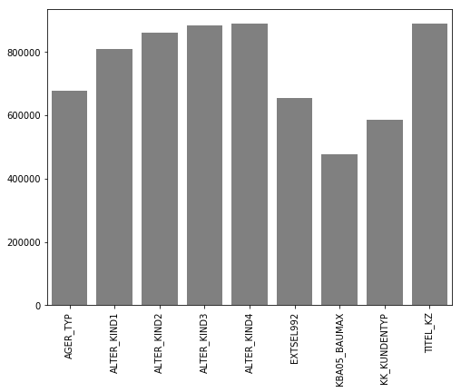


The dropped values correspond only to 18% of all missin values.


```python
azdias[null_df.index].isnull().sum().sum() / azdias.isnull().sum().sum()
```


    0.18222273002095582


```python
feature_drop_list = pd.Series(azdias.isnull().sum()).where(lambda x:  x > 445E3).dropna().index.tolist()
feature_drop_list
```


    ['AGER_TYP',
     'ALTER_KIND1',
     'ALTER_KIND2',
     'ALTER_KIND3',
     'ALTER_KIND4',
     'EXTSEL992',
     'KBA05_BAUMAX',
     'KK_KUNDENTYP',
     'TITEL_KZ']


```python
def drop_features(df, feature_drop_list):
    return df.drop(feature_drop_list, axis=1)
```


```python
azdias = drop_features(azdias, feature_drop_list)
```

### Assess missing data per row

After dealing with missing data per column, we turn our attention to missing data per row. Some rows have too many missing values and imputing them might not be the best option. In general, for these cases, too mush information was lost and imputing will only reproduce the average user.


```python
missing_rows = azdias.isnull().sum(axis=1)
```

For this dataset the missing values are divided in about 4 clusters. The fourth one has a lower cuttoff around 160 missing values. We selected all entries with more missing value than the cuttoff for further analysis. 


```python
fig,ax = plt.subplots(figsize=(14,4), ncols=2, nrows=1)
sns.distplot(missing_rows, kde=False, ax=ax[0])
ax[0].set_xlabel('number of missing values')
ax[0].set_ylabel('number of entries')
ax[0].set_yscale('log')
sns.distplot(missing_rows, kde=False, ax=ax[1])
ax[1].set_xlim([150,300])
#ax[1].set_ylim([0,10000])
ax[1].set_yscale('log')
ax[1].set_xlabel('number of missing values')
ax[1].set_ylabel('number of entries');
plt.suptitle('Count of missing values');
```


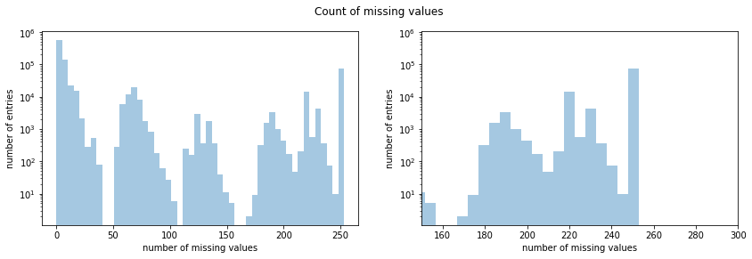


#### Cutoff for missing values is 160


```python
azdias_below = azdias[azdias.isnull().sum(axis=1)<160].copy().reset_index().drop('index', axis=1)
azdias_above = azdias[azdias.isnull().sum(axis=1)>=160].copy().reset_index().drop('index', axis=1)
```

Next we applied the Kolmogorov-Smirnov test to check if the selected subset is different from the main data body. The null hypothesis was that both groups were identical.


```python
list_numeric = azdias.dtypes[(azdias.dtypes=='int64') | 
                             (azdias.dtypes=='Int64') | 
                             (azdias.dtypes=='float64')].index[1:].tolist()
columns_not_missing = (azdias_above.isnull().sum()==0).index[1:].tolist()
columns_test = set(columns_not_missing).intersection(set(list_numeric))
n_columns_test = len(columns_test)
```


```python
ks_df = pd.DataFrame(azdias[columns_test].columns, columns=['col'])
  
def hypothesis_test(df1, df2, cols):
    stats = []
    pvalues = []
    for col in cols:
        counts_main = df1[col].value_counts().sort_index()
        counts_drop = df2[col].value_counts().sort_index()
        try:
            ch = ks_2samp(counts_main, counts_drop)
            stats.append(ch.statistic)
            pvalues.append(ch.pvalue)
        except:
            stats.append(np.nan)
            pvalues.append(np.nan)

    return stats, pvalues

stats, pvalues = hypothesis_test(azdias_below[columns_test], azdias_above[columns_test], azdias_below[columns_test].columns.values)
ks_df['stats'] = stats
ks_df['pvalues'] = pvalues
ks_df.dropna(axis=0, inplace=True)
```


```python
ks_df.head()
```


<div>
<style scoped>
    .dataframe tbody tr th:only-of-type {
        vertical-align: middle;
    }

    .dataframe tbody tr th {
        vertical-align: top;
    }

    .dataframe thead th {
        text-align: right;
    }
</style>
<table border="1" class="dataframe">
  <thead>
    <tr style="text-align: right;">
      <th></th>
      <th>col</th>
      <th>stats</th>
      <th>pvalues</th>
    </tr>
  </thead>
  <tbody>
    <tr>
      <th>0</th>
      <td>RT_KEIN_ANREIZ</td>
      <td>1.000000</td>
      <td>0.007937</td>
    </tr>
    <tr>
      <th>1</th>
      <td>CJT_TYP_3</td>
      <td>1.000000</td>
      <td>0.007937</td>
    </tr>
    <tr>
      <th>3</th>
      <td>FINANZ_VORSORGER</td>
      <td>1.000000</td>
      <td>0.007937</td>
    </tr>
    <tr>
      <th>4</th>
      <td>D19_GESAMT_ANZ_24</td>
      <td>0.857143</td>
      <td>0.008159</td>
    </tr>
    <tr>
      <th>6</th>
      <td>ARBEIT</td>
      <td>0.833333</td>
      <td>0.025974</td>
    </tr>
  </tbody>
</table>
</div>


Because the test involves multiple comparisons, we must apply some form of correction. It we apply the Bonferroni criterium and divide the significance level (5%) by the number of comparisons, we conclude that only 8.3 % of the columns differ. Now, I am not sure if this reason enough to drop these columns or not. I tested both options and I found out that droppping them improve the prediction results.


```python
ks_df[ks_df['pvalues']<0.05/n_columns_test].shape[0] / ks_df.shape[0]
```


    0.08287292817679558


```python
fig,ax = plt.subplots(figsize=(4,40))
sns.barplot(y='col', x='pvalues', data=ks_df, ax=ax)
ax.set_xlabel('p-value')
ax.set_ylabel('column');
ax.set_title('p-value per column for removed data')
```


    Text(0.5, 1.0, 'p-value per column for removed data')


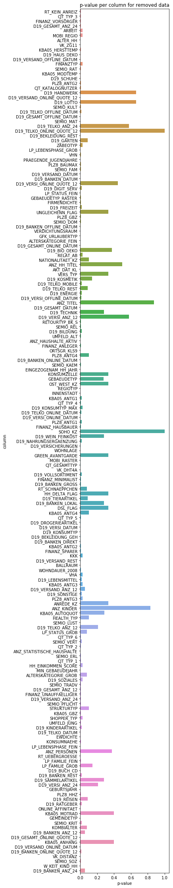


We therefore take only azdias_below.


```python
def drop_rows(df):
    return df[df.isnull().sum(axis=1)<160].copy().reset_index().drop('index', axis=1)
```


```python
azdias2 = drop_rows(azdias.copy())
```

## Data Imputation

For imputation we had to separate numeric from object features. The following functions perform imputation on numeric features using strategy mean and on categorical features using strategy median. It is worthy pointing out here an interesting fact. During the test rounds I tried to use the Iterative Imputer, an experimental method that tries to apply prediction to imputation. I used KNearest Neighbors with 5 neighbors as the prediction method but the prediction results were not match to the more standard mean and median values imputation.

#### Impute ints using median, floats using mean and objects using most frequent value


```python
def impute_numeric(df, strategy):
    imputer = SimpleImputer(missing_values=np.nan, strategy=strategy)
    imputer.fit(df)
    return imputer.transform(df)

def impute_object(df):
    list_mode = df.apply(lambda x: x.mode()[0]).values.tolist()
    list_columns = df.columns.values.tolist()
    dict_mode = {i:j for i,j, in zip(list_columns, list_mode)}
    return df.fillna(value=dict_mode)
    
def impute_calc(df):
    list_numeric = df.dtypes[(df.dtypes=='int64') | 
                             (df.dtypes=='Int64') | 
                             (df.dtypes=='float64')].index[1:].tolist()
    df[list_numeric] = impute_numeric(df[list_numeric].astype('Int64'),'median').astype('int64')
    list_objects = df.dtypes[(df.dtypes=='object')].index.tolist()
    df[list_objects] = impute_object(df[list_objects])
    
    return df
```


```python
azdias2 = impute_calc(azdias2)
```


```python
azdias2.isnull().values.any()
```


    False


### Re-encode mixed features


#### PRAEGENDE_JUGENDJAHRE

#### Two new attributes were created 

#### Levels for PRAGENDE_JUGENDJAHRE_intervall  
#### Dictionary pji_dict
- 1: 40s
- 2: 50s
- 3: 60s
- 4: 70s
- 5: 80s
- 6: 90s

#### Levels for PRAGENDE_JUGENDJAHRE_trend
#### Dictionary pjt_dict
- 0: mainstream
- 1: avantgarde


```python
def pragende_jugendjahre(df):
    pji_dict = {1:1, 2:1, 3:2, 4:2, 5:3, 6:3, 7:3, 8:4, 9:4, 10:5, 11:5, 12:5, 13:5, 14:6, 15:6}
    pjt_dict = {1:0, 2:1, 3:0, 4:1, 5:0, 6:1, 7:1, 8:0, 9:1, 10:0, 11:1, 12:0, 13:1, 14:0, 15:1}
    df['PRAEGENDE_JUGENDJAHRE_intervall'] = \
    df['PRAEGENDE_JUGENDJAHRE'].apply(lambda x: pji_dict[int(x)])
    df['PRAEGENDE_JUGENDJAHRE_trend'] = \
    df['PRAEGENDE_JUGENDJAHRE'].apply(lambda x: pjt_dict[int(x)])
# drop original attribute from dataset
    return df.drop('PRAEGENDE_JUGENDJAHRE', axis=1)
```


```python
azdias2 = pragende_jugendjahre(azdias2)
```

### Mixed-type variable CAMEO_INTL_2015

#### Two new attributes were created

#### Levels for CAMEO_INTL_2015_reichtum
#### Dictionary cir_dict
- 1: Wealthy
- 2: Prosperous
- 3: Comfortable
- 4: Less Affluent
- 5: Poorer

#### Levels for CAMEO_INTL_2015_leben
#### Dictionary cil_dict
- 1: Pre-Family Couples & Singles
- 2: Young Couples With Children
- 3: Families With School Age Children
- 4: Older Families &  Mature Couples
- 5: Elders In Retirement


```python
def cameo_intl_2015(df):
    df['CAMEO_INTL_2015'] = df['CAMEO_INTL_2015'].astype('int64')
    cir_dict = {11:1, 12:1, 13:1, 14:1, 15:1, 21:2, 22:2, 23:2, 24:2, 25:2, 31:3, 32:3, 33:3, 34:3, 
            35:3, 41:4, 42:4, 43:4, 44:4, 45:4, 51:5, 52:5, 53:5, 54:5, 55:5}
    cil_dict = {11:1, 12:2, 13:3, 14:4, 15:5, 21:1, 22:2, 23:3, 24:4, 25:5, 31:1, 32:2, 33:3, 34:4, 
            35:5, 41:1, 42:2, 43:3, 44:4, 45:5, 51:1, 52:2, 53:3, 54:4, 55:5}
    df['CAMEO_INTL_2015_reichtum'] = df['CAMEO_INTL_2015'].map(cir_dict).astype('int64')
    df['CAMEO_INTL_2015_leben'] = df['CAMEO_INTL_2015'].map(cil_dict).astype('int64')
    return df.drop('CAMEO_INTL_2015', axis=1)
```


```python
azdias2 = cameo_intl_2015(azdias2)
```

### Mixed-type variable LP_LEBENSPHASE_FEIN

#### Three new attributes were created.

#### Levels for LP_LEBENSPHASE_FEIN_alter
#### Dictionary llfa_dict

- 1: young age
- 2: middle age
- 3: retirement age
- 4: advanced age
- 5: higher age

#### Levels for LP_LEBENSPHASE_FEIN_verdiener
#### Dictionary llfv_dict

- 1: low-income earners 
- 2: average earner
- 3: independent
- 4: homeowner
- 5: top earner
- 6: wealthy

#### Levels for LP_LEBENSPHASE_FEIN_familie
#### Dictionary llff_dict

- 1: single
- 2: single parent
- 3: multiperson households
- 4: families
- 5: couples


```python
def lp_lebensphase_fein(df):
    df['LP_LEBENSPHASE_FEIN'] = df['LP_LEBENSPHASE_FEIN'].astype('int64')
    llfa_dict={1:1, 2:2, 3:1, 4:2, 5:4, 6:3, 7:4, 8:3, 9:2, 10:6, 11:4, 12:3, 13:5, 14:1, 15:5, 
           16:5, 17:2, 18:1, 19:5, 20:5, 21:2, 22:2, 23:2, 24:2, 25:2, 26:2, 27:2, 28:2, 29:1, 30:1, 
           31:5, 32:5, 33:1, 34:1, 35:1, 36:5, 37:4, 38:3, 39:2, 40:3}

    llfv_dict={1:1, 2:1, 3:2, 4:2, 5:1, 6:1, 7:2, 8:2, 9:3, 10:3, 11:4, 12:4, 13:5, 14:2, 15:1, 
           16:2, 17:3, 18:6, 19:4, 20:5, 21:1, 22:2, 23:5, 24:1, 25:2, 26:3, 27:4, 28:5, 29:1, 30:2, 
           31:1, 32:2, 33:3, 34:4, 35:5, 36:3, 37:4, 38:4, 39:5, 40:5}

    llff_dict={1:1, 2:1, 3:1, 4:1, 5:1, 6:1, 7:1, 8:1, 9:1, 10:1, 11:1, 12:1, 13:1, 14:5, 15:5, 
           16:5, 17:5, 18:5, 19:5, 20:5, 21:2, 22:2, 23:2, 24:4, 25:4, 26:4, 27:4, 28:4, 29:3, 30:3, 
           31:3, 32:3, 33:3, 34:3, 35:3, 36:3, 37:3, 38:3, 39:3, 40:3}

    # transformation of LP_LEBENSPHASE_FEIN
    df['LP_LEBENSPHASE_FEIN_alter'] = df['LP_LEBENSPHASE_FEIN'].map(llfa_dict).astype('int64')
    df['LP_LEBENSPHASE_FEIN_verdiener'] = df['LP_LEBENSPHASE_FEIN'].map(llfv_dict).astype('int64')
    df['LP_LEBENSPHASE_FEIN_familie'] = df['LP_LEBENSPHASE_FEIN'].map(llff_dict).astype('int64')
    # drop original attribute from dataset
    return df.drop('LP_LEBENSPHASE_FEIN', axis=1)


```


```python
azdias2 = lp_lebensphase_fein(azdias2)
```

### Mixed-type variable LP_LEBENSPHASE_GROB

#### Three new attributes were created

#### Levels for LP_LEBENSPHASE_GROB_alter:
#### Dictionary llga_dict  
- 1: young age  
- 2: middle age  
- 3: higher age  

#### Levels for LP_LEBENSPHASE_GROB_verdiener:
#### Dictionary llgv_dict  
- 0: low-income and average earner  
- 1: high-income  

#### Levels for LP_LEBENSPHASE_GROB_familie:
#### Dictionary llgf_dict  
- 1: single
- 2: couples
- 3: families
- 4: multiperson
- 5: single parents


```python
def lp_lebensphase_grob(df):
    df['LP_LEBENSPHASE_GROB'] = df['LP_LEBENSPHASE_GROB'].astype('int64')
    llga_dict={1:1, 2:3, 3:2, 4:2, 5:2, 6:2, 7:2, 8:2, 9:1, 10:3, 11:1, 12:3}
    llgv_dict={1:0, 2:0, 3:1, 4:0, 5:1, 6:0, 7:0, 8:1, 9:0, 10:0, 11:1, 12:1}
    llgf_dict={1:1, 2:1, 3:1, 4:2, 5:2, 6:5, 7:3, 8:3, 9:4, 10:4, 11:4, 12:4}
    
    df['LP_LEBENSPHASE_GROB_alter'] = df['LP_LEBENSPHASE_GROB'].map(llga_dict).astype('int64')
    df['LP_LEBENSPHASE_GROB_verdiener'] = df['LP_LEBENSPHASE_GROB'].map(llgv_dict).astype('int64')
    df['LP_LEBENSPHASE_GROB_familie'] = df['LP_LEBENSPHASE_GROB'].map(llgf_dict).astype('int64')
    # drop original attribute from dataset
    return df.drop('LP_LEBENSPHASE_GROB', axis=1)
```


```python
azdias2 = lp_lebensphase_grob(azdias2)
```

### Mixed-type variable PLZ8_BAUMAX

#### Two new attributes were created

PLZ8_BAUMAX 	most common building-type within the PLZ8 	1 	mainly 1-2 family homes
2038 	NaN 	NaN 	2 	mainly 3-5 family homes
2039 	NaN 	NaN 	3 	mainly 6-10 family homes
2040 	NaN 	NaN 	4 	mainly >10 family homes
2041 	NaN 	NaN 	5 	mainly business building

#### Levels for PLZ8_BAUMAX_geschaft:
#### Dictionary pbg_dict  
- 0: business building  
- 1: residential building 

#### Levels for PLZ8_BAUMAX_nummer:
#### Dictionary pbn_dict  
- 0: mainly 1-2 family homes
- 1: mainly 3-5 family homes
- 2: mainly 6-10 family homes
- 3: mainly >10 family homes


```python
#def plz8_baumax(df):
#    pbg_dict={5:0, 1:1, 2:1, 3:1, 4:1}
#    pbn_dict={1:1, 2:2, 3:3, 4:4, 5:0}
#    
#    df['PLZ8_BAUMAX_geschaft'] = df['PLZ8_BAUMAX'].map(pbg_dict).astype('Int64')
#    df['PLZ8_BAUMAX_nummer'] = df['PLZ8_BAUMAX'].map(pbn_dict).astype('Int64')

    # drop original attribute from dataset
#    return df.drop('PLZ8_BAUMAX', axis=1)

#azdias_below2 = plz8_baumax(azdias_below2)
```

## One-hot encoding


```python
def make_lists(df):
    list_all = df.columns.tolist()[1:]
    list_onehot = dias_info['Attribute'].str.extract(r'([0-9A-Z_]*TYP)', expand=True).\
    dropna().\
    stack().\
    values.\
    tolist()
    list_onehot = list(set(list_onehot).intersection(set(list_all)))
    list_binary = [column for column in df.columns.tolist() if df[column].value_counts().shape[0]==2]
    #list_onehot = set(list_onehot).difference(set(list_binary))
    list_scale = list(set(list_all).difference(set(list_binary)).difference(set(list_onehot)))
    
    # specific corrections
    list_scale.remove('D19_LETZTER_KAUF_BRANCHE')
    list_onehot.append('D19_LETZTER_KAUF_BRANCHE')
    list_scale.remove('CAMEO_DEUG_2015')
    list_onehot.append('CAMEO_DEUG_2015')
    list_scale.remove('CAMEO_DEU_2015')
    list_onehot.append('CAMEO_DEU_2015')
    
    return list_onehot, list_binary, list_scale
```


```python
list_onehot, list_binary, list_scale = make_lists(azdias2)
```


```python
list_onehot
```


    ['ZABEOTYP',
     'VERS_TYP',
     'REGIOTYP',
     'GFK_URLAUBERTYP',
     'CJT_GESAMTTYP',
     'SHOPPER_TYP',
     'FINANZTYP',
     'D19_KONSUMTYP',
     'HEALTH_TYP',
     'GEBAEUDETYP',
     'D19_LETZTER_KAUF_BRANCHE',
     'CAMEO_DEUG_2015',
     'CAMEO_DEU_2015']


```python
azdias2.isnull().values.any()
```


    False


```python
def adjust_types(df):
    df['CAMEO_DEUG_2015'] = df['CAMEO_DEUG_2015'].astype('int')
    return df.drop('LNR', axis=1)
```


```python
azdias2 = adjust_types(azdias2)
```


```python
onehot = OneHotEncoder()
onehot.fit(azdias2[list_onehot])
df_onehot = pd.DataFrame(data = onehot.transform(azdias2[list_onehot]).todense(), 
                         columns=onehot.get_feature_names())
```


```python
df_onehot.shape, azdias2.shape
```


    ((791314, 148), (791314, 361))


```python
azdias3 = pd.concat([azdias2.drop(list_onehot, axis=1), df_onehot], axis=1)
```


```python
azdias3.shape
```


    (791314, 496)


### Scaling


```python
scaler = StandardScaler()
azdias3[list_scale] = scaler.fit_transform(azdias3[list_scale])
```


```python
azdias3.describe()
```


<div>
<style scoped>
    .dataframe tbody tr th:only-of-type {
        vertical-align: middle;
    }

    .dataframe tbody tr th {
        vertical-align: top;
    }

    .dataframe thead th {
        text-align: right;
    }
</style>
<table border="1" class="dataframe">
  <thead>
    <tr style="text-align: right;">
      <th></th>
      <th>AKT_DAT_KL</th>
      <th>ALTER_HH</th>
      <th>ALTERSKATEGORIE_FEIN</th>
      <th>ANZ_HAUSHALTE_AKTIV</th>
      <th>ANZ_HH_TITEL</th>
      <th>ANZ_KINDER</th>
      <th>ANZ_PERSONEN</th>
      <th>ANZ_STATISTISCHE_HAUSHALTE</th>
      <th>ANZ_TITEL</th>
      <th>ARBEIT</th>
      <th>BALLRAUM</th>
      <th>CJT_KATALOGNUTZER</th>
      <th>CJT_TYP_1</th>
      <th>CJT_TYP_2</th>
      <th>CJT_TYP_3</th>
      <th>CJT_TYP_4</th>
      <th>CJT_TYP_5</th>
      <th>CJT_TYP_6</th>
      <th>D19_BANKEN_ANZ_12</th>
      <th>D19_BANKEN_ANZ_24</th>
      <th>D19_BANKEN_DATUM</th>
      <th>D19_BANKEN_DIREKT</th>
      <th>D19_BANKEN_GROSS</th>
      <th>D19_BANKEN_LOKAL</th>
      <th>D19_BANKEN_OFFLINE_DATUM</th>
      <th>D19_BANKEN_ONLINE_DATUM</th>
      <th>D19_BANKEN_ONLINE_QUOTE_12</th>
      <th>D19_BANKEN_REST</th>
      <th>D19_BEKLEIDUNG_GEH</th>
      <th>D19_BEKLEIDUNG_REST</th>
      <th>D19_BILDUNG</th>
      <th>D19_BIO_OEKO</th>
      <th>D19_BUCH_CD</th>
      <th>D19_DIGIT_SERV</th>
      <th>D19_DROGERIEARTIKEL</th>
      <th>D19_ENERGIE</th>
      <th>D19_FREIZEIT</th>
      <th>D19_GARTEN</th>
      <th>D19_GESAMT_ANZ_12</th>
      <th>D19_GESAMT_ANZ_24</th>
      <th>D19_GESAMT_DATUM</th>
      <th>D19_GESAMT_OFFLINE_DATUM</th>
      <th>D19_GESAMT_ONLINE_DATUM</th>
      <th>D19_GESAMT_ONLINE_QUOTE_12</th>
      <th>D19_HANDWERK</th>
      <th>D19_HAUS_DEKO</th>
      <th>D19_KINDERARTIKEL</th>
      <th>D19_KONSUMTYP_MAX</th>
      <th>D19_KOSMETIK</th>
      <th>D19_LEBENSMITTEL</th>
      <th>D19_LOTTO</th>
      <th>D19_NAHRUNGSERGAENZUNG</th>
      <th>D19_RATGEBER</th>
      <th>D19_REISEN</th>
      <th>D19_SAMMELARTIKEL</th>
      <th>D19_SCHUHE</th>
      <th>D19_SONSTIGE</th>
      <th>D19_SOZIALES</th>
      <th>D19_TECHNIK</th>
      <th>D19_TELKO_ANZ_12</th>
      <th>D19_TELKO_ANZ_24</th>
      <th>D19_TELKO_DATUM</th>
      <th>D19_TELKO_MOBILE</th>
      <th>D19_TELKO_OFFLINE_DATUM</th>
      <th>D19_TELKO_ONLINE_DATUM</th>
      <th>D19_TELKO_ONLINE_QUOTE_12</th>
      <th>D19_TELKO_REST</th>
      <th>D19_TIERARTIKEL</th>
      <th>D19_VERSAND_ANZ_12</th>
      <th>D19_VERSAND_ANZ_24</th>
      <th>D19_VERSAND_DATUM</th>
      <th>D19_VERSAND_OFFLINE_DATUM</th>
      <th>D19_VERSAND_ONLINE_DATUM</th>
      <th>D19_VERSAND_ONLINE_QUOTE_12</th>
      <th>D19_VERSAND_REST</th>
      <th>D19_VERSI_ANZ_12</th>
      <th>D19_VERSI_ANZ_24</th>
      <th>D19_VERSI_DATUM</th>
      <th>D19_VERSI_OFFLINE_DATUM</th>
      <th>D19_VERSI_ONLINE_DATUM</th>
      <th>D19_VERSI_ONLINE_QUOTE_12</th>
      <th>D19_VERSICHERUNGEN</th>
      <th>D19_VOLLSORTIMENT</th>
      <th>D19_WEIN_FEINKOST</th>
      <th>DSL_FLAG</th>
      <th>EINGEZOGENAM_HH_JAHR</th>
      <th>EWDICHTE</th>
      <th>FINANZ_ANLEGER</th>
      <th>FINANZ_HAUSBAUER</th>
      <th>FINANZ_MINIMALIST</th>
      <th>FINANZ_SPARER</th>
      <th>FINANZ_UNAUFFAELLIGER</th>
      <th>FINANZ_VORSORGER</th>
      <th>FIRMENDICHTE</th>
      <th>GEBAEUDETYP_RASTER</th>
      <th>GEBURTSJAHR</th>
      <th>GEMEINDETYP</th>
      <th>GREEN_AVANTGARDE</th>
      <th>HH_DELTA_FLAG</th>
      <th>HH_EINKOMMEN_SCORE</th>
      <th>INNENSTADT</th>
      <th>KBA05_ALTER1</th>
      <th>KBA05_ALTER2</th>
      <th>KBA05_ALTER3</th>
      <th>KBA05_ALTER4</th>
      <th>KBA05_ANHANG</th>
      <th>KBA05_ANTG1</th>
      <th>KBA05_ANTG2</th>
      <th>KBA05_ANTG3</th>
      <th>KBA05_ANTG4</th>
      <th>KBA05_AUTOQUOT</th>
      <th>KBA05_CCM1</th>
      <th>KBA05_CCM2</th>
      <th>KBA05_CCM3</th>
      <th>KBA05_CCM4</th>
      <th>KBA05_DIESEL</th>
      <th>KBA05_FRAU</th>
      <th>KBA05_GBZ</th>
      <th>KBA05_HERST1</th>
      <th>KBA05_HERST2</th>
      <th>KBA05_HERST3</th>
      <th>KBA05_HERST4</th>
      <th>KBA05_HERST5</th>
      <th>KBA05_HERSTTEMP</th>
      <th>KBA05_KRSAQUOT</th>
      <th>KBA05_KRSHERST1</th>
      <th>KBA05_KRSHERST2</th>
      <th>KBA05_KRSHERST3</th>
      <th>KBA05_KRSKLEIN</th>
      <th>KBA05_KRSOBER</th>
      <th>KBA05_KRSVAN</th>
      <th>KBA05_KRSZUL</th>
      <th>KBA05_KW1</th>
      <th>KBA05_KW2</th>
      <th>KBA05_KW3</th>
      <th>KBA05_MAXAH</th>
      <th>KBA05_MAXBJ</th>
      <th>KBA05_MAXHERST</th>
      <th>KBA05_MAXSEG</th>
      <th>KBA05_MAXVORB</th>
      <th>KBA05_MOD1</th>
      <th>KBA05_MOD2</th>
      <th>KBA05_MOD3</th>
      <th>KBA05_MOD4</th>
      <th>KBA05_MOD8</th>
      <th>KBA05_MODTEMP</th>
      <th>KBA05_MOTOR</th>
      <th>KBA05_MOTRAD</th>
      <th>KBA05_SEG1</th>
      <th>KBA05_SEG10</th>
      <th>KBA05_SEG2</th>
      <th>KBA05_SEG3</th>
      <th>KBA05_SEG4</th>
      <th>KBA05_SEG5</th>
      <th>KBA05_SEG6</th>
      <th>KBA05_SEG7</th>
      <th>KBA05_SEG8</th>
      <th>KBA05_SEG9</th>
      <th>KBA05_VORB0</th>
      <th>KBA05_VORB1</th>
      <th>KBA05_VORB2</th>
      <th>KBA05_ZUL1</th>
      <th>KBA05_ZUL2</th>
      <th>KBA05_ZUL3</th>
      <th>KBA05_ZUL4</th>
      <th>KBA13_ALTERHALTER_30</th>
      <th>KBA13_ALTERHALTER_45</th>
      <th>KBA13_ALTERHALTER_60</th>
      <th>KBA13_ALTERHALTER_61</th>
      <th>KBA13_ANTG1</th>
      <th>KBA13_ANTG2</th>
      <th>KBA13_ANTG3</th>
      <th>KBA13_ANTG4</th>
      <th>KBA13_ANZAHL_PKW</th>
      <th>KBA13_AUDI</th>
      <th>KBA13_AUTOQUOTE</th>
      <th>KBA13_BAUMAX</th>
      <th>KBA13_BJ_1999</th>
      <th>KBA13_BJ_2000</th>
      <th>KBA13_BJ_2004</th>
      <th>KBA13_BJ_2006</th>
      <th>KBA13_BJ_2008</th>
      <th>KBA13_BJ_2009</th>
      <th>KBA13_BMW</th>
      <th>KBA13_CCM_0_1400</th>
      <th>KBA13_CCM_1000</th>
      <th>KBA13_CCM_1200</th>
      <th>KBA13_CCM_1400</th>
      <th>KBA13_CCM_1401_2500</th>
      <th>KBA13_CCM_1500</th>
      <th>KBA13_CCM_1600</th>
      <th>KBA13_CCM_1800</th>
      <th>KBA13_CCM_2000</th>
      <th>KBA13_CCM_2500</th>
      <th>KBA13_CCM_2501</th>
      <th>KBA13_CCM_3000</th>
      <th>KBA13_CCM_3001</th>
      <th>KBA13_FAB_ASIEN</th>
      <th>KBA13_FAB_SONSTIGE</th>
      <th>KBA13_FIAT</th>
      <th>KBA13_FORD</th>
      <th>KBA13_GBZ</th>
      <th>KBA13_HALTER_20</th>
      <th>KBA13_HALTER_25</th>
      <th>KBA13_HALTER_30</th>
      <th>KBA13_HALTER_35</th>
      <th>KBA13_HALTER_40</th>
      <th>KBA13_HALTER_45</th>
      <th>KBA13_HALTER_50</th>
      <th>KBA13_HALTER_55</th>
      <th>KBA13_HALTER_60</th>
      <th>KBA13_HALTER_65</th>
      <th>KBA13_HALTER_66</th>
      <th>KBA13_HERST_ASIEN</th>
      <th>KBA13_HERST_AUDI_VW</th>
      <th>KBA13_HERST_BMW_BENZ</th>
      <th>KBA13_HERST_EUROPA</th>
      <th>KBA13_HERST_FORD_OPEL</th>
      <th>KBA13_HERST_SONST</th>
      <th>KBA13_HHZ</th>
      <th>KBA13_KMH_0_140</th>
      <th>KBA13_KMH_110</th>
      <th>KBA13_KMH_140</th>
      <th>KBA13_KMH_140_210</th>
      <th>KBA13_KMH_180</th>
      <th>KBA13_KMH_210</th>
      <th>KBA13_KMH_211</th>
      <th>KBA13_KMH_250</th>
      <th>KBA13_KMH_251</th>
      <th>KBA13_KRSAQUOT</th>
      <th>KBA13_KRSHERST_AUDI_VW</th>
      <th>KBA13_KRSHERST_BMW_BENZ</th>
      <th>KBA13_KRSHERST_FORD_OPEL</th>
      <th>KBA13_KRSSEG_KLEIN</th>
      <th>KBA13_KRSSEG_OBER</th>
      <th>KBA13_KRSSEG_VAN</th>
      <th>KBA13_KRSZUL_NEU</th>
      <th>KBA13_KW_0_60</th>
      <th>KBA13_KW_110</th>
      <th>KBA13_KW_120</th>
      <th>KBA13_KW_121</th>
      <th>KBA13_KW_30</th>
      <th>KBA13_KW_40</th>
      <th>KBA13_KW_50</th>
      <th>KBA13_KW_60</th>
      <th>KBA13_KW_61_120</th>
      <th>KBA13_KW_70</th>
      <th>KBA13_KW_80</th>
      <th>KBA13_KW_90</th>
      <th>KBA13_MAZDA</th>
      <th>KBA13_MERCEDES</th>
      <th>KBA13_MOTOR</th>
      <th>KBA13_NISSAN</th>
      <th>KBA13_OPEL</th>
      <th>KBA13_PEUGEOT</th>
      <th>KBA13_RENAULT</th>
      <th>KBA13_SEG_GELAENDEWAGEN</th>
      <th>KBA13_SEG_GROSSRAUMVANS</th>
      <th>KBA13_SEG_KLEINST</th>
      <th>KBA13_SEG_KLEINWAGEN</th>
      <th>KBA13_SEG_KOMPAKTKLASSE</th>
      <th>KBA13_SEG_MINIVANS</th>
      <th>KBA13_SEG_MINIWAGEN</th>
      <th>KBA13_SEG_MITTELKLASSE</th>
      <th>KBA13_SEG_OBEREMITTELKLASSE</th>
      <th>KBA13_SEG_OBERKLASSE</th>
      <th>KBA13_SEG_SONSTIGE</th>
      <th>KBA13_SEG_SPORTWAGEN</th>
      <th>KBA13_SEG_UTILITIES</th>
      <th>KBA13_SEG_VAN</th>
      <th>KBA13_SEG_WOHNMOBILE</th>
      <th>KBA13_SITZE_4</th>
      <th>KBA13_SITZE_5</th>
      <th>KBA13_SITZE_6</th>
      <th>KBA13_TOYOTA</th>
      <th>KBA13_VORB_0</th>
      <th>KBA13_VORB_1</th>
      <th>KBA13_VORB_1_2</th>
      <th>KBA13_VORB_2</th>
      <th>KBA13_VORB_3</th>
      <th>KBA13_VW</th>
      <th>KKK</th>
      <th>KOMBIALTER</th>
      <th>KONSUMNAEHE</th>
      <th>KONSUMZELLE</th>
      <th>LP_FAMILIE_FEIN</th>
      <th>LP_FAMILIE_GROB</th>
      <th>LP_STATUS_FEIN</th>
      <th>LP_STATUS_GROB</th>
      <th>MIN_GEBAEUDEJAHR</th>
      <th>MOBI_RASTER</th>
      <th>MOBI_REGIO</th>
      <th>NATIONALITAET_KZ</th>
      <th>ONLINE_AFFINITAET</th>
      <th>ORTSGR_KLS9</th>
      <th>OST_WEST_KZ</th>
      <th>PLZ8_ANTG1</th>
      <th>PLZ8_ANTG2</th>
      <th>PLZ8_ANTG3</th>
      <th>PLZ8_ANTG4</th>
      <th>PLZ8_BAUMAX</th>
      <th>PLZ8_GBZ</th>
      <th>PLZ8_HHZ</th>
      <th>RELAT_AB</th>
      <th>RETOURTYP_BK_S</th>
      <th>RT_KEIN_ANREIZ</th>
      <th>RT_SCHNAEPPCHEN</th>
      <th>RT_UEBERGROESSE</th>
      <th>SEMIO_DOM</th>
      <th>SEMIO_ERL</th>
      <th>SEMIO_FAM</th>
      <th>SEMIO_KAEM</th>
      <th>SEMIO_KRIT</th>
      <th>SEMIO_KULT</th>
      <th>SEMIO_LUST</th>
      <th>SEMIO_MAT</th>
      <th>SEMIO_PFLICHT</th>
      <th>SEMIO_RAT</th>
      <th>SEMIO_REL</th>
      <th>SEMIO_SOZ</th>
      <th>SEMIO_TRADV</th>
      <th>SEMIO_VERT</th>
      <th>SOHO_KZ</th>
      <th>STRUKTURTYP</th>
      <th>UMFELD_ALT</th>
      <th>UMFELD_JUNG</th>
      <th>UNGLEICHENN_FLAG</th>
      <th>VERDICHTUNGSRAUM</th>
      <th>VHA</th>
      <th>VHN</th>
      <th>VK_DHT4A</th>
      <th>VK_DISTANZ</th>
      <th>VK_ZG11</th>
      <th>W_KEIT_KIND_HH</th>
      <th>WOHNDAUER_2008</th>
      <th>WOHNLAGE</th>
      <th>ANREDE_KZ</th>
      <th>ALTERSKATEGORIE_GROB</th>
      <th>PRAEGENDE_JUGENDJAHRE_intervall</th>
      <th>PRAEGENDE_JUGENDJAHRE_trend</th>
      <th>CAMEO_INTL_2015_reichtum</th>
      <th>CAMEO_INTL_2015_leben</th>
      <th>LP_LEBENSPHASE_FEIN_alter</th>
      <th>LP_LEBENSPHASE_FEIN_verdiener</th>
      <th>LP_LEBENSPHASE_FEIN_familie</th>
      <th>LP_LEBENSPHASE_GROB_alter</th>
      <th>LP_LEBENSPHASE_GROB_verdiener</th>
      <th>LP_LEBENSPHASE_GROB_familie</th>
      <th>x0_1</th>
      <th>x0_2</th>
      <th>x0_3</th>
      <th>x0_4</th>
      <th>x0_5</th>
      <th>x0_6</th>
      <th>x1_1</th>
      <th>x1_2</th>
      <th>x2_1</th>
      <th>x2_2</th>
      <th>x2_3</th>
      <th>x2_4</th>
      <th>x2_5</th>
      <th>x2_6</th>
      <th>x2_7</th>
      <th>x3_1</th>
      <th>x3_2</th>
      <th>x3_3</th>
      <th>x3_4</th>
      <th>x3_5</th>
      <th>x3_6</th>
      <th>x3_7</th>
      <th>x3_8</th>
      <th>x3_9</th>
      <th>x3_10</th>
      <th>x3_11</th>
      <th>x3_12</th>
      <th>x4_1</th>
      <th>x4_2</th>
      <th>x4_3</th>
      <th>x4_4</th>
      <th>x4_5</th>
      <th>x4_6</th>
      <th>x5_0</th>
      <th>x5_1</th>
      <th>x5_2</th>
      <th>x5_3</th>
      <th>x6_1</th>
      <th>x6_2</th>
      <th>x6_3</th>
      <th>x6_4</th>
      <th>x6_5</th>
      <th>x6_6</th>
      <th>x7_1</th>
      <th>x7_2</th>
      <th>x7_3</th>
      <th>x7_4</th>
      <th>x7_5</th>
      <th>x7_6</th>
      <th>x7_9</th>
      <th>x8_1</th>
      <th>x8_2</th>
      <th>x8_3</th>
      <th>x9_1</th>
      <th>x9_2</th>
      <th>x9_3</th>
      <th>x9_4</th>
      <th>x9_5</th>
      <th>x9_6</th>
      <th>x9_8</th>
      <th>x10_D19_BANKEN_DIREKT</th>
      <th>x10_D19_BANKEN_GROSS</th>
      <th>x10_D19_BANKEN_LOKAL</th>
      <th>x10_D19_BANKEN_REST</th>
      <th>x10_D19_BEKLEIDUNG_GEH</th>
      <th>x10_D19_BEKLEIDUNG_REST</th>
      <th>x10_D19_BILDUNG</th>
      <th>x10_D19_BIO_OEKO</th>
      <th>x10_D19_BUCH_CD</th>
      <th>x10_D19_DIGIT_SERV</th>
      <th>x10_D19_DROGERIEARTIKEL</th>
      <th>x10_D19_ENERGIE</th>
      <th>x10_D19_FREIZEIT</th>
      <th>x10_D19_GARTEN</th>
      <th>x10_D19_HANDWERK</th>
      <th>x10_D19_HAUS_DEKO</th>
      <th>x10_D19_KINDERARTIKEL</th>
      <th>x10_D19_KOSMETIK</th>
      <th>x10_D19_LEBENSMITTEL</th>
      <th>x10_D19_LOTTO</th>
      <th>x10_D19_NAHRUNGSERGAENZUNG</th>
      <th>x10_D19_RATGEBER</th>
      <th>x10_D19_REISEN</th>
      <th>x10_D19_SAMMELARTIKEL</th>
      <th>x10_D19_SCHUHE</th>
      <th>x10_D19_SONSTIGE</th>
      <th>x10_D19_TECHNIK</th>
      <th>x10_D19_TELKO_MOBILE</th>
      <th>x10_D19_TELKO_REST</th>
      <th>x10_D19_TIERARTIKEL</th>
      <th>x10_D19_UNBEKANNT</th>
      <th>x10_D19_VERSAND_REST</th>
      <th>x10_D19_VERSICHERUNGEN</th>
      <th>x10_D19_VOLLSORTIMENT</th>
      <th>x10_D19_WEIN_FEINKOST</th>
      <th>x11_1</th>
      <th>x11_2</th>
      <th>x11_3</th>
      <th>x11_4</th>
      <th>x11_5</th>
      <th>x11_6</th>
      <th>x11_7</th>
      <th>x11_8</th>
      <th>x11_9</th>
      <th>x12_1A</th>
      <th>x12_1B</th>
      <th>x12_1C</th>
      <th>x12_1D</th>
      <th>x12_1E</th>
      <th>x12_2A</th>
      <th>x12_2B</th>
      <th>x12_2C</th>
      <th>x12_2D</th>
      <th>x12_3A</th>
      <th>x12_3B</th>
      <th>x12_3C</th>
      <th>x12_3D</th>
      <th>x12_4A</th>
      <th>x12_4B</th>
      <th>x12_4C</th>
      <th>x12_4D</th>
      <th>x12_4E</th>
      <th>x12_5A</th>
      <th>x12_5B</th>
      <th>x12_5C</th>
      <th>x12_5D</th>
      <th>x12_5E</th>
      <th>x12_5F</th>
      <th>x12_6A</th>
      <th>x12_6B</th>
      <th>x12_6C</th>
      <th>x12_6D</th>
      <th>x12_6E</th>
      <th>x12_6F</th>
      <th>x12_7A</th>
      <th>x12_7B</th>
      <th>x12_7C</th>
      <th>x12_7D</th>
      <th>x12_7E</th>
      <th>x12_8A</th>
      <th>x12_8B</th>
      <th>x12_8C</th>
      <th>x12_8D</th>
      <th>x12_9A</th>
      <th>x12_9B</th>
      <th>x12_9C</th>
      <th>x12_9D</th>
      <th>x12_9E</th>
    </tr>
  </thead>
  <tbody>
    <tr>
      <th>count</th>
      <td>7.913140e+05</td>
      <td>7.913140e+05</td>
      <td>7.913140e+05</td>
      <td>7.913140e+05</td>
      <td>7.913140e+05</td>
      <td>7.913140e+05</td>
      <td>7.913140e+05</td>
      <td>7.913140e+05</td>
      <td>7.913140e+05</td>
      <td>7.913140e+05</td>
      <td>7.913140e+05</td>
      <td>7.913140e+05</td>
      <td>7.913140e+05</td>
      <td>7.913140e+05</td>
      <td>7.913140e+05</td>
      <td>7.913140e+05</td>
      <td>7.913140e+05</td>
      <td>7.913140e+05</td>
      <td>7.913140e+05</td>
      <td>7.913140e+05</td>
      <td>7.913140e+05</td>
      <td>7.913140e+05</td>
      <td>7.913140e+05</td>
      <td>7.913140e+05</td>
      <td>7.913140e+05</td>
      <td>7.913140e+05</td>
      <td>7.913140e+05</td>
      <td>7.913140e+05</td>
      <td>7.913140e+05</td>
      <td>7.913140e+05</td>
      <td>7.913140e+05</td>
      <td>7.913140e+05</td>
      <td>7.913140e+05</td>
      <td>7.913140e+05</td>
      <td>7.913140e+05</td>
      <td>7.913140e+05</td>
      <td>7.913140e+05</td>
      <td>7.913140e+05</td>
      <td>7.913140e+05</td>
      <td>7.913140e+05</td>
      <td>7.913140e+05</td>
      <td>7.913140e+05</td>
      <td>7.913140e+05</td>
      <td>7.913140e+05</td>
      <td>7.913140e+05</td>
      <td>7.913140e+05</td>
      <td>7.913140e+05</td>
      <td>7.913140e+05</td>
      <td>7.913140e+05</td>
      <td>7.913140e+05</td>
      <td>7.913140e+05</td>
      <td>7.913140e+05</td>
      <td>7.913140e+05</td>
      <td>7.913140e+05</td>
      <td>7.913140e+05</td>
      <td>7.913140e+05</td>
      <td>7.913140e+05</td>
      <td>7.913140e+05</td>
      <td>7.913140e+05</td>
      <td>7.913140e+05</td>
      <td>7.913140e+05</td>
      <td>7.913140e+05</td>
      <td>7.913140e+05</td>
      <td>7.913140e+05</td>
      <td>7.913140e+05</td>
      <td>7.913140e+05</td>
      <td>7.913140e+05</td>
      <td>7.913140e+05</td>
      <td>7.913140e+05</td>
      <td>7.913140e+05</td>
      <td>7.913140e+05</td>
      <td>7.913140e+05</td>
      <td>7.913140e+05</td>
      <td>7.913140e+05</td>
      <td>7.913140e+05</td>
      <td>7.913140e+05</td>
      <td>7.913140e+05</td>
      <td>7.913140e+05</td>
      <td>7.913140e+05</td>
      <td>7.913140e+05</td>
      <td>7.913140e+05</td>
      <td>7.913140e+05</td>
      <td>7.913140e+05</td>
      <td>7.913140e+05</td>
      <td>791314.000000</td>
      <td>7.913140e+05</td>
      <td>7.913140e+05</td>
      <td>7.913140e+05</td>
      <td>7.913140e+05</td>
      <td>7.913140e+05</td>
      <td>7.913140e+05</td>
      <td>7.913140e+05</td>
      <td>7.913140e+05</td>
      <td>7.913140e+05</td>
      <td>7.913140e+05</td>
      <td>7.913140e+05</td>
      <td>7.913140e+05</td>
      <td>791314.000000</td>
      <td>791314.000000</td>
      <td>7.913140e+05</td>
      <td>7.913140e+05</td>
      <td>7.913140e+05</td>
      <td>7.913140e+05</td>
      <td>7.913140e+05</td>
      <td>7.913140e+05</td>
      <td>7.913140e+05</td>
      <td>7.913140e+05</td>
      <td>7.913140e+05</td>
      <td>7.913140e+05</td>
      <td>7.913140e+05</td>
      <td>7.913140e+05</td>
      <td>7.913140e+05</td>
      <td>7.913140e+05</td>
      <td>7.913140e+05</td>
      <td>7.913140e+05</td>
      <td>7.913140e+05</td>
      <td>7.913140e+05</td>
      <td>7.913140e+05</td>
      <td>7.913140e+05</td>
      <td>7.913140e+05</td>
      <td>7.913140e+05</td>
      <td>7.913140e+05</td>
      <td>7.913140e+05</td>
      <td>7.913140e+05</td>
      <td>7.913140e+05</td>
      <td>7.913140e+05</td>
      <td>7.913140e+05</td>
      <td>7.913140e+05</td>
      <td>7.913140e+05</td>
      <td>7.913140e+05</td>
      <td>7.913140e+05</td>
      <td>7.913140e+05</td>
      <td>7.913140e+05</td>
      <td>7.913140e+05</td>
      <td>7.913140e+05</td>
      <td>7.913140e+05</td>
      <td>7.913140e+05</td>
      <td>7.913140e+05</td>
      <td>7.913140e+05</td>
      <td>7.913140e+05</td>
      <td>7.913140e+05</td>
      <td>7.913140e+05</td>
      <td>7.913140e+05</td>
      <td>7.913140e+05</td>
      <td>7.913140e+05</td>
      <td>7.913140e+05</td>
      <td>7.913140e+05</td>
      <td>7.913140e+05</td>
      <td>7.913140e+05</td>
      <td>7.913140e+05</td>
      <td>7.913140e+05</td>
      <td>7.913140e+05</td>
      <td>7.913140e+05</td>
      <td>7.913140e+05</td>
      <td>791314.000000</td>
      <td>7.913140e+05</td>
      <td>7.913140e+05</td>
      <td>7.913140e+05</td>
      <td>7.913140e+05</td>
      <td>7.913140e+05</td>
      <td>7.913140e+05</td>
      <td>7.913140e+05</td>
      <td>7.913140e+05</td>
      <td>7.913140e+05</td>
      <td>7.913140e+05</td>
      <td>7.913140e+05</td>
      <td>7.913140e+05</td>
      <td>7.913140e+05</td>
      <td>7.913140e+05</td>
      <td>7.913140e+05</td>
      <td>7.913140e+05</td>
      <td>7.913140e+05</td>
      <td>7.913140e+05</td>
      <td>7.913140e+05</td>
      <td>7.913140e+05</td>
      <td>7.913140e+05</td>
      <td>7.913140e+05</td>
      <td>7.913140e+05</td>
      <td>7.913140e+05</td>
      <td>7.913140e+05</td>
      <td>7.913140e+05</td>
      <td>7.913140e+05</td>
      <td>7.913140e+05</td>
      <td>7.913140e+05</td>
      <td>7.913140e+05</td>
      <td>7.913140e+05</td>
      <td>7.913140e+05</td>
      <td>7.913140e+05</td>
      <td>7.913140e+05</td>
      <td>7.913140e+05</td>
      <td>7.913140e+05</td>
      <td>7.913140e+05</td>
      <td>7.913140e+05</td>
      <td>7.913140e+05</td>
      <td>7.913140e+05</td>
      <td>7.913140e+05</td>
      <td>7.913140e+05</td>
      <td>7.913140e+05</td>
      <td>7.913140e+05</td>
      <td>7.913140e+05</td>
      <td>7.913140e+05</td>
      <td>7.913140e+05</td>
      <td>7.913140e+05</td>
      <td>7.913140e+05</td>
      <td>7.913140e+05</td>
      <td>7.913140e+05</td>
      <td>7.913140e+05</td>
      <td>7.913140e+05</td>
      <td>7.913140e+05</td>
      <td>7.913140e+05</td>
      <td>7.913140e+05</td>
      <td>7.913140e+05</td>
      <td>7.913140e+05</td>
      <td>7.913140e+05</td>
      <td>7.913140e+05</td>
      <td>7.913140e+05</td>
      <td>7.913140e+05</td>
      <td>7.913140e+05</td>
      <td>7.913140e+05</td>
      <td>7.913140e+05</td>
      <td>7.913140e+05</td>
      <td>7.913140e+05</td>
      <td>7.913140e+05</td>
      <td>7.913140e+05</td>
      <td>7.913140e+05</td>
      <td>7.913140e+05</td>
      <td>7.913140e+05</td>
      <td>7.913140e+05</td>
      <td>7.913140e+05</td>
      <td>7.913140e+05</td>
      <td>7.913140e+05</td>
      <td>7.913140e+05</td>
      <td>7.913140e+05</td>
      <td>7.913140e+05</td>
      <td>7.913140e+05</td>
      <td>7.913140e+05</td>
      <td>7.913140e+05</td>
      <td>7.913140e+05</td>
      <td>7.913140e+05</td>
      <td>7.913140e+05</td>
      <td>7.913140e+05</td>
      <td>7.913140e+05</td>
      <td>7.913140e+05</td>
      <td>7.913140e+05</td>
      <td>7.913140e+05</td>
      <td>7.913140e+05</td>
      <td>7.913140e+05</td>
      <td>7.913140e+05</td>
      <td>7.913140e+05</td>
      <td>7.913140e+05</td>
      <td>7.913140e+05</td>
      <td>7.913140e+05</td>
      <td>7.913140e+05</td>
      <td>7.913140e+05</td>
      <td>7.913140e+05</td>
      <td>7.913140e+05</td>
      <td>7.913140e+05</td>
      <td>7.913140e+05</td>
      <td>7.913140e+05</td>
      <td>7.913140e+05</td>
      <td>7.913140e+05</td>
      <td>7.913140e+05</td>
      <td>7.913140e+05</td>
      <td>7.913140e+05</td>
      <td>7.913140e+05</td>
      <td>7.913140e+05</td>
      <td>7.913140e+05</td>
      <td>7.913140e+05</td>
      <td>7.913140e+05</td>
      <td>7.913140e+05</td>
      <td>7.913140e+05</td>
      <td>7.913140e+05</td>
      <td>7.913140e+05</td>
      <td>7.913140e+05</td>
      <td>7.913140e+05</td>
      <td>7.913140e+05</td>
      <td>7.913140e+05</td>
      <td>7.913140e+05</td>
      <td>7.913140e+05</td>
      <td>7.913140e+05</td>
      <td>7.913140e+05</td>
      <td>7.913140e+05</td>
      <td>7.913140e+05</td>
      <td>7.913140e+05</td>
      <td>791314.000000</td>
      <td>7.913140e+05</td>
      <td>7.913140e+05</td>
      <td>7.913140e+05</td>
      <td>7.913140e+05</td>
      <td>7.913140e+05</td>
      <td>7.913140e+05</td>
      <td>7.913140e+05</td>
      <td>7.913140e+05</td>
      <td>7.913140e+05</td>
      <td>7.913140e+05</td>
      <td>791314.000000</td>
      <td>7.913140e+05</td>
      <td>7.913140e+05</td>
      <td>7.913140e+05</td>
      <td>7.913140e+05</td>
      <td>7.913140e+05</td>
      <td>7.913140e+05</td>
      <td>7.913140e+05</td>
      <td>7.913140e+05</td>
      <td>7.913140e+05</td>
      <td>7.913140e+05</td>
      <td>7.913140e+05</td>
      <td>7.913140e+05</td>
      <td>7.913140e+05</td>
      <td>7.913140e+05</td>
      <td>7.913140e+05</td>
      <td>7.913140e+05</td>
      <td>7.913140e+05</td>
      <td>7.913140e+05</td>
      <td>7.913140e+05</td>
      <td>7.913140e+05</td>
      <td>7.913140e+05</td>
      <td>7.913140e+05</td>
      <td>7.913140e+05</td>
      <td>7.913140e+05</td>
      <td>7.913140e+05</td>
      <td>7.913140e+05</td>
      <td>791314.000000</td>
      <td>7.913140e+05</td>
      <td>7.913140e+05</td>
      <td>7.913140e+05</td>
      <td>791314.000000</td>
      <td>7.913140e+05</td>
      <td>7.913140e+05</td>
      <td>7.913140e+05</td>
      <td>7.913140e+05</td>
      <td>7.913140e+05</td>
      <td>7.913140e+05</td>
      <td>7.913140e+05</td>
      <td>7.913140e+05</td>
      <td>7.913140e+05</td>
      <td>791314.000000</td>
      <td>7.913140e+05</td>
      <td>7.913140e+05</td>
      <td>791314.000000</td>
      <td>7.913140e+05</td>
      <td>7.913140e+05</td>
      <td>7.913140e+05</td>
      <td>7.913140e+05</td>
      <td>7.913140e+05</td>
      <td>7.913140e+05</td>
      <td>791314.000000</td>
      <td>7.913140e+05</td>
      <td>791314.000000</td>
      <td>791314.000000</td>
      <td>791314.000000</td>
      <td>791314.000000</td>
      <td>791314.000000</td>
      <td>791314.000000</td>
      <td>791314.000000</td>
      <td>791314.000000</td>
      <td>791314.000000</td>
      <td>791314.000000</td>
      <td>791314.000000</td>
      <td>791314.000000</td>
      <td>791314.000000</td>
      <td>791314.000000</td>
      <td>791314.000000</td>
      <td>791314.000000</td>
      <td>791314.000000</td>
      <td>791314.000000</td>
      <td>791314.000000</td>
      <td>791314.000000</td>
      <td>791314.000000</td>
      <td>791314.000000</td>
      <td>791314.000000</td>
      <td>791314.000000</td>
      <td>791314.000000</td>
      <td>791314.000000</td>
      <td>791314.000000</td>
      <td>791314.000000</td>
      <td>791314.000000</td>
      <td>791314.000000</td>
      <td>791314.000000</td>
      <td>791314.000000</td>
      <td>791314.000000</td>
      <td>791314.000000</td>
      <td>791314.000000</td>
      <td>791314.000000</td>
      <td>791314.000000</td>
      <td>791314.000000</td>
      <td>791314.000000</td>
      <td>791314.000000</td>
      <td>791314.000000</td>
      <td>791314.000000</td>
      <td>791314.000000</td>
      <td>791314.000000</td>
      <td>791314.000000</td>
      <td>791314.000000</td>
      <td>791314.000000</td>
      <td>791314.000000</td>
      <td>791314.000000</td>
      <td>791314.000000</td>
      <td>791314.000000</td>
      <td>791314.000000</td>
      <td>791314.000000</td>
      <td>791314.000000</td>
      <td>791314.000000</td>
      <td>791314.000000</td>
      <td>791314.000000</td>
      <td>791314.000000</td>
      <td>791314.000000</td>
      <td>791314.000000</td>
      <td>791314.000000</td>
      <td>791314.000000</td>
      <td>791314.000000</td>
      <td>791314.000000</td>
      <td>791314.000000</td>
      <td>791314.000000</td>
      <td>791314.000000</td>
      <td>791314.000000</td>
      <td>791314.000000</td>
      <td>791314.000000</td>
      <td>791314.000000</td>
      <td>791314.000000</td>
      <td>791314.000000</td>
      <td>791314.000000</td>
      <td>791314.000000</td>
      <td>791314.000000</td>
      <td>791314.000000</td>
      <td>791314.000000</td>
      <td>791314.000000</td>
      <td>791314.000000</td>
      <td>791314.000000</td>
      <td>791314.000000</td>
      <td>791314.000000</td>
      <td>791314.000000</td>
      <td>791314.000000</td>
      <td>791314.000000</td>
      <td>791314.000000</td>
      <td>791314.000000</td>
      <td>791314.000000</td>
      <td>791314.000000</td>
      <td>791314.000000</td>
      <td>791314.000000</td>
      <td>791314.000000</td>
      <td>791314.000000</td>
      <td>791314.000000</td>
      <td>791314.000000</td>
      <td>791314.000000</td>
      <td>791314.000000</td>
      <td>791314.000000</td>
      <td>791314.000000</td>
      <td>791314.000000</td>
      <td>791314.000000</td>
      <td>791314.000000</td>
      <td>791314.000000</td>
      <td>791314.000000</td>
      <td>791314.000000</td>
      <td>791314.000000</td>
      <td>791314.000000</td>
      <td>791314.000000</td>
      <td>791314.000000</td>
      <td>791314.000000</td>
      <td>791314.000000</td>
      <td>791314.000000</td>
      <td>791314.000000</td>
      <td>791314.000000</td>
      <td>791314.000000</td>
      <td>791314.000000</td>
      <td>791314.000000</td>
      <td>791314.000000</td>
      <td>791314.000000</td>
      <td>791314.000000</td>
      <td>791314.000000</td>
      <td>791314.000000</td>
      <td>791314.000000</td>
      <td>791314.000000</td>
      <td>791314.000000</td>
      <td>791314.000000</td>
      <td>791314.000000</td>
      <td>791314.000000</td>
      <td>791314.000000</td>
      <td>791314.000000</td>
      <td>791314.000000</td>
      <td>791314.000000</td>
      <td>791314.000000</td>
      <td>791314.000000</td>
      <td>791314.000000</td>
      <td>791314.000000</td>
      <td>791314.000000</td>
      <td>791314.000000</td>
      <td>791314.000000</td>
      <td>791314.000000</td>
      <td>791314.000000</td>
      <td>791314.000000</td>
      <td>791314.000000</td>
      <td>791314.000000</td>
      <td>791314.000000</td>
      <td>791314.000000</td>
      <td>791314.000000</td>
    </tr>
    <tr>
      <th>mean</th>
      <td>3.408533e-17</td>
      <td>-3.376208e-17</td>
      <td>4.363928e-17</td>
      <td>7.183421e-18</td>
      <td>2.440567e-17</td>
      <td>9.872715e-18</td>
      <td>6.068195e-17</td>
      <td>-2.208902e-18</td>
      <td>1.812018e-17</td>
      <td>5.351649e-18</td>
      <td>2.205580e-16</td>
      <td>-4.460905e-17</td>
      <td>-5.227735e-17</td>
      <td>4.672816e-17</td>
      <td>1.494152e-16</td>
      <td>8.727857e-17</td>
      <td>-2.011358e-17</td>
      <td>-1.104451e-16</td>
      <td>2.713537e-17</td>
      <td>2.738679e-17</td>
      <td>2.598603e-17</td>
      <td>2.183760e-17</td>
      <td>-3.185847e-17</td>
      <td>4.416906e-17</td>
      <td>-6.934516e-16</td>
      <td>-3.377645e-16</td>
      <td>-9.724557e-17</td>
      <td>-7.524634e-18</td>
      <td>4.389070e-17</td>
      <td>1.224773e-17</td>
      <td>1.066738e-17</td>
      <td>-1.966462e-17</td>
      <td>-5.900283e-17</td>
      <td>5.459400e-18</td>
      <td>-4.597390e-18</td>
      <td>1.905403e-17</td>
      <td>-5.885018e-17</td>
      <td>-1.989808e-17</td>
      <td>5.014926e-18</td>
      <td>-3.534243e-17</td>
      <td>3.311557e-17</td>
      <td>-1.634408e-16</td>
      <td>-5.964485e-17</td>
      <td>9.050662e-17</td>
      <td>4.872156e-17</td>
      <td>-9.492891e-17</td>
      <td>3.887578e-17</td>
      <td>-1.387657e-16</td>
      <td>-1.557007e-17</td>
      <td>-5.986484e-17</td>
      <td>-3.127033e-17</td>
      <td>-5.423483e-18</td>
      <td>-8.776794e-17</td>
      <td>3.571058e-17</td>
      <td>-1.867690e-17</td>
      <td>-1.118818e-17</td>
      <td>4.455966e-17</td>
      <td>-8.153183e-18</td>
      <td>-9.051111e-18</td>
      <td>-1.982624e-17</td>
      <td>-8.377665e-18</td>
      <td>-8.422562e-17</td>
      <td>1.027768e-16</td>
      <td>-6.525959e-16</td>
      <td>-2.370332e-15</td>
      <td>-5.333690e-18</td>
      <td>8.394726e-17</td>
      <td>1.251936e-17</td>
      <td>-3.893414e-17</td>
      <td>-5.542908e-17</td>
      <td>1.284486e-16</td>
      <td>4.836687e-16</td>
      <td>9.382446e-17</td>
      <td>-8.644799e-17</td>
      <td>3.552202e-17</td>
      <td>1.814263e-17</td>
      <td>-2.111477e-17</td>
      <td>-6.800904e-17</td>
      <td>1.543789e-15</td>
      <td>7.328257e-16</td>
      <td>-2.098457e-17</td>
      <td>-1.118997e-16</td>
      <td>3.518081e-17</td>
      <td>-4.690325e-17</td>
      <td>0.974114</td>
      <td>1.147056e-14</td>
      <td>-3.721012e-17</td>
      <td>-5.396545e-18</td>
      <td>-1.067636e-16</td>
      <td>2.694681e-17</td>
      <td>1.002087e-16</td>
      <td>7.197788e-17</td>
      <td>-7.596468e-18</td>
      <td>-9.693129e-17</td>
      <td>-2.036051e-16</td>
      <td>1.117740e-16</td>
      <td>8.207059e-18</td>
      <td>0.219796</td>
      <td>0.089321</td>
      <td>1.977416e-16</td>
      <td>-1.614609e-16</td>
      <td>5.550091e-17</td>
      <td>-1.076077e-16</td>
      <td>2.754842e-17</td>
      <td>1.490111e-16</td>
      <td>-2.487260e-17</td>
      <td>2.411834e-17</td>
      <td>9.473137e-17</td>
      <td>3.145441e-17</td>
      <td>3.728196e-17</td>
      <td>1.025882e-16</td>
      <td>-1.045143e-16</td>
      <td>2.299054e-16</td>
      <td>-1.186342e-16</td>
      <td>4.217566e-17</td>
      <td>1.604776e-16</td>
      <td>-4.762608e-17</td>
      <td>-1.207713e-16</td>
      <td>-8.311219e-17</td>
      <td>6.260352e-17</td>
      <td>1.998069e-16</td>
      <td>1.331088e-16</td>
      <td>-8.796099e-17</td>
      <td>1.067636e-16</td>
      <td>5.222347e-17</td>
      <td>-2.180168e-16</td>
      <td>-1.954429e-16</td>
      <td>1.667317e-16</td>
      <td>1.443374e-16</td>
      <td>-6.089745e-17</td>
      <td>-1.528632e-16</td>
      <td>1.371225e-16</td>
      <td>-5.906568e-17</td>
      <td>-7.397128e-17</td>
      <td>-5.051741e-17</td>
      <td>-7.659323e-18</td>
      <td>1.039980e-16</td>
      <td>5.139738e-17</td>
      <td>2.808718e-17</td>
      <td>-7.273214e-17</td>
      <td>-5.818571e-17</td>
      <td>-1.561676e-16</td>
      <td>1.023009e-16</td>
      <td>-3.491143e-17</td>
      <td>5.064312e-18</td>
      <td>-3.850314e-17</td>
      <td>1.308999e-16</td>
      <td>-8.368686e-18</td>
      <td>-3.474980e-17</td>
      <td>1.082542e-16</td>
      <td>-6.844005e-17</td>
      <td>-6.472263e-17</td>
      <td>1.181134e-16</td>
      <td>-8.277097e-17</td>
      <td>0.111815</td>
      <td>-9.284572e-17</td>
      <td>-2.047275e-17</td>
      <td>9.395915e-17</td>
      <td>-1.078591e-16</td>
      <td>-3.135563e-17</td>
      <td>9.359998e-17</td>
      <td>6.924818e-17</td>
      <td>-1.884211e-16</td>
      <td>-1.326329e-16</td>
      <td>-8.675328e-17</td>
      <td>1.073383e-16</td>
      <td>1.891036e-16</td>
      <td>-2.621949e-18</td>
      <td>1.512110e-17</td>
      <td>-1.110467e-16</td>
      <td>1.984779e-16</td>
      <td>-6.863759e-17</td>
      <td>-7.400720e-17</td>
      <td>1.435248e-16</td>
      <td>1.273441e-16</td>
      <td>-1.860506e-17</td>
      <td>-1.187420e-16</td>
      <td>-1.837362e-16</td>
      <td>-1.000291e-17</td>
      <td>4.237770e-17</td>
      <td>5.307650e-17</td>
      <td>-1.602038e-16</td>
      <td>-8.737734e-17</td>
      <td>2.394234e-16</td>
      <td>-9.132822e-17</td>
      <td>4.994274e-17</td>
      <td>-1.371495e-16</td>
      <td>-1.353491e-16</td>
      <td>-1.455720e-16</td>
      <td>-1.536534e-16</td>
      <td>-2.196600e-16</td>
      <td>5.524051e-17</td>
      <td>1.087390e-16</td>
      <td>6.368103e-17</td>
      <td>1.495723e-16</td>
      <td>6.632094e-17</td>
      <td>1.580532e-16</td>
      <td>-2.171548e-16</td>
      <td>1.839674e-16</td>
      <td>1.624172e-16</td>
      <td>-1.553594e-16</td>
      <td>2.162210e-17</td>
      <td>1.896782e-16</td>
      <td>1.482658e-16</td>
      <td>-1.241834e-16</td>
      <td>-1.199362e-16</td>
      <td>-9.764963e-17</td>
      <td>-1.341863e-16</td>
      <td>4.210383e-17</td>
      <td>-1.539093e-16</td>
      <td>-1.380294e-16</td>
      <td>-2.198127e-17</td>
      <td>2.644397e-17</td>
      <td>-1.614654e-16</td>
      <td>-5.945179e-17</td>
      <td>-5.204389e-17</td>
      <td>-2.042965e-16</td>
      <td>1.937728e-17</td>
      <td>1.839674e-16</td>
      <td>1.158147e-16</td>
      <td>1.198374e-16</td>
      <td>1.442072e-17</td>
      <td>-1.647518e-16</td>
      <td>1.790468e-17</td>
      <td>1.633869e-16</td>
      <td>-5.362424e-17</td>
      <td>-3.324128e-17</td>
      <td>9.122945e-18</td>
      <td>-1.300379e-16</td>
      <td>1.073562e-16</td>
      <td>-1.503670e-16</td>
      <td>1.484454e-16</td>
      <td>9.423751e-17</td>
      <td>-2.892764e-16</td>
      <td>-1.688867e-16</td>
      <td>-1.509416e-16</td>
      <td>1.040968e-16</td>
      <td>4.987090e-17</td>
      <td>-2.235840e-18</td>
      <td>-9.747903e-17</td>
      <td>7.273214e-17</td>
      <td>1.332525e-16</td>
      <td>1.227467e-16</td>
      <td>-5.168472e-17</td>
      <td>-5.172063e-18</td>
      <td>2.416862e-16</td>
      <td>-8.465662e-17</td>
      <td>8.784426e-17</td>
      <td>-4.737466e-17</td>
      <td>2.394683e-16</td>
      <td>-1.073562e-16</td>
      <td>-3.243674e-16</td>
      <td>1.650032e-16</td>
      <td>-1.992232e-16</td>
      <td>1.759938e-17</td>
      <td>-1.616270e-17</td>
      <td>-9.857450e-17</td>
      <td>3.439961e-17</td>
      <td>-4.455517e-17</td>
      <td>1.304330e-16</td>
      <td>-8.541088e-17</td>
      <td>-1.431566e-16</td>
      <td>1.509596e-16</td>
      <td>1.739465e-16</td>
      <td>-1.521987e-16</td>
      <td>-1.298403e-16</td>
      <td>2.355130e-16</td>
      <td>-1.150066e-16</td>
      <td>1.728241e-16</td>
      <td>1.564908e-16</td>
      <td>-6.781150e-17</td>
      <td>1.596156e-16</td>
      <td>1.840393e-16</td>
      <td>1.900599e-16</td>
      <td>1.357307e-16</td>
      <td>1.118279e-16</td>
      <td>-7.565041e-18</td>
      <td>1.887085e-16</td>
      <td>-1.062428e-16</td>
      <td>-8.081349e-17</td>
      <td>1.691696e-16</td>
      <td>2.017823e-16</td>
      <td>1.688104e-18</td>
      <td>-6.662623e-17</td>
      <td>0.236474</td>
      <td>-3.252294e-17</td>
      <td>4.266952e-17</td>
      <td>-1.388555e-16</td>
      <td>1.269176e-16</td>
      <td>5.847134e-15</td>
      <td>8.602147e-17</td>
      <td>-2.821289e-17</td>
      <td>-8.593168e-17</td>
      <td>1.483377e-17</td>
      <td>-6.820659e-17</td>
      <td>0.211487</td>
      <td>1.707140e-16</td>
      <td>-1.275057e-17</td>
      <td>8.893974e-17</td>
      <td>1.215794e-17</td>
      <td>5.344465e-17</td>
      <td>1.698879e-16</td>
      <td>6.087950e-17</td>
      <td>-5.191818e-17</td>
      <td>8.578128e-17</td>
      <td>-7.878417e-17</td>
      <td>7.089139e-17</td>
      <td>6.174151e-17</td>
      <td>-1.452398e-17</td>
      <td>-1.545513e-16</td>
      <td>-2.072417e-16</td>
      <td>-1.131389e-18</td>
      <td>-6.116683e-17</td>
      <td>-1.451051e-17</td>
      <td>9.859246e-18</td>
      <td>9.238778e-17</td>
      <td>-2.311625e-16</td>
      <td>-1.242552e-16</td>
      <td>5.107413e-17</td>
      <td>1.229308e-16</td>
      <td>5.965831e-17</td>
      <td>-2.197768e-16</td>
      <td>0.008405</td>
      <td>3.468964e-16</td>
      <td>7.179830e-17</td>
      <td>3.374233e-16</td>
      <td>0.089710</td>
      <td>-5.811388e-17</td>
      <td>6.357328e-18</td>
      <td>1.955507e-16</td>
      <td>-2.860798e-17</td>
      <td>-1.333153e-16</td>
      <td>-1.287090e-16</td>
      <td>7.147504e-18</td>
      <td>1.133544e-16</td>
      <td>-1.134262e-16</td>
      <td>1.521476</td>
      <td>-1.486968e-17</td>
      <td>9.819737e-17</td>
      <td>0.254965</td>
      <td>1.122230e-16</td>
      <td>1.382988e-16</td>
      <td>-9.843083e-17</td>
      <td>-2.102049e-17</td>
      <td>-1.524681e-16</td>
      <td>3.179113e-16</td>
      <td>0.416127</td>
      <td>-1.636338e-16</td>
      <td>0.154226</td>
      <td>0.040678</td>
      <td>0.353712</td>
      <td>0.260572</td>
      <td>0.101678</td>
      <td>0.089135</td>
      <td>0.458504</td>
      <td>0.541496</td>
      <td>0.068803</td>
      <td>0.115256</td>
      <td>0.118125</td>
      <td>0.085737</td>
      <td>0.260625</td>
      <td>0.245934</td>
      <td>0.105519</td>
      <td>0.063831</td>
      <td>0.053429</td>
      <td>0.067064</td>
      <td>0.076067</td>
      <td>0.088843</td>
      <td>0.032422</td>
      <td>0.050981</td>
      <td>0.110128</td>
      <td>0.071552</td>
      <td>0.129291</td>
      <td>0.094229</td>
      <td>0.162162</td>
      <td>0.116748</td>
      <td>0.177663</td>
      <td>0.184275</td>
      <td>0.254112</td>
      <td>0.139684</td>
      <td>0.127520</td>
      <td>0.160240</td>
      <td>0.309158</td>
      <td>0.305257</td>
      <td>0.225345</td>
      <td>0.247171</td>
      <td>0.131059</td>
      <td>0.053675</td>
      <td>0.070294</td>
      <td>0.133302</td>
      <td>0.364498</td>
      <td>0.143728</td>
      <td>0.060348</td>
      <td>0.065403</td>
      <td>0.095609</td>
      <td>0.254154</td>
      <td>0.068978</td>
      <td>0.311780</td>
      <td>0.195437</td>
      <td>0.417334</td>
      <td>0.387229</td>
      <td>0.575689</td>
      <td>0.006100</td>
      <td>0.224059</td>
      <td>0.001123</td>
      <td>0.000001</td>
      <td>0.000781</td>
      <td>0.192246</td>
      <td>0.028449</td>
      <td>0.012884</td>
      <td>0.001765</td>
      <td>0.006410</td>
      <td>0.012525</td>
      <td>0.026507</td>
      <td>0.001190</td>
      <td>0.001489</td>
      <td>0.035205</td>
      <td>0.004379</td>
      <td>0.029360</td>
      <td>0.014817</td>
      <td>0.008868</td>
      <td>0.002003</td>
      <td>0.002722</td>
      <td>0.025506</td>
      <td>0.008860</td>
      <td>0.000969</td>
      <td>0.007894</td>
      <td>0.001016</td>
      <td>0.004994</td>
      <td>0.006033</td>
      <td>0.003815</td>
      <td>0.002985</td>
      <td>0.039652</td>
      <td>0.054681</td>
      <td>0.008557</td>
      <td>0.017650</td>
      <td>0.014050</td>
      <td>0.003152</td>
      <td>0.464017</td>
      <td>0.031812</td>
      <td>0.070633</td>
      <td>0.042499</td>
      <td>0.002654</td>
      <td>0.045508</td>
      <td>0.104416</td>
      <td>0.108456</td>
      <td>0.130363</td>
      <td>0.069174</td>
      <td>0.133171</td>
      <td>0.097869</td>
      <td>0.175023</td>
      <td>0.136021</td>
      <td>0.013624</td>
      <td>0.005108</td>
      <td>0.005416</td>
      <td>0.015002</td>
      <td>0.006358</td>
      <td>0.016624</td>
      <td>0.019392</td>
      <td>0.024329</td>
      <td>0.044071</td>
      <td>0.012800</td>
      <td>0.008880</td>
      <td>0.043674</td>
      <td>0.043102</td>
      <td>0.041539</td>
      <td>0.011344</td>
      <td>0.060020</td>
      <td>0.010781</td>
      <td>0.006679</td>
      <td>0.015099</td>
      <td>0.013006</td>
      <td>0.012438</td>
      <td>0.018768</td>
      <td>0.004487</td>
      <td>0.005376</td>
      <td>0.008553</td>
      <td>0.076953</td>
      <td>0.018626</td>
      <td>0.007651</td>
      <td>0.020281</td>
      <td>0.006768</td>
      <td>0.043270</td>
      <td>0.030799</td>
      <td>0.011342</td>
      <td>0.006637</td>
      <td>0.005821</td>
      <td>0.066100</td>
      <td>0.042049</td>
      <td>0.039068</td>
      <td>0.022144</td>
      <td>0.025911</td>
      <td>0.034853</td>
      <td>0.031477</td>
      <td>0.036006</td>
      <td>0.007773</td>
    </tr>
    <tr>
      <th>std</th>
      <td>1.000001e+00</td>
      <td>1.000001e+00</td>
      <td>1.000001e+00</td>
      <td>1.000001e+00</td>
      <td>1.000001e+00</td>
      <td>1.000001e+00</td>
      <td>1.000001e+00</td>
      <td>1.000001e+00</td>
      <td>1.000001e+00</td>
      <td>1.000001e+00</td>
      <td>1.000001e+00</td>
      <td>1.000001e+00</td>
      <td>1.000001e+00</td>
      <td>1.000001e+00</td>
      <td>1.000001e+00</td>
      <td>1.000001e+00</td>
      <td>1.000001e+00</td>
      <td>1.000001e+00</td>
      <td>1.000001e+00</td>
      <td>1.000001e+00</td>
      <td>1.000001e+00</td>
      <td>1.000001e+00</td>
      <td>1.000001e+00</td>
      <td>1.000001e+00</td>
      <td>1.000001e+00</td>
      <td>1.000001e+00</td>
      <td>1.000001e+00</td>
      <td>1.000001e+00</td>
      <td>1.000001e+00</td>
      <td>1.000001e+00</td>
      <td>1.000001e+00</td>
      <td>1.000001e+00</td>
      <td>1.000001e+00</td>
      <td>1.000001e+00</td>
      <td>1.000001e+00</td>
      <td>1.000001e+00</td>
      <td>1.000001e+00</td>
      <td>1.000001e+00</td>
      <td>1.000001e+00</td>
      <td>1.000001e+00</td>
      <td>1.000001e+00</td>
      <td>1.000001e+00</td>
      <td>1.000001e+00</td>
      <td>1.000001e+00</td>
      <td>1.000001e+00</td>
      <td>1.000001e+00</td>
      <td>1.000001e+00</td>
      <td>1.000001e+00</td>
      <td>1.000001e+00</td>
      <td>1.000001e+00</td>
      <td>1.000001e+00</td>
      <td>1.000001e+00</td>
      <td>1.000001e+00</td>
      <td>1.000001e+00</td>
      <td>1.000001e+00</td>
      <td>1.000001e+00</td>
      <td>1.000001e+00</td>
      <td>1.000001e+00</td>
      <td>1.000001e+00</td>
      <td>1.000001e+00</td>
      <td>1.000001e+00</td>
      <td>1.000001e+00</td>
      <td>1.000001e+00</td>
      <td>1.000001e+00</td>
      <td>1.000001e+00</td>
      <td>1.000001e+00</td>
      <td>1.000001e+00</td>
      <td>1.000001e+00</td>
      <td>1.000001e+00</td>
      <td>1.000001e+00</td>
      <td>1.000001e+00</td>
      <td>1.000001e+00</td>
      <td>1.000001e+00</td>
      <td>1.000001e+00</td>
      <td>1.000001e+00</td>
      <td>1.000001e+00</td>
      <td>1.000001e+00</td>
      <td>1.000001e+00</td>
      <td>1.000001e+00</td>
      <td>1.000001e+00</td>
      <td>1.000001e+00</td>
      <td>1.000001e+00</td>
      <td>1.000001e+00</td>
      <td>1.000001e+00</td>
      <td>0.158795</td>
      <td>1.000001e+00</td>
      <td>1.000001e+00</td>
      <td>1.000001e+00</td>
      <td>1.000001e+00</td>
      <td>1.000001e+00</td>
      <td>1.000001e+00</td>
      <td>1.000001e+00</td>
      <td>1.000001e+00</td>
      <td>1.000001e+00</td>
      <td>1.000001e+00</td>
      <td>1.000001e+00</td>
      <td>1.000001e+00</td>
      <td>0.414109</td>
      <td>0.285207</td>
      <td>1.000001e+00</td>
      <td>1.000001e+00</td>
      <td>1.000001e+00</td>
      <td>1.000001e+00</td>
      <td>1.000001e+00</td>
      <td>1.000001e+00</td>
      <td>1.000001e+00</td>
      <td>1.000001e+00</td>
      <td>1.000001e+00</td>
      <td>1.000001e+00</td>
      <td>1.000001e+00</td>
      <td>1.000001e+00</td>
      <td>1.000001e+00</td>
      <td>1.000001e+00</td>
      <td>1.000001e+00</td>
      <td>1.000001e+00</td>
      <td>1.000001e+00</td>
      <td>1.000001e+00</td>
      <td>1.000001e+00</td>
      <td>1.000001e+00</td>
      <td>1.000001e+00</td>
      <td>1.000001e+00</td>
      <td>1.000001e+00</td>
      <td>1.000001e+00</td>
      <td>1.000001e+00</td>
      <td>1.000001e+00</td>
      <td>1.000001e+00</td>
      <td>1.000001e+00</td>
      <td>1.000001e+00</td>
      <td>1.000001e+00</td>
      <td>1.000001e+00</td>
      <td>1.000001e+00</td>
      <td>1.000001e+00</td>
      <td>1.000001e+00</td>
      <td>1.000001e+00</td>
      <td>1.000001e+00</td>
      <td>1.000001e+00</td>
      <td>1.000001e+00</td>
      <td>1.000001e+00</td>
      <td>1.000001e+00</td>
      <td>1.000001e+00</td>
      <td>1.000001e+00</td>
      <td>1.000001e+00</td>
      <td>1.000001e+00</td>
      <td>1.000001e+00</td>
      <td>1.000001e+00</td>
      <td>1.000001e+00</td>
      <td>1.000001e+00</td>
      <td>1.000001e+00</td>
      <td>1.000001e+00</td>
      <td>1.000001e+00</td>
      <td>1.000001e+00</td>
      <td>1.000001e+00</td>
      <td>1.000001e+00</td>
      <td>1.000001e+00</td>
      <td>0.315139</td>
      <td>1.000001e+00</td>
      <td>1.000001e+00</td>
      <td>1.000001e+00</td>
      <td>1.000001e+00</td>
      <td>1.000001e+00</td>
      <td>1.000001e+00</td>
      <td>1.000001e+00</td>
      <td>1.000001e+00</td>
      <td>1.000001e+00</td>
      <td>1.000001e+00</td>
      <td>1.000001e+00</td>
      <td>1.000001e+00</td>
      <td>1.000001e+00</td>
      <td>1.000001e+00</td>
      <td>1.000001e+00</td>
      <td>1.000001e+00</td>
      <td>1.000001e+00</td>
      <td>1.000001e+00</td>
      <td>1.000001e+00</td>
      <td>1.000001e+00</td>
      <td>1.000001e+00</td>
      <td>1.000001e+00</td>
      <td>1.000001e+00</td>
      <td>1.000001e+00</td>
      <td>1.000001e+00</td>
      <td>1.000001e+00</td>
      <td>1.000001e+00</td>
      <td>1.000001e+00</td>
      <td>1.000001e+00</td>
      <td>1.000001e+00</td>
      <td>1.000001e+00</td>
      <td>1.000001e+00</td>
      <td>1.000001e+00</td>
      <td>1.000001e+00</td>
      <td>1.000001e+00</td>
      <td>1.000001e+00</td>
      <td>1.000001e+00</td>
      <td>1.000001e+00</td>
      <td>1.000001e+00</td>
      <td>1.000001e+00</td>
      <td>1.000001e+00</td>
      <td>1.000001e+00</td>
      <td>1.000001e+00</td>
      <td>1.000001e+00</td>
      <td>1.000001e+00</td>
      <td>1.000001e+00</td>
      <td>1.000001e+00</td>
      <td>1.000001e+00</td>
      <td>1.000001e+00</td>
      <td>1.000001e+00</td>
      <td>1.000001e+00</td>
      <td>1.000001e+00</td>
      <td>1.000001e+00</td>
      <td>1.000001e+00</td>
      <td>1.000001e+00</td>
      <td>1.000001e+00</td>
      <td>1.000001e+00</td>
      <td>1.000001e+00</td>
      <td>1.000001e+00</td>
      <td>1.000001e+00</td>
      <td>1.000001e+00</td>
      <td>1.000001e+00</td>
      <td>1.000001e+00</td>
      <td>1.000001e+00</td>
      <td>1.000001e+00</td>
      <td>1.000001e+00</td>
      <td>1.000001e+00</td>
      <td>1.000001e+00</td>
      <td>1.000001e+00</td>
      <td>1.000001e+00</td>
      <td>1.000001e+00</td>
      <td>1.000001e+00</td>
      <td>1.000001e+00</td>
      <td>1.000001e+00</td>
      <td>1.000001e+00</td>
      <td>1.000001e+00</td>
      <td>1.000001e+00</td>
      <td>1.000001e+00</td>
      <td>1.000001e+00</td>
      <td>1.000001e+00</td>
      <td>1.000001e+00</td>
      <td>1.000001e+00</td>
      <td>1.000001e+00</td>
      <td>1.000001e+00</td>
      <td>1.000001e+00</td>
      <td>1.000001e+00</td>
      <td>1.000001e+00</td>
      <td>1.000001e+00</td>
      <td>1.000001e+00</td>
      <td>1.000001e+00</td>
      <td>1.000001e+00</td>
      <td>1.000001e+00</td>
      <td>1.000001e+00</td>
      <td>1.000001e+00</td>
      <td>1.000001e+00</td>
      <td>1.000001e+00</td>
      <td>1.000001e+00</td>
      <td>1.000001e+00</td>
      <td>1.000001e+00</td>
      <td>1.000001e+00</td>
      <td>1.000001e+00</td>
      <td>1.000001e+00</td>
      <td>1.000001e+00</td>
      <td>1.000001e+00</td>
      <td>1.000001e+00</td>
      <td>1.000001e+00</td>
      <td>1.000001e+00</td>
      <td>1.000001e+00</td>
      <td>1.000001e+00</td>
      <td>1.000001e+00</td>
      <td>1.000001e+00</td>
      <td>1.000001e+00</td>
      <td>1.000001e+00</td>
      <td>1.000001e+00</td>
      <td>1.000001e+00</td>
      <td>1.000001e+00</td>
      <td>1.000001e+00</td>
      <td>1.000001e+00</td>
      <td>1.000001e+00</td>
      <td>1.000001e+00</td>
      <td>1.000001e+00</td>
      <td>1.000001e+00</td>
      <td>1.000001e+00</td>
      <td>1.000001e+00</td>
      <td>1.000001e+00</td>
      <td>1.000001e+00</td>
      <td>1.000001e+00</td>
      <td>1.000001e+00</td>
      <td>1.000001e+00</td>
      <td>0.424917</td>
      <td>1.000001e+00</td>
      <td>1.000001e+00</td>
      <td>1.000001e+00</td>
      <td>1.000001e+00</td>
      <td>1.000001e+00</td>
      <td>1.000001e+00</td>
      <td>1.000001e+00</td>
      <td>1.000001e+00</td>
      <td>1.000001e+00</td>
      <td>1.000001e+00</td>
      <td>0.408363</td>
      <td>1.000001e+00</td>
      <td>1.000001e+00</td>
      <td>1.000001e+00</td>
      <td>1.000001e+00</td>
      <td>1.000001e+00</td>
      <td>1.000001e+00</td>
      <td>1.000001e+00</td>
      <td>1.000001e+00</td>
      <td>1.000001e+00</td>
      <td>1.000001e+00</td>
      <td>1.000001e+00</td>
      <td>1.000001e+00</td>
      <td>1.000001e+00</td>
      <td>1.000001e+00</td>
      <td>1.000001e+00</td>
      <td>1.000001e+00</td>
      <td>1.000001e+00</td>
      <td>1.000001e+00</td>
      <td>1.000001e+00</td>
      <td>1.000001e+00</td>
      <td>1.000001e+00</td>
      <td>1.000001e+00</td>
      <td>1.000001e+00</td>
      <td>1.000001e+00</td>
      <td>1.000001e+00</td>
      <td>1.000001e+00</td>
      <td>0.091293</td>
      <td>1.000001e+00</td>
      <td>1.000001e+00</td>
      <td>1.000001e+00</td>
      <td>0.285766</td>
      <td>1.000001e+00</td>
      <td>1.000001e+00</td>
      <td>1.000001e+00</td>
      <td>1.000001e+00</td>
      <td>1.000001e+00</td>
      <td>1.000001e+00</td>
      <td>1.000001e+00</td>
      <td>1.000001e+00</td>
      <td>1.000001e+00</td>
      <td>0.499539</td>
      <td>1.000001e+00</td>
      <td>1.000001e+00</td>
      <td>0.435842</td>
      <td>1.000001e+00</td>
      <td>1.000001e+00</td>
      <td>1.000001e+00</td>
      <td>1.000001e+00</td>
      <td>1.000001e+00</td>
      <td>1.000001e+00</td>
      <td>0.492915</td>
      <td>1.000001e+00</td>
      <td>0.361165</td>
      <td>0.197543</td>
      <td>0.478121</td>
      <td>0.438947</td>
      <td>0.302224</td>
      <td>0.284939</td>
      <td>0.498275</td>
      <td>0.498275</td>
      <td>0.253119</td>
      <td>0.319331</td>
      <td>0.322756</td>
      <td>0.279976</td>
      <td>0.438976</td>
      <td>0.430640</td>
      <td>0.307222</td>
      <td>0.244451</td>
      <td>0.224887</td>
      <td>0.250134</td>
      <td>0.265106</td>
      <td>0.284518</td>
      <td>0.177118</td>
      <td>0.219959</td>
      <td>0.313050</td>
      <td>0.257745</td>
      <td>0.335522</td>
      <td>0.292148</td>
      <td>0.368600</td>
      <td>0.321119</td>
      <td>0.382229</td>
      <td>0.387708</td>
      <td>0.435361</td>
      <td>0.346659</td>
      <td>0.333554</td>
      <td>0.366829</td>
      <td>0.462147</td>
      <td>0.460516</td>
      <td>0.417810</td>
      <td>0.431367</td>
      <td>0.337465</td>
      <td>0.225376</td>
      <td>0.255643</td>
      <td>0.339901</td>
      <td>0.481289</td>
      <td>0.350814</td>
      <td>0.238130</td>
      <td>0.247235</td>
      <td>0.294055</td>
      <td>0.435385</td>
      <td>0.253416</td>
      <td>0.463221</td>
      <td>0.396537</td>
      <td>0.493119</td>
      <td>0.487117</td>
      <td>0.494238</td>
      <td>0.077864</td>
      <td>0.416961</td>
      <td>0.033499</td>
      <td>0.001124</td>
      <td>0.027935</td>
      <td>0.394066</td>
      <td>0.166252</td>
      <td>0.112773</td>
      <td>0.041980</td>
      <td>0.079803</td>
      <td>0.111211</td>
      <td>0.160636</td>
      <td>0.034482</td>
      <td>0.038554</td>
      <td>0.184297</td>
      <td>0.066027</td>
      <td>0.168814</td>
      <td>0.120821</td>
      <td>0.093749</td>
      <td>0.044710</td>
      <td>0.052102</td>
      <td>0.157655</td>
      <td>0.093709</td>
      <td>0.031118</td>
      <td>0.088499</td>
      <td>0.031859</td>
      <td>0.070493</td>
      <td>0.077438</td>
      <td>0.061649</td>
      <td>0.054553</td>
      <td>0.195140</td>
      <td>0.227357</td>
      <td>0.092106</td>
      <td>0.131677</td>
      <td>0.117697</td>
      <td>0.056052</td>
      <td>0.498704</td>
      <td>0.175498</td>
      <td>0.256211</td>
      <td>0.201725</td>
      <td>0.051447</td>
      <td>0.208415</td>
      <td>0.305800</td>
      <td>0.310956</td>
      <td>0.336702</td>
      <td>0.253749</td>
      <td>0.339760</td>
      <td>0.297137</td>
      <td>0.379987</td>
      <td>0.342811</td>
      <td>0.115925</td>
      <td>0.071287</td>
      <td>0.073396</td>
      <td>0.121559</td>
      <td>0.079482</td>
      <td>0.127859</td>
      <td>0.137898</td>
      <td>0.154069</td>
      <td>0.205253</td>
      <td>0.112412</td>
      <td>0.093815</td>
      <td>0.204369</td>
      <td>0.203086</td>
      <td>0.199532</td>
      <td>0.105904</td>
      <td>0.237525</td>
      <td>0.103270</td>
      <td>0.081450</td>
      <td>0.121947</td>
      <td>0.113301</td>
      <td>0.110828</td>
      <td>0.135703</td>
      <td>0.066838</td>
      <td>0.073123</td>
      <td>0.092085</td>
      <td>0.266517</td>
      <td>0.135200</td>
      <td>0.087132</td>
      <td>0.140961</td>
      <td>0.081992</td>
      <td>0.203464</td>
      <td>0.172774</td>
      <td>0.105893</td>
      <td>0.081197</td>
      <td>0.076071</td>
      <td>0.248457</td>
      <td>0.200701</td>
      <td>0.193757</td>
      <td>0.147152</td>
      <td>0.158871</td>
      <td>0.183409</td>
      <td>0.174602</td>
      <td>0.186305</td>
      <td>0.087822</td>
    </tr>
    <tr>
      <th>min</th>
      <td>-9.389127e-01</td>
      <td>-1.425513e+00</td>
      <td>-3.082220e+00</td>
      <td>-5.308093e-01</td>
      <td>-1.250733e-01</td>
      <td>-3.064170e-01</td>
      <td>-1.494211e+00</td>
      <td>-5.310183e-01</td>
      <td>-6.063610e-02</td>
      <td>-2.171645e+00</td>
      <td>-1.443539e+00</td>
      <td>-1.512074e+00</td>
      <td>-1.687787e+00</td>
      <td>-1.524138e+00</td>
      <td>-1.646377e+00</td>
      <td>-1.667392e+00</td>
      <td>-1.667903e+00</td>
      <td>-1.819550e+00</td>
      <td>-2.387547e-01</td>
      <td>-3.078514e-01</td>
      <td>-4.567119e+00</td>
      <td>-4.671944e-01</td>
      <td>-3.627109e-01</td>
      <td>-1.375997e-01</td>
      <td>-1.410801e+01</td>
      <td>-5.228128e+00</td>
      <td>-2.410806e-01</td>
      <td>-2.949667e-01</td>
      <td>-3.179956e-01</td>
      <td>-5.332892e-01</td>
      <td>-3.109844e-01</td>
      <td>-2.160254e-01</td>
      <td>-6.622738e-01</td>
      <td>-1.984891e-01</td>
      <td>-4.034765e-01</td>
      <td>-2.721309e-01</td>
      <td>-3.599081e-01</td>
      <td>-2.208787e-01</td>
      <td>-6.352490e-01</td>
      <td>-7.661360e-01</td>
      <td>-1.802809e+00</td>
      <td>-4.363784e+00</td>
      <td>-2.098636e+00</td>
      <td>-6.316631e-01</td>
      <td>-4.188350e-01</td>
      <td>-5.007327e-01</td>
      <td>-4.408990e-01</td>
      <td>-1.419473e+00</td>
      <td>-4.632444e-01</td>
      <td>-2.543788e-01</td>
      <td>-4.603599e-01</td>
      <td>-2.164690e-01</td>
      <td>-3.264070e-01</td>
      <td>-4.760107e-01</td>
      <td>-3.480773e-01</td>
      <td>-3.734004e-01</td>
      <td>-8.927647e-01</td>
      <td>-3.904610e-01</td>
      <td>-6.761427e-01</td>
      <td>-1.847019e-01</td>
      <td>-2.626427e-01</td>
      <td>-6.019902e+00</td>
      <td>-4.869396e-01</td>
      <td>-1.134041e+01</td>
      <td>-3.570557e+01</td>
      <td>-3.105543e-02</td>
      <td>-4.160814e-01</td>
      <td>-2.175354e-01</td>
      <td>-5.546820e-01</td>
      <td>-6.651706e-01</td>
      <td>-2.147326e+00</td>
      <td>-5.491123e+00</td>
      <td>-2.254224e+00</td>
      <td>-5.894015e-01</td>
      <td>-4.563094e-01</td>
      <td>-2.735348e-01</td>
      <td>-3.518466e-01</td>
      <td>-4.080897e+00</td>
      <td>-1.697781e+01</td>
      <td>-2.764180e+01</td>
      <td>-4.460158e-02</td>
      <td>-5.915813e-01</td>
      <td>-7.074607e-01</td>
      <td>-2.652505e-01</td>
      <td>0.000000</td>
      <td>-1.472737e+01</td>
      <td>-1.712610e+00</td>
      <td>-1.250423e+00</td>
      <td>-1.512519e+00</td>
      <td>-1.491951e+00</td>
      <td>-1.154630e+00</td>
      <td>-1.180511e+00</td>
      <td>-1.768763e+00</td>
      <td>-2.128564e+00</td>
      <td>-2.967383e+00</td>
      <td>-1.252060e+00</td>
      <td>-1.096238e+00</td>
      <td>0.000000</td>
      <td>0.000000</td>
      <td>-2.215568e+00</td>
      <td>-1.748879e+00</td>
      <td>-1.677737e+00</td>
      <td>-1.968852e+00</td>
      <td>-1.916359e+00</td>
      <td>-2.331187e+00</td>
      <td>-1.050006e+00</td>
      <td>-1.070260e+00</td>
      <td>-1.029163e+00</td>
      <td>-5.979557e-01</td>
      <td>-4.654265e-01</td>
      <td>-1.613052e+00</td>
      <td>-1.894664e+00</td>
      <td>-1.981763e+00</td>
      <td>-1.935834e+00</td>
      <td>-1.006817e+00</td>
      <td>-1.955745e+00</td>
      <td>-1.914587e+00</td>
      <td>-1.655406e+00</td>
      <td>-1.754420e+00</td>
      <td>-1.988952e+00</td>
      <td>-2.684511e+00</td>
      <td>-2.361963e+00</td>
      <td>-2.246413e+00</td>
      <td>-1.441463e+00</td>
      <td>-1.805766e+00</td>
      <td>-1.970703e+00</td>
      <td>-1.902752e+00</td>
      <td>-1.917653e+00</td>
      <td>-1.593023e+00</td>
      <td>-1.633416e+00</td>
      <td>-1.773536e+00</td>
      <td>-1.382599e+00</td>
      <td>-1.843632e+00</td>
      <td>-1.954750e+00</td>
      <td>-1.153425e+00</td>
      <td>-1.819476e+00</td>
      <td>-1.122370e+00</td>
      <td>-1.627040e+00</td>
      <td>-1.266059e+00</td>
      <td>-1.488978e+00</td>
      <td>-1.035366e+00</td>
      <td>-1.950398e+00</td>
      <td>-1.902816e+00</td>
      <td>-2.049564e+00</td>
      <td>-1.245783e+00</td>
      <td>-1.595398e+00</td>
      <td>-1.702440e+00</td>
      <td>-1.200647e+00</td>
      <td>-1.170546e+00</td>
      <td>-1.676953e+00</td>
      <td>-1.947018e+00</td>
      <td>-1.911166e+00</td>
      <td>-1.987145e+00</td>
      <td>-1.238265e+00</td>
      <td>0.000000</td>
      <td>-8.998647e-01</td>
      <td>-7.499437e-01</td>
      <td>-1.146846e+00</td>
      <td>-1.674471e+00</td>
      <td>-1.953243e+00</td>
      <td>-2.059340e+00</td>
      <td>-1.938782e+00</td>
      <td>-1.931203e+00</td>
      <td>-2.016300e+00</td>
      <td>-1.498777e+00</td>
      <td>-1.871893e+00</td>
      <td>-1.875943e+00</td>
      <td>-1.732075e+00</td>
      <td>-1.996265e+00</td>
      <td>-2.342621e+00</td>
      <td>-2.990670e+00</td>
      <td>-1.584685e+00</td>
      <td>-9.253858e-01</td>
      <td>-1.827444e+00</td>
      <td>-2.005697e+00</td>
      <td>-2.662854e+00</td>
      <td>-6.715100e-01</td>
      <td>-2.072659e+00</td>
      <td>-2.004294e+00</td>
      <td>-2.093515e+00</td>
      <td>-2.063484e+00</td>
      <td>-1.665297e+00</td>
      <td>-1.701601e+00</td>
      <td>-2.164181e+00</td>
      <td>-1.628491e+00</td>
      <td>-1.697645e+00</td>
      <td>-1.604301e+00</td>
      <td>-2.134849e+00</td>
      <td>-2.029350e+00</td>
      <td>-1.146582e+00</td>
      <td>-2.169079e+00</td>
      <td>-1.653747e+00</td>
      <td>-2.215817e+00</td>
      <td>-1.763211e+00</td>
      <td>-1.741499e+00</td>
      <td>-1.897327e+00</td>
      <td>-1.081300e+00</td>
      <td>-1.947337e+00</td>
      <td>-1.980345e+00</td>
      <td>-2.131893e+00</td>
      <td>-1.933668e+00</td>
      <td>-2.165001e+00</td>
      <td>-1.913916e+00</td>
      <td>-1.883835e+00</td>
      <td>-1.895050e+00</td>
      <td>-1.910631e+00</td>
      <td>-1.911523e+00</td>
      <td>-1.885914e+00</td>
      <td>-1.759319e+00</td>
      <td>-1.739737e+00</td>
      <td>-1.767376e+00</td>
      <td>-2.042265e+00</td>
      <td>-1.963021e+00</td>
      <td>-1.950987e+00</td>
      <td>-1.882243e+00</td>
      <td>-2.123136e+00</td>
      <td>-2.063084e+00</td>
      <td>-1.866036e+00</td>
      <td>-1.980345e+00</td>
      <td>-2.632995e+00</td>
      <td>-1.531342e+00</td>
      <td>-4.720356e-01</td>
      <td>-1.224876e+00</td>
      <td>-1.912639e+00</td>
      <td>-2.000637e+00</td>
      <td>-2.138950e+00</td>
      <td>-1.655923e+00</td>
      <td>-1.655424e+00</td>
      <td>-3.980358e-01</td>
      <td>-2.707950e+00</td>
      <td>-2.937463e+00</td>
      <td>-3.064418e+00</td>
      <td>-2.901370e+00</td>
      <td>-6.840803e+00</td>
      <td>-3.358256e+00</td>
      <td>-3.172932e+00</td>
      <td>-2.356580e+00</td>
      <td>-2.050565e+00</td>
      <td>-1.691017e+00</td>
      <td>-1.586426e+00</td>
      <td>-1.751963e+00</td>
      <td>-5.916000e-01</td>
      <td>-1.711573e+00</td>
      <td>-1.631535e+00</td>
      <td>-1.631123e+00</td>
      <td>-2.092875e+00</td>
      <td>-1.641764e+00</td>
      <td>-1.645863e+00</td>
      <td>-1.674569e+00</td>
      <td>-2.092615e+00</td>
      <td>-2.100829e+00</td>
      <td>-2.334171e+00</td>
      <td>-2.029691e+00</td>
      <td>-1.876728e+00</td>
      <td>-2.059619e+00</td>
      <td>-2.004176e+00</td>
      <td>-1.915708e+00</td>
      <td>-2.056062e+00</td>
      <td>-1.942719e+00</td>
      <td>-1.921887e+00</td>
      <td>-1.923793e+00</td>
      <td>-1.996095e+00</td>
      <td>-2.099326e+00</td>
      <td>-2.013689e+00</td>
      <td>-2.147303e+00</td>
      <td>-1.695154e+00</td>
      <td>-2.157588e+00</td>
      <td>-1.794301e+00</td>
      <td>-2.026151e+00</td>
      <td>-2.030802e+00</td>
      <td>-1.807238e+00</td>
      <td>-2.066685e+00</td>
      <td>-1.752514e+00</td>
      <td>-1.996926e+00</td>
      <td>-2.066862e+00</td>
      <td>-2.177863e+00</td>
      <td>-2.076703e+00</td>
      <td>-2.000869e+00</td>
      <td>-2.138730e+00</td>
      <td>-1.610241e+00</td>
      <td>-1.888345e+00</td>
      <td>-1.849562e+00</td>
      <td>-1.467601e+00</td>
      <td>-1.303718e+00</td>
      <td>0.000000</td>
      <td>-9.586972e-01</td>
      <td>-1.329347e+00</td>
      <td>-1.075294e+00</td>
      <td>-9.634393e-01</td>
      <td>-2.742158e+00</td>
      <td>-8.958743e-01</td>
      <td>-1.407383e+00</td>
      <td>-3.465557e-01</td>
      <td>-1.760835e+00</td>
      <td>-2.305043e+00</td>
      <td>0.000000</td>
      <td>-2.335873e+00</td>
      <td>-3.080419e+00</td>
      <td>-1.640234e+00</td>
      <td>-9.789818e-01</td>
      <td>-6.369979e-01</td>
      <td>-2.155085e+00</td>
      <td>-2.715660e+00</td>
      <td>-1.526340e+00</td>
      <td>-1.685121e+00</td>
      <td>-1.557071e+00</td>
      <td>-2.171583e+00</td>
      <td>-2.014258e+00</td>
      <td>-1.950284e+00</td>
      <td>-1.983359e+00</td>
      <td>-1.628461e+00</td>
      <td>-1.764006e+00</td>
      <td>-2.018429e+00</td>
      <td>-1.602846e+00</td>
      <td>-1.590249e+00</td>
      <td>-1.506017e+00</td>
      <td>-1.712650e+00</td>
      <td>-1.749444e+00</td>
      <td>-1.567351e+00</td>
      <td>-1.620551e+00</td>
      <td>-1.543930e+00</td>
      <td>-1.684275e+00</td>
      <td>0.000000</td>
      <td>-2.048205e+00</td>
      <td>-1.776500e+00</td>
      <td>-2.706192e+00</td>
      <td>0.000000</td>
      <td>-5.406633e-01</td>
      <td>-3.854073e-01</td>
      <td>-2.090134e+00</td>
      <td>-1.753010e+00</td>
      <td>-2.011490e+00</td>
      <td>-1.783785e+00</td>
      <td>-1.841914e+00</td>
      <td>-3.641389e+00</td>
      <td>-2.090766e+00</td>
      <td>1.000000</td>
      <td>-1.682462e+00</td>
      <td>-2.315012e+00</td>
      <td>0.000000</td>
      <td>-1.550932e+00</td>
      <td>-1.251139e+00</td>
      <td>-1.315828e+00</td>
      <td>-1.037099e+00</td>
      <td>-8.075309e-01</td>
      <td>-1.392222e+00</td>
      <td>0.000000</td>
      <td>-7.970216e-01</td>
      <td>0.000000</td>
      <td>0.000000</td>
      <td>0.000000</td>
      <td>0.000000</td>
      <td>0.000000</td>
      <td>0.000000</td>
      <td>0.000000</td>
      <td>0.000000</td>
      <td>0.000000</td>
      <td>0.000000</td>
      <td>0.000000</td>
      <td>0.000000</td>
      <td>0.000000</td>
      <td>0.000000</td>
      <td>0.000000</td>
      <td>0.000000</td>
      <td>0.000000</td>
      <td>0.000000</td>
      <td>0.000000</td>
      <td>0.000000</td>
      <td>0.000000</td>
      <td>0.000000</td>
      <td>0.000000</td>
      <td>0.000000</td>
      <td>0.000000</td>
      <td>0.000000</td>
      <td>0.000000</td>
      <td>0.000000</td>
      <td>0.000000</td>
      <td>0.000000</td>
      <td>0.000000</td>
      <td>0.000000</td>
      <td>0.000000</td>
      <td>0.000000</td>
      <td>0.000000</td>
      <td>0.000000</td>
      <td>0.000000</td>
      <td>0.000000</td>
      <td>0.000000</td>
      <td>0.000000</td>
      <td>0.000000</td>
      <td>0.000000</td>
      <td>0.000000</td>
      <td>0.000000</td>
      <td>0.000000</td>
      <td>0.000000</td>
      <td>0.000000</td>
      <td>0.000000</td>
      <td>0.000000</td>
      <td>0.000000</td>
      <td>0.000000</td>
      <td>0.000000</td>
      <td>0.000000</td>
      <td>0.000000</td>
      <td>0.000000</td>
      <td>0.000000</td>
      <td>0.000000</td>
      <td>0.000000</td>
      <td>0.000000</td>
      <td>0.000000</td>
      <td>0.000000</td>
      <td>0.000000</td>
      <td>0.000000</td>
      <td>0.000000</td>
      <td>0.000000</td>
      <td>0.000000</td>
      <td>0.000000</td>
      <td>0.000000</td>
      <td>0.000000</td>
      <td>0.000000</td>
      <td>0.000000</td>
      <td>0.000000</td>
      <td>0.000000</td>
      <td>0.000000</td>
      <td>0.000000</td>
      <td>0.000000</td>
      <td>0.000000</td>
      <td>0.000000</td>
      <td>0.000000</td>
      <td>0.000000</td>
      <td>0.000000</td>
      <td>0.000000</td>
      <td>0.000000</td>
      <td>0.000000</td>
      <td>0.000000</td>
      <td>0.000000</td>
      <td>0.000000</td>
      <td>0.000000</td>
      <td>0.000000</td>
      <td>0.000000</td>
      <td>0.000000</td>
      <td>0.000000</td>
      <td>0.000000</td>
      <td>0.000000</td>
      <td>0.000000</td>
      <td>0.000000</td>
      <td>0.000000</td>
      <td>0.000000</td>
      <td>0.000000</td>
      <td>0.000000</td>
      <td>0.000000</td>
      <td>0.000000</td>
      <td>0.000000</td>
      <td>0.000000</td>
      <td>0.000000</td>
      <td>0.000000</td>
      <td>0.000000</td>
      <td>0.000000</td>
      <td>0.000000</td>
      <td>0.000000</td>
      <td>0.000000</td>
      <td>0.000000</td>
      <td>0.000000</td>
      <td>0.000000</td>
      <td>0.000000</td>
      <td>0.000000</td>
      <td>0.000000</td>
      <td>0.000000</td>
      <td>0.000000</td>
      <td>0.000000</td>
      <td>0.000000</td>
      <td>0.000000</td>
      <td>0.000000</td>
      <td>0.000000</td>
      <td>0.000000</td>
      <td>0.000000</td>
      <td>0.000000</td>
      <td>0.000000</td>
      <td>0.000000</td>
      <td>0.000000</td>
      <td>0.000000</td>
      <td>0.000000</td>
      <td>0.000000</td>
      <td>0.000000</td>
      <td>0.000000</td>
      <td>0.000000</td>
      <td>0.000000</td>
      <td>0.000000</td>
      <td>0.000000</td>
      <td>0.000000</td>
      <td>0.000000</td>
      <td>0.000000</td>
      <td>0.000000</td>
      <td>0.000000</td>
      <td>0.000000</td>
      <td>0.000000</td>
      <td>0.000000</td>
      <td>0.000000</td>
    </tr>
    <tr>
      <th>25%</th>
      <td>-9.389127e-01</td>
      <td>-1.425513e+00</td>
      <td>-3.938975e-01</td>
      <td>-4.669429e-01</td>
      <td>-1.250733e-01</td>
      <td>-3.064170e-01</td>
      <td>-6.308506e-01</td>
      <td>-4.613239e-01</td>
      <td>-6.063610e-02</td>
      <td>-1.696644e-01</td>
      <td>-9.855568e-01</td>
      <td>-8.356825e-01</td>
      <td>-9.450228e-01</td>
      <td>-7.947300e-01</td>
      <td>-9.192319e-01</td>
      <td>-9.258071e-01</td>
      <td>-9.310981e-01</td>
      <td>-1.057829e+00</td>
      <td>-2.387547e-01</td>
      <td>-3.078514e-01</td>
      <td>-1.129659e-01</td>
      <td>-4.671944e-01</td>
      <td>-3.627109e-01</td>
      <td>-1.375997e-01</td>
      <td>1.264947e-01</td>
      <td>3.801492e-01</td>
      <td>-2.410806e-01</td>
      <td>-2.949667e-01</td>
      <td>-3.179956e-01</td>
      <td>-5.332892e-01</td>
      <td>-3.109844e-01</td>
      <td>-2.160254e-01</td>
      <td>-6.622738e-01</td>
      <td>-1.984891e-01</td>
      <td>-4.034765e-01</td>
      <td>-2.721309e-01</td>
      <td>-3.599081e-01</td>
      <td>-2.208787e-01</td>
      <td>-6.352490e-01</td>
      <td>-7.661360e-01</td>
      <td>-8.724784e-01</td>
      <td>2.849617e-02</td>
      <td>-8.027534e-01</td>
      <td>-6.316631e-01</td>
      <td>-4.188350e-01</td>
      <td>-5.007327e-01</td>
      <td>-4.408990e-01</td>
      <td>-1.108829e+00</td>
      <td>-4.632444e-01</td>
      <td>-2.543788e-01</td>
      <td>-4.603599e-01</td>
      <td>-2.164690e-01</td>
      <td>-3.264070e-01</td>
      <td>-4.760107e-01</td>
      <td>-3.480773e-01</td>
      <td>-3.734004e-01</td>
      <td>-8.927647e-01</td>
      <td>-3.904610e-01</td>
      <td>-6.761427e-01</td>
      <td>-1.847019e-01</td>
      <td>-2.626427e-01</td>
      <td>-2.715335e-01</td>
      <td>-4.869396e-01</td>
      <td>2.413594e-01</td>
      <td>7.864984e-02</td>
      <td>-3.105543e-02</td>
      <td>-4.160814e-01</td>
      <td>-2.175354e-01</td>
      <td>-5.546820e-01</td>
      <td>-6.651706e-01</td>
      <td>-8.294733e-01</td>
      <td>-1.767926e-01</td>
      <td>-9.210869e-01</td>
      <td>-5.894015e-01</td>
      <td>-4.563094e-01</td>
      <td>-2.735348e-01</td>
      <td>-3.518466e-01</td>
      <td>-3.352209e-02</td>
      <td>1.610641e-01</td>
      <td>7.809792e-02</td>
      <td>-4.460158e-02</td>
      <td>-5.915813e-01</td>
      <td>-7.074607e-01</td>
      <td>-2.652505e-01</td>
      <td>1.000000</td>
      <td>-9.453308e-01</td>
      <td>-1.130521e+00</td>
      <td>-1.250423e+00</td>
      <td>-8.005785e-01</td>
      <td>-7.663248e-01</td>
      <td>-1.154630e+00</td>
      <td>-1.180511e+00</td>
      <td>-1.042268e+00</td>
      <td>-3.941400e-01</td>
      <td>-7.995110e-01</td>
      <td>-1.252060e+00</td>
      <td>-1.012916e+00</td>
      <td>0.000000</td>
      <td>0.000000</td>
      <td>-9.206435e-01</td>
      <td>-7.627962e-01</td>
      <td>-8.118119e-01</td>
      <td>-9.994490e-01</td>
      <td>-9.559443e-01</td>
      <td>-6.724378e-01</td>
      <td>-1.050006e+00</td>
      <td>-1.070260e+00</td>
      <td>-1.029163e+00</td>
      <td>-5.979557e-01</td>
      <td>-4.654265e-01</td>
      <td>-8.778087e-01</td>
      <td>-9.313697e-01</td>
      <td>-9.900769e-01</td>
      <td>-9.804636e-01</td>
      <td>-1.006817e+00</td>
      <td>-9.831382e-01</td>
      <td>-9.540587e-01</td>
      <td>-8.865266e-01</td>
      <td>-2.455228e-01</td>
      <td>-9.878135e-01</td>
      <td>-8.471909e-01</td>
      <td>-7.014262e-01</td>
      <td>-6.502134e-01</td>
      <td>-5.896686e-01</td>
      <td>-8.944807e-01</td>
      <td>-9.523713e-01</td>
      <td>-9.335918e-01</td>
      <td>-9.754073e-01</td>
      <td>1.331247e-02</td>
      <td>5.433863e-02</td>
      <td>1.830752e-03</td>
      <td>-1.382599e+00</td>
      <td>-9.113215e-01</td>
      <td>-9.757898e-01</td>
      <td>-1.153425e+00</td>
      <td>-1.013854e+00</td>
      <td>-1.122370e+00</td>
      <td>-7.038596e-01</td>
      <td>-1.266059e+00</td>
      <td>-1.080581e-01</td>
      <td>-1.035366e+00</td>
      <td>-9.630810e-01</td>
      <td>-9.417435e-01</td>
      <td>-5.466897e-01</td>
      <td>-1.245783e+00</td>
      <td>-7.935917e-01</td>
      <td>-6.057468e-01</td>
      <td>-1.200647e+00</td>
      <td>-1.170546e+00</td>
      <td>-7.821778e-01</td>
      <td>-9.648900e-01</td>
      <td>-9.414791e-01</td>
      <td>-9.874543e-01</td>
      <td>-3.682420e-01</td>
      <td>0.000000</td>
      <td>-8.998647e-01</td>
      <td>-7.499437e-01</td>
      <td>-1.146846e+00</td>
      <td>-7.738286e-01</td>
      <td>-9.742114e-01</td>
      <td>-5.631059e-01</td>
      <td>-9.619788e-01</td>
      <td>-9.600053e-01</td>
      <td>-5.114136e-01</td>
      <td>-7.945291e-01</td>
      <td>-9.259655e-01</td>
      <td>-9.755850e-01</td>
      <td>-7.804531e-01</td>
      <td>-1.121126e-01</td>
      <td>-1.252949e+00</td>
      <td>-8.387470e-01</td>
      <td>-5.990302e-01</td>
      <td>-9.253858e-01</td>
      <td>-6.911482e-01</td>
      <td>-1.005550e+00</td>
      <td>-7.497911e-01</td>
      <td>-6.715100e-01</td>
      <td>-1.029626e+00</td>
      <td>-9.976103e-01</td>
      <td>-1.037755e+00</td>
      <td>-1.023068e+00</td>
      <td>-2.970865e-01</td>
      <td>-1.009235e+00</td>
      <td>-1.584859e-01</td>
      <td>-9.347268e-01</td>
      <td>-9.992464e-01</td>
      <td>-9.171455e-01</td>
      <td>-1.070157e+00</td>
      <td>-9.673027e-01</td>
      <td>-1.146582e+00</td>
      <td>-1.099985e+00</td>
      <td>-2.574360e-01</td>
      <td>-7.612234e-02</td>
      <td>-3.451370e-01</td>
      <td>-1.049277e+00</td>
      <td>-1.163904e+00</td>
      <td>-1.081300e+00</td>
      <td>-9.612567e-01</td>
      <td>-9.846999e-01</td>
      <td>-1.280650e-01</td>
      <td>-9.687757e-01</td>
      <td>-3.731756e-01</td>
      <td>-9.121721e-01</td>
      <td>-9.155317e-01</td>
      <td>-9.735191e-01</td>
      <td>-1.002606e+00</td>
      <td>-9.966065e-01</td>
      <td>-9.555862e-01</td>
      <td>-8.062727e-01</td>
      <td>-7.949171e-01</td>
      <td>-8.325550e-01</td>
      <td>-1.210002e-01</td>
      <td>-1.029432e+00</td>
      <td>-9.776049e-01</td>
      <td>-9.047295e-01</td>
      <td>-1.608487e-01</td>
      <td>-1.072720e+00</td>
      <td>-9.174795e-01</td>
      <td>-9.846999e-01</td>
      <td>-5.830151e-01</td>
      <td>-8.753420e-01</td>
      <td>-4.720356e-01</td>
      <td>-1.224876e+00</td>
      <td>-8.790675e-01</td>
      <td>-9.658964e-01</td>
      <td>-1.088914e+00</td>
      <td>-3.107453e-01</td>
      <td>-3.095540e-01</td>
      <td>-3.980358e-01</td>
      <td>-8.191417e-01</td>
      <td>-9.528531e-01</td>
      <td>-1.076135e+00</td>
      <td>-9.728441e-01</td>
      <td>1.863275e-02</td>
      <td>7.731082e-02</td>
      <td>8.853577e-02</td>
      <td>-1.071773e+00</td>
      <td>-1.013833e+00</td>
      <td>-2.872957e-01</td>
      <td>-9.200761e-01</td>
      <td>-1.053975e+00</td>
      <td>-5.916000e-01</td>
      <td>-1.001228e+00</td>
      <td>-2.403905e-01</td>
      <td>-9.208977e-01</td>
      <td>-1.044454e+00</td>
      <td>-2.393159e-01</td>
      <td>-9.349538e-01</td>
      <td>-2.717767e-01</td>
      <td>-1.088827e+00</td>
      <td>-1.402416e-01</td>
      <td>-1.028431e+00</td>
      <td>-1.044335e+00</td>
      <td>-9.251096e-01</td>
      <td>-1.065189e+00</td>
      <td>-1.023263e+00</td>
      <td>-9.132853e-01</td>
      <td>-1.065574e+00</td>
      <td>-9.660993e-01</td>
      <td>-9.342759e-01</td>
      <td>-9.374305e-01</td>
      <td>-1.007400e+00</td>
      <td>-1.152987e-01</td>
      <td>-1.035418e+00</td>
      <td>-1.592255e-01</td>
      <td>-1.017155e+00</td>
      <td>-1.115732e+00</td>
      <td>-3.980485e-01</td>
      <td>-1.021101e+00</td>
      <td>-1.038590e+00</td>
      <td>-3.854294e-01</td>
      <td>-1.615763e-01</td>
      <td>-8.021170e-01</td>
      <td>-1.032808e+00</td>
      <td>-1.070499e+00</td>
      <td>-1.200545e-01</td>
      <td>-1.028289e+00</td>
      <td>-9.573939e-01</td>
      <td>-1.075222e+00</td>
      <td>-9.276412e-01</td>
      <td>-9.127966e-01</td>
      <td>-7.900019e-01</td>
      <td>-7.434364e-01</td>
      <td>-6.586441e-01</td>
      <td>0.000000</td>
      <td>-7.043339e-01</td>
      <td>-7.492458e-01</td>
      <td>-1.075294e+00</td>
      <td>-9.634393e-01</td>
      <td>-3.879556e-01</td>
      <td>-8.958743e-01</td>
      <td>-6.917282e-01</td>
      <td>-3.465557e-01</td>
      <td>-1.115874e+00</td>
      <td>-5.637756e-01</td>
      <td>0.000000</td>
      <td>-2.576417e-01</td>
      <td>-8.849046e-01</td>
      <td>-6.176841e-01</td>
      <td>-9.789818e-01</td>
      <td>-6.369979e-01</td>
      <td>-3.387749e-01</td>
      <td>-6.434880e-01</td>
      <td>-7.905469e-01</td>
      <td>-9.961720e-01</td>
      <td>-8.479060e-01</td>
      <td>-6.176109e-01</td>
      <td>-6.789480e-01</td>
      <td>-8.540750e-01</td>
      <td>-8.886283e-01</td>
      <td>-1.105301e+00</td>
      <td>-6.933404e-01</td>
      <td>-8.795612e-01</td>
      <td>-5.806270e-01</td>
      <td>-1.114344e+00</td>
      <td>-9.833863e-01</td>
      <td>-6.373308e-01</td>
      <td>-5.396128e-01</td>
      <td>-5.206699e-01</td>
      <td>-1.105376e+00</td>
      <td>-9.771263e-01</td>
      <td>-1.169575e+00</td>
      <td>0.000000</td>
      <td>-7.204096e-01</td>
      <td>-9.765794e-01</td>
      <td>-9.118312e-01</td>
      <td>0.000000</td>
      <td>-5.406633e-01</td>
      <td>-3.854073e-01</td>
      <td>-3.513682e-01</td>
      <td>-1.052217e+00</td>
      <td>-7.797743e-01</td>
      <td>-7.009563e-01</td>
      <td>-6.732663e-01</td>
      <td>3.568875e-02</td>
      <td>-5.449794e-01</td>
      <td>1.000000</td>
      <td>-7.569658e-01</td>
      <td>-9.193336e-01</td>
      <td>0.000000</td>
      <td>-8.689597e-01</td>
      <td>-1.251139e+00</td>
      <td>-6.793669e-01</td>
      <td>-1.037099e+00</td>
      <td>-8.075309e-01</td>
      <td>-1.392222e+00</td>
      <td>0.000000</td>
      <td>-7.970216e-01</td>
      <td>0.000000</td>
      <td>0.000000</td>
      <td>0.000000</td>
      <td>0.000000</td>
      <td>0.000000</td>
      <td>0.000000</td>
      <td>0.000000</td>
      <td>0.000000</td>
      <td>0.000000</td>
      <td>0.000000</td>
      <td>0.000000</td>
      <td>0.000000</td>
      <td>0.000000</td>
      <td>0.000000</td>
      <td>0.000000</td>
      <td>0.000000</td>
      <td>0.000000</td>
      <td>0.000000</td>
      <td>0.000000</td>
      <td>0.000000</td>
      <td>0.000000</td>
      <td>0.000000</td>
      <td>0.000000</td>
      <td>0.000000</td>
      <td>0.000000</td>
      <td>0.000000</td>
      <td>0.000000</td>
      <td>0.000000</td>
      <td>0.000000</td>
      <td>0.000000</td>
      <td>0.000000</td>
      <td>0.000000</td>
      <td>0.000000</td>
      <td>0.000000</td>
      <td>0.000000</td>
      <td>0.000000</td>
      <td>0.000000</td>
      <td>0.000000</td>
      <td>0.000000</td>
      <td>0.000000</td>
      <td>0.000000</td>
      <td>0.000000</td>
      <td>0.000000</td>
      <td>0.000000</td>
      <td>0.000000</td>
      <td>0.000000</td>
      <td>0.000000</td>
      <td>0.000000</td>
      <td>0.000000</td>
      <td>0.000000</td>
      <td>0.000000</td>
      <td>0.000000</td>
      <td>0.000000</td>
      <td>0.000000</td>
      <td>0.000000</td>
      <td>0.000000</td>
      <td>0.000000</td>
      <td>0.000000</td>
      <td>0.000000</td>
      <td>0.000000</td>
      <td>0.000000</td>
      <td>0.000000</td>
      <td>0.000000</td>
      <td>0.000000</td>
      <td>0.000000</td>
      <td>0.000000</td>
      <td>0.000000</td>
      <td>0.000000</td>
      <td>0.000000</td>
      <td>0.000000</td>
      <td>0.000000</td>
      <td>0.000000</td>
      <td>0.000000</td>
      <td>0.000000</td>
      <td>0.000000</td>
      <td>0.000000</td>
      <td>0.000000</td>
      <td>0.000000</td>
      <td>0.000000</td>
      <td>0.000000</td>
      <td>0.000000</td>
      <td>0.000000</td>
      <td>0.000000</td>
      <td>0.000000</td>
      <td>0.000000</td>
      <td>0.000000</td>
      <td>0.000000</td>
      <td>0.000000</td>
      <td>0.000000</td>
      <td>0.000000</td>
      <td>0.000000</td>
      <td>0.000000</td>
      <td>0.000000</td>
      <td>0.000000</td>
      <td>0.000000</td>
      <td>0.000000</td>
      <td>0.000000</td>
      <td>0.000000</td>
      <td>0.000000</td>
      <td>0.000000</td>
      <td>0.000000</td>
      <td>0.000000</td>
      <td>0.000000</td>
      <td>0.000000</td>
      <td>0.000000</td>
      <td>0.000000</td>
      <td>0.000000</td>
      <td>0.000000</td>
      <td>0.000000</td>
      <td>0.000000</td>
      <td>0.000000</td>
      <td>0.000000</td>
      <td>0.000000</td>
      <td>0.000000</td>
      <td>0.000000</td>
      <td>0.000000</td>
      <td>0.000000</td>
      <td>0.000000</td>
      <td>0.000000</td>
      <td>0.000000</td>
      <td>0.000000</td>
      <td>0.000000</td>
      <td>0.000000</td>
      <td>0.000000</td>
      <td>0.000000</td>
      <td>0.000000</td>
      <td>0.000000</td>
      <td>0.000000</td>
      <td>0.000000</td>
      <td>0.000000</td>
      <td>0.000000</td>
      <td>0.000000</td>
      <td>0.000000</td>
      <td>0.000000</td>
      <td>0.000000</td>
      <td>0.000000</td>
      <td>0.000000</td>
      <td>0.000000</td>
      <td>0.000000</td>
      <td>0.000000</td>
      <td>0.000000</td>
      <td>0.000000</td>
      <td>0.000000</td>
      <td>0.000000</td>
      <td>0.000000</td>
      <td>0.000000</td>
      <td>0.000000</td>
      <td>0.000000</td>
    </tr>
    <tr>
      <th>50%</th>
      <td>-3.895612e-01</td>
      <td>2.776368e-01</td>
      <td>5.415618e-02</td>
      <td>-2.753437e-01</td>
      <td>-1.250733e-01</td>
      <td>-3.064170e-01</td>
      <td>-6.308506e-01</td>
      <td>-3.219352e-01</td>
      <td>-6.063610e-02</td>
      <td>-1.696644e-01</td>
      <td>3.883903e-01</td>
      <td>-1.592907e-01</td>
      <td>-2.022586e-01</td>
      <td>-6.532202e-02</td>
      <td>-1.920868e-01</td>
      <td>-1.842224e-01</td>
      <td>-1.942931e-01</td>
      <td>4.656141e-01</td>
      <td>-2.387547e-01</td>
      <td>-3.078514e-01</td>
      <td>4.438033e-01</td>
      <td>-4.671944e-01</td>
      <td>-3.627109e-01</td>
      <td>-1.375997e-01</td>
      <td>1.264947e-01</td>
      <td>3.801492e-01</td>
      <td>-2.410806e-01</td>
      <td>-2.949667e-01</td>
      <td>-3.179956e-01</td>
      <td>-5.332892e-01</td>
      <td>-3.109844e-01</td>
      <td>-2.160254e-01</td>
      <td>-6.622738e-01</td>
      <td>-1.984891e-01</td>
      <td>-4.034765e-01</td>
      <td>-2.721309e-01</td>
      <td>-3.599081e-01</td>
      <td>-2.208787e-01</td>
      <td>-6.352490e-01</td>
      <td>-7.661360e-01</td>
      <td>3.679627e-01</td>
      <td>5.775312e-01</td>
      <td>4.931292e-01</td>
      <td>-6.316631e-01</td>
      <td>-4.188350e-01</td>
      <td>-5.007327e-01</td>
      <td>-4.408990e-01</td>
      <td>7.550359e-01</td>
      <td>-4.632444e-01</td>
      <td>-2.543788e-01</td>
      <td>-4.603599e-01</td>
      <td>-2.164690e-01</td>
      <td>-3.264070e-01</td>
      <td>-4.760107e-01</td>
      <td>-3.480773e-01</td>
      <td>-3.734004e-01</td>
      <td>-8.927647e-01</td>
      <td>-3.904610e-01</td>
      <td>-6.761427e-01</td>
      <td>-1.847019e-01</td>
      <td>-2.626427e-01</td>
      <td>4.470126e-01</td>
      <td>-4.869396e-01</td>
      <td>2.413594e-01</td>
      <td>7.864984e-02</td>
      <td>-3.105543e-02</td>
      <td>-4.160814e-01</td>
      <td>-2.175354e-01</td>
      <td>-5.546820e-01</td>
      <td>-6.651706e-01</td>
      <td>4.883797e-01</td>
      <td>4.874988e-01</td>
      <td>7.453350e-01</td>
      <td>-5.894015e-01</td>
      <td>-4.563094e-01</td>
      <td>-2.735348e-01</td>
      <td>-3.518466e-01</td>
      <td>4.723998e-01</td>
      <td>1.610641e-01</td>
      <td>7.809792e-02</td>
      <td>-4.460158e-02</td>
      <td>-5.915813e-01</td>
      <td>-7.074607e-01</td>
      <td>-2.652505e-01</td>
      <td>1.000000</td>
      <td>-9.283377e-02</td>
      <td>3.365729e-02</td>
      <td>1.073996e-01</td>
      <td>-8.863787e-02</td>
      <td>-4.069872e-02</td>
      <td>1.914423e-01</td>
      <td>-4.649516e-01</td>
      <td>4.107229e-01</td>
      <td>4.730721e-01</td>
      <td>2.844251e-01</td>
      <td>7.807306e-01</td>
      <td>-1.796970e-01</td>
      <td>0.000000</td>
      <td>0.000000</td>
      <td>3.742811e-01</td>
      <td>2.232865e-01</td>
      <td>5.411364e-02</td>
      <td>-3.004570e-02</td>
      <td>4.470041e-03</td>
      <td>1.569370e-01</td>
      <td>4.168722e-02</td>
      <td>-3.441359e-01</td>
      <td>-2.089087e-01</td>
      <td>-5.979557e-01</td>
      <td>-4.654265e-01</td>
      <td>-1.425657e-01</td>
      <td>3.192461e-02</td>
      <td>1.609127e-03</td>
      <td>-2.509297e-02</td>
      <td>-1.636073e-01</td>
      <td>-1.053096e-02</td>
      <td>6.469766e-03</td>
      <td>-1.176472e-01</td>
      <td>-2.455228e-01</td>
      <td>1.332466e-02</td>
      <td>7.146916e-02</td>
      <td>1.288420e-01</td>
      <td>1.478864e-01</td>
      <td>2.621259e-01</td>
      <td>1.680429e-02</td>
      <td>6.596070e-02</td>
      <td>3.556789e-02</td>
      <td>-3.316197e-02</td>
      <td>1.331247e-02</td>
      <td>5.433863e-02</td>
      <td>1.830752e-03</td>
      <td>1.013968e-01</td>
      <td>2.098929e-02</td>
      <td>3.170772e-03</td>
      <td>-3.166886e-01</td>
      <td>-2.082331e-01</td>
      <td>-2.556898e-01</td>
      <td>2.193205e-01</td>
      <td>-1.513030e-01</td>
      <td>-1.080581e-01</td>
      <td>-2.197326e-01</td>
      <td>2.423645e-02</td>
      <td>1.932921e-02</td>
      <td>2.047476e-01</td>
      <td>-2.195243e-01</td>
      <td>8.214492e-03</td>
      <td>4.909460e-01</td>
      <td>-2.682260e-02</td>
      <td>-8.085056e-02</td>
      <td>1.125974e-01</td>
      <td>1.723814e-02</td>
      <td>2.820779e-02</td>
      <td>1.223662e-02</td>
      <td>-3.682420e-01</td>
      <td>0.000000</td>
      <td>1.719152e-01</td>
      <td>-7.499437e-01</td>
      <td>-5.983472e-02</td>
      <td>1.268139e-01</td>
      <td>4.820220e-03</td>
      <td>1.850113e-01</td>
      <td>1.482398e-02</td>
      <td>1.119195e-02</td>
      <td>2.410295e-01</td>
      <td>-9.028148e-02</td>
      <td>1.996179e-02</td>
      <td>-7.522687e-02</td>
      <td>1.711686e-01</td>
      <td>-1.121126e-01</td>
      <td>-1.632771e-01</td>
      <td>2.372145e-01</td>
      <td>3.866244e-01</td>
      <td>4.378331e-01</td>
      <td>-2.071156e-01</td>
      <td>-5.403199e-03</td>
      <td>2.067403e-01</td>
      <td>-6.715100e-01</td>
      <td>1.340641e-02</td>
      <td>9.073094e-03</td>
      <td>1.800484e-02</td>
      <td>1.734873e-02</td>
      <td>3.870188e-01</td>
      <td>3.754966e-01</td>
      <td>-1.584859e-01</td>
      <td>4.528019e-01</td>
      <td>3.975505e-01</td>
      <td>4.571664e-01</td>
      <td>-5.463971e-03</td>
      <td>9.474512e-02</td>
      <td>2.670785e-01</td>
      <td>-3.089012e-02</td>
      <td>4.407196e-01</td>
      <td>-7.612234e-02</td>
      <td>3.638998e-01</td>
      <td>3.351666e-01</td>
      <td>3.029431e-01</td>
      <td>2.465395e-01</td>
      <td>2.482417e-02</td>
      <td>1.094523e-02</td>
      <td>-1.280650e-01</td>
      <td>-3.883643e-03</td>
      <td>-3.731756e-01</td>
      <td>8.957176e-02</td>
      <td>5.277179e-02</td>
      <td>-5.198819e-02</td>
      <td>-9.458075e-02</td>
      <td>-8.169008e-02</td>
      <td>-2.525820e-02</td>
      <td>1.467735e-01</td>
      <td>1.499029e-01</td>
      <td>1.022662e-01</td>
      <td>-1.210002e-01</td>
      <td>-9.584306e-02</td>
      <td>-4.222875e-03</td>
      <td>7.278413e-02</td>
      <td>-1.608487e-01</td>
      <td>-8.235535e-02</td>
      <td>3.107656e-02</td>
      <td>1.094523e-02</td>
      <td>-5.830151e-01</td>
      <td>4.366580e-01</td>
      <td>-4.720356e-01</td>
      <td>2.186320e-01</td>
      <td>1.545040e-01</td>
      <td>6.884372e-02</td>
      <td>-3.887707e-02</td>
      <td>3.618435e-01</td>
      <td>3.633811e-01</td>
      <td>-3.980358e-01</td>
      <td>1.252623e-01</td>
      <td>3.945199e-02</td>
      <td>-8.199354e-02</td>
      <td>-8.581095e-03</td>
      <td>1.863275e-02</td>
      <td>7.731082e-02</td>
      <td>8.853577e-02</td>
      <td>2.130342e-01</td>
      <td>2.289862e-02</td>
      <td>4.145649e-01</td>
      <td>4.126247e-01</td>
      <td>3.420009e-01</td>
      <td>-5.916000e-01</td>
      <td>4.194613e-01</td>
      <td>4.551817e-01</td>
      <td>4.995523e-01</td>
      <td>3.966785e-03</td>
      <td>4.619084e-01</td>
      <td>4.868651e-01</td>
      <td>4.296195e-01</td>
      <td>-8.503946e-02</td>
      <td>-1.402416e-01</td>
      <td>2.773093e-01</td>
      <td>-5.897958e-02</td>
      <td>2.650846e-02</td>
      <td>-7.075995e-02</td>
      <td>-4.234970e-02</td>
      <td>8.913713e-02</td>
      <td>-7.508574e-02</td>
      <td>1.052010e-02</td>
      <td>5.333478e-02</td>
      <td>4.893209e-02</td>
      <td>-1.870404e-02</td>
      <td>-1.152987e-01</td>
      <td>-5.714741e-02</td>
      <td>-1.592255e-01</td>
      <td>3.388416e-01</td>
      <td>-7.387530e-02</td>
      <td>3.000779e-01</td>
      <td>-1.605155e-02</td>
      <td>-4.637725e-02</td>
      <td>3.254748e-01</td>
      <td>-1.615763e-01</td>
      <td>1.482800e-01</td>
      <td>-6.868961e-02</td>
      <td>-7.413720e-02</td>
      <td>-1.200545e-01</td>
      <td>2.012527e-02</td>
      <td>8.608086e-02</td>
      <td>-1.171411e-02</td>
      <td>4.375583e-01</td>
      <td>6.275182e-02</td>
      <td>2.695585e-01</td>
      <td>-1.927197e-02</td>
      <td>-1.357052e-02</td>
      <td>0.000000</td>
      <td>-7.043339e-01</td>
      <td>-7.492458e-01</td>
      <td>-2.204614e-01</td>
      <td>-2.999876e-01</td>
      <td>-3.879556e-01</td>
      <td>-2.433039e-01</td>
      <td>2.392648e-02</td>
      <td>-3.465557e-01</td>
      <td>1.740484e-01</td>
      <td>-1.284588e-01</td>
      <td>0.000000</td>
      <td>-2.576417e-01</td>
      <td>2.128526e-01</td>
      <td>4.048661e-01</td>
      <td>4.085489e-01</td>
      <td>-6.369979e-01</td>
      <td>-3.387749e-01</td>
      <td>3.925980e-01</td>
      <td>-5.475435e-02</td>
      <td>3.817256e-01</td>
      <td>-1.387405e-01</td>
      <td>1.593750e-01</td>
      <td>-1.129332e-02</td>
      <td>2.421343e-01</td>
      <td>-3.412628e-01</td>
      <td>-5.898121e-02</td>
      <td>-1.580074e-01</td>
      <td>2.593071e-01</td>
      <td>-6.951753e-02</td>
      <td>3.133691e-01</td>
      <td>6.187583e-02</td>
      <td>-9.967144e-02</td>
      <td>6.530265e-02</td>
      <td>2.670557e-03</td>
      <td>-7.502621e-02</td>
      <td>1.564802e-01</td>
      <td>3.745233e-01</td>
      <td>0.000000</td>
      <td>6.073854e-01</td>
      <td>-1.766587e-01</td>
      <td>-1.465078e-02</td>
      <td>0.000000</td>
      <td>-4.223883e-01</td>
      <td>-3.854073e-01</td>
      <td>-3.513682e-01</td>
      <td>-1.027747e-03</td>
      <td>1.440123e-01</td>
      <td>2.092957e-02</td>
      <td>-8.894225e-02</td>
      <td>5.609855e-01</td>
      <td>-5.449794e-01</td>
      <td>2.000000</td>
      <td>1.685301e-01</td>
      <td>-2.214942e-01</td>
      <td>0.000000</td>
      <td>4.949854e-01</td>
      <td>9.314518e-02</td>
      <td>-4.290587e-02</td>
      <td>-4.045253e-01</td>
      <td>-8.075309e-01</td>
      <td>-8.063320e-02</td>
      <td>0.000000</td>
      <td>-7.970216e-01</td>
      <td>0.000000</td>
      <td>0.000000</td>
      <td>0.000000</td>
      <td>0.000000</td>
      <td>0.000000</td>
      <td>0.000000</td>
      <td>0.000000</td>
      <td>1.000000</td>
      <td>0.000000</td>
      <td>0.000000</td>
      <td>0.000000</td>
      <td>0.000000</td>
      <td>0.000000</td>
      <td>0.000000</td>
      <td>0.000000</td>
      <td>0.000000</td>
      <td>0.000000</td>
      <td>0.000000</td>
      <td>0.000000</td>
      <td>0.000000</td>
      <td>0.000000</td>
      <td>0.000000</td>
      <td>0.000000</td>
      <td>0.000000</td>
      <td>0.000000</td>
      <td>0.000000</td>
      <td>0.000000</td>
      <td>0.000000</td>
      <td>0.000000</td>
      <td>0.000000</td>
      <td>0.000000</td>
      <td>0.000000</td>
      <td>0.000000</td>
      <td>0.000000</td>
      <td>0.000000</td>
      <td>0.000000</td>
      <td>0.000000</td>
      <td>0.000000</td>
      <td>0.000000</td>
      <td>0.000000</td>
      <td>0.000000</td>
      <td>0.000000</td>
      <td>0.000000</td>
      <td>0.000000</td>
      <td>0.000000</td>
      <td>0.000000</td>
      <td>0.000000</td>
      <td>0.000000</td>
      <td>0.000000</td>
      <td>0.000000</td>
      <td>0.000000</td>
      <td>0.000000</td>
      <td>0.000000</td>
      <td>1.000000</td>
      <td>0.000000</td>
      <td>0.000000</td>
      <td>0.000000</td>
      <td>0.000000</td>
      <td>0.000000</td>
      <td>0.000000</td>
      <td>0.000000</td>
      <td>0.000000</td>
      <td>0.000000</td>
      <td>0.000000</td>
      <td>0.000000</td>
      <td>0.000000</td>
      <td>0.000000</td>
      <td>0.000000</td>
      <td>0.000000</td>
      <td>0.000000</td>
      <td>0.000000</td>
      <td>0.000000</td>
      <td>0.000000</td>
      <td>0.000000</td>
      <td>0.000000</td>
      <td>0.000000</td>
      <td>0.000000</td>
      <td>0.000000</td>
      <td>0.000000</td>
      <td>0.000000</td>
      <td>0.000000</td>
      <td>0.000000</td>
      <td>0.000000</td>
      <td>0.000000</td>
      <td>0.000000</td>
      <td>0.000000</td>
      <td>0.000000</td>
      <td>0.000000</td>
      <td>0.000000</td>
      <td>0.000000</td>
      <td>0.000000</td>
      <td>0.000000</td>
      <td>0.000000</td>
      <td>0.000000</td>
      <td>0.000000</td>
      <td>0.000000</td>
      <td>0.000000</td>
      <td>0.000000</td>
      <td>0.000000</td>
      <td>0.000000</td>
      <td>0.000000</td>
      <td>0.000000</td>
      <td>0.000000</td>
      <td>0.000000</td>
      <td>0.000000</td>
      <td>0.000000</td>
      <td>0.000000</td>
      <td>0.000000</td>
      <td>0.000000</td>
      <td>0.000000</td>
      <td>0.000000</td>
      <td>0.000000</td>
      <td>0.000000</td>
      <td>0.000000</td>
      <td>0.000000</td>
      <td>0.000000</td>
      <td>0.000000</td>
      <td>0.000000</td>
      <td>0.000000</td>
      <td>0.000000</td>
      <td>0.000000</td>
      <td>0.000000</td>
      <td>0.000000</td>
      <td>0.000000</td>
      <td>0.000000</td>
      <td>0.000000</td>
      <td>0.000000</td>
      <td>0.000000</td>
      <td>0.000000</td>
      <td>0.000000</td>
      <td>0.000000</td>
      <td>0.000000</td>
      <td>0.000000</td>
      <td>0.000000</td>
      <td>0.000000</td>
      <td>0.000000</td>
      <td>0.000000</td>
      <td>0.000000</td>
      <td>0.000000</td>
      <td>0.000000</td>
      <td>0.000000</td>
      <td>0.000000</td>
      <td>0.000000</td>
      <td>0.000000</td>
      <td>0.000000</td>
      <td>0.000000</td>
      <td>0.000000</td>
      <td>0.000000</td>
    </tr>
    <tr>
      <th>75%</th>
      <td>1.258493e+00</td>
      <td>8.016829e-01</td>
      <td>5.022099e-01</td>
      <td>1.078548e-01</td>
      <td>-1.250733e-01</td>
      <td>-3.064170e-01</td>
      <td>2.325096e-01</td>
      <td>9.623083e-02</td>
      <td>-6.063610e-02</td>
      <td>8.313258e-01</td>
      <td>8.463727e-01</td>
      <td>1.193493e+00</td>
      <td>1.283270e+00</td>
      <td>6.640860e-01</td>
      <td>1.262203e+00</td>
      <td>5.573623e-01</td>
      <td>1.279317e+00</td>
      <td>1.227336e+00</td>
      <td>-2.387547e-01</td>
      <td>-3.078514e-01</td>
      <td>4.438033e-01</td>
      <td>-4.671944e-01</td>
      <td>-3.627109e-01</td>
      <td>-1.375997e-01</td>
      <td>1.264947e-01</td>
      <td>3.801492e-01</td>
      <td>-2.410806e-01</td>
      <td>-2.949667e-01</td>
      <td>-3.179956e-01</td>
      <td>-5.332892e-01</td>
      <td>-3.109844e-01</td>
      <td>-2.160254e-01</td>
      <td>1.249319e+00</td>
      <td>-1.984891e-01</td>
      <td>-4.034765e-01</td>
      <td>-2.721309e-01</td>
      <td>-3.599081e-01</td>
      <td>-2.208787e-01</td>
      <td>8.297520e-01</td>
      <td>3.703121e-01</td>
      <td>9.881832e-01</td>
      <td>5.775312e-01</td>
      <td>8.170999e-01</td>
      <td>1.432966e+00</td>
      <td>-4.188350e-01</td>
      <td>-5.007327e-01</td>
      <td>-4.408990e-01</td>
      <td>7.550359e-01</td>
      <td>-4.632444e-01</td>
      <td>-2.543788e-01</td>
      <td>-4.603599e-01</td>
      <td>-2.164690e-01</td>
      <td>-3.264070e-01</td>
      <td>-4.760107e-01</td>
      <td>-3.480773e-01</td>
      <td>-3.734004e-01</td>
      <td>1.179121e+00</td>
      <td>-3.904610e-01</td>
      <td>1.457971e+00</td>
      <td>-1.847019e-01</td>
      <td>-2.626427e-01</td>
      <td>4.470126e-01</td>
      <td>-4.869396e-01</td>
      <td>2.413594e-01</td>
      <td>7.864984e-02</td>
      <td>-3.105543e-02</td>
      <td>-4.160814e-01</td>
      <td>-2.175354e-01</td>
      <td>2.896727e-01</td>
      <td>6.117810e-01</td>
      <td>8.178430e-01</td>
      <td>4.874988e-01</td>
      <td>7.453350e-01</td>
      <td>5.856452e-01</td>
      <td>-4.563094e-01</td>
      <td>-2.735348e-01</td>
      <td>-3.518466e-01</td>
      <td>4.723998e-01</td>
      <td>1.610641e-01</td>
      <td>7.809792e-02</td>
      <td>-4.460158e-02</td>
      <td>7.017551e-01</td>
      <td>1.166897e+00</td>
      <td>-2.652505e-01</td>
      <td>1.000000</td>
      <td>9.017460e-01</td>
      <td>1.197835e+00</td>
      <td>7.863109e-01</td>
      <td>6.233027e-01</td>
      <td>6.849274e-01</td>
      <td>8.644782e-01</td>
      <td>9.661669e-01</td>
      <td>1.137218e+00</td>
      <td>4.730721e-01</td>
      <td>2.844251e-01</td>
      <td>8.036646e-01</td>
      <td>4.868782e-01</td>
      <td>0.000000</td>
      <td>0.000000</td>
      <td>1.021743e+00</td>
      <td>7.163279e-01</td>
      <td>9.200392e-01</td>
      <td>9.393576e-01</td>
      <td>9.648844e-01</td>
      <td>9.863117e-01</td>
      <td>4.168722e-02</td>
      <td>1.108111e+00</td>
      <td>6.113455e-01</td>
      <td>4.024687e-01</td>
      <td>-4.654265e-01</td>
      <td>5.926773e-01</td>
      <td>9.952190e-01</td>
      <td>9.932951e-01</td>
      <td>9.302776e-01</td>
      <td>6.796024e-01</td>
      <td>9.620763e-01</td>
      <td>9.669982e-01</td>
      <td>6.512321e-01</td>
      <td>5.089260e-01</td>
      <td>1.014463e+00</td>
      <td>9.901292e-01</td>
      <td>9.591101e-01</td>
      <td>9.459861e-01</td>
      <td>2.621259e-01</td>
      <td>9.280892e-01</td>
      <td>1.084293e+00</td>
      <td>1.004728e+00</td>
      <td>9.090833e-01</td>
      <td>1.331247e-02</td>
      <td>5.433863e-02</td>
      <td>1.830752e-03</td>
      <td>1.013968e-01</td>
      <td>9.533001e-01</td>
      <td>9.821313e-01</td>
      <td>5.200481e-01</td>
      <td>5.973882e-01</td>
      <td>6.109908e-01</td>
      <td>2.193205e-01</td>
      <td>9.634532e-01</td>
      <td>1.272861e+00</td>
      <td>5.959004e-01</td>
      <td>1.011554e+00</td>
      <td>9.804020e-01</td>
      <td>9.561849e-01</td>
      <td>8.067339e-01</td>
      <td>8.100207e-01</td>
      <td>4.909460e-01</td>
      <td>-2.682260e-02</td>
      <td>1.008845e+00</td>
      <td>1.007373e+00</td>
      <td>9.993663e-01</td>
      <td>9.978947e-01</td>
      <td>1.011928e+00</td>
      <td>5.017810e-01</td>
      <td>0.000000</td>
      <td>1.719152e-01</td>
      <td>3.290320e-01</td>
      <td>1.027177e+00</td>
      <td>1.027456e+00</td>
      <td>9.838519e-01</td>
      <td>9.331285e-01</td>
      <td>9.916267e-01</td>
      <td>9.823892e-01</td>
      <td>9.934727e-01</td>
      <td>6.139662e-01</td>
      <td>9.658891e-01</td>
      <td>8.251312e-01</td>
      <td>1.711686e-01</td>
      <td>8.299635e-01</td>
      <td>9.263948e-01</td>
      <td>2.372145e-01</td>
      <td>3.866244e-01</td>
      <td>4.378331e-01</td>
      <td>4.628564e-01</td>
      <td>9.947435e-01</td>
      <td>2.067403e-01</td>
      <td>6.555563e-01</td>
      <td>1.056439e+00</td>
      <td>1.015757e+00</td>
      <td>1.073765e+00</td>
      <td>1.057765e+00</td>
      <td>3.870188e-01</td>
      <td>3.754966e-01</td>
      <td>8.443616e-01</td>
      <td>4.528019e-01</td>
      <td>3.975505e-01</td>
      <td>4.571664e-01</td>
      <td>1.059229e+00</td>
      <td>9.474512e-02</td>
      <td>9.739088e-01</td>
      <td>1.038205e+00</td>
      <td>4.407196e-01</td>
      <td>9.937248e-01</td>
      <td>3.638998e-01</td>
      <td>3.351666e-01</td>
      <td>3.029431e-01</td>
      <td>9.104594e-01</td>
      <td>1.010905e+00</td>
      <td>1.006590e+00</td>
      <td>8.738491e-01</td>
      <td>9.610084e-01</td>
      <td>5.227370e-01</td>
      <td>8.957176e-02</td>
      <td>1.021075e+00</td>
      <td>8.695427e-01</td>
      <td>8.134445e-01</td>
      <td>8.332264e-01</td>
      <td>9.050698e-01</td>
      <td>1.467735e-01</td>
      <td>1.499029e-01</td>
      <td>1.037087e+00</td>
      <td>8.396324e-01</td>
      <td>8.377457e-01</td>
      <td>9.691591e-01</td>
      <td>1.050298e+00</td>
      <td>8.202950e-01</td>
      <td>9.080089e-01</td>
      <td>9.796326e-01</td>
      <td>1.006590e+00</td>
      <td>4.419749e-01</td>
      <td>4.366580e-01</td>
      <td>-4.720356e-01</td>
      <td>9.403859e-01</td>
      <td>1.545040e-01</td>
      <td>1.103584e+00</td>
      <td>1.011159e+00</td>
      <td>3.618435e-01</td>
      <td>3.633811e-01</td>
      <td>-3.980358e-01</td>
      <td>1.252623e-01</td>
      <td>1.031757e+00</td>
      <td>9.121478e-01</td>
      <td>9.556820e-01</td>
      <td>1.863275e-02</td>
      <td>7.731082e-02</td>
      <td>8.853577e-02</td>
      <td>2.130342e-01</td>
      <td>1.059631e+00</td>
      <td>4.145649e-01</td>
      <td>4.126247e-01</td>
      <td>3.420009e-01</td>
      <td>8.801632e-01</td>
      <td>4.194613e-01</td>
      <td>4.551817e-01</td>
      <td>4.995523e-01</td>
      <td>1.052388e+00</td>
      <td>4.619084e-01</td>
      <td>4.868651e-01</td>
      <td>4.296195e-01</td>
      <td>9.187481e-01</td>
      <td>8.400520e-01</td>
      <td>2.773093e-01</td>
      <td>9.263760e-01</td>
      <td>9.781266e-01</td>
      <td>9.236695e-01</td>
      <td>9.385633e-01</td>
      <td>8.913713e-02</td>
      <td>9.154022e-01</td>
      <td>9.871395e-01</td>
      <td>1.040945e+00</td>
      <td>1.035295e+00</td>
      <td>9.699915e-01</td>
      <td>8.767150e-01</td>
      <td>9.211233e-01</td>
      <td>8.348131e-01</td>
      <td>3.388416e-01</td>
      <td>9.679811e-01</td>
      <td>3.000779e-01</td>
      <td>9.889983e-01</td>
      <td>9.458353e-01</td>
      <td>3.254748e-01</td>
      <td>7.909781e-01</td>
      <td>1.482800e-01</td>
      <td>8.954285e-01</td>
      <td>9.222250e-01</td>
      <td>9.088500e-01</td>
      <td>1.068539e+00</td>
      <td>8.608086e-02</td>
      <td>1.051794e+00</td>
      <td>4.375583e-01</td>
      <td>1.038300e+00</td>
      <td>2.695585e-01</td>
      <td>7.048925e-01</td>
      <td>6.315031e-01</td>
      <td>0.000000</td>
      <td>1.076210e+00</td>
      <td>9.910571e-01</td>
      <td>1.204259e+00</td>
      <td>1.026916e+00</td>
      <td>-5.164099e-02</td>
      <td>4.092665e-01</td>
      <td>7.395811e-01</td>
      <td>-3.465557e-01</td>
      <td>8.190094e-01</td>
      <td>7.421748e-01</td>
      <td>0.000000</td>
      <td>7.814738e-01</td>
      <td>2.128526e-01</td>
      <td>4.048661e-01</td>
      <td>4.085489e-01</td>
      <td>7.418121e-01</td>
      <td>5.693800e-01</td>
      <td>3.925980e-01</td>
      <td>6.810382e-01</td>
      <td>1.070674e+00</td>
      <td>1.279590e+00</td>
      <td>9.363609e-01</td>
      <td>6.563614e-01</td>
      <td>7.902389e-01</td>
      <td>7.534681e-01</td>
      <td>9.873384e-01</td>
      <td>9.126587e-01</td>
      <td>8.287412e-01</td>
      <td>9.527013e-01</td>
      <td>7.892736e-01</td>
      <td>5.845069e-01</td>
      <td>9.756473e-01</td>
      <td>6.702181e-01</td>
      <td>5.260110e-01</td>
      <td>9.553239e-01</td>
      <td>7.232835e-01</td>
      <td>8.892229e-01</td>
      <td>0.000000</td>
      <td>6.073854e-01</td>
      <td>6.232619e-01</td>
      <td>8.825296e-01</td>
      <td>0.000000</td>
      <td>5.071144e-02</td>
      <td>-3.854073e-01</td>
      <td>5.180147e-01</td>
      <td>1.050162e+00</td>
      <td>7.598700e-01</td>
      <td>7.428154e-01</td>
      <td>1.079706e+00</td>
      <td>5.609855e-01</td>
      <td>4.855453e-01</td>
      <td>2.000000</td>
      <td>1.094026e+00</td>
      <td>1.174185e+00</td>
      <td>1.000000</td>
      <td>1.176958e+00</td>
      <td>7.652871e-01</td>
      <td>1.230016e+00</td>
      <td>8.606229e-01</td>
      <td>5.771327e-01</td>
      <td>1.230956e+00</td>
      <td>1.000000</td>
      <td>1.413598e+00</td>
      <td>0.000000</td>
      <td>0.000000</td>
      <td>1.000000</td>
      <td>1.000000</td>
      <td>0.000000</td>
      <td>0.000000</td>
      <td>1.000000</td>
      <td>1.000000</td>
      <td>0.000000</td>
      <td>0.000000</td>
      <td>0.000000</td>
      <td>0.000000</td>
      <td>1.000000</td>
      <td>0.000000</td>
      <td>0.000000</td>
      <td>0.000000</td>
      <td>0.000000</td>
      <td>0.000000</td>
      <td>0.000000</td>
      <td>0.000000</td>
      <td>0.000000</td>
      <td>0.000000</td>
      <td>0.000000</td>
      <td>0.000000</td>
      <td>0.000000</td>
      <td>0.000000</td>
      <td>0.000000</td>
      <td>0.000000</td>
      <td>0.000000</td>
      <td>0.000000</td>
      <td>1.000000</td>
      <td>0.000000</td>
      <td>0.000000</td>
      <td>0.000000</td>
      <td>1.000000</td>
      <td>1.000000</td>
      <td>0.000000</td>
      <td>0.000000</td>
      <td>0.000000</td>
      <td>0.000000</td>
      <td>0.000000</td>
      <td>0.000000</td>
      <td>1.000000</td>
      <td>0.000000</td>
      <td>0.000000</td>
      <td>0.000000</td>
      <td>0.000000</td>
      <td>1.000000</td>
      <td>0.000000</td>
      <td>1.000000</td>
      <td>0.000000</td>
      <td>1.000000</td>
      <td>1.000000</td>
      <td>1.000000</td>
      <td>0.000000</td>
      <td>0.000000</td>
      <td>0.000000</td>
      <td>0.000000</td>
      <td>0.000000</td>
      <td>0.000000</td>
      <td>0.000000</td>
      <td>0.000000</td>
      <td>0.000000</td>
      <td>0.000000</td>
      <td>0.000000</td>
      <td>0.000000</td>
      <td>0.000000</td>
      <td>0.000000</td>
      <td>0.000000</td>
      <td>0.000000</td>
      <td>0.000000</td>
      <td>0.000000</td>
      <td>0.000000</td>
      <td>0.000000</td>
      <td>0.000000</td>
      <td>0.000000</td>
      <td>0.000000</td>
      <td>0.000000</td>
      <td>0.000000</td>
      <td>0.000000</td>
      <td>0.000000</td>
      <td>0.000000</td>
      <td>0.000000</td>
      <td>0.000000</td>
      <td>0.000000</td>
      <td>0.000000</td>
      <td>0.000000</td>
      <td>0.000000</td>
      <td>0.000000</td>
      <td>0.000000</td>
      <td>1.000000</td>
      <td>0.000000</td>
      <td>0.000000</td>
      <td>0.000000</td>
      <td>0.000000</td>
      <td>0.000000</td>
      <td>0.000000</td>
      <td>0.000000</td>
      <td>0.000000</td>
      <td>0.000000</td>
      <td>0.000000</td>
      <td>0.000000</td>
      <td>0.000000</td>
      <td>0.000000</td>
      <td>0.000000</td>
      <td>0.000000</td>
      <td>0.000000</td>
      <td>0.000000</td>
      <td>0.000000</td>
      <td>0.000000</td>
      <td>0.000000</td>
      <td>0.000000</td>
      <td>0.000000</td>
      <td>0.000000</td>
      <td>0.000000</td>
      <td>0.000000</td>
      <td>0.000000</td>
      <td>0.000000</td>
      <td>0.000000</td>
      <td>0.000000</td>
      <td>0.000000</td>
      <td>0.000000</td>
      <td>0.000000</td>
      <td>0.000000</td>
      <td>0.000000</td>
      <td>0.000000</td>
      <td>0.000000</td>
      <td>0.000000</td>
      <td>0.000000</td>
      <td>0.000000</td>
      <td>0.000000</td>
      <td>0.000000</td>
      <td>0.000000</td>
      <td>0.000000</td>
      <td>0.000000</td>
      <td>0.000000</td>
      <td>0.000000</td>
      <td>0.000000</td>
      <td>0.000000</td>
      <td>0.000000</td>
      <td>0.000000</td>
      <td>0.000000</td>
      <td>0.000000</td>
      <td>0.000000</td>
      <td>0.000000</td>
      <td>0.000000</td>
      <td>0.000000</td>
      <td>0.000000</td>
    </tr>
    <tr>
      <th>max</th>
      <td>1.258493e+00</td>
      <td>1.325729e+00</td>
      <td>2.518452e+00</td>
      <td>3.746970e+01</td>
      <td>7.089140e+01</td>
      <td>2.157914e+01</td>
      <td>3.735700e+01</td>
      <td>3.076174e+01</td>
      <td>5.827638e+01</td>
      <td>5.836277e+00</td>
      <td>1.304355e+00</td>
      <td>1.193493e+00</td>
      <td>1.283270e+00</td>
      <td>1.393494e+00</td>
      <td>1.262203e+00</td>
      <td>1.298947e+00</td>
      <td>1.279317e+00</td>
      <td>1.227336e+00</td>
      <td>1.052515e+01</td>
      <td>7.421658e+00</td>
      <td>4.438033e-01</td>
      <td>2.895543e+00</td>
      <td>3.155036e+00</td>
      <td>8.194824e+00</td>
      <td>1.264947e-01</td>
      <td>3.801492e-01</td>
      <td>4.172144e+00</td>
      <td>4.160540e+00</td>
      <td>4.045625e+00</td>
      <td>2.458358e+00</td>
      <td>3.788043e+00</td>
      <td>5.132300e+00</td>
      <td>2.013956e+00</td>
      <td>6.277478e+00</td>
      <td>3.446198e+00</td>
      <td>4.746253e+00</td>
      <td>3.556357e+00</td>
      <td>5.311775e+00</td>
      <td>3.759754e+00</td>
      <td>2.643208e+00</td>
      <td>9.881832e-01</td>
      <td>5.775312e-01</td>
      <td>8.170999e-01</td>
      <td>1.662369e+00</td>
      <td>2.760629e+00</td>
      <td>2.656878e+00</td>
      <td>2.811431e+00</td>
      <td>1.065680e+00</td>
      <td>2.413453e+00</td>
      <td>4.846474e+00</td>
      <td>2.251572e+00</td>
      <td>5.438964e+00</td>
      <td>3.833357e+00</td>
      <td>2.421987e+00</td>
      <td>3.388346e+00</td>
      <td>4.334613e+00</td>
      <td>1.524436e+00</td>
      <td>3.406588e+00</td>
      <td>1.813657e+00</td>
      <td>2.055123e+01</td>
      <td>1.438035e+01</td>
      <td>4.470126e-01</td>
      <td>2.607215e+00</td>
      <td>2.413594e-01</td>
      <td>7.864984e-02</td>
      <td>3.240210e+01</td>
      <td>3.014081e+00</td>
      <td>5.512922e+00</td>
      <td>4.511446e+00</td>
      <td>3.165684e+00</td>
      <td>8.178430e-01</td>
      <td>4.874988e-01</td>
      <td>7.453350e-01</td>
      <td>1.760692e+00</td>
      <td>3.081297e+00</td>
      <td>1.297984e+01</td>
      <td>9.010570e+00</td>
      <td>4.723998e-01</td>
      <td>1.610641e-01</td>
      <td>7.809792e-02</td>
      <td>2.275947e+01</td>
      <td>2.426204e+00</td>
      <td>1.916641e+00</td>
      <td>4.228756e+00</td>
      <td>1.000000</td>
      <td>2.038409e+00</td>
      <td>1.197835e+00</td>
      <td>1.465222e+00</td>
      <td>1.335243e+00</td>
      <td>1.410553e+00</td>
      <td>1.537514e+00</td>
      <td>1.681726e+00</td>
      <td>1.137218e+00</td>
      <td>1.340284e+00</td>
      <td>1.368361e+00</td>
      <td>8.505752e-01</td>
      <td>2.153316e+00</td>
      <td>1.000000</td>
      <td>1.000000</td>
      <td>1.021743e+00</td>
      <td>1.702411e+00</td>
      <td>1.785965e+00</td>
      <td>1.908761e+00</td>
      <td>1.925299e+00</td>
      <td>1.815686e+00</td>
      <td>2.225073e+00</td>
      <td>1.834235e+00</td>
      <td>2.251854e+00</td>
      <td>2.403317e+00</td>
      <td>2.721870e+00</td>
      <td>4.268892e+00</td>
      <td>1.958513e+00</td>
      <td>1.984981e+00</td>
      <td>1.885648e+00</td>
      <td>2.366022e+00</td>
      <td>1.934684e+00</td>
      <td>1.927527e+00</td>
      <td>1.420111e+00</td>
      <td>2.017824e+00</td>
      <td>2.015601e+00</td>
      <td>1.908789e+00</td>
      <td>1.789378e+00</td>
      <td>1.744086e+00</td>
      <td>1.965715e+00</td>
      <td>1.839374e+00</td>
      <td>2.102625e+00</td>
      <td>1.973887e+00</td>
      <td>1.851329e+00</td>
      <td>1.619648e+00</td>
      <td>1.742093e+00</td>
      <td>1.777198e+00</td>
      <td>1.585393e+00</td>
      <td>1.885611e+00</td>
      <td>1.961092e+00</td>
      <td>2.193522e+00</td>
      <td>1.403009e+00</td>
      <td>1.477671e+00</td>
      <td>2.065681e+00</td>
      <td>2.078209e+00</td>
      <td>1.272861e+00</td>
      <td>2.227166e+00</td>
      <td>1.998871e+00</td>
      <td>1.941475e+00</td>
      <td>1.707622e+00</td>
      <td>1.832992e+00</td>
      <td>2.413633e+00</td>
      <td>1.587639e+00</td>
      <td>2.320827e+00</td>
      <td>2.098540e+00</td>
      <td>1.902148e+00</td>
      <td>1.981494e+00</td>
      <td>1.967582e+00</td>
      <td>2.011618e+00</td>
      <td>2.241827e+00</td>
      <td>1.000000</td>
      <td>2.315475e+00</td>
      <td>2.486983e+00</td>
      <td>2.114188e+00</td>
      <td>1.928099e+00</td>
      <td>1.962884e+00</td>
      <td>1.681246e+00</td>
      <td>1.968429e+00</td>
      <td>1.953586e+00</td>
      <td>1.745916e+00</td>
      <td>2.022462e+00</td>
      <td>1.911816e+00</td>
      <td>1.725489e+00</td>
      <td>2.074412e+00</td>
      <td>1.772040e+00</td>
      <td>2.016067e+00</td>
      <td>1.313176e+00</td>
      <td>1.372279e+00</td>
      <td>1.801052e+00</td>
      <td>4.960818e+00</td>
      <td>1.994890e+00</td>
      <td>2.119803e+00</td>
      <td>1.982623e+00</td>
      <td>2.099471e+00</td>
      <td>2.022440e+00</td>
      <td>2.129525e+00</td>
      <td>2.098181e+00</td>
      <td>1.755229e+00</td>
      <td>1.760228e+00</td>
      <td>1.847209e+00</td>
      <td>1.840331e+00</td>
      <td>1.794347e+00</td>
      <td>1.831478e+00</td>
      <td>2.123921e+00</td>
      <td>2.218841e+00</td>
      <td>1.680739e+00</td>
      <td>2.107299e+00</td>
      <td>1.837031e+00</td>
      <td>2.063572e+00</td>
      <td>1.781973e+00</td>
      <td>1.719610e+00</td>
      <td>1.769790e+00</td>
      <td>1.574379e+00</td>
      <td>1.996986e+00</td>
      <td>2.002236e+00</td>
      <td>1.875763e+00</td>
      <td>1.925900e+00</td>
      <td>1.418650e+00</td>
      <td>2.093060e+00</td>
      <td>1.989379e+00</td>
      <td>1.791074e+00</td>
      <td>1.721470e+00</td>
      <td>1.748143e+00</td>
      <td>1.835398e+00</td>
      <td>2.052866e+00</td>
      <td>2.039543e+00</td>
      <td>1.971909e+00</td>
      <td>1.800265e+00</td>
      <td>1.771335e+00</td>
      <td>1.942541e+00</td>
      <td>2.027811e+00</td>
      <td>1.801439e+00</td>
      <td>1.898373e+00</td>
      <td>1.928189e+00</td>
      <td>2.002236e+00</td>
      <td>1.466965e+00</td>
      <td>1.748658e+00</td>
      <td>2.492793e+00</td>
      <td>1.662140e+00</td>
      <td>2.221647e+00</td>
      <td>2.138324e+00</td>
      <td>2.061196e+00</td>
      <td>1.707021e+00</td>
      <td>1.709251e+00</td>
      <td>2.583984e+00</td>
      <td>2.014070e+00</td>
      <td>2.024062e+00</td>
      <td>1.906289e+00</td>
      <td>1.919945e+00</td>
      <td>3.448351e+00</td>
      <td>1.795094e+00</td>
      <td>1.719270e+00</td>
      <td>1.497841e+00</td>
      <td>2.096363e+00</td>
      <td>1.818286e+00</td>
      <td>1.745325e+00</td>
      <td>1.737977e+00</td>
      <td>2.351926e+00</td>
      <td>1.840151e+00</td>
      <td>1.846326e+00</td>
      <td>1.920002e+00</td>
      <td>2.100809e+00</td>
      <td>1.864357e+00</td>
      <td>1.908684e+00</td>
      <td>1.832412e+00</td>
      <td>1.922536e+00</td>
      <td>1.820346e+00</td>
      <td>1.583049e+00</td>
      <td>1.911732e+00</td>
      <td>1.929745e+00</td>
      <td>1.918099e+00</td>
      <td>1.919476e+00</td>
      <td>2.093982e+00</td>
      <td>1.905890e+00</td>
      <td>1.963759e+00</td>
      <td>2.028556e+00</td>
      <td>2.021657e+00</td>
      <td>1.958687e+00</td>
      <td>1.868729e+00</td>
      <td>1.899394e+00</td>
      <td>1.828852e+00</td>
      <td>1.694838e+00</td>
      <td>2.009837e+00</td>
      <td>1.696331e+00</td>
      <td>1.994048e+00</td>
      <td>1.938048e+00</td>
      <td>1.747283e+00</td>
      <td>1.743533e+00</td>
      <td>2.049074e+00</td>
      <td>1.859547e+00</td>
      <td>1.918587e+00</td>
      <td>1.937754e+00</td>
      <td>2.116953e+00</td>
      <td>2.173030e+00</td>
      <td>2.115302e+00</td>
      <td>1.802758e+00</td>
      <td>2.013849e+00</td>
      <td>1.329119e+00</td>
      <td>4.325715e+00</td>
      <td>2.566724e+00</td>
      <td>1.000000</td>
      <td>1.839300e+00</td>
      <td>1.571158e+00</td>
      <td>1.489204e+00</td>
      <td>1.690368e+00</td>
      <td>6.674651e+00</td>
      <td>2.366978e+00</td>
      <td>2.170890e+00</td>
      <td>3.947918e+00</td>
      <td>1.463970e+00</td>
      <td>1.612808e+00</td>
      <td>1.000000</td>
      <td>1.820589e+00</td>
      <td>1.310610e+00</td>
      <td>1.427416e+00</td>
      <td>1.796080e+00</td>
      <td>2.120622e+00</td>
      <td>1.477535e+00</td>
      <td>1.428684e+00</td>
      <td>4.360001e+00</td>
      <td>1.070674e+00</td>
      <td>1.279590e+00</td>
      <td>9.363609e-01</td>
      <td>1.324016e+00</td>
      <td>1.338344e+00</td>
      <td>1.300834e+00</td>
      <td>1.510498e+00</td>
      <td>1.447992e+00</td>
      <td>1.398175e+00</td>
      <td>1.463811e+00</td>
      <td>1.265178e+00</td>
      <td>1.629769e+00</td>
      <td>1.513307e+00</td>
      <td>1.880049e+00</td>
      <td>1.572692e+00</td>
      <td>1.470499e+00</td>
      <td>1.856890e+00</td>
      <td>1.403922e+00</td>
      <td>1.000000</td>
      <td>6.073854e-01</td>
      <td>1.423183e+00</td>
      <td>8.825296e-01</td>
      <td>1.000000</td>
      <td>4.781709e+00</td>
      <td>3.973803e+00</td>
      <td>1.387398e+00</td>
      <td>1.750955e+00</td>
      <td>1.683657e+00</td>
      <td>1.825644e+00</td>
      <td>1.079706e+00</td>
      <td>5.609855e-01</td>
      <td>2.031332e+00</td>
      <td>2.000000</td>
      <td>5.721506e+00</td>
      <td>1.174185e+00</td>
      <td>1.000000</td>
      <td>1.176958e+00</td>
      <td>1.437429e+00</td>
      <td>1.866477e+00</td>
      <td>2.125771e+00</td>
      <td>1.961796e+00</td>
      <td>1.230956e+00</td>
      <td>1.000000</td>
      <td>2.150472e+00</td>
      <td>1.000000</td>
      <td>1.000000</td>
      <td>1.000000</td>
      <td>1.000000</td>
      <td>1.000000</td>
      <td>1.000000</td>
      <td>1.000000</td>
      <td>1.000000</td>
      <td>1.000000</td>
      <td>1.000000</td>
      <td>1.000000</td>
      <td>1.000000</td>
      <td>1.000000</td>
      <td>1.000000</td>
      <td>1.000000</td>
      <td>1.000000</td>
      <td>1.000000</td>
      <td>1.000000</td>
      <td>1.000000</td>
      <td>1.000000</td>
      <td>1.000000</td>
      <td>1.000000</td>
      <td>1.000000</td>
      <td>1.000000</td>
      <td>1.000000</td>
      <td>1.000000</td>
      <td>1.000000</td>
      <td>1.000000</td>
      <td>1.000000</td>
      <td>1.000000</td>
      <td>1.000000</td>
      <td>1.000000</td>
      <td>1.000000</td>
      <td>1.000000</td>
      <td>1.000000</td>
      <td>1.000000</td>
      <td>1.000000</td>
      <td>1.000000</td>
      <td>1.000000</td>
      <td>1.000000</td>
      <td>1.000000</td>
      <td>1.000000</td>
      <td>1.000000</td>
      <td>1.000000</td>
      <td>1.000000</td>
      <td>1.000000</td>
      <td>1.000000</td>
      <td>1.000000</td>
      <td>1.000000</td>
      <td>1.000000</td>
      <td>1.000000</td>
      <td>1.000000</td>
      <td>1.000000</td>
      <td>1.000000</td>
      <td>1.000000</td>
      <td>1.000000</td>
      <td>1.000000</td>
      <td>1.000000</td>
      <td>1.000000</td>
      <td>1.000000</td>
      <td>1.000000</td>
      <td>1.000000</td>
      <td>1.000000</td>
      <td>1.000000</td>
      <td>1.000000</td>
      <td>1.000000</td>
      <td>1.000000</td>
      <td>1.000000</td>
      <td>1.000000</td>
      <td>1.000000</td>
      <td>1.000000</td>
      <td>1.000000</td>
      <td>1.000000</td>
      <td>1.000000</td>
      <td>1.000000</td>
      <td>1.000000</td>
      <td>1.000000</td>
      <td>1.000000</td>
      <td>1.000000</td>
      <td>1.000000</td>
      <td>1.000000</td>
      <td>1.000000</td>
      <td>1.000000</td>
      <td>1.000000</td>
      <td>1.000000</td>
      <td>1.000000</td>
      <td>1.000000</td>
      <td>1.000000</td>
      <td>1.000000</td>
      <td>1.000000</td>
      <td>1.000000</td>
      <td>1.000000</td>
      <td>1.000000</td>
      <td>1.000000</td>
      <td>1.000000</td>
      <td>1.000000</td>
      <td>1.000000</td>
      <td>1.000000</td>
      <td>1.000000</td>
      <td>1.000000</td>
      <td>1.000000</td>
      <td>1.000000</td>
      <td>1.000000</td>
      <td>1.000000</td>
      <td>1.000000</td>
      <td>1.000000</td>
      <td>1.000000</td>
      <td>1.000000</td>
      <td>1.000000</td>
      <td>1.000000</td>
      <td>1.000000</td>
      <td>1.000000</td>
      <td>1.000000</td>
      <td>1.000000</td>
      <td>1.000000</td>
      <td>1.000000</td>
      <td>1.000000</td>
      <td>1.000000</td>
      <td>1.000000</td>
      <td>1.000000</td>
      <td>1.000000</td>
      <td>1.000000</td>
      <td>1.000000</td>
      <td>1.000000</td>
      <td>1.000000</td>
      <td>1.000000</td>
      <td>1.000000</td>
      <td>1.000000</td>
      <td>1.000000</td>
      <td>1.000000</td>
      <td>1.000000</td>
      <td>1.000000</td>
      <td>1.000000</td>
      <td>1.000000</td>
      <td>1.000000</td>
      <td>1.000000</td>
      <td>1.000000</td>
      <td>1.000000</td>
      <td>1.000000</td>
      <td>1.000000</td>
      <td>1.000000</td>
      <td>1.000000</td>
      <td>1.000000</td>
      <td>1.000000</td>
      <td>1.000000</td>
      <td>1.000000</td>
      <td>1.000000</td>
      <td>1.000000</td>
    </tr>
  </tbody>
</table>
</div>


## Part 1: Customer Segmentation Report

The main bulk of your analysis will come in this part of the project. Here, you should use unsupervised learning techniques to describe the relationship between the demographics of the company's existing customers and the general population of Germany. By the end of this part, you should be able to describe parts of the general population that are more likely to be part of the mail-order company's main customer base, and which parts of the general population are less so.


```python
def pca_components(df, minRange, maxRange):
    evr = {}
    for i in range(minRange, maxRange):
        pca_model = PCA(n_components=i)
        X_pca = pca_model.fit_transform(df)
        evr[i] = pca_model.explained_variance_ratio_.sum()
    return evr

def generate_pca(df, n_components):
    '''
    Generates PCA model
    
    INPUT: df - scaled dataframe
           n_components - number of components for the model
           
    OUTPUT: pca_model - PCA object
            var_pca - dataframe with components and explained variances
            X_pca - numpy array with transformed data
    '''
    pca_model = PCA(n_components)
    X_pca = pca_model.fit_transform(df)
    components = pd.DataFrame(np.round(pca_model.components_, 4), columns = df.keys())
    ratios = pca_model.explained_variance_ratio_.reshape(len(pca_model.components_),1)
    dimensions = ['Dim {}'.format(i) for i in range(len(pca_model.components_))]
    components.index = dimensions
    variance_ratios = pd.DataFrame(np.round(ratios,4), columns=['Explained_Variance'])
    variance_ratios.index = dimensions
    var_pca = pd.concat([variance_ratios, components], axis=1)
    
    return pca_model, var_pca, X_pca

def scree_plot_pca(pca):
    '''
    Creates a scree plot associated with the principal components 
    
    INPUT: pca - the result of instantiating of PCA in scikit learn
            
    OUTPUT: None
    '''
    
    num_comp = len(pca.explained_variance_ratio_)
    idx = np.arange(num_comp)
    vals = pca.explained_variance_ratio_
    
    plt.figure(figsize=(16,6))
    ax = plt.subplot(111)
    ax.bar(idx, vals*10)
    ax.plot(idx, np.cumsum(vals),'r--')
    
    #for i in range(num_comp):

#        ax.annotate(r"%s" % ((str(vals[i]*100)[:4])), 
#                    (idx[i], vals[i]*10), 
#                    va="bottom", 
#                    ha="center", 
#                    fontsize=8)
        
    ax.xaxis.set_tick_params(width=0)
    ax.yaxis.set_tick_params(width=0)
    
    ax.set_xlabel("Principal Component")
    ax.set_ylabel("Variance Explained")
    
    plt.title("Explained Variance per Principal Component")
```


```python
evr = pca_components(azdias3, 100, 150)
```

We chose 124 components because it is the smallest number of components for 80% explained variance ratio.


```python
n_dim = [key for key, value in evr.items() if value>=0.8][0]
n_dim
```


    124


```python
n_dim = 124
list_pca = azdias3.columns.values.tolist()
pca_model, var_pca, X_pca = generate_pca(azdias3, n_dim)
```


```python
scree_plot_pca(pca_model)
```


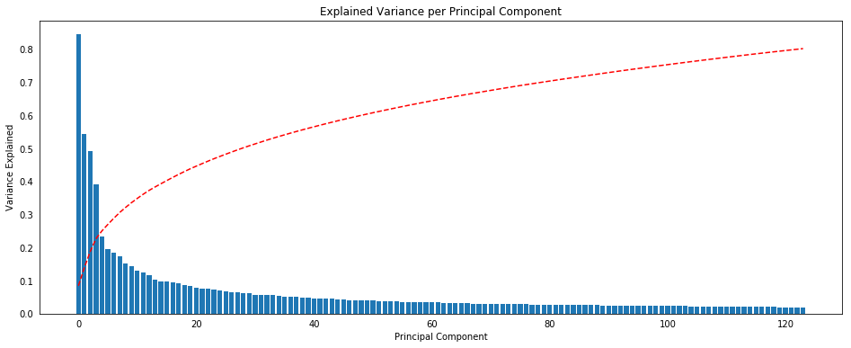


### K-Means

Our first attempt with clustering was with k-means.


```python
def dist_centroid(X_pca, k_model):
    '''
    Calculates the average distance between points in a certain cluster
    and the cluster centroid.
    
    INPUT: X_pca - transformed PCA dimension
           k_model - instantiated k-means model
           
    OUTPUT: scalar mean distance
    '''
    dist = []
    for i, c in enumerate(k_model.cluster_centers_):
        a = np.array([np.sqrt(np.dot((x - c),(x - c))) for x in X_pca[k_model.labels_ == i]])
        #print(a.shape)
        #print(a.sum())
        #print((k_model.labels_==i).sum())
        dist.append(a.sum() / (k_model.labels_ == i).sum())
    
    return np.array(dist).mean()

def scree_plot_kmeans(X_pca):
    '''
    Generates scree plot for k-means model
    with 1 to 20 components
    
    INPUT: X_pca - numpy array with transformed data
           
    OUTPUT: scalar mean distance
    '''
    
    k_score = []
    k_dist = []
    k_step = []
    for k in range(5,25):
        k_model = KMeans(n_clusters = k, random_state=34).fit(X_pca)
        a = k_model.score(X_pca)
        k_score.append(a)
        b = dist_centroid(X_pca, k_model)
        print('clusters: {}, score: {}, dist: {}'.format(k, a, b))
        k_dist.append(b)
        k_step.append(k)
    return k_step, k_dist, k_score
```


```python
k_step, k_dist, k_score = scree_plot_kmeans(X_pca)
```

    clusters: 5, score: -187592965.75542957, dist: 15.199058304082552
    clusters: 6, score: -184468795.7166366, dist: 15.03266858558579
    clusters: 7, score: -182110821.14129853, dist: 14.950952840044861
    clusters: 8, score: -180017646.1672382, dist: 14.965641940195495
    clusters: 9, score: -178266300.60436413, dist: 14.905244912787683
    clusters: 10, score: -176852522.41285926, dist: 14.830474446855414
    clusters: 11, score: -175468344.8294559, dist: 14.903407843924198
    clusters: 12, score: -174240114.33713588, dist: 14.880331457365259
    clusters: 13, score: -173067684.27254775, dist: 15.036538680142225
    clusters: 14, score: -172052919.30034006, dist: 14.947560958344761
    clusters: 15, score: -171546754.2633771, dist: 14.695177055115265
    clusters: 16, score: -170353701.0993238, dist: 14.860894986243022
    clusters: 17, score: -169655722.39510003, dist: 14.809044311679143
    clusters: 18, score: -169355045.4467362, dist: 14.633522737466144
    clusters: 19, score: -168133888.80002192, dist: 14.739927635552668
    clusters: 20, score: -168112363.7389843, dist: 14.606285617519674
    clusters: 21, score: -166378064.9963452, dist: 14.808061752134298
    clusters: 22, score: -165794161.36833212, dist: 14.761936535100453
    clusters: 23, score: -165773554.01132947, dist: 14.626177998022177
    clusters: 24, score: -165357417.00909513, dist: 14.604741419440757


```python
fig, ax = plt.subplots(1,2, figsize=(14,6))
ax[0].scatter(k_step, k_dist)
ax[0].set_xlabel('Number of clusters')
ax[0].set_ylabel('Distance from cluster centroid')
ax[0].set_xticks(np.arange(0, 25, 1.0));
ax[1].scatter(k_step, k_score)
ax[1].set_xlabel('Number of clusters')
ax[1].set_ylabel('KMeans score')
ax[1].set_xticks(np.arange(0, 25, 1.0));
plt.suptitle('Scree plot for K-Means')
```


    Text(0.5, 0.98, 'Scree plot for K-Means')


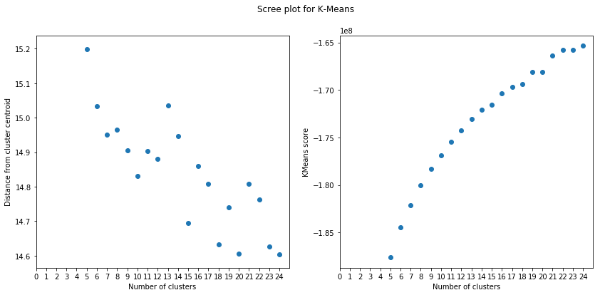


```python
def calc_clusters(method):
    model= method.fit(X_pca)
    df = pd.DataFrame(X_pca)
    df['clusters'] = model.labels_
    
    return df, model

def plot_clusters(df, n_clusters, hue):
    palette = sns.color_palette("Set2", n_clusters).as_hex()

    fig, axis = plt.subplots(1, figsize=(12,10))

    sns.scatterplot(x=0, y=1, data=df, ax=axis, hue=hue, palette=palette)
    axis.set_xlim([-15,25])
    plt.title('Cluster projection of first two PCA axes')

def plot_pops(df):
    df_ = df['clusters'].value_counts(normalize=True).reset_index()
    sns.barplot(x = 'index', y = 'clusters', data=df_, color='gray')    
    plt.title('Relative cluster populations')
    
```


```python
n_clusters = 20
kmeans_df, kmeans =  calc_clusters(KMeans(n_clusters = n_clusters, random_state=34))
```


```python
plot_pops(kmeans_df)
```


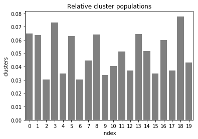


```python
plot_clusters(kmeans_df, n_clusters, hue='clusters')
```


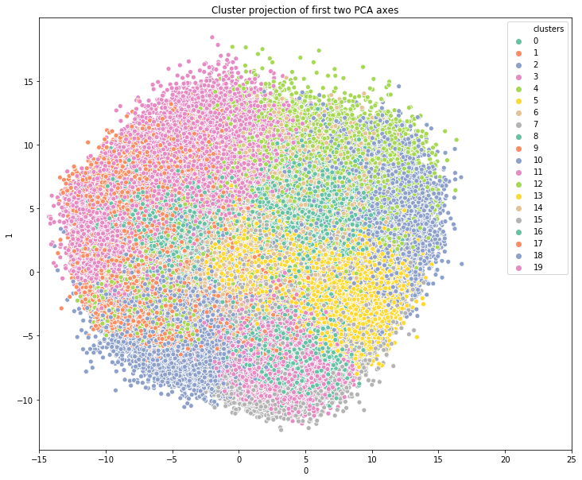


### Apply data processing to customers


```python
def clean_customer(df):
    df_extra = df[['PRODUCT_GROUP','CUSTOMER_GROUP','ONLINE_PURCHASE']]
    return df.drop(['PRODUCT_GROUP','CUSTOMER_GROUP','ONLINE_PURCHASE'], axis=1), df_extra

def pipeline(df):
    df = pre_clean(df)
    df = missing_values(df)
    df = drop_features(df, feature_drop_list)
    df = drop_rows(df)
    df = impute_calc(df)
    df = pragende_jugendjahre(df)
    df = cameo_intl_2015(df)
    df = lp_lebensphase_fein(df)
    df = lp_lebensphase_grob(df)
    df = adjust_types(df)
    #df, df_extra = clean_customer(df)
    df_onehot = pd.DataFrame(data = onehot.transform(df[list_onehot]).todense(), 
                         columns=onehot.get_feature_names())
    df = pd.concat([df.drop(list_onehot, axis=1), df_onehot], axis=1)
    df[list_scale] = scaler.transform(df[list_scale])
    X_pca = pca_model.transform(df[list_pca])
    kmeans_pipe = pd.DataFrame(X_pca)
    kmeans_pipe['clusters'] = kmeans.predict(X_pca)
    
    return df, kmeans_pipe
```


```python
customers_mod = customers.drop(['PRODUCT_GROUP','CUSTOMER_GROUP','ONLINE_PURCHASE'],axis=1)
```


```python
df_customers, kmeans_pipe = pipeline(customers_mod.copy())
```


```python
def plot_pops_comp(df1,df2):
    df_1 = df1['clusters'].value_counts(normalize=True).reset_index()
    df_2 = df2['clusters'].value_counts(normalize=True).reset_index()
    sns.barplot(x = 'index', y = 'clusters', data=df_1, color='black', alpha=0.2)    
    sns.barplot(x = 'index', y = 'clusters', data=df_2, color='red', alpha=0.4)
    plt.title('Relative cluster populations')
```


```python
plot_pops_comp(kmeans_pipe, kmeans_df)
```


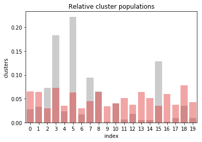


## Part 2: Supervised Learning Model

Now that you've found which parts of the population are more likely to be customers of the mail-order company, it's time to build a prediction model. Each of the rows in the "MAILOUT" data files represents an individual that was targeted for a mailout campaign. Ideally, we should be able to use the demographic information from each individual to decide whether or not it will be worth it to include that person in the campaign.

The "MAILOUT" data has been split into two approximately equal parts, each with almost 43 000 data rows. In this part, you can verify your model with the "TRAIN" partition, which includes a column, "RESPONSE", that states whether or not a person became a customer of the company following the campaign. In the next part, you'll need to create predictions on the "TEST" partition, where the "RESPONSE" column has been withheld.


```python
mailout_train = pd.read_csv('data/mailout_train.csv')
```


```python
mailout_train.head()
```


<div>
<style scoped>
    .dataframe tbody tr th:only-of-type {
        vertical-align: middle;
    }

    .dataframe tbody tr th {
        vertical-align: top;
    }

    .dataframe thead th {
        text-align: right;
    }
</style>
<table border="1" class="dataframe">
  <thead>
    <tr style="text-align: right;">
      <th></th>
      <th>LNR</th>
      <th>AGER_TYP</th>
      <th>AKT_DAT_KL</th>
      <th>ALTER_HH</th>
      <th>ALTER_KIND1</th>
      <th>ALTER_KIND2</th>
      <th>ALTER_KIND3</th>
      <th>ALTER_KIND4</th>
      <th>ALTERSKATEGORIE_FEIN</th>
      <th>ANZ_HAUSHALTE_AKTIV</th>
      <th>ANZ_HH_TITEL</th>
      <th>ANZ_KINDER</th>
      <th>ANZ_PERSONEN</th>
      <th>ANZ_STATISTISCHE_HAUSHALTE</th>
      <th>ANZ_TITEL</th>
      <th>ARBEIT</th>
      <th>BALLRAUM</th>
      <th>CAMEO_DEU_2015</th>
      <th>CAMEO_DEUG_2015</th>
      <th>CAMEO_INTL_2015</th>
      <th>CJT_GESAMTTYP</th>
      <th>CJT_KATALOGNUTZER</th>
      <th>CJT_TYP_1</th>
      <th>CJT_TYP_2</th>
      <th>CJT_TYP_3</th>
      <th>CJT_TYP_4</th>
      <th>CJT_TYP_5</th>
      <th>CJT_TYP_6</th>
      <th>D19_BANKEN_ANZ_12</th>
      <th>D19_BANKEN_ANZ_24</th>
      <th>D19_BANKEN_DATUM</th>
      <th>D19_BANKEN_DIREKT</th>
      <th>D19_BANKEN_GROSS</th>
      <th>D19_BANKEN_LOKAL</th>
      <th>D19_BANKEN_OFFLINE_DATUM</th>
      <th>D19_BANKEN_ONLINE_DATUM</th>
      <th>D19_BANKEN_ONLINE_QUOTE_12</th>
      <th>D19_BANKEN_REST</th>
      <th>D19_BEKLEIDUNG_GEH</th>
      <th>D19_BEKLEIDUNG_REST</th>
      <th>D19_BILDUNG</th>
      <th>D19_BIO_OEKO</th>
      <th>D19_BUCH_CD</th>
      <th>D19_DIGIT_SERV</th>
      <th>D19_DROGERIEARTIKEL</th>
      <th>D19_ENERGIE</th>
      <th>D19_FREIZEIT</th>
      <th>D19_GARTEN</th>
      <th>D19_GESAMT_ANZ_12</th>
      <th>D19_GESAMT_ANZ_24</th>
      <th>D19_GESAMT_DATUM</th>
      <th>D19_GESAMT_OFFLINE_DATUM</th>
      <th>D19_GESAMT_ONLINE_DATUM</th>
      <th>D19_GESAMT_ONLINE_QUOTE_12</th>
      <th>D19_HANDWERK</th>
      <th>D19_HAUS_DEKO</th>
      <th>D19_KINDERARTIKEL</th>
      <th>D19_KONSUMTYP</th>
      <th>D19_KONSUMTYP_MAX</th>
      <th>D19_KOSMETIK</th>
      <th>D19_LEBENSMITTEL</th>
      <th>D19_LETZTER_KAUF_BRANCHE</th>
      <th>D19_LOTTO</th>
      <th>D19_NAHRUNGSERGAENZUNG</th>
      <th>D19_RATGEBER</th>
      <th>D19_REISEN</th>
      <th>D19_SAMMELARTIKEL</th>
      <th>D19_SCHUHE</th>
      <th>D19_SONSTIGE</th>
      <th>D19_SOZIALES</th>
      <th>D19_TECHNIK</th>
      <th>D19_TELKO_ANZ_12</th>
      <th>D19_TELKO_ANZ_24</th>
      <th>D19_TELKO_DATUM</th>
      <th>D19_TELKO_MOBILE</th>
      <th>D19_TELKO_OFFLINE_DATUM</th>
      <th>D19_TELKO_ONLINE_DATUM</th>
      <th>D19_TELKO_ONLINE_QUOTE_12</th>
      <th>D19_TELKO_REST</th>
      <th>D19_TIERARTIKEL</th>
      <th>D19_VERSAND_ANZ_12</th>
      <th>D19_VERSAND_ANZ_24</th>
      <th>D19_VERSAND_DATUM</th>
      <th>D19_VERSAND_OFFLINE_DATUM</th>
      <th>D19_VERSAND_ONLINE_DATUM</th>
      <th>D19_VERSAND_ONLINE_QUOTE_12</th>
      <th>D19_VERSAND_REST</th>
      <th>D19_VERSI_ANZ_12</th>
      <th>D19_VERSI_ANZ_24</th>
      <th>D19_VERSI_DATUM</th>
      <th>D19_VERSI_OFFLINE_DATUM</th>
      <th>D19_VERSI_ONLINE_DATUM</th>
      <th>D19_VERSI_ONLINE_QUOTE_12</th>
      <th>D19_VERSICHERUNGEN</th>
      <th>D19_VOLLSORTIMENT</th>
      <th>D19_WEIN_FEINKOST</th>
      <th>DSL_FLAG</th>
      <th>EINGEFUEGT_AM</th>
      <th>EINGEZOGENAM_HH_JAHR</th>
      <th>EWDICHTE</th>
      <th>EXTSEL992</th>
      <th>FINANZ_ANLEGER</th>
      <th>FINANZ_HAUSBAUER</th>
      <th>FINANZ_MINIMALIST</th>
      <th>FINANZ_SPARER</th>
      <th>FINANZ_UNAUFFAELLIGER</th>
      <th>FINANZ_VORSORGER</th>
      <th>FINANZTYP</th>
      <th>FIRMENDICHTE</th>
      <th>GEBAEUDETYP</th>
      <th>GEBAEUDETYP_RASTER</th>
      <th>GEBURTSJAHR</th>
      <th>GEMEINDETYP</th>
      <th>GFK_URLAUBERTYP</th>
      <th>GREEN_AVANTGARDE</th>
      <th>HEALTH_TYP</th>
      <th>HH_DELTA_FLAG</th>
      <th>HH_EINKOMMEN_SCORE</th>
      <th>INNENSTADT</th>
      <th>KBA05_ALTER1</th>
      <th>KBA05_ALTER2</th>
      <th>KBA05_ALTER3</th>
      <th>KBA05_ALTER4</th>
      <th>KBA05_ANHANG</th>
      <th>KBA05_ANTG1</th>
      <th>KBA05_ANTG2</th>
      <th>KBA05_ANTG3</th>
      <th>KBA05_ANTG4</th>
      <th>KBA05_AUTOQUOT</th>
      <th>KBA05_BAUMAX</th>
      <th>KBA05_CCM1</th>
      <th>KBA05_CCM2</th>
      <th>KBA05_CCM3</th>
      <th>KBA05_CCM4</th>
      <th>KBA05_DIESEL</th>
      <th>KBA05_FRAU</th>
      <th>KBA05_GBZ</th>
      <th>KBA05_HERST1</th>
      <th>KBA05_HERST2</th>
      <th>KBA05_HERST3</th>
      <th>KBA05_HERST4</th>
      <th>KBA05_HERST5</th>
      <th>KBA05_HERSTTEMP</th>
      <th>KBA05_KRSAQUOT</th>
      <th>KBA05_KRSHERST1</th>
      <th>KBA05_KRSHERST2</th>
      <th>KBA05_KRSHERST3</th>
      <th>KBA05_KRSKLEIN</th>
      <th>KBA05_KRSOBER</th>
      <th>KBA05_KRSVAN</th>
      <th>KBA05_KRSZUL</th>
      <th>KBA05_KW1</th>
      <th>KBA05_KW2</th>
      <th>KBA05_KW3</th>
      <th>KBA05_MAXAH</th>
      <th>KBA05_MAXBJ</th>
      <th>KBA05_MAXHERST</th>
      <th>KBA05_MAXSEG</th>
      <th>KBA05_MAXVORB</th>
      <th>KBA05_MOD1</th>
      <th>KBA05_MOD2</th>
      <th>KBA05_MOD3</th>
      <th>KBA05_MOD4</th>
      <th>KBA05_MOD8</th>
      <th>KBA05_MODTEMP</th>
      <th>KBA05_MOTOR</th>
      <th>KBA05_MOTRAD</th>
      <th>KBA05_SEG1</th>
      <th>KBA05_SEG10</th>
      <th>KBA05_SEG2</th>
      <th>KBA05_SEG3</th>
      <th>KBA05_SEG4</th>
      <th>KBA05_SEG5</th>
      <th>KBA05_SEG6</th>
      <th>KBA05_SEG7</th>
      <th>KBA05_SEG8</th>
      <th>KBA05_SEG9</th>
      <th>KBA05_VORB0</th>
      <th>KBA05_VORB1</th>
      <th>KBA05_VORB2</th>
      <th>KBA05_ZUL1</th>
      <th>KBA05_ZUL2</th>
      <th>KBA05_ZUL3</th>
      <th>KBA05_ZUL4</th>
      <th>KBA13_ALTERHALTER_30</th>
      <th>KBA13_ALTERHALTER_45</th>
      <th>KBA13_ALTERHALTER_60</th>
      <th>KBA13_ALTERHALTER_61</th>
      <th>KBA13_ANTG1</th>
      <th>KBA13_ANTG2</th>
      <th>KBA13_ANTG3</th>
      <th>KBA13_ANTG4</th>
      <th>KBA13_ANZAHL_PKW</th>
      <th>KBA13_AUDI</th>
      <th>KBA13_AUTOQUOTE</th>
      <th>KBA13_BAUMAX</th>
      <th>KBA13_BJ_1999</th>
      <th>KBA13_BJ_2000</th>
      <th>KBA13_BJ_2004</th>
      <th>KBA13_BJ_2006</th>
      <th>KBA13_BJ_2008</th>
      <th>KBA13_BJ_2009</th>
      <th>KBA13_BMW</th>
      <th>KBA13_CCM_0_1400</th>
      <th>KBA13_CCM_1000</th>
      <th>KBA13_CCM_1200</th>
      <th>KBA13_CCM_1400</th>
      <th>KBA13_CCM_1401_2500</th>
      <th>KBA13_CCM_1500</th>
      <th>KBA13_CCM_1600</th>
      <th>KBA13_CCM_1800</th>
      <th>KBA13_CCM_2000</th>
      <th>KBA13_CCM_2500</th>
      <th>KBA13_CCM_2501</th>
      <th>KBA13_CCM_3000</th>
      <th>KBA13_CCM_3001</th>
      <th>KBA13_FAB_ASIEN</th>
      <th>KBA13_FAB_SONSTIGE</th>
      <th>KBA13_FIAT</th>
      <th>KBA13_FORD</th>
      <th>KBA13_GBZ</th>
      <th>KBA13_HALTER_20</th>
      <th>KBA13_HALTER_25</th>
      <th>KBA13_HALTER_30</th>
      <th>KBA13_HALTER_35</th>
      <th>KBA13_HALTER_40</th>
      <th>KBA13_HALTER_45</th>
      <th>KBA13_HALTER_50</th>
      <th>KBA13_HALTER_55</th>
      <th>KBA13_HALTER_60</th>
      <th>KBA13_HALTER_65</th>
      <th>KBA13_HALTER_66</th>
      <th>KBA13_HERST_ASIEN</th>
      <th>KBA13_HERST_AUDI_VW</th>
      <th>KBA13_HERST_BMW_BENZ</th>
      <th>KBA13_HERST_EUROPA</th>
      <th>KBA13_HERST_FORD_OPEL</th>
      <th>KBA13_HERST_SONST</th>
      <th>KBA13_HHZ</th>
      <th>KBA13_KMH_0_140</th>
      <th>KBA13_KMH_110</th>
      <th>KBA13_KMH_140</th>
      <th>KBA13_KMH_140_210</th>
      <th>KBA13_KMH_180</th>
      <th>KBA13_KMH_210</th>
      <th>KBA13_KMH_211</th>
      <th>KBA13_KMH_250</th>
      <th>KBA13_KMH_251</th>
      <th>KBA13_KRSAQUOT</th>
      <th>KBA13_KRSHERST_AUDI_VW</th>
      <th>KBA13_KRSHERST_BMW_BENZ</th>
      <th>KBA13_KRSHERST_FORD_OPEL</th>
      <th>KBA13_KRSSEG_KLEIN</th>
      <th>KBA13_KRSSEG_OBER</th>
      <th>KBA13_KRSSEG_VAN</th>
      <th>KBA13_KRSZUL_NEU</th>
      <th>KBA13_KW_0_60</th>
      <th>KBA13_KW_110</th>
      <th>KBA13_KW_120</th>
      <th>KBA13_KW_121</th>
      <th>KBA13_KW_30</th>
      <th>KBA13_KW_40</th>
      <th>KBA13_KW_50</th>
      <th>KBA13_KW_60</th>
      <th>KBA13_KW_61_120</th>
      <th>KBA13_KW_70</th>
      <th>KBA13_KW_80</th>
      <th>KBA13_KW_90</th>
      <th>KBA13_MAZDA</th>
      <th>KBA13_MERCEDES</th>
      <th>KBA13_MOTOR</th>
      <th>KBA13_NISSAN</th>
      <th>KBA13_OPEL</th>
      <th>KBA13_PEUGEOT</th>
      <th>KBA13_RENAULT</th>
      <th>KBA13_SEG_GELAENDEWAGEN</th>
      <th>KBA13_SEG_GROSSRAUMVANS</th>
      <th>KBA13_SEG_KLEINST</th>
      <th>KBA13_SEG_KLEINWAGEN</th>
      <th>KBA13_SEG_KOMPAKTKLASSE</th>
      <th>KBA13_SEG_MINIVANS</th>
      <th>KBA13_SEG_MINIWAGEN</th>
      <th>KBA13_SEG_MITTELKLASSE</th>
      <th>KBA13_SEG_OBEREMITTELKLASSE</th>
      <th>KBA13_SEG_OBERKLASSE</th>
      <th>KBA13_SEG_SONSTIGE</th>
      <th>KBA13_SEG_SPORTWAGEN</th>
      <th>KBA13_SEG_UTILITIES</th>
      <th>KBA13_SEG_VAN</th>
      <th>KBA13_SEG_WOHNMOBILE</th>
      <th>KBA13_SITZE_4</th>
      <th>KBA13_SITZE_5</th>
      <th>KBA13_SITZE_6</th>
      <th>KBA13_TOYOTA</th>
      <th>KBA13_VORB_0</th>
      <th>KBA13_VORB_1</th>
      <th>KBA13_VORB_1_2</th>
      <th>KBA13_VORB_2</th>
      <th>KBA13_VORB_3</th>
      <th>KBA13_VW</th>
      <th>KK_KUNDENTYP</th>
      <th>KKK</th>
      <th>KOMBIALTER</th>
      <th>KONSUMNAEHE</th>
      <th>KONSUMZELLE</th>
      <th>LP_FAMILIE_FEIN</th>
      <th>LP_FAMILIE_GROB</th>
      <th>LP_LEBENSPHASE_FEIN</th>
      <th>LP_LEBENSPHASE_GROB</th>
      <th>LP_STATUS_FEIN</th>
      <th>LP_STATUS_GROB</th>
      <th>MIN_GEBAEUDEJAHR</th>
      <th>MOBI_RASTER</th>
      <th>MOBI_REGIO</th>
      <th>NATIONALITAET_KZ</th>
      <th>ONLINE_AFFINITAET</th>
      <th>ORTSGR_KLS9</th>
      <th>OST_WEST_KZ</th>
      <th>PLZ8_ANTG1</th>
      <th>PLZ8_ANTG2</th>
      <th>PLZ8_ANTG3</th>
      <th>PLZ8_ANTG4</th>
      <th>PLZ8_BAUMAX</th>
      <th>PLZ8_GBZ</th>
      <th>PLZ8_HHZ</th>
      <th>PRAEGENDE_JUGENDJAHRE</th>
      <th>REGIOTYP</th>
      <th>RELAT_AB</th>
      <th>RETOURTYP_BK_S</th>
      <th>RT_KEIN_ANREIZ</th>
      <th>RT_SCHNAEPPCHEN</th>
      <th>RT_UEBERGROESSE</th>
      <th>SEMIO_DOM</th>
      <th>SEMIO_ERL</th>
      <th>SEMIO_FAM</th>
      <th>SEMIO_KAEM</th>
      <th>SEMIO_KRIT</th>
      <th>SEMIO_KULT</th>
      <th>SEMIO_LUST</th>
      <th>SEMIO_MAT</th>
      <th>SEMIO_PFLICHT</th>
      <th>SEMIO_RAT</th>
      <th>SEMIO_REL</th>
      <th>SEMIO_SOZ</th>
      <th>SEMIO_TRADV</th>
      <th>SEMIO_VERT</th>
      <th>SHOPPER_TYP</th>
      <th>SOHO_KZ</th>
      <th>STRUKTURTYP</th>
      <th>TITEL_KZ</th>
      <th>UMFELD_ALT</th>
      <th>UMFELD_JUNG</th>
      <th>UNGLEICHENN_FLAG</th>
      <th>VERDICHTUNGSRAUM</th>
      <th>VERS_TYP</th>
      <th>VHA</th>
      <th>VHN</th>
      <th>VK_DHT4A</th>
      <th>VK_DISTANZ</th>
      <th>VK_ZG11</th>
      <th>W_KEIT_KIND_HH</th>
      <th>WOHNDAUER_2008</th>
      <th>WOHNLAGE</th>
      <th>ZABEOTYP</th>
      <th>RESPONSE</th>
      <th>ANREDE_KZ</th>
      <th>ALTERSKATEGORIE_GROB</th>
    </tr>
  </thead>
  <tbody>
    <tr>
      <th>0</th>
      <td>1763</td>
      <td>2</td>
      <td>1.0</td>
      <td>8.0</td>
      <td>NaN</td>
      <td>NaN</td>
      <td>NaN</td>
      <td>NaN</td>
      <td>8.0</td>
      <td>15.0</td>
      <td>0.0</td>
      <td>0.0</td>
      <td>1.0</td>
      <td>13.0</td>
      <td>0.0</td>
      <td>3.0</td>
      <td>5.0</td>
      <td>5D</td>
      <td>5</td>
      <td>34</td>
      <td>2.0</td>
      <td>5.0</td>
      <td>2.0</td>
      <td>2.0</td>
      <td>5.0</td>
      <td>5.0</td>
      <td>5.0</td>
      <td>5.0</td>
      <td>0</td>
      <td>0</td>
      <td>10</td>
      <td>0</td>
      <td>0</td>
      <td>0</td>
      <td>10</td>
      <td>10</td>
      <td>0.0</td>
      <td>0</td>
      <td>0</td>
      <td>0</td>
      <td>0</td>
      <td>0</td>
      <td>0</td>
      <td>0</td>
      <td>0</td>
      <td>0</td>
      <td>0</td>
      <td>0</td>
      <td>0</td>
      <td>0</td>
      <td>9</td>
      <td>9</td>
      <td>9</td>
      <td>0.0</td>
      <td>0</td>
      <td>0</td>
      <td>0</td>
      <td>3.0</td>
      <td>2</td>
      <td>7</td>
      <td>0</td>
      <td>D19_UNBEKANNT</td>
      <td>0.0</td>
      <td>0</td>
      <td>0</td>
      <td>0</td>
      <td>0</td>
      <td>0</td>
      <td>0</td>
      <td>1.0</td>
      <td>0</td>
      <td>0</td>
      <td>0</td>
      <td>10</td>
      <td>0</td>
      <td>10</td>
      <td>10</td>
      <td>0.0</td>
      <td>0</td>
      <td>0</td>
      <td>0</td>
      <td>0</td>
      <td>9</td>
      <td>9</td>
      <td>9</td>
      <td>0.0</td>
      <td>0</td>
      <td>0</td>
      <td>0</td>
      <td>9</td>
      <td>10</td>
      <td>10</td>
      <td>0.0</td>
      <td>6</td>
      <td>6</td>
      <td>0</td>
      <td>1.0</td>
      <td>1992-02-10 00:00:00</td>
      <td>2004.0</td>
      <td>5.0</td>
      <td>47.0</td>
      <td>2</td>
      <td>5</td>
      <td>3</td>
      <td>1</td>
      <td>1</td>
      <td>5</td>
      <td>6</td>
      <td>2.0</td>
      <td>3.0</td>
      <td>3.0</td>
      <td>0</td>
      <td>12.0</td>
      <td>8.0</td>
      <td>0</td>
      <td>2</td>
      <td>0.0</td>
      <td>6.0</td>
      <td>2.0</td>
      <td>1.0</td>
      <td>3.0</td>
      <td>3.0</td>
      <td>4.0</td>
      <td>0.0</td>
      <td>0.0</td>
      <td>0.0</td>
      <td>0.0</td>
      <td>2.0</td>
      <td>3.0</td>
      <td>4.0</td>
      <td>1.0</td>
      <td>5.0</td>
      <td>2.0</td>
      <td>3.0</td>
      <td>3.0</td>
      <td>3.0</td>
      <td>1.0</td>
      <td>4.0</td>
      <td>2.0</td>
      <td>4.0</td>
      <td>1.0</td>
      <td>3.0</td>
      <td>4.0</td>
      <td>3.0</td>
      <td>4.0</td>
      <td>2.0</td>
      <td>5.0</td>
      <td>1.0</td>
      <td>2.0</td>
      <td>2.0</td>
      <td>1.0</td>
      <td>1.0</td>
      <td>4.0</td>
      <td>2.0</td>
      <td>5.0</td>
      <td>3.0</td>
      <td>3.0</td>
      <td>2.0</td>
      <td>3.0</td>
      <td>3.0</td>
      <td>3.0</td>
      <td>5.0</td>
      <td>1.0</td>
      <td>0.0</td>
      <td>4.0</td>
      <td>2.0</td>
      <td>1.0</td>
      <td>0.0</td>
      <td>2.0</td>
      <td>2.0</td>
      <td>3.0</td>
      <td>3.0</td>
      <td>2.0</td>
      <td>0.0</td>
      <td>0.0</td>
      <td>2.0</td>
      <td>0.0</td>
      <td>3.0</td>
      <td>3.0</td>
      <td>3.0</td>
      <td>3.0</td>
      <td>4.0</td>
      <td>3.0</td>
      <td>1.0</td>
      <td>4.0</td>
      <td>4.0</td>
      <td>1.0</td>
      <td>4.0</td>
      <td>1.0</td>
      <td>4.0</td>
      <td>3.0</td>
      <td>1.0</td>
      <td>390.0</td>
      <td>5.0</td>
      <td>2.0</td>
      <td>5.0</td>
      <td>3.0</td>
      <td>3.0</td>
      <td>4.0</td>
      <td>3.0</td>
      <td>2.0</td>
      <td>3.0</td>
      <td>4.0</td>
      <td>2.0</td>
      <td>3.0</td>
      <td>2.0</td>
      <td>3.0</td>
      <td>3.0</td>
      <td>1.0</td>
      <td>4.0</td>
      <td>3.0</td>
      <td>3.0</td>
      <td>3.0</td>
      <td>4.0</td>
      <td>3.0</td>
      <td>5.0</td>
      <td>2.0</td>
      <td>2.0</td>
      <td>5.0</td>
      <td>3.0</td>
      <td>2.0</td>
      <td>3.0</td>
      <td>4.0</td>
      <td>4.0</td>
      <td>5.0</td>
      <td>4.0</td>
      <td>2.0</td>
      <td>2.0</td>
      <td>1.0</td>
      <td>1.0</td>
      <td>4.0</td>
      <td>4.0</td>
      <td>2.0</td>
      <td>3.0</td>
      <td>4.0</td>
      <td>5.0</td>
      <td>2.0</td>
      <td>2.0</td>
      <td>3.0</td>
      <td>3.0</td>
      <td>1.0</td>
      <td>4.0</td>
      <td>2.0</td>
      <td>3.0</td>
      <td>2.0</td>
      <td>3.0</td>
      <td>3.0</td>
      <td>1.0</td>
      <td>2.0</td>
      <td>3.0</td>
      <td>3.0</td>
      <td>3.0</td>
      <td>2.0</td>
      <td>2.0</td>
      <td>1.0</td>
      <td>2.0</td>
      <td>2.0</td>
      <td>4.0</td>
      <td>1.0</td>
      <td>3.0</td>
      <td>3.0</td>
      <td>3.0</td>
      <td>2.0</td>
      <td>2.0</td>
      <td>4.0</td>
      <td>4.0</td>
      <td>3.0</td>
      <td>2.0</td>
      <td>2.0</td>
      <td>3.0</td>
      <td>3.0</td>
      <td>3.0</td>
      <td>2.0</td>
      <td>4.0</td>
      <td>3.0</td>
      <td>3.0</td>
      <td>1.0</td>
      <td>2.0</td>
      <td>2.0</td>
      <td>3.0</td>
      <td>1.0</td>
      <td>2.0</td>
      <td>5.0</td>
      <td>4.0</td>
      <td>0.0</td>
      <td>3.0</td>
      <td>5.0</td>
      <td>4.0</td>
      <td>1.0</td>
      <td>0.0</td>
      <td>3.0</td>
      <td>3.0</td>
      <td>3.0</td>
      <td>3.0</td>
      <td>3.0</td>
      <td>4.0</td>
      <td>4.0</td>
      <td>4.0</td>
      <td>2.0</td>
      <td>3.0</td>
      <td>NaN</td>
      <td>3.0</td>
      <td>4</td>
      <td>1.0</td>
      <td>1.0</td>
      <td>1.0</td>
      <td>1.0</td>
      <td>8.0</td>
      <td>2.0</td>
      <td>3.0</td>
      <td>2.0</td>
      <td>1992.0</td>
      <td>1.0</td>
      <td>1.0</td>
      <td>1</td>
      <td>1.0</td>
      <td>7.0</td>
      <td>W</td>
      <td>1.0</td>
      <td>4.0</td>
      <td>2.0</td>
      <td>1.0</td>
      <td>5.0</td>
      <td>2.0</td>
      <td>3.0</td>
      <td>1</td>
      <td>5.0</td>
      <td>5.0</td>
      <td>5.0</td>
      <td>2.0</td>
      <td>5.0</td>
      <td>1.0</td>
      <td>6</td>
      <td>7</td>
      <td>2</td>
      <td>6</td>
      <td>6</td>
      <td>1</td>
      <td>7</td>
      <td>1</td>
      <td>3</td>
      <td>2</td>
      <td>1</td>
      <td>5</td>
      <td>1</td>
      <td>3</td>
      <td>3</td>
      <td>0.0</td>
      <td>3.0</td>
      <td>0.0</td>
      <td>2.0</td>
      <td>4.0</td>
      <td>0.0</td>
      <td>4.0</td>
      <td>2</td>
      <td>1.0</td>
      <td>2.0</td>
      <td>5.0</td>
      <td>2.0</td>
      <td>1.0</td>
      <td>6.0</td>
      <td>9.0</td>
      <td>3.0</td>
      <td>3</td>
      <td>0</td>
      <td>2</td>
      <td>4</td>
    </tr>
    <tr>
      <th>1</th>
      <td>1771</td>
      <td>1</td>
      <td>4.0</td>
      <td>13.0</td>
      <td>NaN</td>
      <td>NaN</td>
      <td>NaN</td>
      <td>NaN</td>
      <td>13.0</td>
      <td>1.0</td>
      <td>0.0</td>
      <td>0.0</td>
      <td>2.0</td>
      <td>1.0</td>
      <td>0.0</td>
      <td>2.0</td>
      <td>5.0</td>
      <td>5B</td>
      <td>5</td>
      <td>32</td>
      <td>2.0</td>
      <td>2.0</td>
      <td>2.0</td>
      <td>2.0</td>
      <td>4.0</td>
      <td>3.0</td>
      <td>5.0</td>
      <td>4.0</td>
      <td>1</td>
      <td>1</td>
      <td>5</td>
      <td>0</td>
      <td>0</td>
      <td>3</td>
      <td>10</td>
      <td>10</td>
      <td>0.0</td>
      <td>0</td>
      <td>0</td>
      <td>6</td>
      <td>0</td>
      <td>0</td>
      <td>0</td>
      <td>0</td>
      <td>6</td>
      <td>0</td>
      <td>0</td>
      <td>0</td>
      <td>2</td>
      <td>2</td>
      <td>1</td>
      <td>1</td>
      <td>8</td>
      <td>0.0</td>
      <td>6</td>
      <td>6</td>
      <td>0</td>
      <td>1.0</td>
      <td>4</td>
      <td>6</td>
      <td>0</td>
      <td>D19_TELKO_MOBILE</td>
      <td>0.0</td>
      <td>0</td>
      <td>0</td>
      <td>0</td>
      <td>0</td>
      <td>0</td>
      <td>6</td>
      <td>5.0</td>
      <td>0</td>
      <td>1</td>
      <td>1</td>
      <td>1</td>
      <td>3</td>
      <td>1</td>
      <td>10</td>
      <td>0.0</td>
      <td>0</td>
      <td>6</td>
      <td>1</td>
      <td>1</td>
      <td>5</td>
      <td>5</td>
      <td>8</td>
      <td>0.0</td>
      <td>0</td>
      <td>0</td>
      <td>0</td>
      <td>10</td>
      <td>10</td>
      <td>10</td>
      <td>0.0</td>
      <td>0</td>
      <td>6</td>
      <td>3</td>
      <td>1.0</td>
      <td>1997-05-14 00:00:00</td>
      <td>1994.0</td>
      <td>1.0</td>
      <td>56.0</td>
      <td>2</td>
      <td>3</td>
      <td>5</td>
      <td>1</td>
      <td>1</td>
      <td>5</td>
      <td>6</td>
      <td>4.0</td>
      <td>1.0</td>
      <td>4.0</td>
      <td>1957</td>
      <td>40.0</td>
      <td>8.0</td>
      <td>0</td>
      <td>2</td>
      <td>0.0</td>
      <td>1.0</td>
      <td>7.0</td>
      <td>3.0</td>
      <td>1.0</td>
      <td>5.0</td>
      <td>3.0</td>
      <td>3.0</td>
      <td>3.0</td>
      <td>0.0</td>
      <td>0.0</td>
      <td>0.0</td>
      <td>3.0</td>
      <td>1.0</td>
      <td>3.0</td>
      <td>3.0</td>
      <td>3.0</td>
      <td>1.0</td>
      <td>3.0</td>
      <td>3.0</td>
      <td>5.0</td>
      <td>1.0</td>
      <td>4.0</td>
      <td>4.0</td>
      <td>1.0</td>
      <td>2.0</td>
      <td>2.0</td>
      <td>2.0</td>
      <td>2.0</td>
      <td>4.0</td>
      <td>4.0</td>
      <td>2.0</td>
      <td>1.0</td>
      <td>3.0</td>
      <td>2.0</td>
      <td>3.0</td>
      <td>4.0</td>
      <td>0.0</td>
      <td>3.0</td>
      <td>1.0</td>
      <td>2.0</td>
      <td>3.0</td>
      <td>3.0</td>
      <td>0.0</td>
      <td>5.0</td>
      <td>1.0</td>
      <td>3.0</td>
      <td>2.0</td>
      <td>2.0</td>
      <td>3.0</td>
      <td>1.0</td>
      <td>2.0</td>
      <td>2.0</td>
      <td>3.0</td>
      <td>1.0</td>
      <td>5.0</td>
      <td>0.0</td>
      <td>0.0</td>
      <td>0.0</td>
      <td>0.0</td>
      <td>2.0</td>
      <td>2.0</td>
      <td>5.0</td>
      <td>2.0</td>
      <td>3.0</td>
      <td>3.0</td>
      <td>4.0</td>
      <td>1.0</td>
      <td>2.0</td>
      <td>3.0</td>
      <td>4.0</td>
      <td>3.0</td>
      <td>3.0</td>
      <td>2.0</td>
      <td>1.0</td>
      <td>0.0</td>
      <td>586.0</td>
      <td>3.0</td>
      <td>4.0</td>
      <td>1.0</td>
      <td>4.0</td>
      <td>3.0</td>
      <td>3.0</td>
      <td>3.0</td>
      <td>2.0</td>
      <td>3.0</td>
      <td>1.0</td>
      <td>0.0</td>
      <td>3.0</td>
      <td>0.0</td>
      <td>3.0</td>
      <td>4.0</td>
      <td>1.0</td>
      <td>2.0</td>
      <td>4.0</td>
      <td>4.0</td>
      <td>3.0</td>
      <td>2.0</td>
      <td>2.0</td>
      <td>1.0</td>
      <td>3.0</td>
      <td>2.0</td>
      <td>2.0</td>
      <td>4.0</td>
      <td>4.0</td>
      <td>3.0</td>
      <td>2.0</td>
      <td>2.0</td>
      <td>1.0</td>
      <td>3.0</td>
      <td>4.0</td>
      <td>4.0</td>
      <td>4.0</td>
      <td>3.0</td>
      <td>3.0</td>
      <td>3.0</td>
      <td>3.0</td>
      <td>5.0</td>
      <td>2.0</td>
      <td>2.0</td>
      <td>3.0</td>
      <td>2.0</td>
      <td>3.0</td>
      <td>4.0</td>
      <td>3.0</td>
      <td>4.0</td>
      <td>3.0</td>
      <td>3.0</td>
      <td>3.0</td>
      <td>2.0</td>
      <td>2.0</td>
      <td>1.0</td>
      <td>4.0</td>
      <td>4.0</td>
      <td>2.0</td>
      <td>3.0</td>
      <td>2.0</td>
      <td>3.0</td>
      <td>2.0</td>
      <td>2.0</td>
      <td>3.0</td>
      <td>3.0</td>
      <td>3.0</td>
      <td>2.0</td>
      <td>3.0</td>
      <td>3.0</td>
      <td>2.0</td>
      <td>0.0</td>
      <td>4.0</td>
      <td>3.0</td>
      <td>4.0</td>
      <td>3.0</td>
      <td>2.0</td>
      <td>3.0</td>
      <td>4.0</td>
      <td>3.0</td>
      <td>3.0</td>
      <td>3.0</td>
      <td>3.0</td>
      <td>3.0</td>
      <td>4.0</td>
      <td>3.0</td>
      <td>3.0</td>
      <td>2.0</td>
      <td>3.0</td>
      <td>4.0</td>
      <td>4.0</td>
      <td>3.0</td>
      <td>1.0</td>
      <td>3.0</td>
      <td>2.0</td>
      <td>5.0</td>
      <td>3.0</td>
      <td>0.0</td>
      <td>1.0</td>
      <td>4.0</td>
      <td>5.0</td>
      <td>4.0</td>
      <td>3.0</td>
      <td>3.0</td>
      <td>4.0</td>
      <td>3.0</td>
      <td>3.0</td>
      <td>5.0</td>
      <td>2.0</td>
      <td>2.0</td>
      <td>4</td>
      <td>4.0</td>
      <td>0.0</td>
      <td>2.0</td>
      <td>2.0</td>
      <td>19.0</td>
      <td>5.0</td>
      <td>9.0</td>
      <td>4.0</td>
      <td>1994.0</td>
      <td>4.0</td>
      <td>5.0</td>
      <td>2</td>
      <td>2.0</td>
      <td>2.0</td>
      <td>W</td>
      <td>3.0</td>
      <td>2.0</td>
      <td>1.0</td>
      <td>0.0</td>
      <td>1.0</td>
      <td>4.0</td>
      <td>3.0</td>
      <td>8</td>
      <td>3.0</td>
      <td>1.0</td>
      <td>2.0</td>
      <td>3.0</td>
      <td>1.0</td>
      <td>3.0</td>
      <td>6</td>
      <td>6</td>
      <td>1</td>
      <td>5</td>
      <td>6</td>
      <td>3</td>
      <td>6</td>
      <td>5</td>
      <td>5</td>
      <td>4</td>
      <td>3</td>
      <td>1</td>
      <td>3</td>
      <td>4</td>
      <td>2</td>
      <td>0.0</td>
      <td>1.0</td>
      <td>0.0</td>
      <td>2.0</td>
      <td>5.0</td>
      <td>0.0</td>
      <td>0.0</td>
      <td>1</td>
      <td>1.0</td>
      <td>3.0</td>
      <td>1.0</td>
      <td>2.0</td>
      <td>1.0</td>
      <td>4.0</td>
      <td>9.0</td>
      <td>7.0</td>
      <td>1</td>
      <td>0</td>
      <td>2</td>
      <td>3</td>
    </tr>
    <tr>
      <th>2</th>
      <td>1776</td>
      <td>1</td>
      <td>1.0</td>
      <td>9.0</td>
      <td>NaN</td>
      <td>NaN</td>
      <td>NaN</td>
      <td>NaN</td>
      <td>7.0</td>
      <td>0.0</td>
      <td>NaN</td>
      <td>0.0</td>
      <td>0.0</td>
      <td>1.0</td>
      <td>0.0</td>
      <td>4.0</td>
      <td>1.0</td>
      <td>2D</td>
      <td>2</td>
      <td>14</td>
      <td>4.0</td>
      <td>5.0</td>
      <td>1.0</td>
      <td>1.0</td>
      <td>5.0</td>
      <td>5.0</td>
      <td>5.0</td>
      <td>5.0</td>
      <td>0</td>
      <td>1</td>
      <td>7</td>
      <td>0</td>
      <td>0</td>
      <td>0</td>
      <td>10</td>
      <td>7</td>
      <td>0.0</td>
      <td>5</td>
      <td>0</td>
      <td>0</td>
      <td>0</td>
      <td>0</td>
      <td>0</td>
      <td>0</td>
      <td>0</td>
      <td>0</td>
      <td>0</td>
      <td>0</td>
      <td>0</td>
      <td>2</td>
      <td>6</td>
      <td>6</td>
      <td>7</td>
      <td>0.0</td>
      <td>0</td>
      <td>0</td>
      <td>0</td>
      <td>2.0</td>
      <td>2</td>
      <td>0</td>
      <td>5</td>
      <td>D19_LEBENSMITTEL</td>
      <td>0.0</td>
      <td>0</td>
      <td>0</td>
      <td>0</td>
      <td>0</td>
      <td>0</td>
      <td>6</td>
      <td>2.0</td>
      <td>6</td>
      <td>0</td>
      <td>0</td>
      <td>10</td>
      <td>0</td>
      <td>10</td>
      <td>10</td>
      <td>0.0</td>
      <td>0</td>
      <td>0</td>
      <td>0</td>
      <td>1</td>
      <td>6</td>
      <td>6</td>
      <td>10</td>
      <td>0.0</td>
      <td>0</td>
      <td>0</td>
      <td>0</td>
      <td>10</td>
      <td>10</td>
      <td>10</td>
      <td>0.0</td>
      <td>0</td>
      <td>6</td>
      <td>0</td>
      <td>1.0</td>
      <td>1995-05-24 00:00:00</td>
      <td>1997.0</td>
      <td>6.0</td>
      <td>36.0</td>
      <td>1</td>
      <td>2</td>
      <td>5</td>
      <td>1</td>
      <td>1</td>
      <td>4</td>
      <td>5</td>
      <td>4.0</td>
      <td>2.0</td>
      <td>4.0</td>
      <td>1929</td>
      <td>11.0</td>
      <td>3.0</td>
      <td>1</td>
      <td>1</td>
      <td>NaN</td>
      <td>1.0</td>
      <td>3.0</td>
      <td>1.0</td>
      <td>3.0</td>
      <td>1.0</td>
      <td>5.0</td>
      <td>1.0</td>
      <td>3.0</td>
      <td>0.0</td>
      <td>0.0</td>
      <td>0.0</td>
      <td>4.0</td>
      <td>1.0</td>
      <td>3.0</td>
      <td>3.0</td>
      <td>2.0</td>
      <td>1.0</td>
      <td>2.0</td>
      <td>3.0</td>
      <td>5.0</td>
      <td>2.0</td>
      <td>3.0</td>
      <td>3.0</td>
      <td>4.0</td>
      <td>2.0</td>
      <td>3.0</td>
      <td>5.0</td>
      <td>4.0</td>
      <td>3.0</td>
      <td>3.0</td>
      <td>3.0</td>
      <td>2.0</td>
      <td>2.0</td>
      <td>2.0</td>
      <td>3.0</td>
      <td>3.0</td>
      <td>1.0</td>
      <td>5.0</td>
      <td>4.0</td>
      <td>4.0</td>
      <td>1.0</td>
      <td>2.0</td>
      <td>1.0</td>
      <td>2.0</td>
      <td>4.0</td>
      <td>4.0</td>
      <td>0.0</td>
      <td>4.0</td>
      <td>2.0</td>
      <td>0.0</td>
      <td>1.0</td>
      <td>1.0</td>
      <td>4.0</td>
      <td>3.0</td>
      <td>2.0</td>
      <td>2.0</td>
      <td>0.0</td>
      <td>0.0</td>
      <td>0.0</td>
      <td>1.0</td>
      <td>3.0</td>
      <td>4.0</td>
      <td>1.0</td>
      <td>3.0</td>
      <td>2.0</td>
      <td>4.0</td>
      <td>2.0</td>
      <td>5.0</td>
      <td>4.0</td>
      <td>1.0</td>
      <td>3.0</td>
      <td>4.0</td>
      <td>1.0</td>
      <td>0.0</td>
      <td>0.0</td>
      <td>297.0</td>
      <td>4.0</td>
      <td>2.0</td>
      <td>1.0</td>
      <td>3.0</td>
      <td>2.0</td>
      <td>3.0</td>
      <td>3.0</td>
      <td>5.0</td>
      <td>2.0</td>
      <td>3.0</td>
      <td>2.0</td>
      <td>2.0</td>
      <td>0.0</td>
      <td>4.0</td>
      <td>4.0</td>
      <td>3.0</td>
      <td>3.0</td>
      <td>0.0</td>
      <td>5.0</td>
      <td>2.0</td>
      <td>2.0</td>
      <td>2.0</td>
      <td>1.0</td>
      <td>2.0</td>
      <td>4.0</td>
      <td>1.0</td>
      <td>3.0</td>
      <td>4.0</td>
      <td>3.0</td>
      <td>5.0</td>
      <td>5.0</td>
      <td>5.0</td>
      <td>4.0</td>
      <td>3.0</td>
      <td>2.0</td>
      <td>1.0</td>
      <td>1.0</td>
      <td>2.0</td>
      <td>3.0</td>
      <td>3.0</td>
      <td>3.0</td>
      <td>3.0</td>
      <td>4.0</td>
      <td>3.0</td>
      <td>4.0</td>
      <td>3.0</td>
      <td>1.0</td>
      <td>1.0</td>
      <td>1.0</td>
      <td>4.0</td>
      <td>2.0</td>
      <td>5.0</td>
      <td>2.0</td>
      <td>2.0</td>
      <td>1.0</td>
      <td>3.0</td>
      <td>4.0</td>
      <td>4.0</td>
      <td>2.0</td>
      <td>2.0</td>
      <td>2.0</td>
      <td>2.0</td>
      <td>2.0</td>
      <td>3.0</td>
      <td>4.0</td>
      <td>3.0</td>
      <td>2.0</td>
      <td>1.0</td>
      <td>2.0</td>
      <td>3.0</td>
      <td>3.0</td>
      <td>4.0</td>
      <td>1.0</td>
      <td>3.0</td>
      <td>4.0</td>
      <td>4.0</td>
      <td>3.0</td>
      <td>2.0</td>
      <td>3.0</td>
      <td>3.0</td>
      <td>5.0</td>
      <td>4.0</td>
      <td>2.0</td>
      <td>2.0</td>
      <td>3.0</td>
      <td>3.0</td>
      <td>4.0</td>
      <td>2.0</td>
      <td>2.0</td>
      <td>5.0</td>
      <td>2.0</td>
      <td>0.0</td>
      <td>5.0</td>
      <td>2.0</td>
      <td>2.0</td>
      <td>2.0</td>
      <td>2.0</td>
      <td>2.0</td>
      <td>4.0</td>
      <td>2.0</td>
      <td>3.0</td>
      <td>3.0</td>
      <td>3.0</td>
      <td>3.0</td>
      <td>3.0</td>
      <td>2.0</td>
      <td>2.0</td>
      <td>NaN</td>
      <td>1.0</td>
      <td>4</td>
      <td>2.0</td>
      <td>0.0</td>
      <td>0.0</td>
      <td>0.0</td>
      <td>0.0</td>
      <td>0.0</td>
      <td>10.0</td>
      <td>5.0</td>
      <td>1995.0</td>
      <td>5.0</td>
      <td>5.0</td>
      <td>1</td>
      <td>3.0</td>
      <td>8.0</td>
      <td>O</td>
      <td>4.0</td>
      <td>0.0</td>
      <td>0.0</td>
      <td>1.0</td>
      <td>1.0</td>
      <td>4.0</td>
      <td>3.0</td>
      <td>2</td>
      <td>1.0</td>
      <td>4.0</td>
      <td>3.0</td>
      <td>1.0</td>
      <td>5.0</td>
      <td>2.0</td>
      <td>3</td>
      <td>3</td>
      <td>4</td>
      <td>1</td>
      <td>3</td>
      <td>4</td>
      <td>7</td>
      <td>6</td>
      <td>1</td>
      <td>1</td>
      <td>5</td>
      <td>3</td>
      <td>1</td>
      <td>7</td>
      <td>3</td>
      <td>0.0</td>
      <td>3.0</td>
      <td>0.0</td>
      <td>1.0</td>
      <td>5.0</td>
      <td>0.0</td>
      <td>10.0</td>
      <td>1</td>
      <td>4.0</td>
      <td>1.0</td>
      <td>6.0</td>
      <td>4.0</td>
      <td>2.0</td>
      <td>NaN</td>
      <td>9.0</td>
      <td>2.0</td>
      <td>3</td>
      <td>0</td>
      <td>1</td>
      <td>4</td>
    </tr>
    <tr>
      <th>3</th>
      <td>1460</td>
      <td>2</td>
      <td>1.0</td>
      <td>6.0</td>
      <td>NaN</td>
      <td>NaN</td>
      <td>NaN</td>
      <td>NaN</td>
      <td>6.0</td>
      <td>4.0</td>
      <td>0.0</td>
      <td>0.0</td>
      <td>2.0</td>
      <td>4.0</td>
      <td>0.0</td>
      <td>4.0</td>
      <td>2.0</td>
      <td>2D</td>
      <td>2</td>
      <td>14</td>
      <td>2.0</td>
      <td>5.0</td>
      <td>2.0</td>
      <td>2.0</td>
      <td>5.0</td>
      <td>5.0</td>
      <td>5.0</td>
      <td>4.0</td>
      <td>0</td>
      <td>0</td>
      <td>10</td>
      <td>0</td>
      <td>0</td>
      <td>0</td>
      <td>10</td>
      <td>10</td>
      <td>0.0</td>
      <td>0</td>
      <td>0</td>
      <td>6</td>
      <td>0</td>
      <td>0</td>
      <td>6</td>
      <td>0</td>
      <td>0</td>
      <td>0</td>
      <td>0</td>
      <td>0</td>
      <td>0</td>
      <td>0</td>
      <td>10</td>
      <td>10</td>
      <td>10</td>
      <td>0.0</td>
      <td>0</td>
      <td>0</td>
      <td>0</td>
      <td>3.0</td>
      <td>2</td>
      <td>7</td>
      <td>0</td>
      <td>D19_UNBEKANNT</td>
      <td>7.0</td>
      <td>0</td>
      <td>0</td>
      <td>0</td>
      <td>0</td>
      <td>0</td>
      <td>6</td>
      <td>1.0</td>
      <td>7</td>
      <td>0</td>
      <td>0</td>
      <td>10</td>
      <td>0</td>
      <td>10</td>
      <td>10</td>
      <td>0.0</td>
      <td>0</td>
      <td>0</td>
      <td>0</td>
      <td>0</td>
      <td>10</td>
      <td>10</td>
      <td>10</td>
      <td>0.0</td>
      <td>0</td>
      <td>0</td>
      <td>0</td>
      <td>10</td>
      <td>10</td>
      <td>10</td>
      <td>0.0</td>
      <td>0</td>
      <td>6</td>
      <td>0</td>
      <td>1.0</td>
      <td>1992-02-10 00:00:00</td>
      <td>1994.0</td>
      <td>6.0</td>
      <td>41.0</td>
      <td>1</td>
      <td>5</td>
      <td>4</td>
      <td>1</td>
      <td>2</td>
      <td>5</td>
      <td>5</td>
      <td>3.0</td>
      <td>1.0</td>
      <td>3.0</td>
      <td>1924</td>
      <td>11.0</td>
      <td>5.0</td>
      <td>1</td>
      <td>2</td>
      <td>0.0</td>
      <td>4.0</td>
      <td>4.0</td>
      <td>2.0</td>
      <td>3.0</td>
      <td>1.0</td>
      <td>4.0</td>
      <td>0.0</td>
      <td>2.0</td>
      <td>3.0</td>
      <td>0.0</td>
      <td>0.0</td>
      <td>3.0</td>
      <td>0.0</td>
      <td>3.0</td>
      <td>2.0</td>
      <td>2.0</td>
      <td>4.0</td>
      <td>1.0</td>
      <td>4.0</td>
      <td>3.0</td>
      <td>5.0</td>
      <td>3.0</td>
      <td>1.0</td>
      <td>2.0</td>
      <td>3.0</td>
      <td>2.0</td>
      <td>4.0</td>
      <td>5.0</td>
      <td>3.0</td>
      <td>2.0</td>
      <td>2.0</td>
      <td>2.0</td>
      <td>2.0</td>
      <td>3.0</td>
      <td>2.0</td>
      <td>1.0</td>
      <td>4.0</td>
      <td>5.0</td>
      <td>4.0</td>
      <td>1.0</td>
      <td>4.0</td>
      <td>1.0</td>
      <td>3.0</td>
      <td>3.0</td>
      <td>3.0</td>
      <td>3.0</td>
      <td>0.0</td>
      <td>1.0</td>
      <td>4.0</td>
      <td>0.0</td>
      <td>0.0</td>
      <td>4.0</td>
      <td>3.0</td>
      <td>3.0</td>
      <td>1.0</td>
      <td>1.0</td>
      <td>0.0</td>
      <td>1.0</td>
      <td>3.0</td>
      <td>0.0</td>
      <td>5.0</td>
      <td>2.0</td>
      <td>3.0</td>
      <td>2.0</td>
      <td>1.0</td>
      <td>5.0</td>
      <td>4.0</td>
      <td>1.0</td>
      <td>1.0</td>
      <td>1.0</td>
      <td>5.0</td>
      <td>4.0</td>
      <td>2.0</td>
      <td>1.0</td>
      <td>0.0</td>
      <td>373.0</td>
      <td>4.0</td>
      <td>3.0</td>
      <td>1.0</td>
      <td>2.0</td>
      <td>2.0</td>
      <td>3.0</td>
      <td>4.0</td>
      <td>5.0</td>
      <td>1.0</td>
      <td>5.0</td>
      <td>0.0</td>
      <td>4.0</td>
      <td>1.0</td>
      <td>2.0</td>
      <td>1.0</td>
      <td>4.0</td>
      <td>3.0</td>
      <td>0.0</td>
      <td>2.0</td>
      <td>4.0</td>
      <td>5.0</td>
      <td>5.0</td>
      <td>5.0</td>
      <td>1.0</td>
      <td>4.0</td>
      <td>3.0</td>
      <td>1.0</td>
      <td>4.0</td>
      <td>1.0</td>
      <td>1.0</td>
      <td>1.0</td>
      <td>1.0</td>
      <td>1.0</td>
      <td>2.0</td>
      <td>1.0</td>
      <td>1.0</td>
      <td>2.0</td>
      <td>5.0</td>
      <td>5.0</td>
      <td>1.0</td>
      <td>3.0</td>
      <td>5.0</td>
      <td>2.0</td>
      <td>1.0</td>
      <td>4.0</td>
      <td>3.0</td>
      <td>5.0</td>
      <td>1.0</td>
      <td>5.0</td>
      <td>1.0</td>
      <td>1.0</td>
      <td>2.0</td>
      <td>5.0</td>
      <td>5.0</td>
      <td>1.0</td>
      <td>4.0</td>
      <td>3.0</td>
      <td>5.0</td>
      <td>1.0</td>
      <td>1.0</td>
      <td>3.0</td>
      <td>2.0</td>
      <td>2.0</td>
      <td>2.0</td>
      <td>2.0</td>
      <td>3.0</td>
      <td>5.0</td>
      <td>1.0</td>
      <td>3.0</td>
      <td>0.0</td>
      <td>1.0</td>
      <td>2.0</td>
      <td>0.0</td>
      <td>2.0</td>
      <td>3.0</td>
      <td>2.0</td>
      <td>5.0</td>
      <td>2.0</td>
      <td>1.0</td>
      <td>1.0</td>
      <td>3.0</td>
      <td>2.0</td>
      <td>4.0</td>
      <td>3.0</td>
      <td>1.0</td>
      <td>1.0</td>
      <td>1.0</td>
      <td>2.0</td>
      <td>3.0</td>
      <td>3.0</td>
      <td>5.0</td>
      <td>5.0</td>
      <td>4.0</td>
      <td>5.0</td>
      <td>4.0</td>
      <td>3.0</td>
      <td>3.0</td>
      <td>5.0</td>
      <td>1.0</td>
      <td>2.0</td>
      <td>1.0</td>
      <td>4.0</td>
      <td>3.0</td>
      <td>2.0</td>
      <td>2.0</td>
      <td>3.0</td>
      <td>3.0</td>
      <td>NaN</td>
      <td>1.0</td>
      <td>4</td>
      <td>3.0</td>
      <td>0.0</td>
      <td>2.0</td>
      <td>2.0</td>
      <td>16.0</td>
      <td>4.0</td>
      <td>3.0</td>
      <td>2.0</td>
      <td>1992.0</td>
      <td>1.0</td>
      <td>3.0</td>
      <td>1</td>
      <td>1.0</td>
      <td>9.0</td>
      <td>W</td>
      <td>4.0</td>
      <td>2.0</td>
      <td>1.0</td>
      <td>0.0</td>
      <td>1.0</td>
      <td>4.0</td>
      <td>3.0</td>
      <td>2</td>
      <td>1.0</td>
      <td>3.0</td>
      <td>5.0</td>
      <td>2.0</td>
      <td>5.0</td>
      <td>1.0</td>
      <td>5</td>
      <td>7</td>
      <td>1</td>
      <td>6</td>
      <td>7</td>
      <td>1</td>
      <td>7</td>
      <td>1</td>
      <td>4</td>
      <td>2</td>
      <td>2</td>
      <td>5</td>
      <td>3</td>
      <td>2</td>
      <td>1</td>
      <td>0.0</td>
      <td>3.0</td>
      <td>0.0</td>
      <td>3.0</td>
      <td>5.0</td>
      <td>0.0</td>
      <td>5.0</td>
      <td>2</td>
      <td>1.0</td>
      <td>4.0</td>
      <td>8.0</td>
      <td>11.0</td>
      <td>11.0</td>
      <td>6.0</td>
      <td>9.0</td>
      <td>1.0</td>
      <td>3</td>
      <td>0</td>
      <td>2</td>
      <td>4</td>
    </tr>
    <tr>
      <th>4</th>
      <td>1783</td>
      <td>2</td>
      <td>1.0</td>
      <td>9.0</td>
      <td>NaN</td>
      <td>NaN</td>
      <td>NaN</td>
      <td>NaN</td>
      <td>9.0</td>
      <td>53.0</td>
      <td>0.0</td>
      <td>0.0</td>
      <td>1.0</td>
      <td>44.0</td>
      <td>0.0</td>
      <td>3.0</td>
      <td>4.0</td>
      <td>7B</td>
      <td>7</td>
      <td>41</td>
      <td>6.0</td>
      <td>5.0</td>
      <td>1.0</td>
      <td>2.0</td>
      <td>5.0</td>
      <td>5.0</td>
      <td>5.0</td>
      <td>5.0</td>
      <td>0</td>
      <td>0</td>
      <td>10</td>
      <td>0</td>
      <td>0</td>
      <td>0</td>
      <td>10</td>
      <td>10</td>
      <td>0.0</td>
      <td>0</td>
      <td>5</td>
      <td>0</td>
      <td>7</td>
      <td>0</td>
      <td>0</td>
      <td>0</td>
      <td>0</td>
      <td>0</td>
      <td>0</td>
      <td>0</td>
      <td>0</td>
      <td>1</td>
      <td>7</td>
      <td>7</td>
      <td>10</td>
      <td>0.0</td>
      <td>0</td>
      <td>0</td>
      <td>0</td>
      <td>2.0</td>
      <td>2</td>
      <td>0</td>
      <td>0</td>
      <td>D19_BEKLEIDUNG_GEH</td>
      <td>0.0</td>
      <td>0</td>
      <td>2</td>
      <td>0</td>
      <td>0</td>
      <td>0</td>
      <td>7</td>
      <td>1.0</td>
      <td>0</td>
      <td>0</td>
      <td>0</td>
      <td>10</td>
      <td>0</td>
      <td>10</td>
      <td>10</td>
      <td>0.0</td>
      <td>0</td>
      <td>0</td>
      <td>0</td>
      <td>1</td>
      <td>7</td>
      <td>7</td>
      <td>10</td>
      <td>0.0</td>
      <td>0</td>
      <td>0</td>
      <td>0</td>
      <td>10</td>
      <td>10</td>
      <td>10</td>
      <td>0.0</td>
      <td>0</td>
      <td>7</td>
      <td>0</td>
      <td>1.0</td>
      <td>1992-02-10 00:00:00</td>
      <td>1994.0</td>
      <td>5.0</td>
      <td>55.0</td>
      <td>1</td>
      <td>5</td>
      <td>3</td>
      <td>1</td>
      <td>1</td>
      <td>5</td>
      <td>5</td>
      <td>3.0</td>
      <td>3.0</td>
      <td>4.0</td>
      <td>1936</td>
      <td>12.0</td>
      <td>4.0</td>
      <td>0</td>
      <td>3</td>
      <td>0.0</td>
      <td>4.0</td>
      <td>2.0</td>
      <td>1.0</td>
      <td>1.0</td>
      <td>3.0</td>
      <td>5.0</td>
      <td>1.0</td>
      <td>1.0</td>
      <td>0.0</td>
      <td>0.0</td>
      <td>1.0</td>
      <td>3.0</td>
      <td>0.0</td>
      <td>2.0</td>
      <td>3.0</td>
      <td>4.0</td>
      <td>0.0</td>
      <td>2.0</td>
      <td>3.0</td>
      <td>1.0</td>
      <td>3.0</td>
      <td>4.0</td>
      <td>2.0</td>
      <td>3.0</td>
      <td>1.0</td>
      <td>2.0</td>
      <td>3.0</td>
      <td>3.0</td>
      <td>4.0</td>
      <td>3.0</td>
      <td>1.0</td>
      <td>2.0</td>
      <td>2.0</td>
      <td>3.0</td>
      <td>2.0</td>
      <td>4.0</td>
      <td>2.0</td>
      <td>5.0</td>
      <td>4.0</td>
      <td>2.0</td>
      <td>2.0</td>
      <td>1.0</td>
      <td>2.0</td>
      <td>3.0</td>
      <td>4.0</td>
      <td>2.0</td>
      <td>1.0</td>
      <td>3.0</td>
      <td>3.0</td>
      <td>1.0</td>
      <td>0.0</td>
      <td>1.0</td>
      <td>2.0</td>
      <td>4.0</td>
      <td>3.0</td>
      <td>2.0</td>
      <td>0.0</td>
      <td>0.0</td>
      <td>1.0</td>
      <td>1.0</td>
      <td>4.0</td>
      <td>3.0</td>
      <td>0.0</td>
      <td>3.0</td>
      <td>2.0</td>
      <td>4.0</td>
      <td>3.0</td>
      <td>3.0</td>
      <td>4.0</td>
      <td>2.0</td>
      <td>4.0</td>
      <td>2.0</td>
      <td>2.0</td>
      <td>1.0</td>
      <td>1.0</td>
      <td>285.0</td>
      <td>4.0</td>
      <td>3.0</td>
      <td>1.0</td>
      <td>1.0</td>
      <td>1.0</td>
      <td>1.0</td>
      <td>4.0</td>
      <td>5.0</td>
      <td>3.0</td>
      <td>4.0</td>
      <td>0.0</td>
      <td>1.0</td>
      <td>0.0</td>
      <td>2.0</td>
      <td>4.0</td>
      <td>1.0</td>
      <td>2.0</td>
      <td>5.0</td>
      <td>3.0</td>
      <td>5.0</td>
      <td>3.0</td>
      <td>4.0</td>
      <td>1.0</td>
      <td>2.0</td>
      <td>3.0</td>
      <td>3.0</td>
      <td>2.0</td>
      <td>2.0</td>
      <td>2.0</td>
      <td>3.0</td>
      <td>4.0</td>
      <td>4.0</td>
      <td>4.0</td>
      <td>3.0</td>
      <td>2.0</td>
      <td>3.0</td>
      <td>2.0</td>
      <td>3.0</td>
      <td>4.0</td>
      <td>2.0</td>
      <td>4.0</td>
      <td>4.0</td>
      <td>3.0</td>
      <td>2.0</td>
      <td>3.0</td>
      <td>2.0</td>
      <td>1.0</td>
      <td>1.0</td>
      <td>1.0</td>
      <td>2.0</td>
      <td>1.0</td>
      <td>4.0</td>
      <td>5.0</td>
      <td>5.0</td>
      <td>1.0</td>
      <td>3.0</td>
      <td>3.0</td>
      <td>3.0</td>
      <td>2.0</td>
      <td>2.0</td>
      <td>2.0</td>
      <td>2.0</td>
      <td>1.0</td>
      <td>1.0</td>
      <td>2.0</td>
      <td>5.0</td>
      <td>3.0</td>
      <td>1.0</td>
      <td>1.0</td>
      <td>0.0</td>
      <td>2.0</td>
      <td>5.0</td>
      <td>0.0</td>
      <td>5.0</td>
      <td>4.0</td>
      <td>3.0</td>
      <td>4.0</td>
      <td>2.0</td>
      <td>2.0</td>
      <td>2.0</td>
      <td>4.0</td>
      <td>3.0</td>
      <td>3.0</td>
      <td>4.0</td>
      <td>2.0</td>
      <td>2.0</td>
      <td>4.0</td>
      <td>3.0</td>
      <td>3.0</td>
      <td>4.0</td>
      <td>4.0</td>
      <td>3.0</td>
      <td>2.0</td>
      <td>4.0</td>
      <td>2.0</td>
      <td>4.0</td>
      <td>3.0</td>
      <td>3.0</td>
      <td>3.0</td>
      <td>3.0</td>
      <td>3.0</td>
      <td>5.0</td>
      <td>1.0</td>
      <td>1.0</td>
      <td>2.0</td>
      <td>0.0</td>
      <td>4.0</td>
      <td>NaN</td>
      <td>3.0</td>
      <td>4</td>
      <td>3.0</td>
      <td>0.0</td>
      <td>1.0</td>
      <td>1.0</td>
      <td>9.0</td>
      <td>3.0</td>
      <td>6.0</td>
      <td>3.0</td>
      <td>1992.0</td>
      <td>1.0</td>
      <td>1.0</td>
      <td>1</td>
      <td>2.0</td>
      <td>7.0</td>
      <td>W</td>
      <td>2.0</td>
      <td>3.0</td>
      <td>0.0</td>
      <td>2.0</td>
      <td>4.0</td>
      <td>1.0</td>
      <td>2.0</td>
      <td>3</td>
      <td>7.0</td>
      <td>3.0</td>
      <td>5.0</td>
      <td>1.0</td>
      <td>5.0</td>
      <td>1.0</td>
      <td>5</td>
      <td>4</td>
      <td>6</td>
      <td>2</td>
      <td>5</td>
      <td>5</td>
      <td>6</td>
      <td>6</td>
      <td>4</td>
      <td>5</td>
      <td>4</td>
      <td>6</td>
      <td>2</td>
      <td>7</td>
      <td>1</td>
      <td>0.0</td>
      <td>3.0</td>
      <td>0.0</td>
      <td>2.0</td>
      <td>5.0</td>
      <td>0.0</td>
      <td>4.0</td>
      <td>1</td>
      <td>0.0</td>
      <td>4.0</td>
      <td>2.0</td>
      <td>2.0</td>
      <td>1.0</td>
      <td>6.0</td>
      <td>9.0</td>
      <td>3.0</td>
      <td>3</td>
      <td>0</td>
      <td>1</td>
      <td>3</td>
    </tr>
  </tbody>
</table>
</div>


```python
mailout_train.shape
```


    (42962, 367)


```python
mailout_train.RESPONSE.value_counts()
```


    0    42430
    1      532
    Name: RESPONSE, dtype: int64


```python
df_mailout_train, kmeans_train = pipeline(mailout_train.copy())
```


```python
df_mailout_train.shape, kmeans_train.shape
```


    ((35096, 497), (35096, 125))


```python
kmeans_train.head()
```


<div>
<style scoped>
    .dataframe tbody tr th:only-of-type {
        vertical-align: middle;
    }

    .dataframe tbody tr th {
        vertical-align: top;
    }

    .dataframe thead th {
        text-align: right;
    }
</style>
<table border="1" class="dataframe">
  <thead>
    <tr style="text-align: right;">
      <th></th>
      <th>0</th>
      <th>1</th>
      <th>2</th>
      <th>3</th>
      <th>4</th>
      <th>5</th>
      <th>6</th>
      <th>7</th>
      <th>8</th>
      <th>9</th>
      <th>10</th>
      <th>11</th>
      <th>12</th>
      <th>13</th>
      <th>14</th>
      <th>15</th>
      <th>16</th>
      <th>17</th>
      <th>18</th>
      <th>19</th>
      <th>20</th>
      <th>21</th>
      <th>22</th>
      <th>23</th>
      <th>24</th>
      <th>25</th>
      <th>26</th>
      <th>27</th>
      <th>28</th>
      <th>29</th>
      <th>30</th>
      <th>31</th>
      <th>32</th>
      <th>33</th>
      <th>34</th>
      <th>35</th>
      <th>36</th>
      <th>37</th>
      <th>38</th>
      <th>39</th>
      <th>40</th>
      <th>41</th>
      <th>42</th>
      <th>43</th>
      <th>44</th>
      <th>45</th>
      <th>46</th>
      <th>47</th>
      <th>48</th>
      <th>49</th>
      <th>50</th>
      <th>51</th>
      <th>52</th>
      <th>53</th>
      <th>54</th>
      <th>55</th>
      <th>56</th>
      <th>57</th>
      <th>58</th>
      <th>59</th>
      <th>60</th>
      <th>61</th>
      <th>62</th>
      <th>63</th>
      <th>64</th>
      <th>65</th>
      <th>66</th>
      <th>67</th>
      <th>68</th>
      <th>69</th>
      <th>70</th>
      <th>71</th>
      <th>72</th>
      <th>73</th>
      <th>74</th>
      <th>75</th>
      <th>76</th>
      <th>77</th>
      <th>78</th>
      <th>79</th>
      <th>80</th>
      <th>81</th>
      <th>82</th>
      <th>83</th>
      <th>84</th>
      <th>85</th>
      <th>86</th>
      <th>87</th>
      <th>88</th>
      <th>89</th>
      <th>90</th>
      <th>91</th>
      <th>92</th>
      <th>93</th>
      <th>94</th>
      <th>95</th>
      <th>96</th>
      <th>97</th>
      <th>98</th>
      <th>99</th>
      <th>100</th>
      <th>101</th>
      <th>102</th>
      <th>103</th>
      <th>104</th>
      <th>105</th>
      <th>106</th>
      <th>107</th>
      <th>108</th>
      <th>109</th>
      <th>110</th>
      <th>111</th>
      <th>112</th>
      <th>113</th>
      <th>114</th>
      <th>115</th>
      <th>116</th>
      <th>117</th>
      <th>118</th>
      <th>119</th>
      <th>120</th>
      <th>121</th>
      <th>122</th>
      <th>123</th>
      <th>clusters</th>
    </tr>
  </thead>
  <tbody>
    <tr>
      <th>0</th>
      <td>-5.267240</td>
      <td>-4.682783</td>
      <td>2.555490</td>
      <td>6.882862</td>
      <td>-0.269018</td>
      <td>3.552564</td>
      <td>-1.840115</td>
      <td>-0.246669</td>
      <td>-0.694496</td>
      <td>-0.222268</td>
      <td>1.133857</td>
      <td>-0.372996</td>
      <td>0.021991</td>
      <td>-0.939394</td>
      <td>-1.938789</td>
      <td>1.522607</td>
      <td>1.035946</td>
      <td>0.681141</td>
      <td>-2.322233</td>
      <td>-2.142787</td>
      <td>-0.880772</td>
      <td>0.102634</td>
      <td>0.343932</td>
      <td>0.371459</td>
      <td>0.383527</td>
      <td>-1.485521</td>
      <td>-1.269155</td>
      <td>-0.744483</td>
      <td>1.246895</td>
      <td>2.389553</td>
      <td>2.019179</td>
      <td>0.086369</td>
      <td>-1.570159</td>
      <td>1.880131</td>
      <td>-2.979970</td>
      <td>1.864624</td>
      <td>-1.396816</td>
      <td>-2.092155</td>
      <td>1.298445</td>
      <td>0.491987</td>
      <td>-0.348482</td>
      <td>0.168164</td>
      <td>-0.540193</td>
      <td>-1.000043</td>
      <td>0.578146</td>
      <td>0.466354</td>
      <td>0.379087</td>
      <td>0.769923</td>
      <td>0.448181</td>
      <td>0.795588</td>
      <td>1.264439</td>
      <td>0.243596</td>
      <td>1.134793</td>
      <td>-1.659213</td>
      <td>-0.684358</td>
      <td>-0.421550</td>
      <td>-0.706934</td>
      <td>0.721466</td>
      <td>-0.315394</td>
      <td>0.290423</td>
      <td>-0.682997</td>
      <td>1.032932</td>
      <td>-0.754519</td>
      <td>-0.584029</td>
      <td>0.368932</td>
      <td>-1.316099</td>
      <td>-1.465549</td>
      <td>0.719255</td>
      <td>-0.288713</td>
      <td>0.746847</td>
      <td>-0.522582</td>
      <td>0.051953</td>
      <td>-0.227260</td>
      <td>-1.137792</td>
      <td>-0.840553</td>
      <td>1.483048</td>
      <td>0.139103</td>
      <td>0.453012</td>
      <td>0.449958</td>
      <td>-0.535770</td>
      <td>0.378830</td>
      <td>0.280201</td>
      <td>-0.076010</td>
      <td>-0.208462</td>
      <td>0.666089</td>
      <td>-0.410020</td>
      <td>0.676507</td>
      <td>-0.065595</td>
      <td>-0.585011</td>
      <td>0.514072</td>
      <td>-2.052977</td>
      <td>0.355140</td>
      <td>-1.148980</td>
      <td>0.346481</td>
      <td>-0.854709</td>
      <td>0.345943</td>
      <td>0.402757</td>
      <td>0.088197</td>
      <td>0.078346</td>
      <td>-0.540782</td>
      <td>0.207282</td>
      <td>0.245568</td>
      <td>-0.330697</td>
      <td>-1.024395</td>
      <td>-0.228958</td>
      <td>1.117869</td>
      <td>0.872839</td>
      <td>-0.308057</td>
      <td>1.774220</td>
      <td>-2.234345</td>
      <td>0.588732</td>
      <td>0.219617</td>
      <td>-0.619220</td>
      <td>-0.285362</td>
      <td>-0.654709</td>
      <td>-0.694645</td>
      <td>-0.643305</td>
      <td>-0.566846</td>
      <td>1.134675</td>
      <td>0.860750</td>
      <td>-0.108446</td>
      <td>1.147677</td>
      <td>1.557588</td>
      <td>-0.866240</td>
      <td>10</td>
    </tr>
    <tr>
      <th>1</th>
      <td>9.689803</td>
      <td>0.165826</td>
      <td>-3.357597</td>
      <td>1.243669</td>
      <td>-2.281934</td>
      <td>2.640780</td>
      <td>-2.913668</td>
      <td>-1.947833</td>
      <td>1.150220</td>
      <td>-0.378506</td>
      <td>0.758958</td>
      <td>-0.093433</td>
      <td>1.820193</td>
      <td>0.722079</td>
      <td>4.230173</td>
      <td>0.507641</td>
      <td>0.886074</td>
      <td>-1.031550</td>
      <td>-0.874236</td>
      <td>-1.157902</td>
      <td>-1.100280</td>
      <td>3.385096</td>
      <td>0.569802</td>
      <td>6.842967</td>
      <td>4.451868</td>
      <td>-1.531274</td>
      <td>2.608049</td>
      <td>1.096946</td>
      <td>2.944666</td>
      <td>-1.926669</td>
      <td>1.549908</td>
      <td>-1.697545</td>
      <td>1.482100</td>
      <td>0.268960</td>
      <td>2.444343</td>
      <td>-2.203536</td>
      <td>1.812009</td>
      <td>-2.226375</td>
      <td>-0.447375</td>
      <td>-2.763841</td>
      <td>-4.545826</td>
      <td>0.719501</td>
      <td>0.630603</td>
      <td>-0.624413</td>
      <td>-1.760905</td>
      <td>-0.196711</td>
      <td>0.366951</td>
      <td>1.023393</td>
      <td>0.497917</td>
      <td>0.746044</td>
      <td>-1.482139</td>
      <td>0.768589</td>
      <td>-1.006855</td>
      <td>-1.406086</td>
      <td>0.053610</td>
      <td>-1.197077</td>
      <td>0.850067</td>
      <td>1.699925</td>
      <td>1.514675</td>
      <td>-2.084293</td>
      <td>1.065843</td>
      <td>1.291828</td>
      <td>-0.368584</td>
      <td>-0.057707</td>
      <td>-1.328068</td>
      <td>-1.444634</td>
      <td>0.865839</td>
      <td>0.612552</td>
      <td>0.845525</td>
      <td>-0.431570</td>
      <td>-0.027407</td>
      <td>1.172915</td>
      <td>-0.213319</td>
      <td>-1.180144</td>
      <td>-0.952498</td>
      <td>-0.744396</td>
      <td>-1.366902</td>
      <td>0.922859</td>
      <td>1.744639</td>
      <td>0.661830</td>
      <td>0.039446</td>
      <td>-1.235471</td>
      <td>-0.346330</td>
      <td>1.917477</td>
      <td>2.117949</td>
      <td>-3.978214</td>
      <td>1.683614</td>
      <td>-0.423916</td>
      <td>1.922771</td>
      <td>1.285496</td>
      <td>-0.188113</td>
      <td>0.477874</td>
      <td>-2.020045</td>
      <td>-0.492601</td>
      <td>0.482041</td>
      <td>-3.343884</td>
      <td>3.267129</td>
      <td>-0.268690</td>
      <td>2.212993</td>
      <td>0.461828</td>
      <td>0.694184</td>
      <td>0.498268</td>
      <td>-0.081878</td>
      <td>2.752088</td>
      <td>0.833112</td>
      <td>-2.566487</td>
      <td>0.407762</td>
      <td>1.940244</td>
      <td>0.408154</td>
      <td>-0.617327</td>
      <td>0.402500</td>
      <td>-0.979934</td>
      <td>0.621910</td>
      <td>1.084676</td>
      <td>-0.258477</td>
      <td>-2.454843</td>
      <td>0.038964</td>
      <td>-1.133219</td>
      <td>0.225290</td>
      <td>-0.413361</td>
      <td>-0.017149</td>
      <td>-0.233533</td>
      <td>0.998433</td>
      <td>1.500529</td>
      <td>5</td>
    </tr>
    <tr>
      <th>2</th>
      <td>3.235419</td>
      <td>-4.259503</td>
      <td>-2.834992</td>
      <td>5.605305</td>
      <td>5.116398</td>
      <td>0.104935</td>
      <td>3.849278</td>
      <td>-1.093625</td>
      <td>-1.470362</td>
      <td>4.312304</td>
      <td>-0.449021</td>
      <td>1.332211</td>
      <td>-1.292222</td>
      <td>-2.523775</td>
      <td>0.392229</td>
      <td>-2.082771</td>
      <td>-1.567530</td>
      <td>0.303031</td>
      <td>-2.772623</td>
      <td>1.762764</td>
      <td>0.883117</td>
      <td>1.000380</td>
      <td>-1.865906</td>
      <td>0.815311</td>
      <td>0.721804</td>
      <td>-1.103714</td>
      <td>-0.709893</td>
      <td>0.434727</td>
      <td>0.243259</td>
      <td>-1.491161</td>
      <td>-1.470136</td>
      <td>2.808309</td>
      <td>0.131904</td>
      <td>0.194118</td>
      <td>-2.037014</td>
      <td>2.036869</td>
      <td>0.550398</td>
      <td>-1.576478</td>
      <td>0.428547</td>
      <td>0.379799</td>
      <td>-0.938465</td>
      <td>1.016534</td>
      <td>0.268196</td>
      <td>1.054304</td>
      <td>0.231467</td>
      <td>-0.931043</td>
      <td>-0.335132</td>
      <td>1.610634</td>
      <td>2.918896</td>
      <td>-2.033996</td>
      <td>1.387102</td>
      <td>-1.551654</td>
      <td>-1.646623</td>
      <td>-0.014775</td>
      <td>-0.184402</td>
      <td>0.545100</td>
      <td>-1.580199</td>
      <td>1.260434</td>
      <td>-1.701787</td>
      <td>-1.324277</td>
      <td>-0.050870</td>
      <td>0.373607</td>
      <td>-0.542055</td>
      <td>-0.108516</td>
      <td>2.163221</td>
      <td>-1.571681</td>
      <td>-0.466796</td>
      <td>1.902979</td>
      <td>-2.047102</td>
      <td>-1.226738</td>
      <td>0.766491</td>
      <td>-2.015684</td>
      <td>1.112935</td>
      <td>-0.217036</td>
      <td>1.290087</td>
      <td>-0.298347</td>
      <td>0.789076</td>
      <td>-0.021130</td>
      <td>0.447585</td>
      <td>-0.740195</td>
      <td>-0.976694</td>
      <td>1.098759</td>
      <td>0.446408</td>
      <td>-0.269481</td>
      <td>0.945031</td>
      <td>1.350800</td>
      <td>-0.377393</td>
      <td>-0.919922</td>
      <td>0.202898</td>
      <td>1.060738</td>
      <td>0.396327</td>
      <td>-0.185108</td>
      <td>-0.517428</td>
      <td>1.036985</td>
      <td>0.109938</td>
      <td>0.235202</td>
      <td>-1.506698</td>
      <td>-0.374339</td>
      <td>1.479307</td>
      <td>-1.971693</td>
      <td>-0.268233</td>
      <td>0.320518</td>
      <td>1.043735</td>
      <td>0.415611</td>
      <td>-0.942635</td>
      <td>-0.789326</td>
      <td>0.707239</td>
      <td>1.018174</td>
      <td>0.462806</td>
      <td>0.292062</td>
      <td>2.018184</td>
      <td>-1.326788</td>
      <td>0.119635</td>
      <td>1.074916</td>
      <td>-1.292720</td>
      <td>0.941560</td>
      <td>-0.190557</td>
      <td>-1.717493</td>
      <td>-0.069425</td>
      <td>-1.146924</td>
      <td>0.322238</td>
      <td>1.085516</td>
      <td>0.080519</td>
      <td>-0.427012</td>
      <td>3</td>
    </tr>
    <tr>
      <th>3</th>
      <td>1.733053</td>
      <td>-9.345069</td>
      <td>10.415830</td>
      <td>3.284154</td>
      <td>-0.320023</td>
      <td>-4.100706</td>
      <td>-0.901471</td>
      <td>1.848618</td>
      <td>-0.802747</td>
      <td>-0.573170</td>
      <td>4.480595</td>
      <td>-2.488959</td>
      <td>-1.908523</td>
      <td>1.126154</td>
      <td>1.479665</td>
      <td>-0.274272</td>
      <td>0.394499</td>
      <td>0.879654</td>
      <td>1.193557</td>
      <td>-0.846199</td>
      <td>0.920975</td>
      <td>1.911174</td>
      <td>0.049188</td>
      <td>0.398461</td>
      <td>-1.486183</td>
      <td>1.110747</td>
      <td>-0.112615</td>
      <td>-2.459722</td>
      <td>0.870680</td>
      <td>-0.983965</td>
      <td>-0.385775</td>
      <td>0.438612</td>
      <td>-2.524014</td>
      <td>-1.779237</td>
      <td>-0.034933</td>
      <td>4.155486</td>
      <td>1.119641</td>
      <td>-0.147769</td>
      <td>-0.241453</td>
      <td>-0.016937</td>
      <td>-0.351669</td>
      <td>0.790512</td>
      <td>0.923353</td>
      <td>0.200374</td>
      <td>2.725156</td>
      <td>0.264846</td>
      <td>-1.120744</td>
      <td>1.185122</td>
      <td>-0.364132</td>
      <td>-1.087591</td>
      <td>1.342804</td>
      <td>0.553109</td>
      <td>1.893931</td>
      <td>0.379756</td>
      <td>-1.333196</td>
      <td>1.783403</td>
      <td>-1.353488</td>
      <td>-1.405872</td>
      <td>-0.934731</td>
      <td>-1.431313</td>
      <td>-2.181543</td>
      <td>-0.324133</td>
      <td>-0.977195</td>
      <td>-0.208779</td>
      <td>0.129950</td>
      <td>-0.819186</td>
      <td>0.991666</td>
      <td>0.244678</td>
      <td>-1.181652</td>
      <td>-1.388488</td>
      <td>0.321544</td>
      <td>0.199114</td>
      <td>1.734112</td>
      <td>-1.220432</td>
      <td>0.365065</td>
      <td>0.770914</td>
      <td>-0.047416</td>
      <td>0.078174</td>
      <td>1.235809</td>
      <td>-0.288752</td>
      <td>-0.761900</td>
      <td>1.192077</td>
      <td>0.368397</td>
      <td>0.426615</td>
      <td>0.165573</td>
      <td>0.786441</td>
      <td>-0.476718</td>
      <td>-0.079963</td>
      <td>0.003562</td>
      <td>-0.312140</td>
      <td>-0.537973</td>
      <td>-0.054035</td>
      <td>0.400732</td>
      <td>-1.015417</td>
      <td>1.102358</td>
      <td>-0.236984</td>
      <td>-0.230678</td>
      <td>-0.812434</td>
      <td>-0.703107</td>
      <td>2.224698</td>
      <td>0.726469</td>
      <td>0.791041</td>
      <td>0.585925</td>
      <td>-0.040694</td>
      <td>-0.378604</td>
      <td>1.318743</td>
      <td>-0.377016</td>
      <td>0.716669</td>
      <td>0.407264</td>
      <td>1.107639</td>
      <td>0.692893</td>
      <td>0.397525</td>
      <td>0.052332</td>
      <td>0.565694</td>
      <td>-1.186808</td>
      <td>-0.648781</td>
      <td>0.376134</td>
      <td>0.633555</td>
      <td>0.553372</td>
      <td>-0.144452</td>
      <td>-0.593842</td>
      <td>-0.251981</td>
      <td>0.483762</td>
      <td>-0.396604</td>
      <td>15</td>
    </tr>
    <tr>
      <th>4</th>
      <td>-0.315600</td>
      <td>-5.085146</td>
      <td>5.057908</td>
      <td>4.999668</td>
      <td>5.556226</td>
      <td>2.338513</td>
      <td>1.996367</td>
      <td>-1.539845</td>
      <td>1.032428</td>
      <td>1.990829</td>
      <td>2.643084</td>
      <td>-1.415522</td>
      <td>1.914635</td>
      <td>0.800462</td>
      <td>-1.872599</td>
      <td>3.471593</td>
      <td>-1.374365</td>
      <td>-2.013778</td>
      <td>0.401991</td>
      <td>2.355099</td>
      <td>0.418172</td>
      <td>2.717356</td>
      <td>-0.258917</td>
      <td>0.556084</td>
      <td>-0.397334</td>
      <td>-0.833339</td>
      <td>-0.315437</td>
      <td>2.091597</td>
      <td>1.209490</td>
      <td>0.361157</td>
      <td>-0.263199</td>
      <td>-0.469576</td>
      <td>-0.717441</td>
      <td>0.216697</td>
      <td>-0.092939</td>
      <td>0.971208</td>
      <td>-0.250495</td>
      <td>-2.561505</td>
      <td>1.495237</td>
      <td>0.177179</td>
      <td>-0.691046</td>
      <td>0.642343</td>
      <td>-0.038645</td>
      <td>0.841915</td>
      <td>-1.656469</td>
      <td>1.005884</td>
      <td>-1.901930</td>
      <td>-0.198871</td>
      <td>1.512186</td>
      <td>0.172555</td>
      <td>-2.934418</td>
      <td>-0.378554</td>
      <td>-0.749220</td>
      <td>0.424023</td>
      <td>1.353349</td>
      <td>0.990638</td>
      <td>1.371463</td>
      <td>0.136687</td>
      <td>-0.341881</td>
      <td>-0.397012</td>
      <td>0.833861</td>
      <td>-1.195528</td>
      <td>-1.173911</td>
      <td>-0.005123</td>
      <td>-0.749200</td>
      <td>0.984027</td>
      <td>0.784524</td>
      <td>1.007621</td>
      <td>-0.699600</td>
      <td>-0.326793</td>
      <td>1.121602</td>
      <td>-0.245452</td>
      <td>1.443348</td>
      <td>-0.104439</td>
      <td>-1.106879</td>
      <td>-1.106311</td>
      <td>-1.000467</td>
      <td>-0.882071</td>
      <td>0.949729</td>
      <td>-0.518652</td>
      <td>-0.698189</td>
      <td>0.319557</td>
      <td>-1.556529</td>
      <td>0.119550</td>
      <td>0.197207</td>
      <td>0.713975</td>
      <td>0.216960</td>
      <td>-0.404805</td>
      <td>0.643391</td>
      <td>-0.880097</td>
      <td>0.015694</td>
      <td>-0.415702</td>
      <td>-0.831666</td>
      <td>-0.720449</td>
      <td>-0.353231</td>
      <td>1.309538</td>
      <td>-1.141561</td>
      <td>-0.311964</td>
      <td>0.187539</td>
      <td>-1.446695</td>
      <td>1.507014</td>
      <td>0.170976</td>
      <td>-1.063709</td>
      <td>1.590174</td>
      <td>-0.864362</td>
      <td>0.063817</td>
      <td>-0.639848</td>
      <td>-0.697627</td>
      <td>-0.081846</td>
      <td>-0.290220</td>
      <td>1.090572</td>
      <td>0.992150</td>
      <td>0.427868</td>
      <td>0.644933</td>
      <td>0.448705</td>
      <td>-0.353522</td>
      <td>-0.895839</td>
      <td>-1.349649</td>
      <td>-1.459538</td>
      <td>0.302392</td>
      <td>0.508749</td>
      <td>0.260685</td>
      <td>0.571046</td>
      <td>0.087439</td>
      <td>15</td>
    </tr>
  </tbody>
</table>
</div>


```python
df_mailout_train['clusters'] = kmeans_train['clusters']
df_0 = df_mailout_train.query('RESPONSE==0')
plot_pops_comp(df_0, kmeans_df)
```


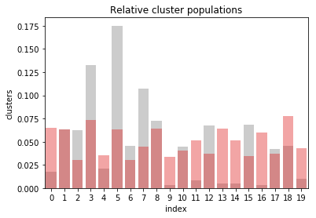


```python
df_1 = df_mailout_train.query('RESPONSE==1')
plot_pops_comp(df_1, kmeans_df)
```


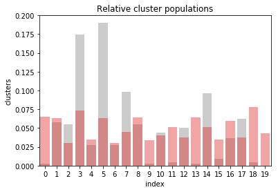


```python
kmeans_train['RESPONSE'] = df_mailout_train['RESPONSE']
```


```python
def plot_clusters(df, n_clusters):
    palette = sns.color_palette("Set2", n_clusters).as_hex()
    colors = []
    colors.extend([palette[10], palette[9], palette[8], palette[7], palette[6]])

    fig, axis = plt.subplots(1, figsize=(12,10))

    sns.scatterplot(x=0, y=1, data=df, ax=axis, hue='clusters', palette=palette)
    axis.set_xlim([-15,25])

```


```python
plot_clusters(kmeans_train, 2, hue='RESPONSE')
```


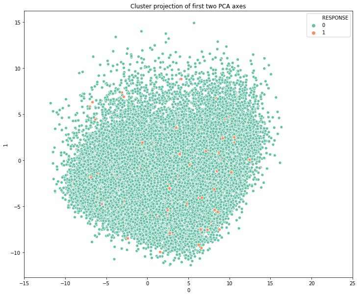


```python
plot_clusters(kmeans_train, 20, hue='clusters')
```


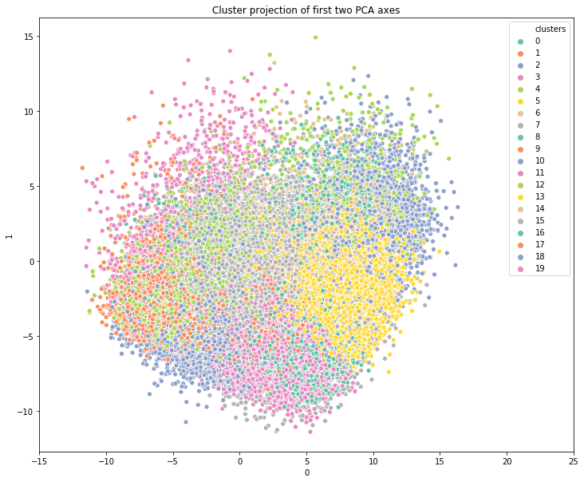


```python
dummies = pd.get_dummies(kmeans_train.clusters, prefix='cluster')
kmeans_train_extended = pd.concat([kmeans_train.iloc[:,:-2],dummies], axis=1)
kmeans_train_extended.head()
```


<div>
<style scoped>
    .dataframe tbody tr th:only-of-type {
        vertical-align: middle;
    }

    .dataframe tbody tr th {
        vertical-align: top;
    }

    .dataframe thead th {
        text-align: right;
    }
</style>
<table border="1" class="dataframe">
  <thead>
    <tr style="text-align: right;">
      <th></th>
      <th>0</th>
      <th>1</th>
      <th>2</th>
      <th>3</th>
      <th>4</th>
      <th>5</th>
      <th>6</th>
      <th>7</th>
      <th>8</th>
      <th>9</th>
      <th>10</th>
      <th>11</th>
      <th>12</th>
      <th>13</th>
      <th>14</th>
      <th>15</th>
      <th>16</th>
      <th>17</th>
      <th>18</th>
      <th>19</th>
      <th>20</th>
      <th>21</th>
      <th>22</th>
      <th>23</th>
      <th>24</th>
      <th>25</th>
      <th>26</th>
      <th>27</th>
      <th>28</th>
      <th>29</th>
      <th>30</th>
      <th>31</th>
      <th>32</th>
      <th>33</th>
      <th>34</th>
      <th>35</th>
      <th>36</th>
      <th>37</th>
      <th>38</th>
      <th>39</th>
      <th>40</th>
      <th>41</th>
      <th>42</th>
      <th>43</th>
      <th>44</th>
      <th>45</th>
      <th>46</th>
      <th>47</th>
      <th>48</th>
      <th>49</th>
      <th>50</th>
      <th>51</th>
      <th>52</th>
      <th>53</th>
      <th>54</th>
      <th>55</th>
      <th>56</th>
      <th>57</th>
      <th>58</th>
      <th>59</th>
      <th>60</th>
      <th>61</th>
      <th>62</th>
      <th>63</th>
      <th>64</th>
      <th>65</th>
      <th>66</th>
      <th>67</th>
      <th>68</th>
      <th>69</th>
      <th>70</th>
      <th>71</th>
      <th>72</th>
      <th>73</th>
      <th>74</th>
      <th>75</th>
      <th>76</th>
      <th>77</th>
      <th>78</th>
      <th>79</th>
      <th>80</th>
      <th>81</th>
      <th>82</th>
      <th>83</th>
      <th>84</th>
      <th>85</th>
      <th>86</th>
      <th>87</th>
      <th>88</th>
      <th>89</th>
      <th>90</th>
      <th>91</th>
      <th>92</th>
      <th>93</th>
      <th>94</th>
      <th>95</th>
      <th>96</th>
      <th>97</th>
      <th>98</th>
      <th>99</th>
      <th>100</th>
      <th>101</th>
      <th>102</th>
      <th>103</th>
      <th>104</th>
      <th>105</th>
      <th>106</th>
      <th>107</th>
      <th>108</th>
      <th>109</th>
      <th>110</th>
      <th>111</th>
      <th>112</th>
      <th>113</th>
      <th>114</th>
      <th>115</th>
      <th>116</th>
      <th>117</th>
      <th>118</th>
      <th>119</th>
      <th>120</th>
      <th>121</th>
      <th>122</th>
      <th>123</th>
      <th>cluster_0</th>
      <th>cluster_1</th>
      <th>cluster_2</th>
      <th>cluster_3</th>
      <th>cluster_4</th>
      <th>cluster_5</th>
      <th>cluster_6</th>
      <th>cluster_7</th>
      <th>cluster_8</th>
      <th>cluster_9</th>
      <th>cluster_10</th>
      <th>cluster_11</th>
      <th>cluster_12</th>
      <th>cluster_13</th>
      <th>cluster_14</th>
      <th>cluster_15</th>
      <th>cluster_16</th>
      <th>cluster_17</th>
      <th>cluster_18</th>
      <th>cluster_19</th>
    </tr>
  </thead>
  <tbody>
    <tr>
      <th>0</th>
      <td>-5.267240</td>
      <td>-4.682783</td>
      <td>2.555490</td>
      <td>6.882862</td>
      <td>-0.269018</td>
      <td>3.552564</td>
      <td>-1.840115</td>
      <td>-0.246669</td>
      <td>-0.694496</td>
      <td>-0.222268</td>
      <td>1.133857</td>
      <td>-0.372996</td>
      <td>0.021991</td>
      <td>-0.939394</td>
      <td>-1.938789</td>
      <td>1.522607</td>
      <td>1.035946</td>
      <td>0.681141</td>
      <td>-2.322233</td>
      <td>-2.142787</td>
      <td>-0.880772</td>
      <td>0.102634</td>
      <td>0.343932</td>
      <td>0.371459</td>
      <td>0.383527</td>
      <td>-1.485521</td>
      <td>-1.269155</td>
      <td>-0.744483</td>
      <td>1.246895</td>
      <td>2.389553</td>
      <td>2.019179</td>
      <td>0.086369</td>
      <td>-1.570159</td>
      <td>1.880131</td>
      <td>-2.979970</td>
      <td>1.864624</td>
      <td>-1.396816</td>
      <td>-2.092155</td>
      <td>1.298445</td>
      <td>0.491987</td>
      <td>-0.348482</td>
      <td>0.168164</td>
      <td>-0.540193</td>
      <td>-1.000043</td>
      <td>0.578146</td>
      <td>0.466354</td>
      <td>0.379087</td>
      <td>0.769923</td>
      <td>0.448181</td>
      <td>0.795588</td>
      <td>1.264439</td>
      <td>0.243596</td>
      <td>1.134793</td>
      <td>-1.659213</td>
      <td>-0.684358</td>
      <td>-0.421550</td>
      <td>-0.706934</td>
      <td>0.721466</td>
      <td>-0.315394</td>
      <td>0.290423</td>
      <td>-0.682997</td>
      <td>1.032932</td>
      <td>-0.754519</td>
      <td>-0.584029</td>
      <td>0.368932</td>
      <td>-1.316099</td>
      <td>-1.465549</td>
      <td>0.719255</td>
      <td>-0.288713</td>
      <td>0.746847</td>
      <td>-0.522582</td>
      <td>0.051953</td>
      <td>-0.227260</td>
      <td>-1.137792</td>
      <td>-0.840553</td>
      <td>1.483048</td>
      <td>0.139103</td>
      <td>0.453012</td>
      <td>0.449958</td>
      <td>-0.535770</td>
      <td>0.378830</td>
      <td>0.280201</td>
      <td>-0.076010</td>
      <td>-0.208462</td>
      <td>0.666089</td>
      <td>-0.410020</td>
      <td>0.676507</td>
      <td>-0.065595</td>
      <td>-0.585011</td>
      <td>0.514072</td>
      <td>-2.052977</td>
      <td>0.355140</td>
      <td>-1.148980</td>
      <td>0.346481</td>
      <td>-0.854709</td>
      <td>0.345943</td>
      <td>0.402757</td>
      <td>0.088197</td>
      <td>0.078346</td>
      <td>-0.540782</td>
      <td>0.207282</td>
      <td>0.245568</td>
      <td>-0.330697</td>
      <td>-1.024395</td>
      <td>-0.228958</td>
      <td>1.117869</td>
      <td>0.872839</td>
      <td>-0.308057</td>
      <td>1.774220</td>
      <td>-2.234345</td>
      <td>0.588732</td>
      <td>0.219617</td>
      <td>-0.619220</td>
      <td>-0.285362</td>
      <td>-0.654709</td>
      <td>-0.694645</td>
      <td>-0.643305</td>
      <td>-0.566846</td>
      <td>1.134675</td>
      <td>0.860750</td>
      <td>-0.108446</td>
      <td>1.147677</td>
      <td>1.557588</td>
      <td>-0.866240</td>
      <td>0</td>
      <td>0</td>
      <td>0</td>
      <td>0</td>
      <td>0</td>
      <td>0</td>
      <td>0</td>
      <td>0</td>
      <td>0</td>
      <td>0</td>
      <td>1</td>
      <td>0</td>
      <td>0</td>
      <td>0</td>
      <td>0</td>
      <td>0</td>
      <td>0</td>
      <td>0</td>
      <td>0</td>
      <td>0</td>
    </tr>
    <tr>
      <th>1</th>
      <td>9.689803</td>
      <td>0.165826</td>
      <td>-3.357597</td>
      <td>1.243669</td>
      <td>-2.281934</td>
      <td>2.640780</td>
      <td>-2.913668</td>
      <td>-1.947833</td>
      <td>1.150220</td>
      <td>-0.378506</td>
      <td>0.758958</td>
      <td>-0.093433</td>
      <td>1.820193</td>
      <td>0.722079</td>
      <td>4.230173</td>
      <td>0.507641</td>
      <td>0.886074</td>
      <td>-1.031550</td>
      <td>-0.874236</td>
      <td>-1.157902</td>
      <td>-1.100280</td>
      <td>3.385096</td>
      <td>0.569802</td>
      <td>6.842967</td>
      <td>4.451868</td>
      <td>-1.531274</td>
      <td>2.608049</td>
      <td>1.096946</td>
      <td>2.944666</td>
      <td>-1.926669</td>
      <td>1.549908</td>
      <td>-1.697545</td>
      <td>1.482100</td>
      <td>0.268960</td>
      <td>2.444343</td>
      <td>-2.203536</td>
      <td>1.812009</td>
      <td>-2.226375</td>
      <td>-0.447375</td>
      <td>-2.763841</td>
      <td>-4.545826</td>
      <td>0.719501</td>
      <td>0.630603</td>
      <td>-0.624413</td>
      <td>-1.760905</td>
      <td>-0.196711</td>
      <td>0.366951</td>
      <td>1.023393</td>
      <td>0.497917</td>
      <td>0.746044</td>
      <td>-1.482139</td>
      <td>0.768589</td>
      <td>-1.006855</td>
      <td>-1.406086</td>
      <td>0.053610</td>
      <td>-1.197077</td>
      <td>0.850067</td>
      <td>1.699925</td>
      <td>1.514675</td>
      <td>-2.084293</td>
      <td>1.065843</td>
      <td>1.291828</td>
      <td>-0.368584</td>
      <td>-0.057707</td>
      <td>-1.328068</td>
      <td>-1.444634</td>
      <td>0.865839</td>
      <td>0.612552</td>
      <td>0.845525</td>
      <td>-0.431570</td>
      <td>-0.027407</td>
      <td>1.172915</td>
      <td>-0.213319</td>
      <td>-1.180144</td>
      <td>-0.952498</td>
      <td>-0.744396</td>
      <td>-1.366902</td>
      <td>0.922859</td>
      <td>1.744639</td>
      <td>0.661830</td>
      <td>0.039446</td>
      <td>-1.235471</td>
      <td>-0.346330</td>
      <td>1.917477</td>
      <td>2.117949</td>
      <td>-3.978214</td>
      <td>1.683614</td>
      <td>-0.423916</td>
      <td>1.922771</td>
      <td>1.285496</td>
      <td>-0.188113</td>
      <td>0.477874</td>
      <td>-2.020045</td>
      <td>-0.492601</td>
      <td>0.482041</td>
      <td>-3.343884</td>
      <td>3.267129</td>
      <td>-0.268690</td>
      <td>2.212993</td>
      <td>0.461828</td>
      <td>0.694184</td>
      <td>0.498268</td>
      <td>-0.081878</td>
      <td>2.752088</td>
      <td>0.833112</td>
      <td>-2.566487</td>
      <td>0.407762</td>
      <td>1.940244</td>
      <td>0.408154</td>
      <td>-0.617327</td>
      <td>0.402500</td>
      <td>-0.979934</td>
      <td>0.621910</td>
      <td>1.084676</td>
      <td>-0.258477</td>
      <td>-2.454843</td>
      <td>0.038964</td>
      <td>-1.133219</td>
      <td>0.225290</td>
      <td>-0.413361</td>
      <td>-0.017149</td>
      <td>-0.233533</td>
      <td>0.998433</td>
      <td>1.500529</td>
      <td>0</td>
      <td>0</td>
      <td>0</td>
      <td>0</td>
      <td>0</td>
      <td>1</td>
      <td>0</td>
      <td>0</td>
      <td>0</td>
      <td>0</td>
      <td>0</td>
      <td>0</td>
      <td>0</td>
      <td>0</td>
      <td>0</td>
      <td>0</td>
      <td>0</td>
      <td>0</td>
      <td>0</td>
      <td>0</td>
    </tr>
    <tr>
      <th>2</th>
      <td>3.235419</td>
      <td>-4.259503</td>
      <td>-2.834992</td>
      <td>5.605305</td>
      <td>5.116398</td>
      <td>0.104935</td>
      <td>3.849278</td>
      <td>-1.093625</td>
      <td>-1.470362</td>
      <td>4.312304</td>
      <td>-0.449021</td>
      <td>1.332211</td>
      <td>-1.292222</td>
      <td>-2.523775</td>
      <td>0.392229</td>
      <td>-2.082771</td>
      <td>-1.567530</td>
      <td>0.303031</td>
      <td>-2.772623</td>
      <td>1.762764</td>
      <td>0.883117</td>
      <td>1.000380</td>
      <td>-1.865906</td>
      <td>0.815311</td>
      <td>0.721804</td>
      <td>-1.103714</td>
      <td>-0.709893</td>
      <td>0.434727</td>
      <td>0.243259</td>
      <td>-1.491161</td>
      <td>-1.470136</td>
      <td>2.808309</td>
      <td>0.131904</td>
      <td>0.194118</td>
      <td>-2.037014</td>
      <td>2.036869</td>
      <td>0.550398</td>
      <td>-1.576478</td>
      <td>0.428547</td>
      <td>0.379799</td>
      <td>-0.938465</td>
      <td>1.016534</td>
      <td>0.268196</td>
      <td>1.054304</td>
      <td>0.231467</td>
      <td>-0.931043</td>
      <td>-0.335132</td>
      <td>1.610634</td>
      <td>2.918896</td>
      <td>-2.033996</td>
      <td>1.387102</td>
      <td>-1.551654</td>
      <td>-1.646623</td>
      <td>-0.014775</td>
      <td>-0.184402</td>
      <td>0.545100</td>
      <td>-1.580199</td>
      <td>1.260434</td>
      <td>-1.701787</td>
      <td>-1.324277</td>
      <td>-0.050870</td>
      <td>0.373607</td>
      <td>-0.542055</td>
      <td>-0.108516</td>
      <td>2.163221</td>
      <td>-1.571681</td>
      <td>-0.466796</td>
      <td>1.902979</td>
      <td>-2.047102</td>
      <td>-1.226738</td>
      <td>0.766491</td>
      <td>-2.015684</td>
      <td>1.112935</td>
      <td>-0.217036</td>
      <td>1.290087</td>
      <td>-0.298347</td>
      <td>0.789076</td>
      <td>-0.021130</td>
      <td>0.447585</td>
      <td>-0.740195</td>
      <td>-0.976694</td>
      <td>1.098759</td>
      <td>0.446408</td>
      <td>-0.269481</td>
      <td>0.945031</td>
      <td>1.350800</td>
      <td>-0.377393</td>
      <td>-0.919922</td>
      <td>0.202898</td>
      <td>1.060738</td>
      <td>0.396327</td>
      <td>-0.185108</td>
      <td>-0.517428</td>
      <td>1.036985</td>
      <td>0.109938</td>
      <td>0.235202</td>
      <td>-1.506698</td>
      <td>-0.374339</td>
      <td>1.479307</td>
      <td>-1.971693</td>
      <td>-0.268233</td>
      <td>0.320518</td>
      <td>1.043735</td>
      <td>0.415611</td>
      <td>-0.942635</td>
      <td>-0.789326</td>
      <td>0.707239</td>
      <td>1.018174</td>
      <td>0.462806</td>
      <td>0.292062</td>
      <td>2.018184</td>
      <td>-1.326788</td>
      <td>0.119635</td>
      <td>1.074916</td>
      <td>-1.292720</td>
      <td>0.941560</td>
      <td>-0.190557</td>
      <td>-1.717493</td>
      <td>-0.069425</td>
      <td>-1.146924</td>
      <td>0.322238</td>
      <td>1.085516</td>
      <td>0.080519</td>
      <td>-0.427012</td>
      <td>0</td>
      <td>0</td>
      <td>0</td>
      <td>1</td>
      <td>0</td>
      <td>0</td>
      <td>0</td>
      <td>0</td>
      <td>0</td>
      <td>0</td>
      <td>0</td>
      <td>0</td>
      <td>0</td>
      <td>0</td>
      <td>0</td>
      <td>0</td>
      <td>0</td>
      <td>0</td>
      <td>0</td>
      <td>0</td>
    </tr>
    <tr>
      <th>3</th>
      <td>1.733053</td>
      <td>-9.345069</td>
      <td>10.415830</td>
      <td>3.284154</td>
      <td>-0.320023</td>
      <td>-4.100706</td>
      <td>-0.901471</td>
      <td>1.848618</td>
      <td>-0.802747</td>
      <td>-0.573170</td>
      <td>4.480595</td>
      <td>-2.488959</td>
      <td>-1.908523</td>
      <td>1.126154</td>
      <td>1.479665</td>
      <td>-0.274272</td>
      <td>0.394499</td>
      <td>0.879654</td>
      <td>1.193557</td>
      <td>-0.846199</td>
      <td>0.920975</td>
      <td>1.911174</td>
      <td>0.049188</td>
      <td>0.398461</td>
      <td>-1.486183</td>
      <td>1.110747</td>
      <td>-0.112615</td>
      <td>-2.459722</td>
      <td>0.870680</td>
      <td>-0.983965</td>
      <td>-0.385775</td>
      <td>0.438612</td>
      <td>-2.524014</td>
      <td>-1.779237</td>
      <td>-0.034933</td>
      <td>4.155486</td>
      <td>1.119641</td>
      <td>-0.147769</td>
      <td>-0.241453</td>
      <td>-0.016937</td>
      <td>-0.351669</td>
      <td>0.790512</td>
      <td>0.923353</td>
      <td>0.200374</td>
      <td>2.725156</td>
      <td>0.264846</td>
      <td>-1.120744</td>
      <td>1.185122</td>
      <td>-0.364132</td>
      <td>-1.087591</td>
      <td>1.342804</td>
      <td>0.553109</td>
      <td>1.893931</td>
      <td>0.379756</td>
      <td>-1.333196</td>
      <td>1.783403</td>
      <td>-1.353488</td>
      <td>-1.405872</td>
      <td>-0.934731</td>
      <td>-1.431313</td>
      <td>-2.181543</td>
      <td>-0.324133</td>
      <td>-0.977195</td>
      <td>-0.208779</td>
      <td>0.129950</td>
      <td>-0.819186</td>
      <td>0.991666</td>
      <td>0.244678</td>
      <td>-1.181652</td>
      <td>-1.388488</td>
      <td>0.321544</td>
      <td>0.199114</td>
      <td>1.734112</td>
      <td>-1.220432</td>
      <td>0.365065</td>
      <td>0.770914</td>
      <td>-0.047416</td>
      <td>0.078174</td>
      <td>1.235809</td>
      <td>-0.288752</td>
      <td>-0.761900</td>
      <td>1.192077</td>
      <td>0.368397</td>
      <td>0.426615</td>
      <td>0.165573</td>
      <td>0.786441</td>
      <td>-0.476718</td>
      <td>-0.079963</td>
      <td>0.003562</td>
      <td>-0.312140</td>
      <td>-0.537973</td>
      <td>-0.054035</td>
      <td>0.400732</td>
      <td>-1.015417</td>
      <td>1.102358</td>
      <td>-0.236984</td>
      <td>-0.230678</td>
      <td>-0.812434</td>
      <td>-0.703107</td>
      <td>2.224698</td>
      <td>0.726469</td>
      <td>0.791041</td>
      <td>0.585925</td>
      <td>-0.040694</td>
      <td>-0.378604</td>
      <td>1.318743</td>
      <td>-0.377016</td>
      <td>0.716669</td>
      <td>0.407264</td>
      <td>1.107639</td>
      <td>0.692893</td>
      <td>0.397525</td>
      <td>0.052332</td>
      <td>0.565694</td>
      <td>-1.186808</td>
      <td>-0.648781</td>
      <td>0.376134</td>
      <td>0.633555</td>
      <td>0.553372</td>
      <td>-0.144452</td>
      <td>-0.593842</td>
      <td>-0.251981</td>
      <td>0.483762</td>
      <td>-0.396604</td>
      <td>0</td>
      <td>0</td>
      <td>0</td>
      <td>0</td>
      <td>0</td>
      <td>0</td>
      <td>0</td>
      <td>0</td>
      <td>0</td>
      <td>0</td>
      <td>0</td>
      <td>0</td>
      <td>0</td>
      <td>0</td>
      <td>0</td>
      <td>1</td>
      <td>0</td>
      <td>0</td>
      <td>0</td>
      <td>0</td>
    </tr>
    <tr>
      <th>4</th>
      <td>-0.315600</td>
      <td>-5.085146</td>
      <td>5.057908</td>
      <td>4.999668</td>
      <td>5.556226</td>
      <td>2.338513</td>
      <td>1.996367</td>
      <td>-1.539845</td>
      <td>1.032428</td>
      <td>1.990829</td>
      <td>2.643084</td>
      <td>-1.415522</td>
      <td>1.914635</td>
      <td>0.800462</td>
      <td>-1.872599</td>
      <td>3.471593</td>
      <td>-1.374365</td>
      <td>-2.013778</td>
      <td>0.401991</td>
      <td>2.355099</td>
      <td>0.418172</td>
      <td>2.717356</td>
      <td>-0.258917</td>
      <td>0.556084</td>
      <td>-0.397334</td>
      <td>-0.833339</td>
      <td>-0.315437</td>
      <td>2.091597</td>
      <td>1.209490</td>
      <td>0.361157</td>
      <td>-0.263199</td>
      <td>-0.469576</td>
      <td>-0.717441</td>
      <td>0.216697</td>
      <td>-0.092939</td>
      <td>0.971208</td>
      <td>-0.250495</td>
      <td>-2.561505</td>
      <td>1.495237</td>
      <td>0.177179</td>
      <td>-0.691046</td>
      <td>0.642343</td>
      <td>-0.038645</td>
      <td>0.841915</td>
      <td>-1.656469</td>
      <td>1.005884</td>
      <td>-1.901930</td>
      <td>-0.198871</td>
      <td>1.512186</td>
      <td>0.172555</td>
      <td>-2.934418</td>
      <td>-0.378554</td>
      <td>-0.749220</td>
      <td>0.424023</td>
      <td>1.353349</td>
      <td>0.990638</td>
      <td>1.371463</td>
      <td>0.136687</td>
      <td>-0.341881</td>
      <td>-0.397012</td>
      <td>0.833861</td>
      <td>-1.195528</td>
      <td>-1.173911</td>
      <td>-0.005123</td>
      <td>-0.749200</td>
      <td>0.984027</td>
      <td>0.784524</td>
      <td>1.007621</td>
      <td>-0.699600</td>
      <td>-0.326793</td>
      <td>1.121602</td>
      <td>-0.245452</td>
      <td>1.443348</td>
      <td>-0.104439</td>
      <td>-1.106879</td>
      <td>-1.106311</td>
      <td>-1.000467</td>
      <td>-0.882071</td>
      <td>0.949729</td>
      <td>-0.518652</td>
      <td>-0.698189</td>
      <td>0.319557</td>
      <td>-1.556529</td>
      <td>0.119550</td>
      <td>0.197207</td>
      <td>0.713975</td>
      <td>0.216960</td>
      <td>-0.404805</td>
      <td>0.643391</td>
      <td>-0.880097</td>
      <td>0.015694</td>
      <td>-0.415702</td>
      <td>-0.831666</td>
      <td>-0.720449</td>
      <td>-0.353231</td>
      <td>1.309538</td>
      <td>-1.141561</td>
      <td>-0.311964</td>
      <td>0.187539</td>
      <td>-1.446695</td>
      <td>1.507014</td>
      <td>0.170976</td>
      <td>-1.063709</td>
      <td>1.590174</td>
      <td>-0.864362</td>
      <td>0.063817</td>
      <td>-0.639848</td>
      <td>-0.697627</td>
      <td>-0.081846</td>
      <td>-0.290220</td>
      <td>1.090572</td>
      <td>0.992150</td>
      <td>0.427868</td>
      <td>0.644933</td>
      <td>0.448705</td>
      <td>-0.353522</td>
      <td>-0.895839</td>
      <td>-1.349649</td>
      <td>-1.459538</td>
      <td>0.302392</td>
      <td>0.508749</td>
      <td>0.260685</td>
      <td>0.571046</td>
      <td>0.087439</td>
      <td>0</td>
      <td>0</td>
      <td>0</td>
      <td>0</td>
      <td>0</td>
      <td>0</td>
      <td>0</td>
      <td>0</td>
      <td>0</td>
      <td>0</td>
      <td>0</td>
      <td>0</td>
      <td>0</td>
      <td>0</td>
      <td>0</td>
      <td>1</td>
      <td>0</td>
      <td>0</td>
      <td>0</td>
      <td>0</td>
    </tr>
  </tbody>
</table>
</div>


```python
y = kmeans_train.RESPONSE
X = kmeans_train_extended
```


```python
X_train, X_test, y_train, y_test = train_test_split(X, y, test_size=0.2, shuffle=True, random_state=34)
```


```python
y.value_counts()
```


    0    34660
    1      436
    Name: RESPONSE, dtype: int64


```python
modelx2 = XGBClassifier(booster='dart', 
                       max_depth=7, 
                       learning_rate=0.06, 
                       n_estimators=1000, 
                       n_jobs=-1, 
                       random_state=34)

modelx2 = skf_smt(X_train2, y_train2, modelx2)
pred_model(modelx2, X_test2.values, y_test2)
```

    accuracy : 1.0
    F1 : 1.0
    precision : 1.0
    recall : 1.0


    array([[110836,      0],
           [     0, 110836]])


    accuracy : 0.9897435897435898
    F1 : 0.0
    precision : 0.0
    recall : 0.0


    array([[6948,    3],
           [  69,    0]])


```python
def skf_noSmote(X_train, y_train, model): 

    labels = []
    preds = []

    skf = StratifiedKFold(n_splits=5, shuffle=True, random_state=34)
    for train_indices, test_indices in skf.split(X_train, y_train):
    
        X_train_skf = X.iloc[train_indices,:]
        y_train_skf = y[train_indices]
    
        X_test_skf = X.iloc[test_indices,:]
        y_test_skf = y[test_indices]
        
        model.fit(X_train_skf, y_train_skf)            
        labels.extend(y_test_skf)
        preds.extend(model.predict(X_test_skf))
    
    print('accuracy :', accuracy_score(labels, preds)) 
    print('F1 :',f1_score(labels, preds))
    print('precision :', precision_score(labels, preds))
    print('recall :', recall_score(labels, preds))
    print('auc :', roc_auc_score(labels, preds))
    display(confusion_matrix(labels, preds))
    
    return model
```


```python
model1 = AdaBoostClassifier(random_state=34)
model1 = skf_noSmote(X_train, y_train, model1)
```

    accuracy : 0.9874982191195327
    F1 : 0.0
    precision : 0.0
    recall : 0.0


    array([[27725,     3],
           [  348,     0]])


```python
model2 = RandomForestClassifier(random_state=34)
model2 = skf_noSmote(X_train, y_train, model2)
```

    accuracy : 0.9875694543382249
    F1 : 0.0
    precision : 0.0
    recall : 0.0


    array([[27727,     1],
           [  348,     0]])


```python
#model3 = XGBClassifier(booster='dart', max_depth=5, n_estimators=100, n_jobs=-1, random_state=34)
model3 = XGBClassifier(random_state=34)
model3 = skf_noSmote(X_train, y_train, model3)
```

    accuracy : 0.9876050719475709
    F1 : 0.0
    precision : 0.0
    recall : 0.0


    array([[27728,     0],
           [  348,     0]])


```python
def skf_SMOTE(X_train, y_train, model):
    
    labels = []
    preds = []

    n = 0

    skf = StratifiedKFold(n_splits=5, shuffle=True, random_state=34)
    for train_indices, test_indices in skf.split(X_train, y_train):

        X_train_skf = X.iloc[train_indices,:]
        y_train_skf = y[train_indices]
    
        X_test_skf = X.iloc[test_indices,:]
        y_test_skf = y[test_indices]
        
        sm = SMOTE(random_state=42)
        X_res, y_res = sm.fit_resample(X_train_skf, y_train_skf)
        
        model.fit(X_res, y_res)
                
        labels.extend(y_res)
        preds.extend(model.predict(X_res))
    
    print('accuracy :', accuracy_score(labels, preds)) 
    print('F1 :',f1_score(labels, preds))
    print('precision :', precision_score(labels, preds))
    print('recall :', recall_score(labels, preds))
    print('auc :', roc_auc_score(labels, preds))
    display(confusion_matrix(labels, preds))
    
    return model
```


```python
#model = AdaBoostClassifier(random_state=34, n_estimators=1000, learning_rate=0.1)
model4 = AdaBoostClassifier(random_state=34)
model4 = skf_SMOTE(X_train, y_train, model4)
```

    accuracy : 0.8421361079053664
    F1 : 0.8440247650438732
    precision : 0.8340463740558812
    recall : 0.8542448066935949


    array([[92060, 18852],
           [16166, 94746]])


```python
model5 = RandomForestClassifier(random_state=34)
model5 = skf_SMOTE(X_train, y_train, model5)
```

    accuracy : 0.9999143465089441
    F1 : 0.9999143414889252
    precision : 0.9999729483584162
    recall : 0.9998557414887478


    array([[110909,      3],
           [    16, 110896]])


```python
#model6 = XGBClassifier(random_state=34)
model6 = XGBClassifier(booster='dart', max_depth=5, n_estimators=100, n_jobs=-1, random_state=34)
model6 = skf_SMOTE(X_train, y_train, model6)
```

    accuracy : 0.9918043133294865
    F1 : 0.9918622035612932
    precision : 0.9849053249177705
    recall : 0.9989180611656088


    array([[109214,   1698],
           [   120, 110792]])


```python
def pred_model(model, X_test, y_test):
    y_preds = model.predict(X_test)
    print('accuracy :', accuracy_score(y_test, y_preds)) 
    print('F1 :',f1_score(y_test, y_preds))
    print('precision :', precision_score(y_test, y_preds))
    print('recall :', recall_score(y_test, y_preds))
    print('auc :', roc_auc_score(y_test, y_preds))
    display(confusion_matrix(y_test, y_preds))
```


```python
y_test.value_counts()
```


    0    6940
    1      80
    Name: RESPONSE, dtype: int64


```python
pred_model(model1, X_test, y_test)
```

    accuracy : 0.9886039886039886
    F1 : 0.0
    precision : 0.0
    recall : 0.0


    array([[6940,    0],
           [  80,    0]])


```python
pred_model(model2, X_test, y_test)
```

    accuracy : 0.9927350427350428
    F1 : 0.5321100917431192
    precision : 1.0
    recall : 0.3625


    array([[6940,    0],
           [  51,   29]])


```python
pred_model(model3, X_test, y_test)
```

    accuracy : 0.9886039886039886
    F1 : 0.0
    precision : 0.0
    recall : 0.0


    array([[6940,    0],
           [  80,    0]])


```python
pred_model(model4, X_test, y_test)
```

    accuracy : 0.80997150997151
    F1 : 0.03473227206946455
    precision : 0.018433179723502304
    recall : 0.3


    array([[5662, 1278],
           [  56,   24]])


```python
pred_model(model5, X_test, y_test)
```

    accuracy : 0.9955840455840456
    F1 : 0.7256637168141593
    precision : 0.9318181818181818
    recall : 0.5942028985507246
    auc : 0.7968856529870586


    array([[6948,    3],
           [  28,   41]])


```python
pred_model(model6, X_test.values, y_test)
```

    accuracy : 0.978917378917379
    F1 : 0.36206896551724144
    precision : 0.27631578947368424
    recall : 0.525


    array([[6830,  110],
           [  38,   42]])

### Good models

```python
modelx1 = RandomForestClassifier(random_state=34, n_estimators = 1000)
modelx1 = skf_SMOTE(X_train, y_train, modelx1)
```


```python
model6 = XGBClassifier(booster='dart', max_depth=7, learning_rate=0.05, n_estimators=1000, n_jobs=-1, random_state=34)
model6 = skf_SMOTE(X_train, y_train, model6)
```


## Part 3: Kaggle Competition

Now that you've created a model to predict which individuals are most likely to respond to a mailout campaign, it's time to test that model in competition through Kaggle. If you click on the link [here](http://www.kaggle.com/t/21e6d45d4c574c7fa2d868f0e8c83140), you'll be taken to the competition page where, if you have a Kaggle account, you can enter. If you're one of the top performers, you may have the chance to be contacted by a hiring manager from Arvato or Bertelsmann for an interview!

Your entry to the competition should be a CSV file with two columns. The first column should be a copy of "LNR", which acts as an ID number for each individual in the "TEST" partition. The second column, "RESPONSE", should be some measure of how likely each individual became a customer – this might not be a straightforward probability. As you should have found in Part 2, there is a large output class imbalance, where most individuals did not respond to the mailout. Thus, predicting individual classes and using accuracy does not seem to be an appropriate performance evaluation method. Instead, the competition will be using AUC to evaluate performance. The exact values of the "RESPONSE" column do not matter as much: only that the higher values try to capture as many of the actual customers as possible, early in the ROC curve sweep.


```python
mailout_test = pd.read_csv('../../data/Term2/capstone/arvato_data/Udacity_MAILOUT_052018_TEST.csv')
```


```python
, kmeans_pipe = pipeline(customers)
```


```python

```


```python

```

## Code Bank


```python
#customer = (customer.pipe(pre_clean)
#      .pipe(missing_values)
#      .pipe(drop_features, arg1=445E3)
#      .pipe(drop_rows).pipe(impute_calc)
#      .pipe(pragende_jugendjahre)
#      .pipe(cameo_intl_2015)
#      .pipe(lp_lebensphase_fein)
#      .pipe(lp_lebensphase_grob)
#      .pipe(adjust_types))
#
#def dummies_scale(df):
#    df_onehot = pd.DataFrame(data = onehot.transform(df[list_onehot]).todense(), 
#                         columns=onehot.get_feature_names())
#    df = pd.concat([df.drop(list_onehot, axis=1), df_onehot], axis=1)
#    df[list_scale] = scaler.transform(df[list_scale])
#    return df
#
#dummies_scale(customer)
```
